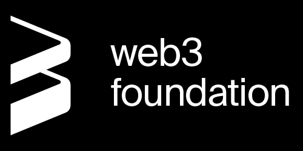

[](#LICENSE)
[](https://www.markdownguide.org/)
[](docs/general/contributing.md)
[](https://github.com/w3f/polkadot-wiki/actions/workflows/deploy-polkadot-prod.yml)
[](https://github.com/w3f/polkadot-wiki/actions/workflows/deploy-kusama-prod.yml)

# Polkadot Wiki



<p align="left">
  The Polkadot Wiki is the central source of truth for Polkadot. It is a community-focused initiative led by 
  Web3 Foundation to keep an up-to-date resource on the best information for learning, building, or maintaining 
  on Polkadot. 
</p>

> :high_brightness: **Please Note**: The Wiki will undergo a major revamp over the next several weeks in an attempt 
> to improve its configuration, functionality, relevancy, adequacy, and overall design. 
> The new Wiki will exist in a new repository, still under `w3f`.

> :scroll: This repository will still be maintained in the meantime, and contributions are always encouraged.

## Contributing to Documentation

The Technical Education team at Web3 Foundation are the primary maintainers of the Wiki and will review 
all issues and pull requests created in this repository. If you notice typos or grammatical errors, please feel free 
to create pull requests with these corrections directly. Larger contributions may start as issues to test the waters on 
the subject with the maintainers. It is generally preferable to create a pull request over an issue to propose a change 
to the Wiki content.

:sparkles: ***The Wiki belongs to the community, help generate its identity.*** :sparkles:

https://user-images.githubusercontent.com/25497083/146822391-5c52a64a-dc2e-4583-9746-109191db5271.mp4


> :inbox_tray: There will be an upcoming initiative that will promote and encourage contributions towards 
> Polkadot-based content and documentation. In the meantime, feel free to share any ideas or feedback you may 
> have for the Wiki by opening a [Feature Request issue](https://github.com/w3f/polkadot-wiki/issues/new/choose).

**Keep engaged by checking out these common [Polkadot ecosystem resources](https://hackmd.io/IMgniwlyT_GIqjI8Wui35A)**.

## Running Locally

Both the Polkadot Wiki and the Kusama Guide are built from the source files in this repository.
After cloning the source locally, you can start the websites with each of these respective commands
(ensure you run `yarn` at the root of the repository first to install dependencies):

> The site is built using Docusaurus: you may need to install Docusaurus before running
> the Wiki locally. 

Using yarn, run:

```bash
yarn upgrade @docusaurus/core@latest @docusaurus/preset-classic@latest`.
```

### Build

> The Wiki is currently in the process of being deployed onto IPFS and will follow the same configuration to 
> build the static files.

:bird: Building the Kusama Guide: 
```bash 
yarn kusama:build
```
🟣 Building the Polkadot Wiki: 
```bash
yarn polkadot:build
```

### Start

:bird: Starting the Kusama Guide: 
```bash
yarn kusama:start
```

🟣 Starting the Polkadot Wiki: 
```bash
yarn polkadot:start
```
#### Running GitHub Pages

:bird: Publishing the Kusama Guide: 
```bash
yarn kusama:publish-gh-pages
```

🟣 Publishing the Polkadot Wiki: 
```bash
yarn polkadot:publish-gh-pages
```

## Style and Configuration Guide

Use the style guide from the
[Substrate Knowledge Base](https://github.com/substrate-developer-hub/knowledgebase/blob/master/CONTRIBUTING.md#documentation-style)

### Formatting

Use [pretty-quick](https://prettier.io/docs/en/precommit.html#option-2-pretty-quickhttpsgithubcomazzpretty-quick)
as a pre-commit formatting tool.

There is an automatic `pretty-quick` check that occurs pre-commit to format
your changed/staged files.

To format markdown pages, run the following in the `docs` folder:

```bash
npx pretty-quick --staged
```

To run pretty on the whole project, `npx pretty-quick`.

### Static Site Generator

The Wiki's latest version uses the [Docusaurus](https://docusaurus.io/) static website
generator to convert the Markdown docs into a documentation website.

### Search Engine

[Algolia DocSearch](https://docsearch.algolia.com/) is the search engine that is used, which
is built into Docusaurus. Indexing via Algolia provides faster lookup; the actual configuration
for lookup is located in another repository that Algolia DocSearch maintains.

We have enabled searching on the Wiki by declaring the `algolia` section in the `siteConfig.js`
file in `scripts`, and defining an API key and index name that are provided by DocSearch.

```js
  algolia: {
    apiKey: "53c6a4ab0d77c0755375a971c9b7cc3d",
    indexName: "kusama_guide",
    algoliaOptions: {
      facetFilters: ["language:LANGUAGE"],
    }, // Optional, if provided by Algolia
  }
```

If you would like to access and modify this, you can re-submit the documentation url via
[DocSearch Program](https://docsearch.algolia.com/apply/), where they will send
a JavaScript snippet that you can re-integrate into the configuration, similar to the
one shown above.

### Automated Deployments

The Polkadot Wiki is built on the `gh-pages` branch and automatically deployed to GitHub Pages.
The Kusama Wiki is also deployed to GitHub Pages (via a separate repository).

Development servers exist at `https://staging.polkadot.network` and `https://staging.kusama.network`.
The servers will reflect the latest `master` commit or PR put up against the master branch by a member of the 
Technical Education team. The latest version of `master` is staged and checked by the team. If all is well, the 
new commits on `master` are transferred into the production branch,`prod`, by rebasing `master` on `prod`. The CICD 
production workflow will deploy `prod` to the public sites: [Polkadot Wiki](https://wiki.polkadot.network) and 
[Kusama Guide](https://guide.kusama.network), respectively.

### Mirror Pages

A limitation of Docusaurus is that pages can only be included in one sidebar at any given time.
Thus, our Kusama section will either hijack some content it shares with the rest of the Wiki or
lack that content. The repository mirrors some pages and includes them in additional sidebars to solve this. 

The `scripts` folder contains a `mirror.js` script that creates a copy of the pages to duplicate across 
sidebars. The new pages are prefixed with `mirror` and must first be declared in `mirror.js`, then added 
to the relevant sidebar section. To run the script:

```bash
yarn mirror
```

> Note: This command runs when using `polkadot:start` or `kusama:start` development
> scripts, so you don't need to worry about running it manually if you start the development site
> with one of these commands.

### Conditional Rendering

The two Wikis support conditional rendering depending on which Wiki is being deployed. This is
useful for mirrored pages with most content in common but have minor differences. To use 
this functionality, surround Kusama specific content with {{ kusama: :kusama }}, and polkadot specific
content with {{ polkadot: :polkadot }}. Example:

```md
If the treasury ends a budget period without spending all of its funds, it suffers a burn of a
percentage of its funds -- thereby causing deflationary pressure.
{{ polkadot: This percentage is currently at 1%
on Polkadot. :polkadot }}{{ kusama: This percentage is currently 0.2% on Kusama, with the amount currently 
going to [Society](https://guide.kusama.network/docs/en/maintain-guides-society-kusama) rather than being
burned. :kusama }}
```

To test the resolution, run `polkadot:build` and `kusama:build`, then `polkadot:inject` and
`kusama:inject`, respectively.
Inspect the built files in the corresponding `build` folder under `website` or
`kusama-guide`.

## Internationalization

We are using Crowdin to manage all different translations. You can go to the
[project page](https://crowdin.com/project/polkadot-wiki) and select the language you would like to
translate to start.  
All translated content through Crowdin will regularly submit a pull request to this repository.

If you do not see the language you would like to translate in, please let us know via Matrix.

## License

The Polkadot Wiki is licensed under the [GPL-3.0](LICENSE) free software license.
