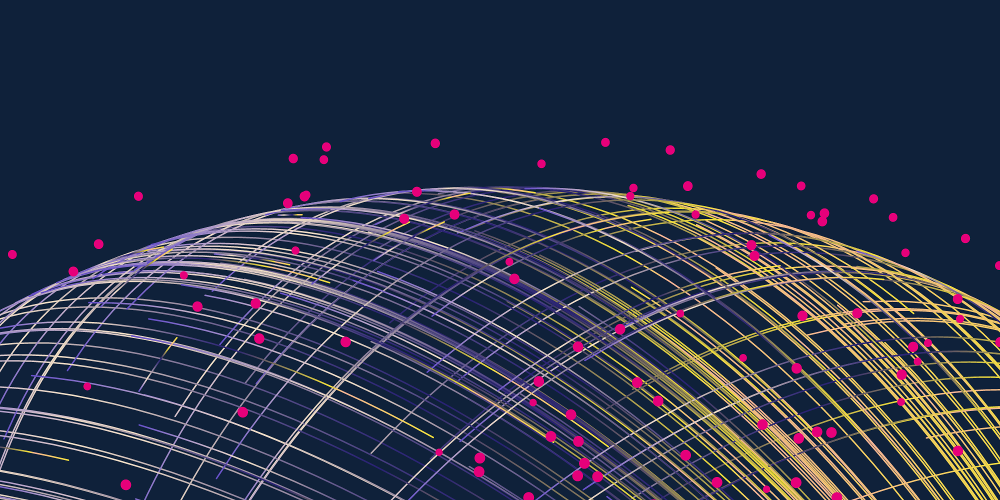

[](#LICENSE) [](https://www.markdownguide.org/) [](https://github.com/prettier/prettier)
[](docs/general/CONTRIBUTING.md) 

<a href="https://wiki.polkadot.network/" rel="some text"></a> | <a href="https://guide.kusama.network/" rel="some text"></a>
:----------------------------------:|:--------------------------------:

# Polkadot Wiki

The Polkadot Wiki is the central source of truth for Polkadot.

It is a community-focused initiative led by Web3 Foundation to keep an up-to-date resource on the best information for 
learning, building, or maintaining on Polkadot.

 


## Contributing to Documentation

The Wiki is an open source project and we will review all issues and pull-requests created
in this repository. If you notice typos or grammatical errors, please feel free to directly create pull requests with 
these corrections. 

Larger contributions may start as issues to test the waters on the subject with the maintainers. 
It is generally preferable to create a pull request over an issue to propose a change to the wiki content.

### Running Locally

Both the Polkadot Wiki and the Kusama Guide are built from the source files in this repository.
After cloning the source locally, you can start the websites with each of these respective commands
(ensure you run `yarn` at the root of the repository first to install dependencies):

```zsh
# For the Polkadot Wiki:
yarn polkadot:start
# For the Kusama Guide:
yarn kusama:start
```

### Style Guide

Use the style guide from the
[Substrate Knowledge Base](https://github.com/substrate-developer-hub/knowledgebase/blob/master/CONTRIBUTING.md#documentation-style)

#### Formatting

Use [Prettier](https://prettier.io/) to format markdown pages. To run Prettier on the `docs` folder,
run:

```bash
npx prettier --write ./docs/
```

### Static Site Generator

The Wiki's latest version uses the [Docusaurus](https://docusaurus.io/) static website 
generator to convert the Markdown docs into a documentation website.

### Search Engine

[Algolia DocSearch](https://docsearch.algolia.com/) is the search engine that is used, which 
is built into Docusaurus. Indexing via Algolia provides faster lookup; the actual configuration
for lookup is located in another repository that's maintained by Algolia DocSearch.

We have enabled searching on the Wiki by declaring the `algolia` section in the `siteConfig.js` 
file in `scripts`, and defining an API key and index name that are provided by DocSearch.

```js
  algolia: {
    apiKey: "53c6a4ab0d77c0755375a971c9b7cc3d",
    indexName: "kusama_guide",
    algoliaOptions: {
      facetFilters: ["language:LANGUAGE"],
    }, // Optional, if provided by Algolia
  }
```

If you would like to access and modify this, you can re-submit the documentation url via 
[DocSearch Program](https://docsearch.algolia.com/apply/), where they will send 
a JavaScript snippet that you can re-integrate into the configuration, similar to the 
one shown above.

### Automated Deployments

The Polkadot wiki is built on the `gh-pages` branch and automatically deployed to GitHub Pages.
The Kusama wiki is also deployed to GitHub Pages (via a separate repository). 

### Mirror Pages

A limitation of Docusaurus is that pages can only be included in one sidebar at any given time.
Thus, our Kusama section will either hijack some content it shares with the rest of the wiki, or
lack that content.

To solve this, the repo mirrors some pages and includes them in additional sidebars. The `scripts`
folder contains a `mirror.js` script that creates a copy of the pages to duplicate across sidebars.
The new pages are prefixed with `mirror` and first need to be declared in `mirror.js`, then added to
the relevant sidebar section. To run the script:

```bash
yarn mirror
```

> Note: This command runs automatically when using `polkadot:start` or `kusama:start` development
> scripts, so you don't need to worry about running it manually if you start the development site
> with one of these commands.

### Conditional Rendering

The two wikis support conditional rendering depending on which wiki is being deployed. This is
useful for mirrored pages that have most content in common, but some minor differences. To use this
functionality, surround Kusama specific content with {{ kusama: :kusama }}, and polkadot specific
content with {{ polkadot: :polkadot }}. Example:

```md
If the treasury ends a budget period without spending all of its funds, it suffers a burn of a
percentage of its funds -- thereby causing deflationary pressure.
{{ polkadot: This percentage is currently at 1%
on Polkadot. :polkadot }} {{ kusama: This percentage is currently 0.2% on Kusama, with the amount currently going to
[Society](https://guide.kusama.network/docs/en/maintain-guides-society-kusama) rather than being
burned. :kusama }}
```

To test the resolution, run `polkadot:build` and `kusama:build`, then `polkadot:inject` and
`kusama:inject`. Inspect the built files in the corresponding `build` folder under `website` or
`kusama-guide`.

## Internationalization

We are using Crowdin to manage all different translations. You can go to the
[project page](https://crowdin.com/project/polkadot-wiki) and select the language you would like to
translate to start.  
All translated content through Crowdin will regularly submit a pull request to this repository.

If you do not see the language you would like to translate, please let us know via Riot.

## License

The Polkadot Wiki is licensed under the [GPL-3.0](LICENSE) free software license.

 
