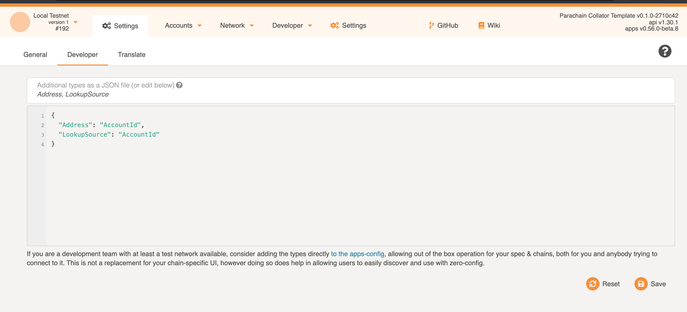
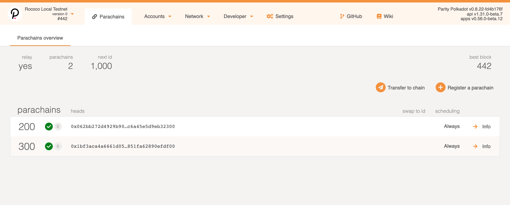

[Rococo](https://github.com/paritytech/cumulus#rococo-crown) is a Polkadot testnet built for testing
parachains. Rococo utilizes Cumulus and HRMP (Horizontal Relay-routed Message Passing) in order to
send transfers and messages between parachains.

## Setting the Environment

To connect to the Rococo testnet, we need to prepare the environment. This command will install
Substrate onto your machine.

```zsh
curl https://getsubstrate.io -sSf | bash -s -- --fast
```

Make sure you have the Polkadot repository cloned locally and checkout to the `fd4b176` commit.

```
git clone https://github.com/paritytech/polkadot.git
cd polkadot
git checkout fd4b176
```

Now it's time to build the Relay Chain node. Note that this command could take some time to run on
your machine.

```
cargo build --release
```

## Building the Parachain Template

Next we will be building the parachain template inside the `polkadot` repo, which will be used to
launch parachains. First, we will clone the parachain template and checkout to the `2710c42` commit.

```
git clone https://github.com/substrate-developer-hub/substrate-parachain-template.git
cd substrate-parachain-template
git checkout 2710c42
```

Now we will begin building the parachain template in our terminal. Again, this can take some time to
run on your computer.

```
cargo build --release
```

## Defining the Chain Spec

Once you've cloned the Polkadot repo and the parachain template, the next step is to select and
download a chain spec. A chain specification is needed for your Relay Chain because it contains
information such as the genesis block, the chain type, and more. Depending on the number of
validators you have, you can choose one from the three files below.

- [rococo-local.json:](https://substrate.dev/cumulus-workshop/specs/rococo-local.json) This is a
  two-validator Relay Chain with Alice and Bob as authorities.
- [rococo-3.json:](https://substrate.dev/cumulus-workshop/specs/rococo-3.json) A three-validator
  Relay Chain with Alice, Bob, and Charlie as the third validator.
- [rococo-4.json:](https://substrate.dev/cumulus-workshop/specs/rococo-4.json) A four-validator
  Relay Chain with Dave as the fourth validator.

### Creating your own Chain Spec

If you aren't interested in downloading pre-made chain specs for the Relay Chain, there is also the
option to build one yourself based on an existing specification. To do so, begin by running this
command:

```
./target/release/polkadot build-spec --chain rococo-local --disable-default-bootnode > rococo-custom-plain.json
```

When you create your own chain spec, there are a few considerations to keep in mind. One being that
Rococo is a Proof-of-Authority chain, so you will need to add in an authority and its session keys
to the file. So you will need to modify the following:

```json
"session": {
    "keys": [
        [
            "5GNJqTPyNqANBkUVMN1LPPrxXnFouWXoe2wNSmmEoLctxiZY",
            "5GNJqTPyNqANBkUVMN1LPPrxXnFouWXoe2wNSmmEoLctxiZY",
            {
                "grandpa": "5FA9nQDVg267DEd8m1ZypXLBnvN7SFxYwV7ndqSYGiN9TTpu",
                "babe": "5GrwvaEF5zXb26Fz9rcQpDWS57CtERHpNehXCPcNoHGKutQY",
                "im_online": "5GrwvaEF5zXb26Fz9rcQpDWS57CtERHpNehXCPcNoHGKutQY",
                "parachain_validator": "5GrwvaEF5zXb26Fz9rcQpDWS57CtERHpNehXCPcNoHGKutQY",
                "authority_discovery": "5GrwvaEF5zXb26Fz9rcQpDWS57CtERHpNehXCPcNoHGKutQY"
            }
        ],
        [
            "5HpG9w8EBLe5XCrbczpwq5TSXvedjrBGCwqxK1iQ7qUsSWFc",
            "5HpG9w8EBLe5XCrbczpwq5TSXvedjrBGCwqxK1iQ7qUsSWFc",
            {
                "grandpa": "5GoNkf6WdbxCFnPdAnYYQyCjAKPJgLNxXwPjwTh6DGg6gN3E",
                "babe": "5FHneW46xGXgs5mUiveU4sbTyGBzmstUspZC92UhjJM694ty",
                "im_online": "5FHneW46xGXgs5mUiveU4sbTyGBzmstUspZC92UhjJM694ty",
                "parachain_validator": "5FHneW46xGXgs5mUiveU4sbTyGBzmstUspZC92UhjJM694ty",
                "authority_discovery": "5FHneW46xGXgs5mUiveU4sbTyGBzmstUspZC92UhjJM694ty"
            }
        ]
    ]
},
```

> Note that if you don't have an account made, please head over to this
> [page](learn-account-generation) to create one. It is recommended to create an account using
> subkey.

1. Add in your authority's `AccountID` and `ValidatorID`.
2. Add in the GRANDPA session key with your own.
3. Add in the other session keys.
4. Remove these two lines (by removing them, it avoids parsing errors and warnings in your
   terminal):

```
"forkBlocks": null,
"badBlocks": null,
```

Next, we will need to generate the final raw spec file:

```
./target/release/polkadot build-spec --chain rococo-custom-plain.json --raw --disable-default-bootnode > rococo-custom.json
```

> Note: Any final spec that you create must begin with `rococo` as without it, your node will not
> know hat the runtime logic is in the module.

## Starting the Relay Chain

Now it's time to start up the Relay Chain. Keep in mind this is separate from parachains, we will
need to have the Relay Chain running in order to support parachains. To run the Polkadot executable,
we will need to go back to the `polkadot` directory and run the following command:

```
./target/release/polkadot --chain /rococo-#.json --tmp --ws-port 9944 --port 30333 --NODE
```

Notice here that `rococo-#.json` should be replaced with your chain spec filename and the `--NODE`
flag should be replaced with the name of each of your validator nodes (ex. alice, bob, dave, etc.).
To run your other validators, ensure the commands are run in separate terminals.

At this point, your log console should look like this:

```
Parity Polkadot
2020-08-24 17:36:37 ✌️  version 0.8.22-fd4b176f-x86_64-macos
2020-08-24 17:36:37 ❤️  by Parity Technologies <admin@parity.io>, 2017-2020
2020-08-24 17:36:37 📋 Chain specification: Rococo Local Testnet
2020-08-24 17:36:37 🏷  Node name: Alice
2020-08-24 17:36:37 👤 Role: AUTHORITY
2020-08-24 17:36:37 💾 Database: RocksDb at /var/folders/pd/hm71vwjj3hg48b1dh8yxwych0000gn/T/substrate24QkJL/chains/rococo_local_testnet/db
2020-08-24 17:36:37 ⛓  Native runtime: rococo-0 (parity-rococo-0.tx0.au2)
2020-08-24 17:36:39 🔨 Initializing Genesis block/state (state: 0x336a…4bf1, header-hash: 0xe482…3e12)
2020-08-24 17:36:39 👴 Loading GRANDPA authority set from genesis on what appears to be first startup.
2020-08-24 17:36:39 ⏱  Loaded block-time = 6000 milliseconds from genesis on first-launch
2020-08-24 17:36:39 👶 Creating empty BABE epoch changes on what appears to be first startup.
2020-08-24 17:36:39 🏷  Local node identity is: 12D3KooWJJzcDNfGi3FXifAhrmZP1baL4heEJAKHZbE6mz7pCmgH (legacy representation: Qmbf22QsBPUCXL1z2CNJrFswBZiyEiyX7FgJEjPUpE8NGk)
2020-08-24 17:36:40 📦 Highest known block at #0
2020-08-24 17:36:40 〽️ Prometheus server started at 127.0.0.1:9615
2020-08-24 17:36:40 👶 Starting BABE Authorship worker
2020-08-24 17:36:45 💤 Idle (0 peers), best: #0 (0xe482…3e12), finalized #0 (0xe482…3e12), ⬇ 0 ⬆ 0
2
```

Notice a few things about this output:

- Chain specification is `Rococo Local Testnet`.
- Validator node name is set to `Alice`.
- Role is set to `AUTHORITY`. This means is that alice is a validator node.
- `Local node identity is: 12D3KooWJJzcDNfGi3FXifAhrmZP1baL4heEJAKHZbE6mz7pCmgH` this is **Alice's
  peer ID** and will be used for setting up other validator nodes.
- `Prometheus server started at 127.0.0.1:9615`, the `127.0.0.1` is **Alice's IP**.
- `Idle (0 peers)` will change depending on how many other validators you have running.

To run another validator, you will need the following command in another terminal:

```
./target/release/polkadot --chain /rococo-#.json --tmp --ws-port 9966 --port 30335 --NODE --bootnodes /ip4/<Alice ID>/tcp/30333/p2p/<Alice peer ID>
```

> Important note: When you run another validator, change the values for `--ws-port` and `--port`, so
> that they aren't conflicting with each other. The Rococo `json` file should be kept the same here.

## Connect to Polkadot-JS Apps

At this point, you are now ready to connect your local node to the Polkadot-JS Apps. To do so, head
over to the [user interface](https://polkadot.js.org/apps/) and change the network to `Local Node`.
For now, you can change the custom endpoint to one of your validator `--ws-port` values. When this
the network is connected, the main page should look like this:


## Starting the Parachain with the Relay Chain

In order for the parachain to launch properly, we first need to register it with the Relay Chain. We
will begin by running this command to generate a WASM file inside your substrate parachain template
folder:

```
./target/release/parachain-collator export-genesis-wasm > para-wasm
```

Next, inside the same terminal, you will need to run the collator node.

```
./target/release/parachain-collator --tmp --validator --ws-port # --port # --parachain-id 200 -- --chain <Path to>/rococo-#.json --bootnodes /ip4/<Alice IP>/tcp/<Alice port>/p2p/<Alice Peer ID> <Other Relay Chain Node(s)>
```

> Tip: to check what your validator nodes are doing on the network so far, you can look for:
> `✍️ Starting parachain attestation session (parent: 0xe482…3e12) with active duty LocalDuty { validation: Relay, index: 0 `
> in your terminal. In this case, this validator node is working on the Relay Chain.

Note that for `--port` and `--ws-port` you need to set to different values than your validator
nodes. Also take note that for creating more parachains, you'd need to change the value of the
`--parachain-id`, and it is not required that the parachain ID in this case be `200`, it can be
whatever ID you choose as long as it's a numerical value. The `<Alice port>` should also be replaced
with alice's port number created.

Once that starts running in your terminal, an important thing to grab is the genesis state. It will
be in the format:

```
2020-08-11 13:58:06 Parachain genesis state: 0x00000000000000000000000000000000000000000000000000000000000000000097600fcfeeed0c7c2e7d922081a466c4c00f2af96ce17f4a07d59e7d47e8354b03170a2e7597b7b7e3d84c05391d139a62b157e78786d8c082f29dcf4c11131400
```

This is the genesis state of the parachain and will be used to actually register the parachain in
the Polkadot-JS Apps. It is recommended to keep this in a safe place to refer back to.

At this point the console log should resemble something like this:

```
2020-08-25 13:32:11 Parachain Collator Template
2020-08-25 13:32:11 ✌️  version 0.1.0-2710c42-x86_64-macos
2020-08-25 13:32:11 ❤️  by Parity Technologies <admin@parity.io>, 2017-2020
2020-08-25 13:32:11 📋 Chain specification: Local Testnet
2020-08-25 13:32:11 🏷  Node name: meaty-lawyer-0481
2020-08-25 13:32:11 👤 Role: AUTHORITY
2020-08-25 13:32:11 💾 Database: RocksDb at /var/folders/pd/hm71vwjj3hg48b1dh8yxwych0000gn/T/substratebiGtlw/chains/local_testnet/db
2020-08-25 13:32:11 ⛓  Native runtime: parachain-template-1 (parachain-template-1.tx1.au1)
2020-08-25 13:32:13 Parachain id: Id(200)
2020-08-25 13:32:13 Parachain Account: 5Ec4AhPTL6nWnUnw58QzjJvFd3QATwHA3UJnvSD4GVSQ7Gop
2020-08-25 13:32:13 Parachain genesis state: 0x00000000000000000000000000000000000000000000000000000000000000000009fb65c199955826c617e30d2204a7f4b77883c94082ebcce843496811f0b50b03170a2e7597b7b7e3d84c05391d139a62b157e78786d8c082f29dcf4c11131400
2020-08-25 13:32:13 Is collating: yes
2020-08-25 13:32:13 🔨 Initializing Genesis block/state (state: 0x09fb…b50b, header-hash: 0x6d45…12f6)
2020-08-25 13:32:13 Using default protocol ID "sup" because none is configured in the chain specs
2020-08-25 13:32:13 🏷  Local node identity is: 12D3KooWC9nCQBJeL9gdeQr87mJMJeJKRydVpTSxyD7oPb62N42U (legacy representation: QmPsncwgCNBtopg2V1JR9DpicZ4jQAQR2M4qWQ72JLmKRT)
2020-08-25 13:32:13 📦 Highest known block at #0
2020-08-25 13:32:15 🔨 Initializing Genesis block/state (state: 0x336a…4bf1, header-hash: 0xe482…3e12)
2020-08-25 13:32:15 👴 Loading GRANDPA authority set from genesis on what appears to be first startup.
2020-08-25 13:32:15 ⏱  Loaded block-time = 6000 milliseconds from genesis on first-launch
2020-08-25 13:32:15 👶 Creating empty BABE epoch changes on what appears to be first startup.
2020-08-25 13:32:15 🏷  Local node identity is: 12D3KooWG5vyoKZggwpEqee8PqNqp6RYFh9gJgPWYAXMFx2ZPcGU (legacy representation: QmeVUPFTAqDBRvEMyi8XATMbeF9ykH5txPgWooRzSyoDZE)
2020-08-25 13:32:15 📦 Highest known block at #0
2020-08-25 13:32:15 〽️ Prometheus server started at 127.0.0.1:9616
2020-08-25 13:32:15 📪 Libp2p listener () closed: Address already in use (os error 48)
2020-08-25 13:32:15 📪 Libp2p listener () closed: Address already in use (os error 48)
2020-08-25 13:32:18 ✨ [Relaychain] Imported #268 (0xb6ba…65e0)
2020-08-25 13:32:18 💤 [Parachain] Idle (0 peers), best: #0 (0x6d45…12f6), finalized #0 (0x6d45…12f6), ⬇ 0 ⬆ 0
2020-08-25 13:32:20 💤 [Relaychain] Idle (3 peers), best: #268 (0xb6ba…65e0), finalized #265 (0x081c…1b35), ⬇ 18.1kiB/s ⬆ 2.4kiB/s
2020-08-25 13:32:23 💤 [Parachain] Idle (0 peers), best: #0 (0x6d45…12f6), finalized #0 (0x6d45…12f6), ⬇ 0 ⬆ 0
2020-08-25 13:32:24 ✨ [Relaychain] Imported #269 (0x2dd2…9964)
2020-08-25 13:32:25 💤 [Relaychain] Idle (3 peers), best: #269 (0x2dd2…9964), finalized #266 (0xf093…fd8f), ⬇ 1.0kiB/s ⬆ 0.6kiB/s
2020-08-25 13:32:28 💤 [Parachain] Idle (0 peers), best: #0 (0x6d45…12f6), finalized #0 (0x6d45…12f6), ⬇ 0 ⬆ 0
2020-08-25 13:32:30 ✨ [Relaychain] Imported #270 (0xe7f2…3743)
2020-08-25 13:32:30 💤 [Relaychain] Idle (3 peers), best: #270 (0xe7f2…3743), finalized #267 (0x8bfc…8abb), ⬇ 1.2kiB/s ⬆ 0.5kiB/s
2020-08-25 13:32:33 💤 [Parachain] Idle (0 peers), best: #0 (0x6d45…12f6), finalized #0 (0x6d45…12f6), ⬇ 0 ⬆ 0
2020-08-25 13:32:35 💤 [Relaychain] Idle (3 peers), best: #270 (0xe7f2…3743), finalized #267 (0x8bfc…8abb), ⬇ 0.7kiB/s ⬆ 0.3kiB/s
2020-08-25 13:32:36 ✨ [Relaychain] Imported #271 (0x256f…8849)
2020-08-25 13:32:38 💤 [Parachain] Idle (0 peers), best: #0 (0x6d45…12f6), finalized #0 (0x6d45…12f6), ⬇ 0 ⬆ 0
2020-08-25 13:32:40 💤 [Relaychain] Idle (3 peers), best: #271 (0x256f…8849), finalized #269 (0x2dd2…9964), ⬇ 1.5kiB/s ⬆ 0.5kiB/s
2020-08-25 13:32:42 ✨ [Relaychain] Imported #272 (0x709a…c025)
2020-08-25 13:32:43 💤 [Parachain] Idle (0 peers), best: #0 (0x6d45…12f6), finalized #0 (0x6d45…12f6), ⬇ 0 ⬆ 0
2020-08-25 13:32:45 💤 [Relaychain] Idle (3 peers), best: #272 (0x709a…c025), finalized #269 (0x2dd2…9964), ⬇ 0.6kiB/s ⬆ 0.3kiB/s
```

Note a few things about this new output:

- `Parachain id: Id(200)` is referring to the id of the parachain that we set it to.
- `Parachain Account: 5Ec4AhPTL6nWnUnw58QzjJvFd3QATwHA3UJnvSD4GVSQ7Gop` is important for cross chain
  transfers.

## Registering the Parachain on Polkadot-JS Apps

At this point, the parachain is ready to be registered officially in the UI. The first step is to
head underneath `Developer` and click on the `Sudo` button.


We will need the genesis state from before that we copied and placed in the `initial_head_data`
section. On this page, you will see other details like the `id`, `ParaInfo`, and `code`. In the `id`
field, we will want to place the ID of the parachain, in this case it would be `200`. The `ParaInfo`
should be set to always, and the `code` field should contain the WASM file that was created while
launching the parachain (for this example, it'd be `para-wasm`).


If you return to your terminal where the collator is running, you should see the following output:

```
2020-08-26 10:21:42 🎁 Prepared block for proposing at 2 [hash: 0xecb70e1f3f69112f854c1e48db49ee3078ced2fe2e813a30422faebb8c635384; parent_hash: 0xbf54…d665; extrinsics (3): [0xaf96…8879, 0x0cf2…7bb2, 0x2259…cec2]]
2020-08-26 10:21:42 ✨ [Parachain] Imported #2 (0xecb7…5384)
2020-08-26 10:21:42 💤 [Relaychain] Idle (3 peers), best: #138 (0x0950…150c), finalized #135 (0xf9ee…9c97), ⬇ 639.9kiB/s ⬆ 821.5kiB/s
2020-08-26 10:21:44 💤 [Parachain] Idle (0 peers), best: #1 (0xbf54…d665), finalized #0 (0x6d45…12f6), ⬇ 0 ⬆ 0
2020-08-26 10:21:47 💤 [Relaychain] Idle (3 peers), best: #138 (0x0950…150c), finalized #135 (0xf9ee…9c97), ⬇ 2.5kiB/s ⬆ 2.6kiB/s
2020-08-26 10:21:48 ✨ [Relaychain] Imported #139 (0x9455…a954)
2020-08-26 10:21:48 🙌 Starting consensus session on top of parent 0xecb70e1f3f69112f854c1e48db49ee3078ced2fe2e813a30422faebb8c635384
2020-08-26 10:21:48 🎁 Prepared block for proposing at 3 [hash: 0x270a31530a178e422fe29bc038b8ea1000c21863619624b1ec292f3fcfa1f003; parent_hash: 0xecb7…5384; extrinsics (3): [0x1cfe…1f17, 0x0784…6e50, 0x2259…cec2]]
2020-08-26 10:21:48 ✨ [Parachain] Imported #3 (0x270a…f003)
```

> This now shows that the Relay Chain is starting to import blocks and that the collator is
> collating!

## Interacting with your Parachain

If you navigate to [apps](https://polkadot.js.org/apps/) and connect the network your collator
port, you will now see that your parachain collator is now connected to the Polkadot network.
Depending on your `--ws-port` value, the custom endpoint should match that.


At this point, you can make transfers between accounts on your parachain. However, to produce a
successful transfer, you will need to enter the following `json` snippet inside "Settings" >
"Developer" and hit the "Save" button.

```
{
  "Address": "AccountId",
  "LookupSource": "AccountId"
}
```

Without this `json` code added in, an error will occur whenever you attempt to make a transfer:


For reference, the page should look like this after you've added in the code:



## Launching another Parachain Node

To launch another parachain node, you may notice that it is similar to launching our first parachain
yet with subtle differences:

```
./target/release/parachain-collator --tmp --bootnodes /ip4/<Collator ip>/tcp/<Collator port>/p2p/<Collator peer id>  --ws-port # --port # --parachain-id <Parachain id> --validator  -- --chain ./specs/rococo-#.json  --bootnodes <Alice, Bob, and other Relay Chain collators>
```

> Note here that when launching another parachain node in a separate terminal, you'll need to change
> the `<Parachain id>` to a different id than your first parachain. The chain spec can lead to the
> same file as your other colllator, or you can generate a new WASM and point it to there.

From here, you will need to go thru the
[parachain registration steps](build-parachains-rococo#registering-the-parachain-on-polkadot-js-ui)
again in order to see and interact with your new parachain node on the network.



## How to make Cross Chain transfers

To send a transfer between parachains, let's start with heading over to "Accounts" > "Transfer".
From here, you'll need to select the parachain node that you have. Next, enter in the amount that
you'd like to send to another parachain. Be sure to select the correct parachain you'd like to send
an amount to. Once you've hit the Submit button, you should see a green notification button,
indicating a successful transfer.

### Downward Transfers

Downward transfers are when an account on the Relay Chain sends a transfer to their own account on a
different parachain. This type of transfer uses a depository and mint model, meaning that when the
DOT leave the senders account on the Relay Chain and are transferred into an account on a parachain,
the parachain mints a corresponding amount of tokens in the specified amount on the parachain.

For example, we can send tokens from Alice's account on the Relay Chain to her own account on
parachain 200. To do so, we will need to head to the "Network" > "Parachains" tab and click on the
"Transfer to chain" button.


Notice here, that we can select which parachain to send the funds to, specify the amount to be sent,
and add any comments or a memo for the transfer.

### Upward Transfers

Upward transfers are when you are on a parachain and want to send a transfer to another account on
the Relay Chain. To proceed with this kind of transfer, we need to be connected to the parachain
node on the network and be on the "Network" > "Parachains" tab and click on the "Transfer to chain"
button.


Note here that the toggle should be set to off, that way the funds go to the Relay Chain and not
another parachain.

### Lateral Transfers

This type of transfer is only possible with at least two different registered parachains. In true
XCMP, lateral transfers would allow for messages to be sent directly from one parachain to another.
However, this is not yet implemented, so the Relay Chain is helping us deliver messages for the time
being. How lateral transfers work is thru the depository model, which means in order to transfer
tokens from chain 200 to chain 300, there must already be tokens owned by chain 200 in a depository
on chain 300.

Before we can actually send funds from one parachain to another, we must ensure that the chain 's
account on the receiptent chain has some funds in it. In this example, Alice will be sending some
funds from her account on parachain 200 to her account on parachain 300.

We will need to grab that parachains account address, from our parachain 300's terminal:

```
2020-08-26 14:46:34 Parachain Account: 5Ec4AhNv5ArwGxtngtW8qcVgzpCAu8nokvnh6vhtvvFkJtpq
```

Then from the Alice's account on the Relay Chain, she is able to send some amount to parachain 200's
depository.


From there, Alice is able to send from her account on parachain 200 to her account on parachain 300.


