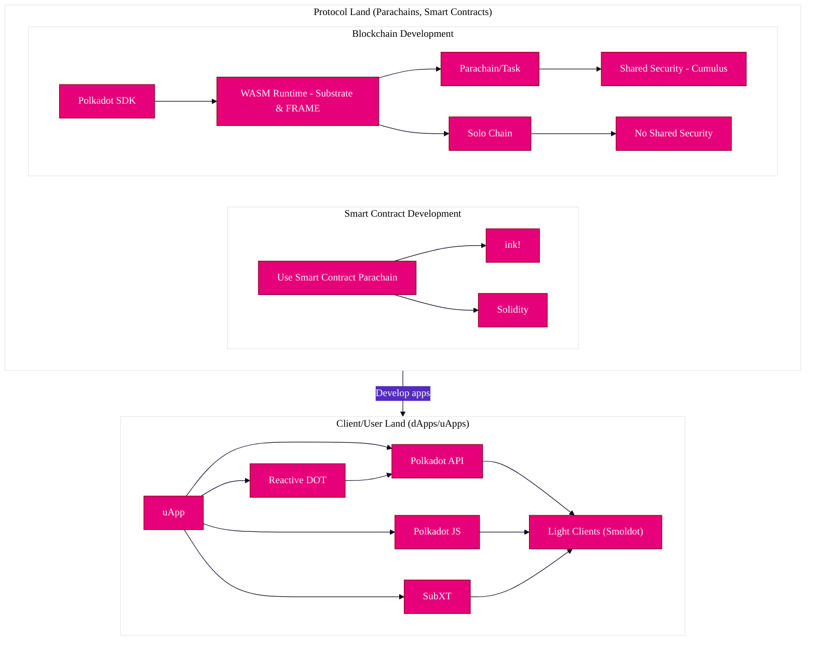

Polkadot is a blockchain network protocol that provides **shared security** among all connected
parachains and allowing all connected tasks to **interoperate** by using
[XCM](../learn/learn-xcm.md).

With the [Polkadot SDK](https://github.com/paritytech/polkadot-sdk) and
[Agile Coretime](../learn/learn-agile-coretime.md), the time it takes to develop and launch a new
chain has dropped significantly. Depending on your goals, it may only take weeks or even days.

This starters guide will walk you through the steps you can take today to get started building your
vision with Polkadot. It will also point to resources you can use to start building immediately.

!!!note For Developers!
    Please note that the following documentation is more geared towards developers. If you are looking
    for more general knowledge related to Polkadot, be sure to check out the
    [Learn](../learn/index.md) section.

This build guide covers three different areas, taking a **top-down** approach from protocol
development to user-facing applications:

<!-- prettier-ignore -->
<!-- no toc -->

1. [Runtime Development - Developing parachains/blockchains](#building-parachains)
2. [Smart Contract Development - How Polkadot handles smart contracts](#developing-smart-contracts)
3. [dApp Development - The tools available for dApp development on Polkadot](#developing-a-dapp)

!!!tip "Keep reading to find out more, or explore each respective area"
    Keep in mind that these areas are merely suggestive, and there are many ways to utilize Polkadot,
    Substrate, and their various developmental components. For more inspiration, look at the
    [open source projects](./build-open-source.md) featured here in the wiki!

## Development Ecosystem Overview

Before diving into the various paths one can take in developing on Polkadot, it's essential to
realize and know key terms that make up the following sections. Even before considering what kind of
application you want to build, it's prudent to understand what Polkadot _is_, and what each
developmental component can do for you within the Polkadot ecosystem.

Before diving into any one of these tracks, it is encouraged to read about Polkadot and its networks
in order to gain context about the application you could make.

[Take a look at the various development network options here.](./build-network-overview.md)

## Building Parachains

Polkadot is canonically referred to as the relay chain. It is also considered a _layer zero_
protocol, as it enables the interoperability and shared security of multiple
[parachains](../learn/learn-parachains.md), which are _layer one_ protocols. Parachains currently
connect to a relay chain using the [Parachains Protocol](../learn/learn-parachains-protocol.md).
More elaborate (or simpler) tasks could be constructed in the future.

!!!info
    Throughout this document, you may encounter the term **runtime** or **STF (State Transition
    Function)**. Both refer to the same concept, as they define how a particular system, i.e., a
    blockchain, should deal with state changes externally and internally. Both of these terms are used
    extensively in Polkadot and Substrate.

Parachains built through the Polkadot SDK, open possibilities to construct complex **runtime**, or
**STF** (state transition function) the logic that would be too expensive to execute with smart
contracts. However, unlike smart contracts, parachains lack a mandatory gas metering system entirely
and could potentially be vulnerable to bugs that cause infinite loops (something that is prevented
by design in smart contracts). This vulnerability is mitigated by the
[weight system](https://docs.polkadot.com/polkadot-protocol/basics/blocks-transactions-fees/fees/) that is implemented in Substrate
-- although it places more of a burden on the developer of the parachain to perform properly
benchmarks.

!!!info "What is an on-demand parachain?"
    On-demand parachains use a "pay-as-you-go" model enabled by Agile Coretime to interact with the
    relay chain. On-demand parachains will only produce a block when needed, unlike full parachains,
    which have access to bulk coretime to produce a block at every block of the relay chain. When
    building an on-demand parachain, you will use the same tools (like PDKs) and get all the benefits of
    building a parachain without the cost drawback of purchasing bulk coretime.

### Polkadot SDK Overview

Polkadot is built using the Polkadot SDK, which,
[the Polkadot node/host implementation](https://paritytech.github.io/polkadot-sdk/master/polkadot_sdk_docs/polkadot_sdk/polkadot/index.html),
within contains the source code for:

- **Substrate** - a set of core libraries used for constructing blockchains - mostly un-opinionated
- **FRAME** - the framework used to build Substrate runtimes - more opinionated
- **Cumulus** - parachain/task specific functions which allow for solo chains to become compatible
  with Polkadot

[Substrate](https://paritytech.github.io/polkadot-sdk/master/polkadot_sdk_docs/polkadot_sdk/substrate/index.html)
is a highly configurable and dynamic framework for building blockchains. At a lower level, Substrate
provides a set of tools and libraries ranging from block production, finality gadgets to
peer-to-peer networking. Both Polkadot and Kusama, as well as most parachains, are built using
Substrate.

In essence, Substrate can break down a blockchain's development process by providing crucial
building blocks of functionality, removing the need for re-engineering complex mechanisms that
usually involved when developing a blockchain.

Substrate can be used as a basis for a parachain to connect to a relay chain like Polkadot or
Kusama, or even as a basis to form a conventional layer one solo chain.

Currently, the most streamlined way of utilizing Substrate is through
[FRAME](https://paritytech.github.io/polkadot-sdk/master/polkadot_sdk_docs/polkadot_sdk/frame_runtime/index.html),
which conveniently allows for a runtime/STF to be generated from a set of modules (called
[pallets](https://paritytech.github.io/polkadot-sdk/master/polkadot_sdk_docs/polkadot_sdk/frame_runtime/index.html#pallets)).
Runtimes in Substrate are built using [WebAssembly](../learn/learn-wasm.md) (Wasm), and represent
the state transition function for a network. FRAME provides a framework for
[pallets](https://paritytech.github.io/polkadot-sdk/master/polkadot_sdk_docs/polkadot_sdk/frame_runtime/index.html#pallets),
to construct a runtime/STF and define how your task is supposed to behave. Ranging from
[identity](https://paritytech.github.io/substrate/master/pallet_identity/index.html) to
[smart contracts](https://paritytech.github.io/substrate/master/pallet_contracts/index.html),
pallets can be quite extensive in providing on-chain functionality.

Even though FRAME is heavily used, it is not the only way to create a valid runtime/STF using
Substrate. Substrate can be used to create new paradigms and abstractions. One such example is the
[Open Runtime Module Library (ORML)](https://github.com/open-web3-stack/open-runtime-module-library),
which is another way of creating and using runtime modules.

!!!note
    Although most parachains utilize FRAME and Substrate to build runtime/STFs for connecting to the
    relay chain, it is not contingent. Building a parachain using other tools is possible if they follow
    the [Parachains Protocol](../learn/learn-parachains-protocol.md).

    As a general rule of thumb, Substrate provides the means for this to become possible through
    comparably minimal effort.

#### Building Parachains with Cumulus

[Cumulus](https://paritytech.github.io/polkadot-sdk/master/polkadot_sdk_docs/polkadot_sdk/cumulus/index.html)
is a set of tools that allows you to convert a blockchain developed using Substrate and FRAME into a
Polkadot-compatible Parachain. More specifically, it provides libraries for all of the necessary
parts of the Polkadot protocol necessary for Parachains to work, for example:

- Creating new parachain blocks via Collators
- Listening to the relay chain for updates
- Synchronizing upgrades between the parachain and relay chain

For most developers, the best place to start is to get familiar with Substrate independently,
followed by FRAME, with Cumulus as the final step to understanding the entire parachain building
process. This way, one can view how various paradigms are applied and decide on integrating or
utilizing Substrate for their particular use case.

Please see [our guides on getting started with coretime](build-guides-coretime-start.md) for how to
get started on building and deploying a parachain.

#### Parachains Benefits

Parachains contain their own runtime/STF logic and benefit from the shared security and the
cross-consensus messaging provided by the relay chain. Parachains permit high flexibility and
customization but require more effort to create and maintain over time. A production-grade parachain
is typically more involved to create due to the complexity involved in blockchain networks'
technical and economic aspects.

Parachains grant the creators more space to build the monetary system and other chain aspects from
the ground up. They will allow for a more concise and efficient execution of complex logic than a
smart contract platform could offer. Parachains also provide more flexibility in the form of
governance and can perform complete upgrades in a less controversial way than the current process of
hard forks.

Some examples of features you can have on a parachain:

- Custom fee structure (for example, pay a flat transaction fee or pay per byte).
- Shared security and finalization via the relay chain (Polkadot or Kusama).
- Custom monetary policy for the native token and local economy.
- Treasury to be funded through transitions in your state function.
- A governance mechanism that could manage a DAO that is responsible for allocating your on-chain
  treasury.

### Building a Pallet

While parachains are highly customizable, they are often complex to develop. If you wish to get
familiar with FRAME and Substrate, a good place to start is by building a pallet in a development
environment. A pallet is a fully customizable module that allows you to implement layer one logic
with relatively minimal development time on a fundamental level while still allowing the possibility
of building advanced functionality into your custom chain.

## Developing Smart Contracts

Smart contracts are another option that enables an often simpler developer experience. Below is a
quick comparison of how building a smart contract compares to building a parachain:

|                         | Parachains | Smart Contracts |
| ----------------------- | ---------- | --------------- |
| Speed of Development    | -          | +               |
| Ease of Deployment      | -          | +               |
| Complexity of logic     | +          | -               |
| Maintenance overhead    | -          | +               |
| Level of customization  | +          | -               |
| Strict resource control | -          | +               |
| Native chain features   | +          | -               |
| Scalability             | +          | -               |

!!!info What's the difference between a smart contract and a pallet?
    If you recall, a parachain comprises a runtime/STF usually built on Substrate. These runtime/STFs
    often utilize FRAME, which is subsequently made of pallets. Pallets are part of a Substrate
    runtime/STF, whereas smart contracts are a product of a pallet (see:
    [pallet_contracts](https://paritytech.github.io/substrate/master/pallet_contracts/index.html)).
    Pallets require more engineering and thought, as they can directly affect the chain's state.

    For a more comprehensive (and maintained) comparison, be sure to check out the
    [comparison from the Polkadot SDK documentation](https://paritytech.github.io/polkadot-sdk/master/polkadot_sdk_docs/reference_docs/runtime_vs_smart_contract/index.html).

### ink! and EVM-based Smart Contracts

At a high level, a _smart contract_ is simply some code that exists at an address on a chain and is
callable by external actors. Whether it's [EVM-based](https://polkadot-evm.github.io/frontier/) or
written using [ink!](https://use.ink/), smart contracts are sandboxed, executable programs that live
on-chain.

!!!note
    _The Polkadot relay chain does not support smart contracts._ However, several parachains do. See the
    [smart contracts guide](build-smart-contracts.md#parachains) for the exact chains in which you can
    deploy contracts on Polkadot.

A Polkadot-native choice for smart contracts is [ink!](https://use.ink/). Other parachains that
offer EVM-based contracts written in Solidity alongside ink!
[are also available](../build/build-smart-contracts.md#parachains).

Because smart contracts exist on a single chain at a time, they can have smooth interoperability
with other smart contracts on the same chain. However, they will always be constrained and limited
by the inherent characteristics of their host chain.

As a developer, you will need to consider the storage and complexity of your smart contract to
ensure that gas usage stays within reasonable bounds. Consider using the listed options on the
[decentralized storage](build-storage.md) page to keep the data and submit only the content address
on the chain.

!!!info Building a smart contract
    Please see the [smart contracts guide](build-smart-contracts.md) for how to get started on building
    a smart contract.

## Developing a dApp

If one aims to develop a **dApp** (Decentralized App), the Polkadot ecosystem contains various SDKs
to tap into the relay chain and parachains.

For front-end applications, several options exist for interfacing with Substrate-based chains
(parachains, relay chains, etc.) and smart contracts. These often will interact with the RPC of a
Substrate node.

[Please visit the documentation for developing dApps and other general client-side development resources.](../build/build-dapp.md)

For a complete list of tools, please take a look here:
[Tools, APIs, and Languages](../build/build-open-source.md)

## Resources

- [Agile Coretime Fellowship RFC](https://polkadot-fellows.github.io/RFCs/approved/0001-agile-coretime.html)
- [Polkadot Bridges](../learn/learn-bridges.md)
- [The Path of a Parachain Block](https://polkadot.network/blog/the-path-of-a-parachain-block/)
- [The Path of a Parachain Block (Parachain Protocol page)](../learn/learn-parachains-protocol.md)
- [How to become a parachain on Polkadot (Video)](https://www.youtube.com/watch?v=fYc1yolanoE)
- [Trusted Execution Environments and the Polkadot Ecosystem](https://polkadot.network/blog/trusted-execution-environments-and-the-polkadot-ecosystem/)
