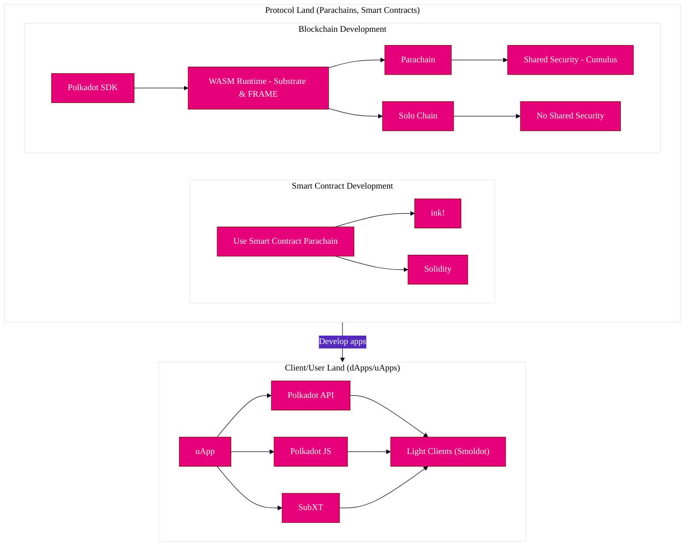

import Tabs from "@theme/Tabs"; import TabItem from "@theme/TabItem"; import DocCardList from
'@theme/DocCardList';

<DocCardList />

{{ polkadot: Polkadot :polkadot }}{{ kusama: Kusama :kusama }} is a blockchain protocol with two
goals: providing **shared security** among all connected parachains and allowing all connected
chains to **interoperate** by using [XCM](../learn/learn-xcm.md). With the advent of
[PDKs](../build/build-parachains.md#parachain-development-kit) like
[Substrate](https://substrate.io/) and [Cumulus](https://github.com/paritytech/cumulus), the time it
takes to develop and launch a new chain has dropped significantly. While before, it would take years
to launch a new chain, now it may only take weeks or even days, depending on your goals.

This guide will walk you through the steps you can take today to get started building your vision
with {{ polkadot: Polkadot :polkadot }}{{ kusama: Kusama :kusama }}. It will explain the difference
between a [parachain](../learn/learn-parachains.md) and a smart contract in deciding which best fits
your architectural needs.

This build guide provides three different tracks:

1.  [Protocol Development - Blockchain & Parachain Development](#building-parachains)
2.  [Developing Smart Contracts](#developing-smart-contracts)
3.  [Developing a dApp](#developing-a-dappuapp)

:::tip Keep reading to find out more, or visit each respective track

Keep in mind that these tracks are merely suggestive, and there are many ways to utilize
{{ polkadot: Polkadot :polkadot }}{{ kusama: Kusama :kusama }}, Substrate, and their various
developmental components. For more inspiration, look at the
[open source projects](./build-open-source.md) featured here in the wiki!

:::

## Development Ecosystem Overview

Before diving into the various paths, one can take in developing on
{{ polkadot: Polkadot :polkadot }}, it's important to realize and know key terms that make up the
following sections. Even before considering what kind of application you want to build, it's prudent
to understand what {{ polkadot: Polkadot :polkadot }} _is_ and how {{ kusama: Kusama :kusama }}
relates to it, and what each developmental component can do for you within the Polkadot ecosystem.

Before diving into any one of these tracks, it is encouraged to read about
{{ polkadot: Polkadot :polkadot }}{{ kusama: Kusama :kusama }} and its networks in order to gain
context about the application you could make.

## Building Parachains

{{ polkadot: Polkadot :polkadot }}{{ kusama: Kusama :kusama }} is canonically referred to as the
Relay Chain. It is also considered a _layer zero_ protocol, as it enables the interoperability and
shared security of multiple [parachains](../learn/learn-parachains.md), which are _layer one_
protocols. Parachains connect to a relay chain using the
[Parachains Protocol](../learn/learn-parachains-protocol.md).

:::info

Throughout this document, you will encounter the term **runtime** or **STF (State Transition
Function)**. Both refer to the same concept, as they define how a particular system, i.e., a
blockchain, should deal with state changes externally and internally. Both of these terms are used
extensively in {{ polkadot: Polkadot :polkadot }}{{ kusama: Kusama :kusama }}, and by association,
Substrate contexts.

:::

Parachains open possibilities to construct complex **runtime**, or **STF** (state transition
function) the logic that would be too expensive to execute with smart contracts. However, unlike
smart contracts, parachains lack a mandatory gas metering system entirely and could potentially be
vulnerable to bugs that cause infinite loops (something that is prevented by design in smart
contracts). This vulnerability is mitigated by the
[weight system](https://docs.substrate.io/build/tx-weights-fees/) that is implemented in Substrate
-- although it places more of a burden on the developer of the parachain to perform properly
benchmarks.

:::info What is a parathread?

Parathreads, or "on-demand parachains," are like parachains and enable the developer to have
lower-level control of the logic of their application. The main difference between the two is
economical since parathreads will be much less expensive to secure than a parachain and is a
"pay-as-you-go" model. The lower costs of parathreads are because parathreads will only produce a
block when needed, unlike parachains, which have secured a slot to produce a block at every block of
the Relay Chain. When building a parathread, you will use the same tools (like PDKs) and get all the
benefits of building a parachain without the cost drawback.

:::

### Constructing FRAME Runtimes with Substrate

Polkadot is built using the [Substrate](https://substrate.io/) framework.
[Substrate](https://substrate.io/) is a highly configurable and dynamic framework for building
blockchains. At a lower level, Substrate provides a set of tools and libraries ranging from
[block production, finality gadgets to peer-to-peer networking](https://docs.substrate.io/reference/rust-api/).
Both Polkadot and Kusama, as well as most parachains, are built using Substrate.

In essence, Substrate can break down a blockchain's development process by providing crucial
building blocks of functionality, removing the need for re-engineering complex mechanisms that
usually involved when developing a blockchain.

Substrate can be used as a basis for a parachain to connect to a relay chain like Polkadot or
Kusama, or even as a basis to form a conventional layer one solo chain.

Currently, the most streamlined way of utilizing Substrate is
[FRAME](https://docs.substrate.io/learn/runtime-development/#frame), which conveniently allows for a
runtime/STF to be generated from a set of modules (called
[pallets](https://docs.substrate.io/reference/frame-pallets/)).
[Runtimes](https://docs.substrate.io/learn/architecture/#runtime) in Substrate are built using
[WebAssembly](../learn/learn-wasm.md) (Wasm), and represent the state transition function for a
network. FRAME allows for a collection of business logic-oriented modules, called
[pallets](https://docs.substrate.io/reference/frame-pallets/), to construct a runtime/STF and define
how exactly the blockchain is supposed to behave. Ranging from
[identity](https://paritytech.github.io/substrate/master/pallet_identity/index.html) to
[smart contracts](https://paritytech.github.io/substrate/master/pallet_contracts/index.html),
pallets can be quite extensive in providing on-chain functionality.

Even though FRAME is heavily used, it is not the only way to create a valid runtime/STF using
Substrate. Substrate can be used to create new paradigms and abstractions that build on the concept
of web3.

:::note

Although most parachains utilize FRAME and Substrate to build runtime/STFs for connecting to the
relay chain, it is not contingent. Building a parachain using other tools is possible, as long as
they follow the [Parachains Protocol](../learn/learn-parachains-protocol.md).

As a general rule of thumb, Substrate provides the means for this to become possible through
comparably minimal effort.

:::

#### Building Parachains with Cumulus

Diving further into building parachains, [Cumulus](https://github.com/paritytech/cumulus) is another
set of tools that aid in building a parachain-ready blockchain for Polkadot or Kusama. Cumulus
utilizes FRAME and Substrate to create an easy way to build your first parachain. It ensures the
chain follows the Parachain Protocol.

:::info

_Cumulus clouds are shaped like dots; together, they form an intricate, beautiful and functional
system._

:::

For most developers, the best place to start is to get familiar with Substrate independently,
followed by FRAME, with Cumulus as the final step to understanding the entire parachain building
process. This way, one can view how various paradigms are applied and decide on integrating or
utilizing Substrate for their particular use case.

Please see the [parachain development guide](build-parachains.md) for how to get started on building
a parachain or parathread.

#### Parachains Benefits

Parachains contain their own runtime/STF logic and benefit from the shared security and the
cross-consensus messaging provided by the {{ polkadot: Polkadot :polkadot }} relay chain. Parachains
permit high flexibility and customization but require more effort to create and maintain over time.
A production-grade parachain is typically more involved to create due to the complexity involved in
blockchain networks' technical and economic aspects.

Parachains grant the creators more space to build the monetary system and other chain aspects from
the ground up. They will allow for a more concise and efficient execution of complex logic than a
smart contract platform could offer. Parachains also provide more flexibility in the form of
governance and can perform complete upgrades in a less controversial way than the current process of
hard forks.

Some examples of features you can have on a parachain or parathread:

- Custom fee structure (for example, pay a flat transaction fee or pay per byte).
- Shared security and finalization via the relay chain (Polkadot or Kusama).
- Custom monetary policy for the native token and local economy.
- Treasury to be funded through transitions in your state function.
- A governance mechanism that could manage a DAO that is responsible for allocating your on-chain
  treasury.

### Building a Pallet

While parachains are highly customizable, they are often complex to develop. If you wish to get
familiar with FRAME and Substrate, a good place to start is by building a pallet in a development
environment. A pallet is a fully customizable module that allows you to implement layer one logic
with relatively minimal development time on a fundamental level while still allowing the possibility
of building advanced functionality into your custom chain.

To learn how to build a pallet, follow the
[Substrate documentation](https://docs.substrate.io/tutorials/build-application-logic/).

## Developing Smart Contracts

Smart contracts are another option that enables an often simpler developer experience. Below is a
quick comparison of how building a smart contract compares to building a parachain:

|                         | Parachains | Smart Contracts |
| ----------------------- | ---------- | --------------- |
| Speed of Development    | -          | +               |
| Ease of Deployment      | -          | +               |
| Complexity of logic     | +          | -               |
| Maintenance overhead    | -          | +               |
| Level of customization  | +          | -               |
| Strict resource control | -          | +               |
| Native chain features   | +          | -               |
| Scalability             | +          | -               |

:::info What's the difference between a smart contract and a pallet?

If you recall, a parachain comprises a runtime/STF usually built on Substrate. These runtime/STFs
often utilize FRAME, which is subsequently made of pallets. Pallets are part of a Substrate
runtime/STF, whereas smart contracts are a product of a pallet (see:
[pallet_contracts](https://paritytech.github.io/substrate/master/pallet_contracts/index.html)).
Pallets require more engineering and thought, as they can directly affect the chain's state.

:::

### ink! and EVM-based Smart Contracts

At a high level, a _smart contract_ is simply some code that exists at an address on a chain and is
callable by external actors. Whether it's
[EVM-based](https://docs.substrate.io/tutorials/integrate-with-tools/evm-integration/), or written
using [ink!](https://use.ink/), smart contracts sandboxed, executable programs that live on-chain.

:::note

The Polkadot relay chain does not support smart contracts. However, several parachains do. See the
[smart contracts guide](build-smart-contracts.md#smart-contract-environments-are-still-maturing) for
more information about the environments provided.

:::

A popular choice for smart contracts is [ink!](https://use.ink/). Other parachains that offer
EVM-based contracts written in Solidity alongside ink!
[are also available](./build-smart-contracts#parachains).

Because smart contracts exist on a single chain at a time, they can have smooth interoperability
with other smart contracts on the same chain. However, they will always be constrained and limited
by the inherent characteristics of their host chain.

As a developer, you will need to consider the storage and complexity of your smart contract to
ensure that gas usage stays within reasonable bounds. Consider using the listed options on the
[decentralized storage](build-storage.md) page to keep the data and submit only the content address
on the chain.

:::info Building a smart contract

Please see the [smart contracts guide](build-smart-contracts.md) for how to get started on building
a smart contract.

:::

## Developing a dApp/uApp

If one aims to develop a **dApp** (Decentralized App) or **uApp** (Unstoppable App), the Polkadot
ecosystem contains various SDKs to tap into the relay chain and parachains.

For front-end applications, several options exist for interfacing with Substrate-based chains
(parachains, relay chains, etc.) and smart contracts. These often will interact with the RPC of a
Substrate node.

[Please visit the full documentation for developing dApps and other general client-side development resources.](build-dapp)

For a complete list of tools, please take a look here:
[Tools, APIs, and Languages](build-open-source.md)

## Resources

- [System (Common Good) Parachains](https://polkadot.network/blog/common-good-parachains-an-introduction-to-governance-allocated-parachain-slots/)
- [The Launch of Parachains](https://polkadot.network/blog/the-launch-of-parachains/)
- [Parathreads: Pay-as-you-go Parachains](https://medium.com/polkadot-network/parathreads-pay-as-you-go-parachains-7440d23dde06)
- [Polkadot Bridges](https://medium.com/polkadot-network/polkadot-bridges-connecting-the-polkadot-ecosystem-with-external-networks-1118916392e3)
- [The Path of a Parachain Block](https://polkadot.network/blog/the-path-of-a-parachain-block/)
- [The Path of a Parachain Block (Video)](https://www.crowdcast.io/e/polkadot-path-of-a-parachain-block?utm_source=profile&utm_medium=profile_web&utm_campaign=profile)
- [Polkadot Parachain Slots](https://polkadot.network/polkadot-parachain-slots/)
- [How to become a parachain on Polkadot (Video)](https://www.youtube.com/watch?v=fYc1yolanoE)
- [Trusted Execution Environments and the Polkadot Ecosystem](https://polkadot.network/blog/trusted-execution-environments-and-the-polkadot-ecosystem/)
