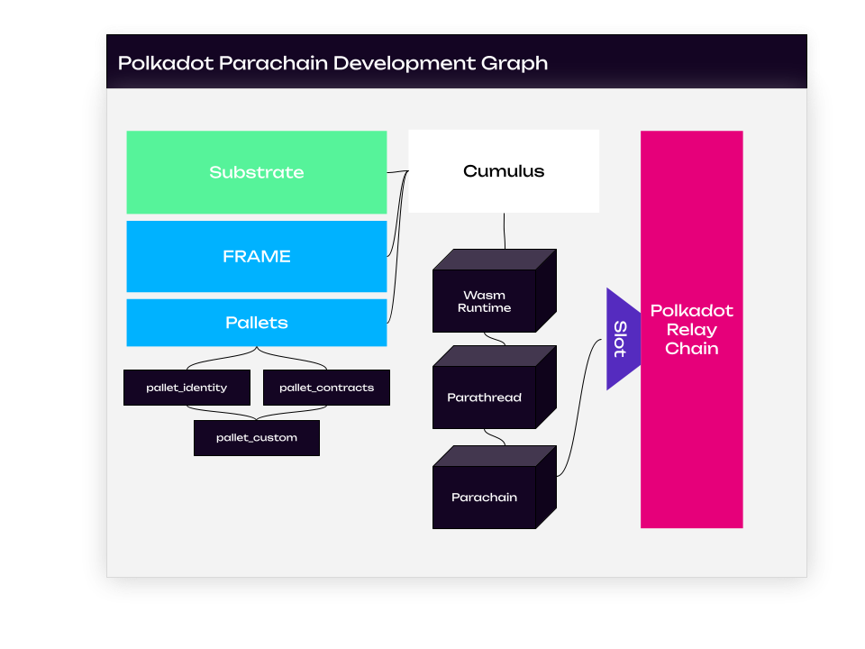

import Tabs from "@theme/Tabs";

import TabItem from "@theme/TabItem";

Polkadot is a blockchain protocol with two goals: providing **shared security** among all connected
parachains and allowing all connected chains to **interoperate** by using
[XCM](../learn/learn-xcm.md). With the advent of
[PDKs](../build/build-parachains.md#parachain-development-kit) like
[Substrate](https://substrate.io/) and [Cumulus](https://github.com/paritytech/cumulus), the time it
takes to develop and launch a new chain has dropped significantly. While before it would take years
to launch a new chain, now it may only take weeks or even days depending on your goals.

This guide will walk you through the steps you can take today to get started building your vision
with {{ polkadot: Polkadot :polkadot }}{{ kusama: Kusama :kusama }}. It will explain the difference
between a [parachain](../learn/learn-parachains.md) and a smart contract in terms of deciding which
best fits your architectural needs.

This build guide provides four different tracks:

1. [Building Parachains](#building-parachains)
2. [Building a Pallet](#building-a-pallet)
3. [Developing Smart Contracts](#developing-smart-contracts)
4. [Developing a dApp](#developing-a-dapp)

:::info

Keep in mind that these tracks are merely suggestive, and there are many ways to utilize Polkadot,
Substrate, and their various developmental components. For more inspiration, take a look at the
[open source projects](./build-open-source.md) featured here in the wiki!

:::

Before diving into any one of these tracks, it is encouraged to read about Polkadot and its networks
in order to gain context about the application you could make.

## Development Ecosystem Overview

Before diving into the various paths one can take in developing on
{{ polkadot: Polkadot :polkadot }}, it's important to realize and know key terms that make up the
following sections. Even prior to considering what kind of application you want to build, it's
prudent to understand what {{ polkadot: Polkadot :polkadot }} _is_ and how
{{ kusama: Kusama :kusama }} relates to it, and how what each developmental component can do for you
within the Polkadot ecosystem.

### Polkadot Ecosystem Networks

- Mainnet: **Polkadot**
- Canary network: **Kusama**
  - [Kusama](https://kusama.network/) is a value-bearing canary network that gets features before
    Polkadot does. _Expect Chaos_.
- Official testnets:
  - **Westend** - Functionality equal to the current Polkadot mainnet, with possible next-generation
    testing of features from time to time that will eventually migrate onto Polkadot. Perma-testnet
    (is not reset back to genesis block).
  - **Canvas** - Wasm based Smart Contract enabled testnet, primarily for [`ink!`](https://use.ink/)
    development.
  - **Rococo** - Parachains and XCM testnet. Occasionally reset (started over again with a new
    genesis block).

{{ polkadot: Polkadot mainnet has been running since May 2020 :polkadot }}{{ kusama: Kusama mainnet has been
running since August 2019 :kusama }} and has [implementations in various programming languages](../learn/learn-implementations.md)
ranging from Rust to JavaScript. Currently, the leading implementation is built in Rust and built using
the Substrate framework.

Tooling is rapidly evolving to interact with the network; there are so many ways to get started!

But before you jump head-first into the code, you should consider the _kind_ of decentralized
application you want to make and understand the different paradigms available to developers who want
to build on {{ polkadot: Polkadot :polkadot }}{{ kusama: Kusama :kusama }}.

## Building Parachains

As mentioned, Polkadot is the **mainnet**, but is canonically referred to as the Relay Chain. It is
also considered a _layer zero_ protocol, as it enables for the interoperability and shared security
of multiple [parachains](../learn/learn-parachains.md), which are _layer one_ protocols. Parachains
connect to a relay chain using the [Parachains Protocol](../learn/learn-parachains-protocol.md).

:::info

Throughout this document, you will encounter the term **runtime** or **STF (State Transition
Function)**. Both refer to the same concept, as they both define how exactly a particular system,
i.e., a blockchain, should deal with state changes both externally and internally. Both of these
terms are used extensively in Polkadot, and by association, Substrate contexts.

:::

Parachains open possibilities to construct complex **runtime**, or **STF** (state transition
function) logic that would be too expensive to execute with smart contracts. However, unlike smart
contracts, parachains lack a mandatory gas metering system entirely and could potentially be
vulnerable to bugs that cause infinite loops (something that is prevented by design in smart
contracts). This vulnerability is mitigated by the
[weight system](https://docs.substrate.io/build/tx-weights-fees/) that is implemented in Substrate
-- although it places more of a burden on the developer of the parachain to properly perform
benchmarks.

:::info What is a parathread?

Parathreads, or "on-demand parachains", are like parachains and enable the developer to have
lower-level control of the logic of their application. The main difference between the two is
economic since parathreads will be much less expensive to secure than a parachain, and is a
"pay-as-you-go" model. The lower costs of parathreads are due to the fact that parathreads will only
produce a block when they need to, unlike parachains, which have secured a slot to produce a block
at every block of the Relay Chain. When building a parathread, you will use the same tools (like
PDKs) and you get all of the benefits of building a parachain, without the drawback of the cost.

:::

You may also decide to harness a combination of parachain, parathread, and smart contract. If you
have certain logic that requires loops and it cannot be removed, use the native parachain
runtime/STF to handle all complex logic and the smart contract to call iteration. If you require
off-chain data from an oracle, you may want to use a parathread as an oracle feed that only triggers
once every 24 hours (this makes the most sense if the data is useful to other players in the
{{ polkadot: Polkadot :polkadot }}{{ kusama: Kusama :kusama }} ecosystem too).

### Constructing FRAME Runtimes with Substrate

Polkadot is built using the [Substrate](https://substrate.io/) framework.
[Substrate](https://substrate.io/) is a highly configurable and dynamic framework that is used for
building blockchains. At a lower level, Substrate provides a set of tools and libraries ranging from
[block production, finality gadgets, to peer-to-peer networking](https://docs.substrate.io/reference/rust-api/).
Both Polkadot and Kusama, as well as most parachains are built using Substrate.

In essence, Substrate can break down a blockchain's development process by providing crucial
building blocks of functionality, removing the need for re-engineering complex mechanisms that
usually are involved when developing a blockchain.

Substrate can be used as a basis for a parachain to connect to a relay chain like Polkadot or
Kusama, or even as a basis to form a conventional layer one solo chain.

Currently, the most streamlined way of utilizing Substrate is
[FRAME](https://docs.substrate.io/learn/runtime-development/#frame), which conveniently allows for a
runtime/STF to be generated from a set of modules (called
[pallets](https://docs.substrate.io/reference/frame-pallets/)).
[Runtimes](https://docs.substrate.io/learn/architecture/#runtime) in Substrate are built using
[WebAssembly](../learn/learn-wasm.md) (Wasm), and represent the state transition function for a
network. FRAME allows for a collection of business logic-oriented modules, called
[pallets](https://docs.substrate.io/reference/frame-pallets/), to construct a runtime/STF and define
how exactly the blockchain is supposed to behave. Ranging from
[identity](https://paritytech.github.io/substrate/master/pallet_identity/index.html) to
[smart contracts](https://paritytech.github.io/substrate/master/pallet_contracts/index.html),
pallets can be quite extensive in providing on-chain functionality.

Even though FRAME is heavily used, it is not the only way to create a valid runtime/STF using
Substrate. Substrate as a whole can be used to create new paradigms and abstractions that build on
the concept of web3.

:::note

Although most parachains utilize FRAME and Substrate to build runtime/STFs for connecting to the
relay chain, it is not contigent. It is entirely possible to build a parachain using other tools, so
long as they follow the [Parachains Protocol](../learn/learn-parachains-protocol.md).

As a general rule of thumb, Substrate provides the means for this to become possible through
comparably minimal effort.

:::

#### Building Parachains with Cumulus

Diving further into building parachains, [Cumulus](https://github.com/paritytech/cumulus) is yet
another set of tools that aid in the process of building a parachain-ready blockchain for Polkadot
or Kusama. Cumulus utilizes FRAME and Substrate to create a easy way to build your first parachain.
It ensures the chain follows the Parachain Protocol.

:::info

_Cumulus clouds are shaped sort of like dots; together they form a system that is intricate,
beautiful and functional._

:::

For most developers, the best place to start is to first get familiar with Substrate on its own,
followed by FRAME, with Cumulus as the final step to understanding the entire parachain building
process. This way, one can view how various paradigms are applied, and can make decisions on how to
integrate or utilize Substrate for their particular use case.

Please see the [parachain development guide](build-parachains.md) for how to get started on building
a parachain or parathread.

#### Parachains Benefits

Parachains contain their own runtime/STF logic and benefit from the shared security and the
cross-chain messaging provided by the {{ polkadot: Polkadot :polkadot }} relay chain. Parachains
permit a high degree of flexibility and customization but require more effort to create and maintain
over time. A production-grade parachain is typcially are more involved to create due the complexity
that is involved in technical and economic aspects of blockchain networks.

Parachains grant the creators more space to build the monetary system and other aspects of the chain
from the ground up. They will allow for more succinct and efficient execution of complex logic than
could ever be offered by a smart contract platform. Parachains also offer more flexibility in the
form of governance and can perform complete upgrades in a less controversial way than the current
process of hard-forks.

Some examples of features you can have on a parachain or parathread:

- Custom fee structure (for example, pay a flat fee for transactions or pay per byte).
- Custom monetary policy for the native token and local economy.
- Treasury to be funded through transitions in your state function.
- A governance mechanism that could manage a DAO that is responsible for allocating your on-chain
  treasury.

## Building a Pallet

While parachains are highly customizable, they are often complex to develop. If you wish to get
familiar with FRAME and Substrate, a good place to start is by building a pallet in a development
environment. A pallet is a fully customizable module that allows you to implement layer one logic
with relatively minimal development time on a basic level, while still allowing the possibility of
building advanced functionality into your custom chain.

To learn how to build a pallet, follow the
[Substrate documentation](https://docs.substrate.io/tutorials/build-application-logic/).

## Developing Smart Contracts

Smart contracts are another option which enable for an often times simpler developer experience.

:::info What's the difference between a smart contract and a pallet?

If you recall, a parachain is made up of a runtime/STF that is usually built on Substrate. These
runtime/STFs often utilize FRAME, which is subsequently made up of pallets. Pallets are part of a
Substrate runtime/STF, whereas smart contracts are a product of a pallet (see:
[pallet_contracts](https://paritytech.github.io/substrate/master/pallet_contracts/index.html)).
Pallets require more engineering and thought, as they can directly affect the chain's state.

:::

### ink! and EVM-based Smart Contracts

At a high level, a _smart contract_ is simply some code that exists at an address on a chain and is
callable by external actors. Whether it's
[EVM-based](https://docs.substrate.io/tutorials/integrate-with-tools/evm-integration/), or written
using [ink!](https://use.ink/), smart contracts sandboxed, executable programs that live on-chain.

:::note

The Polkadot relay chain does not support smart contracts, however a number of parachains do. See
the [smart contracts guide](build-smart-contracts.md#smart-contract-environments-are-still-maturing)
for more information about the environments provided.

:::

A popular choice for smart contracts is [ink!](https://use.ink/), however on other parachains,
EVM-based contracts written in Solidity are also available!

Because smart contracts exist on a single chain at a time, they can have smooth interoperability
with other smart contracts on the same chain. However, they will always be constrained and limited
by the inherent characteristics of their host chain.

As a developer, you will need to consider the storage and complexity of your smart contract to
ensure that gas usage stays within reasonable bounds. Storage will likely be expensive for whichever
smart contract platform you use, so it is necessary to keep as much data off-chain as possible. You
may consider using the listed options on the [decentralized storage](build-storage.md) page to keep
the data and submitting only the content address on chain.

:::info Building a smart contract

Please see the [smart contracts guide](build-smart-contracts.md) for how to get started on building
a smart contract.

:::

## Developing a dApp

If one simply wishes to develop a dApp, it is most likely that learning how the RPC interfaces of
Substrate work. The Polkadot ecosystem contains a wide variety of SDKs to tap into both the relay
chain and parachains.

For front end applications, there are several options for interfacing with Substrate-based chains
(parachains, relay chains etc) and smart contracts:

<!-- <Tabs groupId="client-libraries" values={[ {label: 'Polkadot.js', value: 'pjs'}, {label: 'CAPI',
value: 'capi'}, {label: 'Subxt', value: 'subxt'}, {label: 'React Hooks for ink', value: 'ink'} ]}>
<TabItem value="pjs"> Promise and RxJS APIs around Polkadot and Substrate based chains via RPC
calls. It is dynamically generated based on what the Substrate runtime provides in terms of
metadata. Full documentation & examples available. </TabItem> <TabItem value="capi"> Capi is a
framework (based on Typescript) for crafting interactions with Substrate chains. It consists of a
development server and fluent API, which facilitates multichain interactions without compromising
either performance or ease of use. </TabItem> <TabItem value="subxt"> Submit extrinsics
(transactions) to a Substrate node via RPC using Rust. Also referred to as Rust Parity. </TabItem> </Tabs> -->

<Tabs groupId="clients" values={[ {label: 'Polkadot.js', value: 'pjs'}, {label: 'Subxt', value:
'subxt'}, {label: 'CAPI', value: 'capi'}, {label: 'React Hooks for ink', value: 'ink'} ]}>

<TabItem value="pjs"> Promise and RxJS APIs around Polkadot and Substrate based chains via RPC
calls. It is dynamically generated based on what the Substrate runtime provides in terms of
metadata. Full documentation & examples available. </TabItem>

<TabItem value="capi"> Capi is a framework (based on Typescript) for crafting interactions with
Substrate chains. It consists of a development server and fluent API, which facilitates multichain
interactions without compromising either performance or ease of use. </TabItem>

<TabItem value="subxt"> Submit extrinsics (transactions) to a Substrate node via RPC using Rust.
Also referred to as Rust Parity. </TabItem>

<TabItem value="ink"> React hooks for ink! smart contracts </TabItem>

</Tabs>

For a full list of tools please take a look here: [Tools, APIs and Languages](build-open-source.md)
