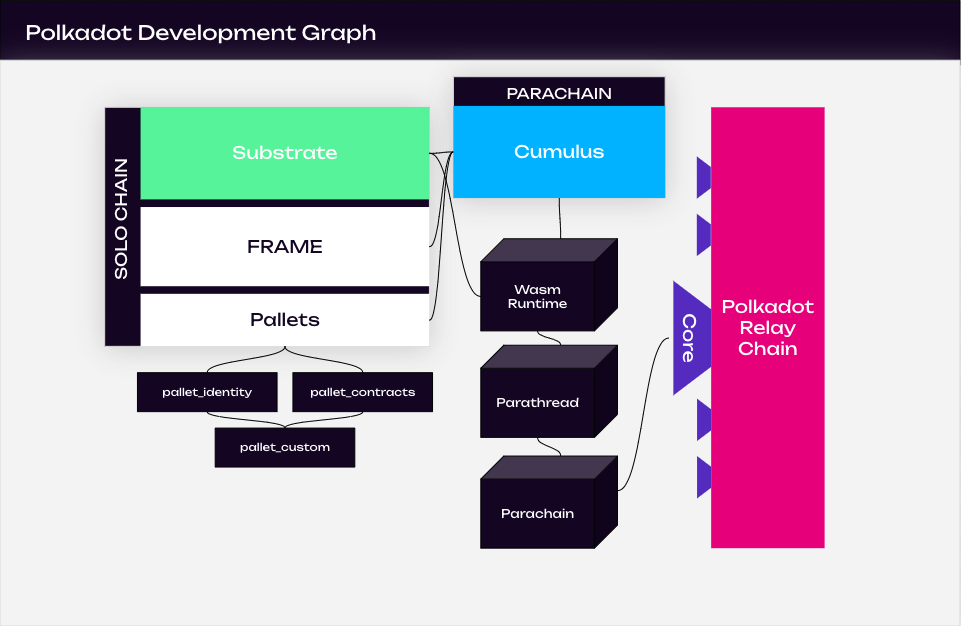

Polkadot is a blockchain protocol with two goals: providing **shared security** among all connected
parachains and allowing all connected chains to **interoperate** by using
[XCM](../learn/learn-xcm.md). With the advent of
[PDKs](../build/build-parachains.md#parachain-development-kit) like
[Substrate](https://substrate.io/) and [Cumulus](https://github.com/paritytech/cumulus), the time it
takes to develop and launch a new chain has dropped significantly. While before it would take years
to launch a new chain, now it may only take weeks or even days depending on your goals.

This guide will walk you through the steps you can take today to get started building your vision
with {{ polkadot: Polkadot :polkadot }}{{ kusama: Kusama :kusama }}. It will explain the difference
between a [parachain](../learn/learn-parachains.md) and a smart contract (and why one may be better
suited for your application over the other).

## Development Ecosystem Overview

Before diving into the various paths one can take in developing on
{{ polkadot: Polkadot :polkadot }}, it's important to realize and know key terms that make up the
following sections. Even prior to considering what kind of application you want to build, it's
prudent to understand what {{ polkadot: Polkadot :polkadot }} _is_ and how
{{ kusama: Kusama :kusama }} relates to it, and how what each developmental component can do for you
within the Polkadot ecosystem.

### Polkadot Ecosystem Networks

- Mainnet: **Polkadot**
- Canary network: **Kusama**
  - [Kusama](https://kusama.network/) is a value-bearing canary network that gets features before
    Polkadot does. _Expect Chaos_.
- Official testnets:
  - **Westend** - Functionality equal to the current Polkadot mainnet, with possible next-generation
    testing of features from time to time that will eventually migrate onto Polkadot. Perma-testnet
    (is not reset back to genesis block).
  - **Canvas** - Wasm based Smart Contract enabled testnet, primarily for `ink!` development.
  - **Rococo** - Parachains and XCM testnet. Occasionally reset (started over again with a new
    genesis block).

{{ polkadot: Polkadot mainnet has been running since May 2020 :polkadot }}{{ kusama: Kusama mainnet has been
running since August 2019 :kusama }} and has [implementations in various programming languages](../learn/learn-implementations.md)
ranging from Rust to JavaScript. Currently, the leading implementation is built in Rust and built using
the Substrate framework.

:::info

As mentioned, Polkadot is the **mainnet**, but it is more accurately referred to as a relay chain.
It is also considered a _layer zero_ protocol, as it enables for the interoperability and shared
security of multiple parachains. While it is possible to develop applications using just Polkadot,
it is important to realize that usually a developer could utilize any number of parachains,
functionality from Polkadot, or smart contracts to build an application.

:::

Tooling is rapidly evolving to interact with the network; there are so many ways to get started!

But before you jump head-first into the code, you should consider the _kind_ of decentralized
application you want to make and understand the different paradigms available to developers who want
to build on {{ polkadot: Polkadot :polkadot }}{{ kusama: Kusama :kusama }}.

### Constructing FRAME Runtimes with Substrate

Polkadot is built using the [Substrate](https://substrate.io/) framework.
[Substrate](https://substrate.io/) is a highly configurable and dynamic framework that is used for
building blockchains. At a lower level, Substrate provides a set of tools and libraries ranging from
[block production, finality gadgets, to peer-to-peer networking](https://docs.substrate.io/reference/rust-api/).
Both Polkadot and Kusama, as well as most parachains are built using Substrate.

In essence, Substrate can break down a blockchain's development process by providing crucial
building blocks of functionality, removing the need for re-engineering complex mechanisms that
usually are involved when developing a blockchain.

Substrate can be used as a basis for a parachain to connect to a relay chain like Polkadot or
Kusama, or even as a basis to form a conventional layer one solo network.

The most streamlined implementation of Substrate is
[FRAME](https://docs.substrate.io/learn/runtime-development/#frame), which conveniently allows for a
runtime to be generated from a set of modules.
[Runtimes](https://docs.substrate.io/learn/architecture/#runtime) in Substrate are built using
WebAssembly, and represent the state transition function for a network. FRAME allows for a
collection of business logic-oriented modules, called
[pallets](https://docs.substrate.io/reference/frame-pallets/), to construct a runtime and define how
exactly the blockchain is supposed to behave. Ranging from
[identity](https://paritytech.github.io/substrate/master/pallet_identity/index.html) to
[smart contracts](https://paritytech.github.io/substrate/master/pallet_contracts/index.html),
pallets can be quite extensive in providing on-chain functionality.

Even though FRAME is heavily used, it is not the only way to create a valid runtime using Substrate.
Substrate as a whole can be used to create new paradigms and abstractions that build on the concept
of web3.

#### Building Parachains with Cumulus

Diving further into building parachains, [Cumulus](https://github.com/paritytech/cumulus) is yet
another set of tools that aid in the process of building a parachain-ready blockchain for Polkadot
or Kusama. Cumulus utilizes FRAME and Substrate heavily to create a easy way to build your first
parachain.

:::info

_Cumulus clouds are shaped sort of like dots; together they form a system that is intricate,
beautiful and functional._

:::

For most developers, the best place to start is to first get familiar with Substrate on its own,
followed by FRAME, with Cumulus as the final step to understanding the entire parachain building
process. This way, one can view how various paradigms are applied, and can make decisions on how to
integrate or utilize Substrate for their particular use case.

Please see the [parachain development guide](build-parachains.md) for how to get started on building
a parachain or parathread.

### ink! and EVM-based Smart Contracts

At a high level, a _smart contract_ is simply some code that exists at an address on a chain and is
callable by external actors. Whether it's
[EVM-based](https://docs.substrate.io/tutorials/integrate-with-tools/evm-integration/), or written
using [ink!](https://use.ink/), smart contracts sandboxed, executable programs that live on-chain.

:::note

The Polkadot relay chain does not support smart contracts, however a number of parachains do.

:::

Deploying your smart contract on chain will vary slightly for whichever specific parachain you will
use, but generally you will send a special transaction that will create the smart contract on the
ledger. You will likely need to pay an associated fee for the initialization logic and any storage
that your contract consumes.

A popular choice for smart contracts is [ink!](https://use.ink/), however on other parachains,
EVM-based contracts written in Solidity are also available!

Because smart contracts exist on a single chain at a time, they can have smooth interoperability
with other smart contracts on the same chain. However, they will always be constrained and limited
by the inherent characteristics of their host chain.

Each platform will have a different way of paying for and maintaining the state of your smart
contract.

You will need to consider the storage and complexity of your smart contract to ensure that gas usage
stays within reasonable bounds. Storage will likely be expensive for whichever smart contract
platform you use, so it is necessary to keep as much data off-chain as possible. You may consider
using the listed options on the [decentralized storage](build-storage.md) page to keep the data and
submitting only the content address on chain.

:::info Building a smart contract

Please see the [smart contracts guide](build-smart-contracts.md) for how to get started on building
a smart contract.

:::

## What is the difference between building a parachain, a parathread, or a smart contract?

:::note The image above does not include parathreads

As we mentioned before, all the benefits of parachains apply just as well to parathreads.
Parathreads, however, _are_ cheaper to deploy and maintain. So if they had a column on the table
above, it would look like the parachain column with "Ease of deployment" and "Maintenance overhead"
changed to `+`.

:::

{{ polkadot: Polkadot :polkadot }}{{ kusama: Kusama :kusama }} provides several ways for you to
deploy your application: as a smart contract on an existing parachain, as your own parachain, or as
a parathread. There are trade-offs when working with each of these and reading this section will
help you understand them.

If there is a need to have a large amount of control over the design and features of your
application, a parachain is a better choice. Keep in mind, smart contracts can be used as a testing
ground before later being turned into full-fledged parachains. Smart contract platforms will usually
have convenient tooling like IDEs to facilitate quick iterations. A smart contract MVP could be
created to gauge user interest before putting in the work to build out a parachain.

### Parachains & Parathreads

Parachains contain their own runtime logic and benefit from the shared security and the cross-chain
messaging provided by the {{ polkadot: Polkadot :polkadot }} relay chain. Parachains permit a high
degree of flexibility and customization but require more effort to create and maintain over time. A
production-grade parachain is typcially are more involved to create due the complexity that is
involved in technical and economic aspects of blockchain networks.

Parathreads, or "on-demand parachains", are like parachains and enable the developer to have
lower-level control of the logic of their application. The main difference between the two is
economic since parathreads will be much less expensive to secure than a parachain, and is a
"pay-as-you-go" model. The lower costs of parathreads are due to the fact that parathreads will only
produce a block when they need to, unlike parachains, which have secured a slot to produce a block
at every block of the Relay Chain. When building a parathread, you will use the same tools (like
PDKs) and you get all of the benefits of building a parachain, without the drawback of the cost.

Parachains grant the creators more space to build the monetary system and other aspects of the chain
from the ground up. They will allow for more succinct and efficient execution of complex logic than
could ever be offered by a smart contract platform. Parachains also offer more flexibility in the
form of governance and can perform complete upgrades in a less controversial way than the current
process of hard-forks.

Some examples of features you can have on a parachain or parathread:

- Custom fee structure (for example, pay a flat fee for transactions or pay per byte).
- Custom monetary policy for the native token and local economy.
- Treasury to be funded through transitions in your state function.
- A governance mechanism that could manage a DAO that is responsible for allocating your on-chain
  treasury.

:::info What's the difference between a smart contract and a pallet?

If you recall, a parachain is made up of a runtime that is usually built on Substrate. These
runtimes often utilize FRAME, which is subsequently made up of pallets. Pallets are part of a
Substrate runtime, whereas smart contracts are a product of a pallet (see:
[pallet_contracts](https://paritytech.github.io/substrate/master/pallet_contracts/index.html)).
Pallets require more engineering and thought, as they can directly affect the chain's state.

:::

Parachains open possibilities to construct complex runtime logic that would be too expensive to
execute with smart contracts. However, unlike smart contracts, parachains lack a mandatory gas
metering system entirely and could potentially be vulnerable to bugs that cause infinite loops
(something that is prevented by design in smart contracts). This vulnerability is mitigated by the
[weight system](https://docs.substrate.io/build/tx-weights-fees/) that is implemented in Substrate
-- although it places more of a burden on the developer of the parachain to properly perform
benchmarks.

You may also decide to harness a combination of parachain, parathread, and smart contract. If you
have certain logic that requires loops and it cannot be removed, use the native parachain runtime to
handle all complex logic and the smart contract to call iteration. If you require off-chain data
from an oracle, you may want to use a parathread as an oracle feed that only triggers once every 24
hours (this makes the most sense if the data is useful to other players in the
{{ polkadot: Polkadot :polkadot }}{{ kusama: Kusama :kusama }} ecosystem too).
