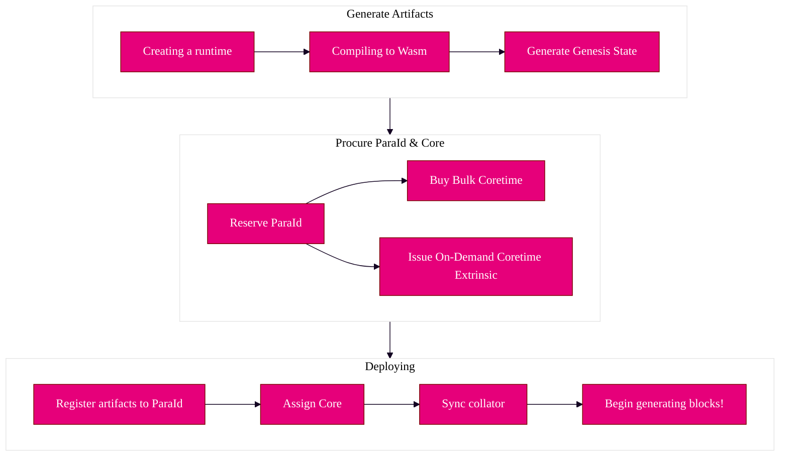

:::warning This section is under construction and moving! (Expect Chaos)

:::

:::warning Only for Kusama and testnets!

Agile coretime is only for the Kusama and testnet networks at the moment, and is not yet deployed on
Polkadot.

:::

## Using the Polkadot SDK

At first glance, the Polkadot SDK can be rather overwhelming, and in a way it is - it packs a lot of
tech into one place. The Polkadot SDK used to be overarching **three** repositories:

- [**Polkadot**](https://paritytech.github.io/polkadot-sdk/master/polkadot_sdk_docs/polkadot_sdk/index.html#polkadot) -
  Which for a time, included both the client implementation and runtime, until the runtime was moved
  to the Polkadot Fellows organization.
- [**Substrate**](https://paritytech.github.io/polkadot-sdk/master/polkadot_sdk_docs/polkadot_sdk/index.html#substrate) -
  The underlying, core primitives and libraries for building blockchains (any blockchain, not just
  one for Polkadot). Much of Polkadot is built with Substrate!
- [**Cumulus**](https://paritytech.github.io/polkadot-sdk/master/polkadot_sdk_docs/polkadot_sdk/index.html#cumulus) -
  A set of libraries and tools which pertain specifically with connecting blockchains to Polkadot,
  known as parachains.

> For an in-depth dive into the monorepo, it is highly recommended that you look into the
> [Polkadot SDK Docs, which explains everything.](https://paritytech.github.io/polkadot-sdk/master/polkadot_sdk_docs/polkadot_sdk/index.html)

:::info What is a task?

You might see the term "task" referenced quite a bit, but in most cases, it refers to a process
utilizing Polkadot's compute. This could be a parachain or any other computational process, provided
that it adheres to the Polkadot protocol.

The full definition can be found [here](../learn/learn-agile-coretime.md#task).

:::

1. **Reserving** a [`ParaId`](../general/glossary.md#paraid), where you will upload your runtime and
   genesis state.
2. **Compiling** the runtime (written in Rust) to a [WebAssembly](../learn/learn-wasm.md) blob,
   thereby defining how your state transitions from one state to the next. This runtime is created
   using the Polkadot SDK.
3. **Ensure** your chain spec is viable and ready to be deployed as a live, working parachain.
4. **Generating** your genesis state and wasm.
5. **Obtaining** a core, most likely through a
   [Coretime marketplace](../learn/learn-guides-coretime-marketplaces.md).
6. **Assigning** that core to your[ `ParaId`](../general/glossary.md#paraid).
7. **Ensuring** you have at least one honest, synced collator for your task

## Deploying on a Core

Once you have your runtime and pallets developed, you will be able to deploy it on a
[core](../learn/learn-agile-coretime.md#core), which is how one utilizes the shared security of the
{{ polkadot: Polkadot :polkadot }}{{ kusama: Kusama :kusama }} network. One does so by:

### Install dependencies

Make sure you have everything you need for your target system
[here.](./build-guides-install-deps.md)

### Deploy adder collator

Try out the above by deploying the
[adder collator, a very simple "counter" parachain implementation.](../learn/learn-guides-coretime-parachains.md).

## Template to Core

If you wish to use a template, such as the ones found in the Polkadot SDK, feel free to use the
[Template to Core guide.](./build-guides-template-basic.md)
