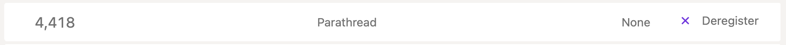
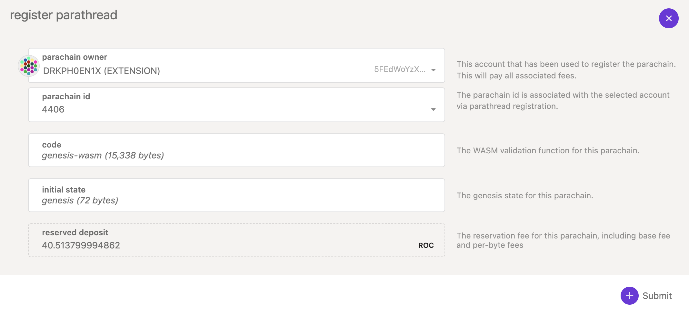
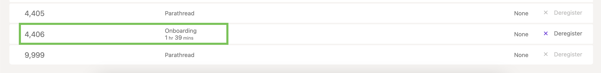
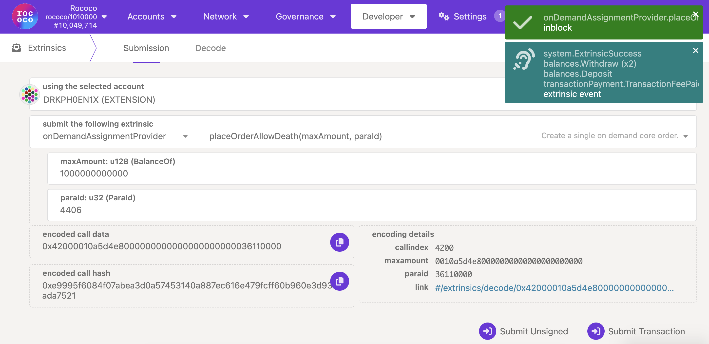
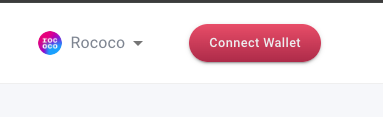
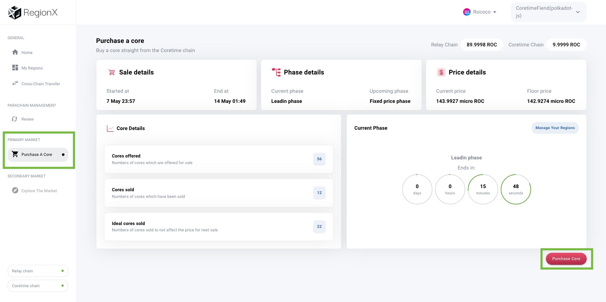
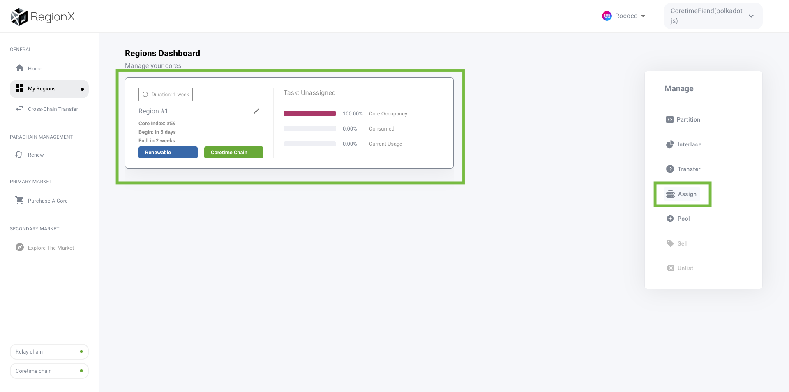
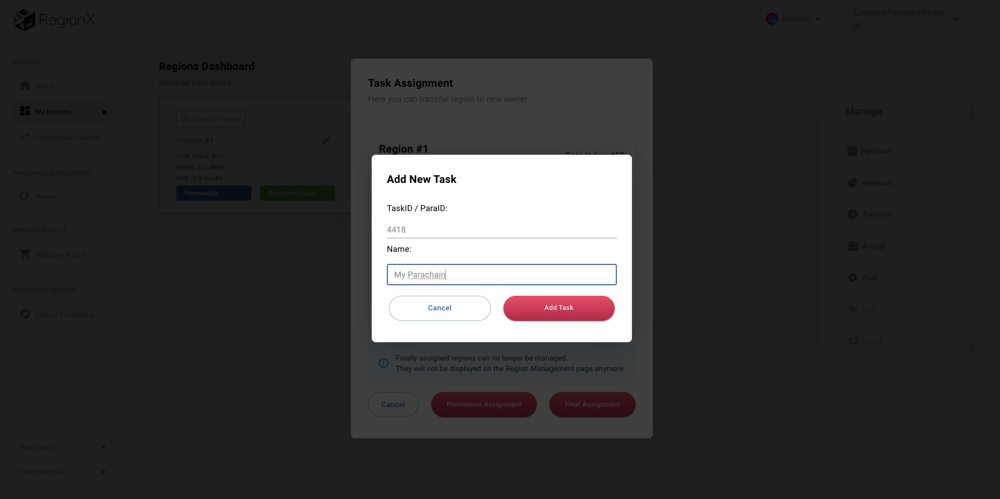

!!!warning "Not a production ready guide."
    This guide is considered a moving document and currently uses the **Paseo** testnet. This guide is
    also applicable to the parachains on the Kusama relay chain, as coretime is also enabled there.

    **This instructions on this guide are applicable for the Polkadot SDK repository with tag
    `polkadot-v1.15.1`**

This guide aims to get you up and running with the basics of:

- **Compiling** and configuring your first template
- **Obtaining** Coretime (bulk or on-demand)
- **Deploying** your template on your procured core

## Getting ROC and Reserving a ParaId

Before starting to work with coretime, you'll need some ROC tokens to pay fees, reserve a
[ParaId](../general/glossary.md#paraid), and more.

Head over to Polkadot-JS to reserve a [ParaId](../general/glossary.md#paraid). We'll need a ParaId
to upload our parachain's code:

1. Get the [Polkadot-JS Web Extension.](https://polkadot.js.org/extension/)
2. Create a wallet, and get some [ROC via the faucet.](https://faucet.polkadot.io/) with your new
   address.
3. Go to the [Polkadot-JS Web App](https://polkadot.js.org/apps/#), and make sure you select
   **Paseo** as your network via the tabs on the side
   [or visit this link to get to Paseo directly](https://polkadot.js.org/apps/?rpc=wss%3A%2F%2Fpaseo.dotters.network#/explorer)
4. Head to
   [Network > Parachains > Parathreads (the tab)](https://polkadot.js.org/apps/#/parachains/parathreads)
5. [Follow these instructions to reserve a ParaId.](../learn/learn-guides-coretime-parachains.md#reserve-paraid)

Visit the [Accounts](https://polkadot.js.org/apps/#/accounts) tab to view all registered accounts
and associated balances within the Polkadot-JS Extension. Once finished, you should see your new
ParaId at the bottom of the list within
[Network > Parachains > Parathreads](https://polkadot.js.org/apps/#/parachains/parathreads) with the
option to "Deregister" to the right:



## Compiling Parachain Runtime and Generating Wasm Blob

We can now move on to working with the template. Essential prerequisites are:

1. **Have** a command line, git, and other common development tools to edit code/files.
2. **Rust**, its associated tooling, the nightly toolchain, and the `wasm32-unknown-unknown`
   compilation target.

!!!info "Install dependencies"
    Visit [the dependencies' installation](build-guides-install-deps.md) page before starting.

This guide uses release
[`polkadot-v1.15.1`](https://github.com/paritytech/polkadot-sdk/releases/tag/polkadot-v1.15.1), for
associated tooling (such as `polkadot-parachain` and `chain-spec-builder`).

We will be using the
[Polkadot SDK's parachain template](https://github.com/paritytech/polkadot-sdk-parachain-template),
which is mirrored in the templates folder within Polkadot SDK repository.

Clone the repository:

```shell
git clone git@github.com:paritytech/polkadot-sdk-parachain-template.git
```

Now, navigate to `polkadot-sdk-parachain-template/`:

```bash
cd polkadot-sdk-parachain-template
```

Open this in your code editor of choice. This template contains the necessary dependencies we need
to utilize a core.

### Compiling the Parachain Template Node

This tutorial won't go into the specifics of the template, nor will it go into the specifics of
FRAME and Substrate. All you need to know is the following:

- `runtime/` - Contains the runtime and business logic. This is how all of your pallets (runtime
  modules) are configured. The runtime, once it's compiled as a WebAssembly blob, is uploaded
  on-chain.
- `node/` - The node implementation, which takes care of networking and RPC setup.

> Pallets are essentially just Rust crates, which are imported as dependencies, as seen in
> `runtime/Cargo.toml`. Read more about
> [pallets here.](https://paritytech.github.io/polkadot-sdk/master/polkadot_sdk_docs/polkadot_sdk/frame_runtime/index.html#pallets)

When we compile our template, we can extract the runtime code as a WebAssembly `.wasm` blob, which
is one of the key artifacts for registering our parachain on the relay chain.

Build the node using the following command:

```shell
cargo build --release
```

For the sake of this example, we won't go into adding or modifying any pallets. However, this is
definitely a next step after you get used to deploying your parachain.

### Customizing our chain specification's patch file

The chain specification is a JSON file that describes Polkadot SDK-based networks. It usually
contains the genesis runtime (in hex) under `genesis.runtimeGenesis.code` and also contains genesis
values/state for the pallets included in your runtime.

You can bootstrap your network with some initial values, such as initial collators, balances for
certain accounts, and more. This is done using a patch file, which the `chain-spec-builder` tool
uses to create the full chain specification of your network. You should do the following to create
your `patch.json`:

Feel free to use the patch provided here, which you can look to tweak to your liking.

1. Create the file: `touch patch.json`
2. Paste the below patch JSON.

The patch JSON states that:

- The `Alice` and `Bob` accounts get a substantial balance.
- `Alice` is the collator and block producer of this network. This makes it easy for us to run our
  collator with `--alice` later on.
- `Alice` is the sudo key of our network.

!!!info "Make sure you replace `YOUR_PARA_ID_HERE` with your reserved ParaId!"
    This should be the same as the ID you reserved.

```json
{
  "balances": {
    "balances": [
      ["5GrwvaEF5zXb26Fz9rcQpDWS57CtERHpNehXCPcNoHGKutQY", 1152921504606846976],
      ["5FHneW46xGXgs5mUiveU4sbTyGBzmstUspZC92UhjJM694ty", 1152921504606846976]
    ]
  },
  "collatorSelection": {
    "candidacyBond": 16000000000,
    "invulnerables": ["5GrwvaEF5zXb26Fz9rcQpDWS57CtERHpNehXCPcNoHGKutQY"]
  },
  "parachainInfo": {
    "parachainId": YOUR_PARA_ID_HERE
  },
  "polkadotXcm": {
    "safeXcmVersion": 4
  },

  "session": {
    "keys": [
      [
        "5GrwvaEF5zXb26Fz9rcQpDWS57CtERHpNehXCPcNoHGKutQY",
        "5GrwvaEF5zXb26Fz9rcQpDWS57CtERHpNehXCPcNoHGKutQY",
        {
          "aura": "5GrwvaEF5zXb26Fz9rcQpDWS57CtERHpNehXCPcNoHGKutQY"
        }
      ]
    ]
  },
  "sudo": {
    "key": "5GrwvaEF5zXb26Fz9rcQpDWS57CtERHpNehXCPcNoHGKutQY"
  }
}
```

### Generating the chain specification

> Ensure you have
> the[ `chain-spec-builder`](build-guides-install-deps.md#install-polkadot-parachain-and-chain-spec-builder)
> installed before following along!

By now, you should have `patch.json` created and populated, and your `./target` folder should look
something akin to:

```sh
./target/release/wbuild/parachain-template-runtime
├── Cargo.lock
├── Cargo.toml
├── parachain_template_runtime.compact.compressed.wasm
├── parachain_template_runtime.compact.wasm
├── parachain_template_runtime.wasm
├── src
└── target
```

We'll be using `parachain_template_runtime.wasm` in conjunction with `chain-spec-builder` to build
our chain specification:

```sh
chain-spec-builder create \
-v \
-r ./target/release/wbuild/parachain-template-runtime/parachain_template_runtime.wasm \
patch patch.json
```

You should now see `chain_spec.json` generated, with the message `Genesis config verification: OK`.
The `-v` does a superficial verification of the JSON to ensure all fields are properly populated.

Next, you'll need to modify a few things in your chain spec, namely by adding the following fields
to make it parachain-ready. Once again, make sure you set `para_id` to the one you reserved earlier:

```json
"protocolId": "my-live-protocol",
"properties": {
   "ss58Format": 42,
   "tokenDecimals": 12,
   "tokenSymbol": "UNIT"
},
"para_id": PARA_ID_HERE,
"relay_chain": "paseo",
```

Once you finish modifying the file, it should look like this:

```json
{
  "name": "Custom",
  "id": "custom",
  "chainType": "Live",
  "bootNodes": [],
  "telemetryEndpoints": null,
  "protocolId": "my-live-protocol",
  "properties": {
    "ss58Format": 42,
    "tokenDecimals": 12,
    "tokenSymbol": "UNIT"
  },
  "para_id": YOUR_PARA_ID_HERE,
  "relay_chain": "paseo",
  "codeSubstitutes": {},
  "genesis": { ... }
}
```

Feel free to customize various aspects of your spec, such as the `UNIT` ticker, `name`, `id`, or
other fields.

Now you should open your `chain_spec.json`, and use this checklist to ensure all the necessary
fields are in place:

1. **Make** sure that `relay_chain` is set to the target relay chain (`paseo`, in our case)
2. **Make** sure that `para_id` (right below `relay_chain`) is set to your reserved ParaId
3. **Make** sure that our `chain_type` is set to `Live`
4. **Optionally**, change the name, id, and token symbol of your chain.

If you fail to do one of these, your chain may fail to produce blocks.

For more information on chain specifications,
[check out the reference document from the Polkadot SDK.](https://paritytech.github.io/polkadot-sdk/master/polkadot_sdk_docs/reference_docs/chain_spec_genesis/index.html)

### Generating the Runtime and Genesis

With our chain specification successfully generated, we can move to generating the genesis state and
runtime.

Generate the genesis following the instructions below:

```shell
polkadot-parachain export-genesis-head --chain chain_spec.json genesis
```

Although you can use the WebAssembly within `wbuild`, for ease of access you can also regenerate
your WebAssembly blob with the following:

```shell
polkadot-parachain export-genesis-wasm --chain chain_spec.json genesis-wasm
```

Within your project folder, you should now have two files:

- **`genesis`** - the initial state of your parachain.
- **`genesis-wasm`** - the initial runtime WebAssembly blob of your parachain.

## Running Your Collator

> Make sure you have the
> [`polkadot-parachain`](build-guides-install-deps.md#install-polkadot-parachain-and-chain-spec-builder) binary installed!

Before you are able to connect your collator, you must sync the relay chain. Depending on your
download speed, the time to sync may vary. In order to avoid storing the full state of the relay
chain, be sure to run with the appropriate pruning flags (`blocks-pruning` and `state-pruning`):

!!!info "Explaining `blocks-pruning` and `state-pruning`"
    A Polkadot SDK-based node has two pruning modes:

    - `blocks-pruning` - Prunes block bodies (the list of extrinsics in the block) from a specified
      height (default: `256`)
    - `state-pruning` - Prunes the overall state from a specified height

    Both of these flags aid in reducing the amount of disk space taken up by the relay chain. Note that
    `state-pruning` is only used for the first initial sync for the database.

```shell
polkadot-parachain --collator \
--alice \
--chain chain_spec.json \
--force-authoring \
--base-path <your-base-path-here> \
-- \
--chain=paseo \
--sync warp \
--blocks-pruning 256 \
--state-pruning 256
```

> **Fun fact**: This command really spins up _two_ nodes: your collator node for your parachain,
> along with an embedded relay chain node, hence the separation in the command via `--`.

You should now see your relay chain syncing, reaching the same target that your target relay chain
is currently at:

```bash
2024-05-07 11:43:18 [Relaychain] ⚙️  Syncing 490.8 bps, target=#10342815 (9 peers), best: #10013784 (0x91d7…aeb2), finalized #10013704 (0x8556…e679), ⬇ 8.3MiB/s ⬆ 1.2kiB/s
```

## Register the Parachain as a Parathread

With your **`genesis`** and **`genesis-wasm`** created, you can now create your parathread. Head
back to
[Network > Parachains > Parathreads (the tab)](https://polkadot.js.org/apps/#/parachains/parathreads)
in PolkadotJS, and click _+ Parathread_ in the top right. Now, you can upload your runtime and
genesis accordingly:

1. Upload `genesis-wasm` in the `code` field
2. Upload `genesis` in the `initial state` field



Pay the deposit, and you're good to go! Keep in mind the parathread takes around **~2 hours** to
onboard. You can scroll down to your ParaId to see it onboarding, for example:



## Procure Coretime

> ** Your node should be synced with the relay before this step.**

Procuring a core is easy with coretime marketplaces already available. Visit
[The Coretime Marketplaces](../learn/learn-guides-coretime-marketplaces.md) page to learn more about
them, and purchase a core!

We have two options:

1. [**Bulk**](../learn/learn-agile-coretime.md#bulk-coretime) - obtain a set amount of coretime in
   bulk.
2. [**On-demand**](../learn/learn-agile-coretime.md#on-demand-coretime) - pay as we go for our block
   production.

With bulk coretime, we assign a core to our ParaId, and as long as that core is valid, our parachain
will produce blocks and finalize them via the relay chain until we have to renew the core.

It's worth noting that you can easily experiment using on-demand extrinsics, then later switch to a
bulk coretime model. For now, let's start with on-demand coretime to get our first blocks going.

**It is recommended that you first try an on-demand assignment, then move to a bulk assignment after
you confirm your chain can create blocks!**

### On-Demand Coretime

Provided your collator is synced, you can create a block using an on-demand extrinsic.

1. Head to [PolkadotJS > Extrinsics](https://polkadot.js.org/apps/#/extrinsics)
2. Issue the `onDemandAssignmentProvider.placeOrderAllowDeath` extrinsic
3. Set the `max_amount` to at least `1000000000000` and `paraId` to your ParaId.
4. As long as your collator is running, you should see your block height increase from 0 to 1!



### Bulk Coretime: Assigning your Core

If everything is working as intended, you can now choose to assign bulk coretime to your parachain
for persistent block generation. For this assignment,
[RegionX's CoreHub](https://app.regionx.tech/regions?network=paseo) will be used to purchase and
assign cores.

!!!info "Getting Coretime ROC"
    In the upper right, you will see two balances: one for the relay chain, and one for the coretime
    chain. Before you can purchase a core, you need ROC on the coretime chain. RegionX includes a tool
    for doing so:

    1. Head to General > Cross Chain Transfer on the right, and transfer 10 ROC:

    

    2. Sign the transaction with Polkadot-JS. If all goes well, you should see the balance update in the
      upper right:

    

1. Connect your wallet and make sure you select **Paseo** as your network:



2. Click **Purchase a Core** on the left:


3. In the lower right, click "Purchase Core":



4. Go to **My Regions**, and click to select your region, then click **Assign** on the right side:



5. Click **Add Task**, and input your ParaId along with a name for your chain:



6. Select your task, and select **Provisional Assignment**, and sign using Polkadot JS:


7. Once the transaction is confirmed, provided everything is synced, your collator is running, and
   the region has begun, you should see blocks being persistently created as they were with the
   on-demand extrinsic:


## What's Next?

Now that you can launch a layer one blockchain, the possibilities are endless:

- Setup a local development environment for your parachain
- Create a pallet
- [Take a look at the OpenZepplin template - which has a lot more pallets configured.](build-guides-coretime-start.md#openzeppelin-templates--guides)
- Upgrade your network
