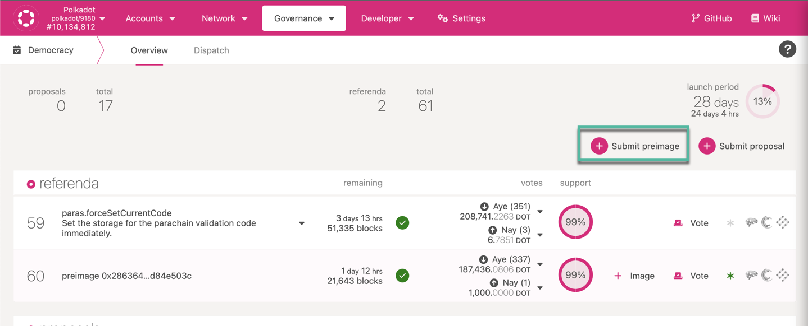

[HRMP](../learn/learn-xcm.md#xcmp-lite-hrmp) has the same interface and functionality as
[XCMP](../learn/learn-xcm.md#xcmp-cross-chain-message-passing) but is much more
demanding on resources since it passes all messages via the Relay Chain. When XCMP is implemented on
Polkadot, HRMP is planned to be deprecated and phased out in favor of it.

## Opening HRMP channel: parachain to parachain

To open a channel from one parachain to another that are not common good chains on Polkadot, the
governance of each parachain needs to declare its intent to open a channel on the Relay Chain, and
the second chain needs to accept and do the same.

In order to do this, the calls to be dispatched from both chains are:

1. `hrmp > hrmpInitOpenChannel(recipient, proposedMaxCapacity, proposedMaxMessageSize)`: this call
   initiates opening a channel from a parachain to a given recipient with given channel

2. `hrmp > hrmpAcceptOpenChannel(sender)`: accepting the channel open request from the given sender.

Each parachain is to use its own governance process to execute this. The call will be executed on
the Relay Chain.

## Opening HRMP channel to Statemint

In order to provide complete contextual information and transparency to the community, which is the
ultimate decision maker of the proposals, we encourage following the process implemented on Kusama.

In general, a governance proposal process includes 4 steps:

1. Publication on [Polkassembly](https://polkadot.polkassembly.io/discussions) for discussion and
   feedback;
2. Preimage submission on democracy tab (Polkadot JS Apps);
3. Submission of the proposal as an external motion to Council;
4. Vote by the community in Democracy module.

:::caution

Please note your parachain must make a channel request with Statemint before this proposal enacts,
in order for the proposal to be enacted successfully.

:::

## Publication on Polkassembly for discussion and feedback

The [discussions section of Polkassembly](https://polkadot.polkassembly.io/discussions) is the best
place to share the reasoning behind your proposal: make sure to log in with the proposer address (if
possible) before publishing yours, and if you can do this also make sure the address has an on-chain
identity.

Your proposal should contain the following sections to be considered complete for the community to
review and ultimately vote:

1.  A request on what the proposal aims to do (opening an HRMP channel with Statemint);
2.  The use cases this channel will support for your chain;
3.  Technical details of the proposal, including proposal parameters and technical details of this
    call (On Kusama, most proposals were designed as a batchAll calls) :

     - A force transfer from Polkadot treasury to Statemint as deposit to accept and open an HRMP channel with your chain;
     - Send XCM message to Statemint to execute a transaction with superuser (root) permission.

    Please note that if governance decides to reduce the HRMP channel deposit on Polkadot to 0 DOT, the first transaction should not be necessary (these guidelines will be updated accordingly).

4.  The XCM message to Statemint, which can be decoded on the network;
5.  The call data to verify on
    [Polkadot JS Apps Decode](https://polkadot.js.org/apps/?rpc=wss%3A%2F%2Frpc.polkadot.io#/extrinsics/decode)
    tab;
6.  The proposal hash for the external motion submission.

Below is an example of how teams followed this process on Kusama, as a way to:

- Proposal to open HRMP channel between Bifrost and Statemine: the motion can be found
  [here](https://kusama.polkassembly.io/motion/418).

## Preimage submission on democracy tab (Polkadot JS Apps)

Once the community has given enough feedback (we expect these proposal to be non controversial)
please submit the image on the discussion post in the
[Democracy](https://polkadot.js.org/apps/?rpc=wss%3A%2F%2Frpc.polkadot.io#/democracy) tab on
Polkadot JS Apps, by using the "Submit Preimage" button:

On the pop up window, compose the preimage in the discussion post: making sure the proposal hash is
the same as in the post.

## Submission of the proposal as an external motion to Council

A [Council member](../maintain/maintain-guides-how-to-join-council.md) will need to assist you in order to be able to submit an external motion: they will
use the proposal hash for your preimage and submit it to Council vote. The same contextual
information you used in the discussion post will be used for the motion post on Polkassembly.

Once the Council approves your proposal, this will move to the external queue - and soon after to be
voted by the community in the Referenda queue: make sure to discuss the proposal with your parachain
community and encourage them to vote. You can follow all announcements on these submissions in the
[Polkadot Direction channel](https://matrix.to/#/#polkadot-direction:matrix.parity.io).

## Vote by the community

After the community voting period, there will be an enactment period. In general, on Kusama these
have been defined in shorter terms than the voting periods. Again, it is very important you
encourage the community to vote on this, highlighting the benefits for your chain, use cases enabled
with this submission, among other things. After the enactment period is over, both chains will
authorize the channel.
