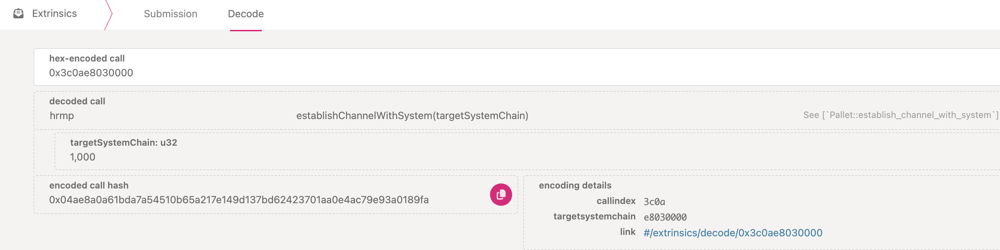
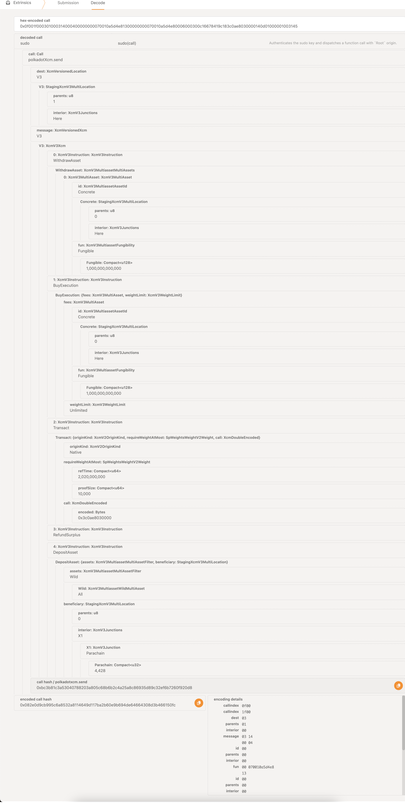

In order to communicate over [HRMP](../learn/learn-xcm-transport.md#hrmp-xcmp-lite), parachains must
establish channels by registering them on the relay chain. Like
[XCMP](../learn/learn-xcm-transport.md#xcmp-cross-chain-message-passing), HRMP is a message
transport protocol, but passes all messages via the relay chain. When XCMP is implemented on
Polkadot, HRMP is planned to be deprecated and phased out.

HRMP channels are uni-directional. Bi-directional communication between two parachains will require
two channels, one in each direction.

## Opening HRMP Channels

Opening a channel between two parachains is a two-phase process, with one chain first initiating a
channel request and then the second chain accepting it. When neither chain is a
[system chain](../learn/learn-system-chains.md), they will use the `hrmpInitOpenChannel` and
`hrmpAcceptOpenChannel` calls, respectively.

Each chain must dispatch the following calls on the relay chain from its parachain origin.

1. `hrmp > hrmpInitOpenChannel(recipient, proposedMaxCapacity, proposedMaxMessageSize)`: Initiates
   channel establishment by creating a channel request with a given configuration. Note that the max
   capacity and max message size must be within the `configuration`'s limits.

2. `hrmp > hrmpAcceptOpenChannel(sender)`: Accept the channel open request from the given sender.

In order to dispatch a call from its sovereign origin, a parachain may use governance to send the
encoded call in a `Transact` instruction to the relay chain, but it may also execute this logic
autonomously (e.g. on the notification that a channel was requested).

### Examples of HRMP Channel Management

There are several ways to trigger a specific message from a parachain's origin. The naive way is to
write the program off-chain and submit it using the XCM pallet's `send` extrinsic. Sending arbitrary
programs is gated by a privileged origin, so who can initiate that depends on each chain's
configuration. The chain may need to go through governance to dispatch the extrinsic.

Another option is to write the programs that a chain will send ahead of time and incorporate them
into the runtime. These programs could be behind extrinsics with their own privileged origins, or
even unprivileged origins. As the extrinsic can perform any checks prior to sending the message, the
runtime developer can program things like allowing any signed origin to dispatch a call accepting an
open HRMP channel request with another parachain.

Note that this is actually how other extrinsics (e.g. to teleport assets) in the XCM pallet work;
they construct XCM programs locally from a user's inputs and, assuming all checks pass, send the
program to the destination.

In addition, the logic could be autonomous and react to other instructions that the chain receives.
For example, see Polimec's
[implementation](https://github.com/Polimec/polimec-node/blob/da9d1ee0062ead7a62f815647813ada48e4c2250/pallets/xcm-executor/src/lib.rs#L890)
of the `XcmExecutor`, which handles notifications of channel requests and acceptance.

## Opening HRMP Channels with System Parachains

The
[`establish_channel_with_system`](https://paritytech.github.io/polkadot-sdk/master/polkadot_runtime_parachains/hrmp/pallet/dispatchables/fn.establish_channel_with_system.html)
call can be used to establish a bi-directional channel between any parachain and a system chain.
This call needs to be dispatched from the parachain via an XCM program to execute on the Relay
Chain.

For instance, the call to be executed on the relay chain to establish a bi-directional channel
between a parachain and the Asset Hub with `ParaID` 1000 is `0x3c0ae8030000`

Here is an example call with an XCM program sent from the parachain to Paseo relay chain to
establish channel a bi-directional channel with Paseo Asset Hub -
`0x0f001f000301000314000400000000070010a5d4e81300000000070010a5d4e80006000300c16678419c183c0ae8030000140d01000001003145`

## Opening HRMP Channels Between Two System Parachains

As of Polkadot and Kusama runtimes 1,001,000, anyone can call an `establishSystemChannel` extrinsic
with two system parachains as arguments in order to establish a channel from the given sender to
receiver.
