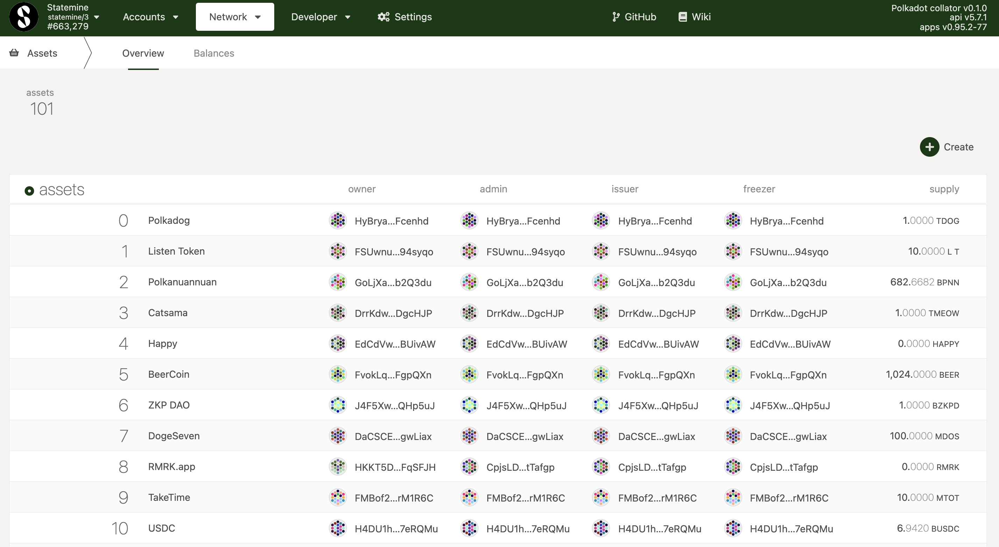

The Polkadot Relay Chain does not natively support assets beyond DOT (likewise, KSM for Kusama).
This functionality exists in parachains. On Polkadot, this parachain is called Statemint, and on
Kusama it is called Statemine. All information in this guide applies equally to Kusama/Statemine.

Statemint provides a first-class interface for creating, managing, and using both fungible and
non-fungible assets. The fungible interface is similar to Ethereum's ERC-20 standard. However, the
data structures and stateful operations are encoded directly into the chain's runtime, making
operations fast and fee-efficient.

Beyond merely supporting assets, integrating Statemint into your systems has several benefits for
infrastructure providers and users:

- Support for on-chain assets.
- Significantly lower transaction fees (about 1/10) than the Relay Chain.
- Significantly lower deposits (1/10) than the Relay Chain. This includes the existential deposit
  and deposits for proxy/multisig operations.
- Ability to pay transaction fees in certain assets. As in, accounts would **not** need DOT in order
  to exist on-chain nor to pay fees.

Statemint will use DOT as its native currency. Users can transfer DOT from the Relay Chain into
Statemint and use it natively. The Relay Chain will also accept DOT transfers from Statemint back to
the Relay Chain to use for staking, governance, or any other activity taking place there.

Using Statemint for DOT/KSM balance transfers will be much more efficent than the Relay Chain and is
highly recommended. Until domain specific parachains are built, the Relay Chain will still need to
be used for staking and governance.

## Assets Basics

See the [Assets pallet](https://github.com/paritytech/substrate/blob/master/frame/assets/src/lib.rs)
for the most up-to-date info and reference documentation.

Assets are stored as a map from an ID to information about the asset, including a management team,
total supply, total number of accounts, its sufficiency for account existence, and more.
Additionally, the asset owner can register metadata like the name, symbol, and number of decimals
for representation.

Some assets, as determined by on-chain governance, are regarded as “sufficient”. Sufficiency means
that the asset balance is enough to create the account on-chain, with no need for the DOT/KSM
existential deposit. Likewise, you cannot send a non-sufficient asset to an account that does not
exist. Sufficient assets can be used to pay transaction fees (i.e. there is no need to hold DOT/KSM
on the account).

Assets do have a minimum balance (set by the creator), and if an account drops below that balance,
the dust is lost.

### Asset Operations

The Assets pallet has its own interface for dealing with assets. See the [Integration](#integration)
section below for how to fetch information and construct transactions.

The main functions you will probably interact with are `transfer` and `transfer_keep_alive`. These
functions transfer some `amount` (balance) of an `AssetId` (a `u32`, not a contract address) to
another account.

The Assets pallet also provides an `approve_transfer`, `cancel_approval`, and `transfer_approved`
interface for non-custodial operations.

Asset transfers will result in an `assets.transferred` event. The same instructions for
[monitoring events and **not** transactions](build-protocol-info.md#events) applies to asset
transfers.

Note that you can use the same addresses (except anonymous proxies!) on Statemint that you use on
the Relay Chain. The SS58 encodings are the same, only the chain information (genesis hash, etc.)
will change on transaction construction.

### Transferring Assets

Using Statemine, assets can be easily created and also transacted with.

> Statemine has an existential deposit equal to 1/10th of Kusama's, so you'll need to teleport `0.000003333 KSM` (+ tx fees) to Statemine.

#### Receiving:

You can use the same account on both networks and both will use the same `pubkey`.
The network IDs change, so your address will look different. At the moment, assets are not
visible on the Accounts page; you will need to visit the [Assets Page](https://polkadot.js.org/apps/?rpc=wss%3A%2F%2Fkusama-statemine-rpc.paritytech.net#/assets) under the `Network` tab on Statemine to receive assets.



#### Sending:

Similarly, head over to the [Assets Page](https://polkadot.js.org/apps/?rpc=wss%3A%2F%2Fkusama-statemine-rpc.paritytech.net#/assets) on Statemine and select the ID of the asset(s) you would like to send.

> Sending the asset follows the same transaction scheme as sending KSM (or DOT).

## Integration

Statemint will come with the same tooling suite that Parity Technologies provides for the Relay
Chain, namely [API Sidecar](https://github.com/paritytech/substrate-api-sidecar) and
[TxWrapper Polkadot](https://github.com/paritytech/txwrapper-core/tree/main/packages/txwrapper-polkadot).
If you have a technical question or issue about how to use one of the integration tools please file
a GitHub issue so a developer can help.

### Parachain Node

Using Statemint will require running a parachain node to sync the chain. This is very similar to
running a Polkadot node, with the addition of some extra flags. The basic format looks like this:

```bash
./statemint $STATEMINT_CLI_ARGS --collator -- $POLKADOT_CLI_ARGS
```

where both `$STATEMINT_CLI_ARGS` and `$POLKADOT_CLI_ARGS` consist of regular Polkadot node flags.
Flags can be used twice, one for the collating component and one for the Relay Chain component.
Additional ports that will be used are (by default) 9934, 9616, and 30334 (Relay Chain RPC,
Prometheus endpoint, and libp2p respectively). As usual, any of these ports can be adjusted through
flags. To deploy a Statemint RPC node, one would use the same flags as a Polkadot RPC node in place
of `$STATEMINT_CLI_ARGS`. The node will keep both the database for Polkadot and for Statemint in its
database directory, so provision disks accordingly.

### Sidecar

API Sidecar is a REST service for relay chain and parachain nodes; It comes with endpoints to query
info about assets and asset balances on Statemint.

- Asset lookups will always use the `AssetId` to refer to an asset class. On-chain metadata is
  subject to change and thus not suitable as a canonical index.
- Please refer to [docs](https://paritytech.github.io/substrate-api-sidecar/dist/) for full usage
  information. Details on options like how to make a historical query are not included here.

### Tx Wrapper Polkadot

TxWrapper Polkadot is a library designed to facilitate transaction construction and signing in
offline environments; it comes with a set of asset-specific functions to use on Statemint. When
constructing parachain transactions, you can use `txwrapper-polkadot` exactly as on the Relay Chain,
but would construct transactions with the appropriate parachain metadata like genesis hash, spec
version, and type registry.
