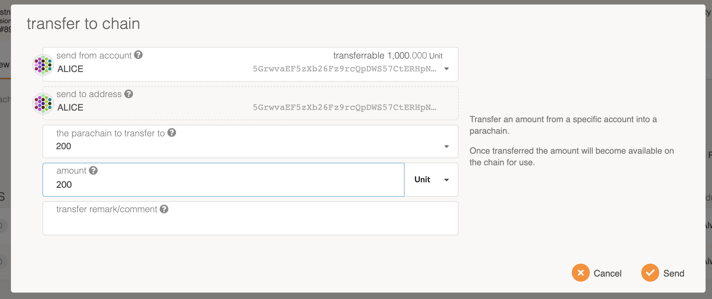
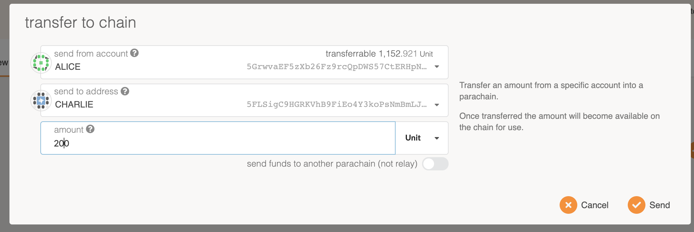
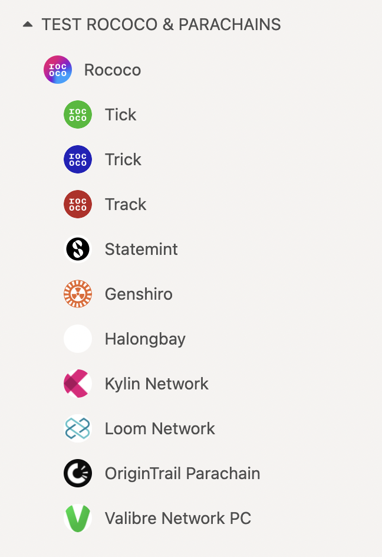
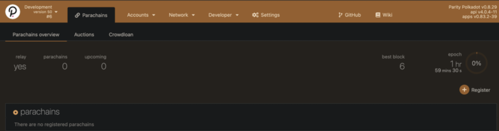

### Your Go-To Overview for Developing a Parachain

This guide will cover the motivation to build a parachain or parathread, the tools available to
facilitate this, the steps to test, and finally, how to launch your network on
{{ polkadot: Polkadot :polkadot }}{{ kusama: Kusama :kusama }} .

### Why Create a Parachain?

Parachains are connected to and secured by the Relay Chain. They benefit from the _pooled security_,
_thought-through governance_, and overall _scalability_ of the heterogeneous sharding approach of
the network. Creating a parachain can be seen as creating a **Layer-1 blockchain**, which has its
own logic and runs in parallel within the
{{ polkadot: Polkadot :polkadot }}{{ kusama: Kusama :kusama }} ecosystem.

Developers can focus on creating state-of-the-art chains that take advantage of
{{ polkadot: Polkadot's :polkadot }}{{ kusama: Kusama's :kusama }} next-generation approach. Some
examples of what a parachain could be are:

- DeFi (Decentralized Finance) Applications
- Digital Wallets
- IoT (Internet of Things) Applications
- Gaming
- Web 3.0 Infrastructure

and more.

Polkadot aims to be a bet against blockchain maximalism, where the success of Polkadot's
heterogeneous multi-chain approach will play a key part in the overall advancement of Web 3.0 and
decentralized systems. As a result, Polkadot’s parachain model was designed with the belief that the
internet of the future will have many different types of blockchains working together.

### What are the Benefits of Deploying a Parachain?

The parachain model attempts to alleviate five key _build_ failures of present technology stacks, as
described in the [Polkadot Whitepaper](https://polkadot.network/PolkaDotPaper.pdf):

- **Scalability**: How much is spent on resources and will the network be subject to bottlenecks?
- **Isolatability**: Are the needs of many accounted for under the same framework?
- **Developability**: Is the system tooling, system support, and overall system integrity
  dependable?
- **Governance**: Can the network remain flexible to evolve and adapt over time? Can decisions be
  made with sufficient inclusivity, legitimacy, and transparency to provide effective leadership of
  a decentralised system?
- **Applicability**: Does the technology address a burning need on its own? Is other “middleware”
  required to bridge the gap to actual applications?

#### [Shared Security](../learn/learn-security.md) (Pooled Security)

Parachains can lease the security of the
{{ polkadot: Polkadot :polkadot }}{{ kusama: Kusama :kusama }} network by bonding
{{ polkadot: [DOT](../learn/learn-DOT.md) :polkadot }}{{ kusama: KSM :kusama }} for a parachain
slot. This means that the social costs of building a community around your project and convincing
validators to participate in your network security are reduced.
{{ polkadot: Polkadot :polkadot }}{{ kusama: Kusama :kusama }} has strong security, and
decentralised application projects wishing to benefit from this security would want to become a
parachain to share in that pooled security.

#### [On-Chain Governance](../learn/learn-governance.md) (Thought-through Governance)

Most governance systems in blockchains use an off-chain governance mechanism. Polkadot's on-chain
governance encourages maximum participation of token holders and is frictionless and transparent. It
also enables [forkless upgrades](../learn/learn-runtime-upgrades.md).

#### Scalability

The sharded multichain network approach allows for what is essentially parallel computation
(processing power) that can process several transactions in parallel. Isolated blockchains are often
faced with the network constraint of processing transactions in sequence, causing bottlenecks.

#### Interoperability

Any decentralised application or chain that wants to enable trustless messaging to other parachains
already connected to {{ polkadot: Polkadot :polkadot }}{{ kusama: Kusama :kusama }} would want to
become a parachain. Interoperability between sovereign chains involves certain constraints and
complex protocols to enable across a wide breadth of chains.

With {{ polkadot: Polkadot :polkadot }}{{ kusama: Kusama :kusama }}, you will get this feature out
of the box if you build your application as a parachain. The [XCM format](../learn/learn-xcm.md)
allows any parachains to communicate by passing messages between them. Furthermore, as bridges to
other chains are connected (such as those to Bitcoin or Ethereum)
{{ polkadot: Polkadot's :polkadot }}{{ kusama: Kusama's :kusama }} parachains will be able to
communicate with these as well.

:::note

Despite the benefits of becoming a parachain, developers should be conscious of the challenges in
becoming a parachain, and whether building a blockchain with an end goal of becoming a parachain is
a viable one for their project.

:::

On {{ polkadot: Polkadot :polkadot }}{{ kusama: Kusama :kusama }}, you are able to put your
blockchain’s latest block head onto the relay chain. As a parachain, the blocks you submit are
verified by validators with a Wasm runtime, which can be stored on the relay chain. You also get the
ability to communicate with other parachains using the [XCM](../learn/learn-xcm.md) format: an
abstract message passing system. Message passing is tracked on the relay chain - as such, you can
prove the delivery of messages and facilitate trustless interactions.

As you can place your blockchain’s latest block head, you can achieve deterministic finalization for
your chain. The hard part of reaching finalization for blockchains tends to be the consensus, where,
in the parachain model, a blockchain can offload consensus to the overall shared network, and focus
on block production. Since the validators have the Wasm runtime for all the parachains, your
parachain shares the security of the validator pool with everyone on the relay chain.

Any validator in the validator pool can help validate your blockchain.

## Things to Consider

### [Para-nomics](../learn/learn-parachains.md#parachain-economies)

#### Digital nation states

Parachains can be seen as autonomous agents; networks that act as decentralised digital nation
states. Parachains have their own communities, rules, economies, governance, treasuries, and
relationships with external chains. As a result, the economic policies within parachain ecosystems
are subject to the developers and overall community of that parachain ecosystem; there isn't
necessarily a go-to economic model a parachain should follow.

Moreover, _becoming a parachain_ has an opportunity cost associated. Ideally, you can increase the
value of the network by participating in the parachain selection process, and this should serve as a
good return on investment.

#### Connecting digital economies

[Collators](../learn/learn-collator.md) act as network maintainers and maintain a full node of a
parachain. They are incentivized with a native token payout from:

- Transaction fees collected
- Parathread token sponsorship
  - Blocks are naturally produced when a parathread bid is less than the native token payout.

### Para-objects

:::info The Relay Chain can host arbitrary state machines, not just blockchains.

The {{ polkadot: Polkadot :polkadot }}{{ kusama: Kusama :kusama }} network will encourage the
connection and interoperability between different _para-objects_.

Here, para-objects are referring to objects on the network that operate in parallel, generally,
parallelizable objects.

:::

These could be in the form of:

- System level chains (permanent chains): [leased slots](../learn/learn-auction.md),
  [parathread pool](../learn/learn-parathreads.md)
- [Bridge](../learn/learn-bridges.md) Hubs
- Nested Relay Chains: [Polkadot 2.0](../learn/learn-launch.md##polkadot2.0)

### Migration

Projects that are already functioning as "solochains" or in isolated environments may be interested
in migrating onto {{ polkadot: Polkadot :polkadot }}{{ kusama: Kusama :kusama }} as a para-object.
While the parachain model has its benefits, it may not be the go-to strategy for some projects.

As a path for migration onto {{ polkadot: Polkadot :polkadot }}{{ kusama: Kusama :kusama }}, it may
be more viable to migrate to one of the chains in one of the reserved slots.

For instance, there are currently options for [smart contract deployment](build-smart-contracts.md)
on Kusama through the networks that have secured a slot in the latest slot auctions.

## Implement a Parachain

The Parachain Implementer's Guide is a significant work in progress and maintained by Parity Tech.
[**The live version**](https://w3f.github.io/parachain-implementers-guide/) is built from the source
located in the official
[Polkadot repository](https://github.com/paritytech/polkadot/tree/master/roadmap/implementers-guide).

### Parachain Development Kit (PDK)

A **PDK** is a set of tools that allows developers to easily create a parachain. In practice, the
PDK will consist of the following key components:

- _State transition function_ : a way for your application to move from one state to another state.
- _Collator node_ : a type of peer-to-peer node in the {{ polkadot: Polkadot :polkadot }}{{ kusama:
  Kusama :kusama }} network with certain responsibilities regarding parachains.

#### Key Components

The state transition function (STF) can be an abstract way for an application to go from one state
to another state. The only constraint that {{ polkadot: Polkadot :polkadot }}
{{ kusama: Kusama :kusama }} places on this STF is that it must be easily verifiable -- usually
through what we call a _witness_ or _proof_. It must be so because the Relay Chain validators will
need to check that each state it receives from the collator node is correct without actually running
through the entire computation. Some examples of these proofs include the Proof-of-Validity blocks
or zk-SNARKs, which require less computational resources to verify than they do to generate. The
verification asymmetry in the proof generation of the STF is one of the integral insights that
allows {{ polkadot: Polkadot :polkadot }}{{ kusama: Kusama :kusama }} to scale while keeping
high-security guarantees.

A collator node is one of the types of network maintainers in the protocol. They are responsible for
**keeping availability** of the state of the parachain and the new states returned from the
iteration of the state transition function. They must remain online to keep track of the state and
also of the XCMP messages that it will route between itself and other parachains. Collator nodes are
responsible for passing the succinct proofs to the relay chain's validators and tracking the latest
blocks from the relay chain. In essence, a collator node also acts as a light client for the relay
chain. For more on collator nodes, see the [collator page](../learn/learn-collator.md).

#### What PDKs Exist?

Currently, the only PDK is [Parity Substrate](https://github.com/paritytech/substrate) and
[Cumulus](https://github.com/paritytech/cumulus). **[Substrate](https://substrate.io/)** is a
blockchain framework that provides the basic building blocks of a blockchain (things like the
networking layer, consensus, a Wasm interpreter) while providing an intuitive way to construct your
runtime. Substrate is made to ease the process of creating a new chain, but it does not provide
support for {{ polkadot: Polkadot :polkadot }}{{ kusama: Kusama :kusama }} compatibility directly.
For this reason, `Cumulus`, an added _library_ contains all of the
{{ polkadot: Polkadot :polkadot }}{{ kusama: Kusama :kusama }} compatibility glue code.

:::note Get started with Substrate

The best way to get started with Substrate is to explore the
[Substrate Developer Hub](https://docs.substrate.io/), an online resource built and maintained by
[Parity Technologies](https://parity.io).

:::

#### Cumulus

    Cumulus clouds are shaped sort of like dots; together they form an intricate system;
    beautiful and functional.

[Cumulus](https://github.com/paritytech/cumulus) is an extension to Substrate that makes it easy to
make any Substrate-built runtime into a Polkadot-compatible parachain.

Cumulus Consensus is a consensus engine for Substrate that follows a
{{ polkadot: Polkadot :polkadot }}{{ kusama: Kusama :kusama }} Relay Chain (i.e., parachains). This
runs a {{ polkadot: Polkadot :polkadot }}{{ kusama: Kusama :kusama }} node internally, and dictates
to the client and synchronization algorithms which chain to follow, finalize, and treat as correct.

See the [Cumulus overview](https://github.com/paritytech/cumulus/blob/master/docs/overview.md) for a
more detailed description of Cumulus.

Cumulus is still in development, but the idea is that it should be simple to take a Substrate chain
and add the parachain code by importing the crates and adding a single line of code. Keep up-to-date
with the latest Cumulus developments from the [Cumulus section](###cumulus).

:::info

Substrate and Cumulus provide a PDK from the abstraction of the blockchain format, but it is **not
necessary** that a parachain even needs to be a blockchain. For example, a parachain just needs to
satisfy the two constraints listed above: _state transition function_ and _collator node_.

Everything else is up to the implementer of the PDK.

:::

Cumulus handles the network compatibility overhead that any parachain would need to implement to be
connected to {{ polkadot: Polkadot :polkadot }}{{ kusama: Kusama :kusama }}. This includes:

- Cross-chain message passing (XCMP)
- Out-of-the-box Collator node setup
- An embedded full client of the Relay Chain
- Block authorship compatibility

Are you interested in building a PDK? See the [future PDKs](##future-pdks) section for details.

### How to set up your parachain

After creating your chain runtime logic with Substrate, you will be able to compile it down to a
Wasm executable. This Wasm code blob will contain the entire state transition function of your
chain, and is what you will need to deploy your project to Polkadot as either a parachain or
parathread.

Validators on {{ polkadot: Polkadot :polkadot }}{{ kusama: Kusama :kusama }} will use the submitted
Wasm code to validate the state transitions of your chain or thread, but doing this requires some
additional infrastructure. A validator needs some way to stay up to date with the most recent state
transitions, since {{ polkadot: Polkadot :polkadot }}{{ kusama: Kusama :kusama }} nodes will not be
required to also be nodes of your chain.

This is where the collator node comes into play. A collator is a maintainer of your parachain and
performs the critical action of producing new block candidates for your chain and passing them to
{{ polkadot: Polkadot :polkadot }}{{ kusama: Kusama :kusama }} validators for inclusion in the
{{ polkadot: Polkadot :polkadot }}{{ kusama: Kusama :kusama }} Relay Chain.

Substrate comes with its own networking layer built-in but unfortunately only supports solo chains
(that is, chains that do not connect to the relay chain). However, there is the Cumulus extension
that includes a collator node and allows for your Substrate-built logic to be compatible with
{{ polkadot: Polkadot :polkadot }}{{ kusama: Kusama :kusama }} as either a parachain or parathread.

### Future PDKs

:::info Call to action

Do you want to build a Parachain Development Kit from scratch? The Web3 Foundation is giving grants
to teams who are doing this, learn more and apply on the
[W3F grants page](https://grants.web3.foundation).

:::

One example of a PDK W3F is interested in supporting is a
[roll-up](https://ethresear.ch/t/roll-up-roll-back-snark-side-chain-17000-tps/3675) kit that allowed
developers to create SNARK-based parachains. If we review the roll-up write-up, we see that the
system uses two roles: users that update **state** and an operator that **aggregates the state
updates** into a single on-chain update. It should be straightforward to see how we can translate
this to the parachain terms. The state transition function for a roll-up-like parachain would be
updating the state (in practice, most likely a Merkle tree, which would be easily verifiable) from
the user inputs. The operator would act as the collator node, which would aggregate the state and
create the zk-SNARK proof that it would hand to a Relay Chain's validators for verification.

If you or your team are interested in developing a PDK feel free to open an issue on the
[W3F collaboration repository](https://github.com/w3f/Web3-collaboration) for comment. There may be
grants available for this type of work.

## Testing a Parachain

### Rococo Testnet

[Rococo](https://github.com/paritytech/cumulus#rococo-crown) is a testnet built for testing
parachains. Rococo utilizes Cumulus and [HRMP](../learn/learn-xcm.md#xcmp-lite-hrmp) (Horizontal
Relay-routed Message Passing) in order to send transfers and messages between parachains and a Relay
Chain. Every message is sent to the Relay Chain, then from the Relay Chain to the desired parachain.

Rococo currently runs four test system parachains:
[Statemint](https://polkadot.js.org/apps/?rpc=wss%3A%2F%2Fstatemint-rococo-rpc.parity.io#/explorer),
[Tick](https://polkadot.js.org/apps/?rpc=wss://tick-rpc.polkadot.io#/explorer),
[Trick](https://polkadot.js.org/apps/?rpc=wss://trick-rpc.polkadot.io#/explorer) and
[Track](https://polkadot.js.org/apps/?rpc=wss://track-rpc.polkadot.io#/explorer). as well as several
externally developed parachains.

### What Parachains are on Rococo Now?

You can see the list of included parachains
[here](https://polkadot.js.org/apps/?rpc=wss%3A%2F%2Frococo-rpc.polkadot.io#/parachains). A list of
proposed parachains is available
[here](https://polkadot.js.org/apps/?rpc=wss%3A%2F%2Frococo-rpc.polkadot.io#/parachains/proposals).

### Obtaining ROC

ROC are available in the [Rococo Faucet](https://app.element.io/#/room/#rococo-faucet:matrix.org)
channel on Matrix. To receive ROC tokens, use the command:

```
!drip YOUR_ROCOCO_ADDRESS
```

### Build and Register a Rococo Parathread

The parachains of Rococo all use the same runtime code. The only difference between them is the
parachain ID used for registration with the Relay Chain.

You will need to run a Rococo collator. To do so, you need to compile the following binary:

```bash
cargo build --release --locked -p polkadot-collator
```

Once the executable is built, launch collators for your parachain:

```bash
./target/release/polkadot-collator --chain $CHAIN --validator
```

If you are interested in running and launching your own parathread or parachain, Parity Technologies
has created
[parachain tutorials](https://docs.substrate.io/reference/how-to-guides/parachains/connect-to-a-relay-chain/)
to show you how. Get stuck or need support along the way? Join the
[Parachain Technical matrix chat channel](https://matrix.to/#/#parachain-technical:matrix.parity.io)
and connect with other builders there.

### How to Make Cross Chain Transfers

To send a transfer between parachains, navigate to "Accounts" > "Transfer" on Polkadot-JS Apps. From
here, you'll need to select the parachain node that you are running. Next, enter in the amount that
you'd like to send to another parachain. Be sure to select the correct parachain you'd like to send
an amount to. Once you've hit the "Submit" button, you should see a green notification, indicating a
successful transfer.

#### Downward Transfers

Downward transfers are when an account on the Relay Chain sends a transfer to their account on a
different parachain. This type of transfer uses a depository and mint model, meaning that when the
DOT leave the sender's account on the Relay Chain and are transferred into an account on a
parachain, the parachain mints a corresponding amount of tokens on the parachain.

For example, we can send tokens from Alice's account on the Relay Chain to her account on
parachain 200. To do so, we will need to head to the "Network" > "Parachains" tab and click on the
"Transfer to chain" button.



Notice here, that we can select which parachain to send the funds to, specify the amount to be sent,
and add any comments or a memo for the transfer.

#### Upward Transfers

Upward transfers occur _from_ a parachain _to_ an account on the Relay Chain. To proceed with this
kind of transfer, we need to be connected to a parachain node on the network and be on the
"Network" > "Parachains" tab. Click on the "Transfer to chain" button.



Note that the toggle should be set to off, ensuring that the funds go to the Relay Chain and not
another parachain.

#### Lateral Transfers

Lateral transfers are only possible with at least two different registered parachains. In true XCMP,
lateral transfers would allow for messages to be sent directly from one parachain to another.
However, this is not yet implemented, so the Relay Chain is helping us deliver messages for the time
being. Lateral transfers work through the depository model, which means that in order to transfer
tokens from chain 200 to chain 300, tokens must already be owned by chain 200 deposited on
chain 300. Lateral transfers are called HRMP, Horizontal Relay-Chain Message Passing.

Before we can send funds from one parachain to another, we must ensure that the chain's account on
the recipient chain has some funds in it. In this example, Alice will be sending some funds from her
account on parachain 200 to her account on parachain 300.

We can get that parachain account address, from our parachain 300's terminal:

```
2020-08-26 14:46:34 Parachain Account: 5Ec4AhNv5ArwGxtngtW8qcVgzpCAu8nokvnh6vhtvvFkJtpq
```

From Alice's account on the Relay Chain, she can send some amount to parachain 200's depository.


Alice is now able to send from her account on parachain 200 to her account on parachain 300.


### How to Connect to a Parachain

If you would like to connect to a parachain via [Polkadot-JS Apps](https://polkadot.js.org/apps/),
you may do so by clicking on the network selection at the top left-hand corner of the navigation and
selecting any parachain of choice.



For the purpose of these following examples, we will be using the Rococo testnet "Custom Node"
underneath "Development", following the
[parachain tutorials](https://docs.substrate.io/reference/how-to-guides/parachains/connect-to-a-relay-chain/).

### Parachain Playground

You can also take advantage of the account functions offered on Polkadot-JS Apps to test the entire
Parachain onboarding process (e.g. crowdloans, auctions, registrations).

Start a local node on [Westend](../maintain/maintain-networks.md###westend-test-network) by running:

```bash
polkadot --chain=westend-dev --alice
```

Then, connect your local node with Polkadot-JS Apps.



## Deploy

Substrate-based chains, including the Polkadot and Kusama Relay Chains, use an
[SS58 encoding](<https://github.com/paritytech/substrate/wiki/External-Address-Format-(SS58)>) for
their address formats.
[This page](https://github.com/paritytech/ss58-registry/blob/main/ss58-registry.json) serves as the
canonical registry for teams to see which chain corresponds to a given prefix, and which prefixes
are available.

### Parachain

To include your parachain into the {{ polkadot: Polkadot :polkadot }}{{ kusama: Kusama :kusama }}
network, you will need to acquire a parachain slot.

Parachain slots will be sold in open auctions, the mechanics of which can be found on the
{{ polkadot: [parachain auction](../learn/learn-auction.md) :polkadot }}
{{ kusama: [parachain auction](../learn/learn-auction.md) :kusama }} page of the wiki.

### Parathread

Parathreads will not require a parachain slot, so you will not need to engage in the candle auction
mechanism. Instead, you will be able to register your parathread code to a Relay Chain for a fee and
from then be able to start participating in the per-block auctions for inclusion of your state
transition into a Relay Chain.

For more information on how parathread per-block auctions work, see the more detailed
{{ polkadot: [parathread](../learn/learn-parathreads.md) :polkadot }}
{{ kusama: [parathread](../learn/learn-parathreads.md) :kusama }} page.

## Resources

<!-- - [Parachain tutorials](https://docs.substrate.io/tutorials/connect-other-chains/relay-chain/) -->

- [Common Good Parachains](https://polkadot.network/blog/common-good-parachains-an-introduction-to-governance-allocated-parachain-slots/)
- [The Launch of Parachains](https://polkadot.network/blog/the-launch-of-parachains/)
- [Parathreads: Pay-as-you-go Parachains](https://medium.com/polkadot-network/parathreads-pay-as-you-go-parachains-7440d23dde06)
- [Polkadot Bridges](https://medium.com/polkadot-network/polkadot-bridges-connecting-the-polkadot-ecosystem-with-external-networks-1118916392e3)
- [The Path of a Parachain Block](https://polkadot.network/blog/the-path-of-a-parachain-block/)
- [The Path of a Parachain Block (Video)](https://www.crowdcast.io/e/polkadot-path-of-a-parachain-block?utm_source=profile&utm_medium=profile_web&utm_campaign=profile)
- [Polkadot Parachain Slots](https://polkadot.network/polkadot-parachain-slots/)
- [How to become a parachain on Polkadot (Video)](https://www.youtube.com/watch?v=fYc1yolanoE)
- [Trusted Execution Environments and the Polkadot Ecosystem](https://polkadot.network/blog/trusted-execution-environments-and-the-polkadot-ecosystem/)
