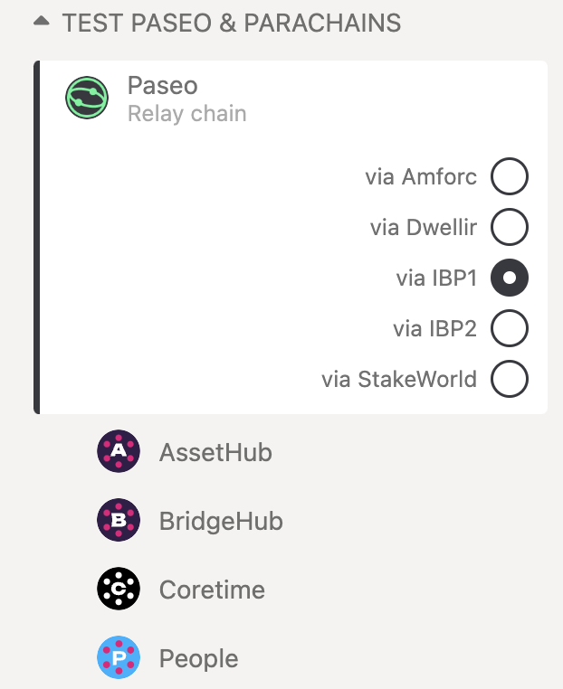

Parachains are connected to and secured by the relay chain. They benefit from the _pooled security_,
_thought-through governance_, and overall _scalability_ of the heterogeneous sharding approach of
the network. Creating a parachain can be seen as creating a **Layer-1 blockchain**, which has its
own logic and runs in parallel within the Polkadot ecosystem.

Developers can focus on creating state-of-the-art chains that take advantage of Polkadot's
next-generation approach. Some examples of what a parachain could be are:

- DeFi (Decentralized Finance) Applications
- Digital Wallets
- IoT (Internet of Things) Applications
- Gaming
- Web 3.0 Infrastructure

and more.

Polkadot aims to be a bet against blockchain maximalism, where the success of Polkadot's
heterogeneous multi-chain approach will play a key part in the overall advancement of Web 3.0 and
decentralized systems. As a result, Polkadot's parachain model was designed with the belief that the
internet of the future will have many different types of blockchains working together.

### What are the Benefits of Deploying a Parachain?

The parachain model attempts to alleviate five key _build_ failures of present technology stacks, as
described in the [Polkadot Whitepaper](https://polkadot.network/PolkaDotPaper.pdf):

- **Scalability**: How much is spent on resources and will the network be subject to bottlenecks?
- **Isolatability**: Are the needs of many accounted for under the same framework?
- **Developability**: Is the system tooling, system support, and overall system integrity
  dependable?
- **Governance**: Can the network remain flexible to evolve and adapt over time? Can decisions be
  made with sufficient inclusivity, legitimacy, and transparency to provide effective leadership of
  a decentralised system?
- **Applicability**: Does the technology address a burning need on its own? Is other “middleware”
  required to bridge the gap to actual applications?

#### [Shared Security](../learn/learn-parachains.md) (Pooled Security)

Parachains can lease the security and interoperability of the Polkadot network purchasing coretime
with [DOT](../learn/learn-DOT.md). This means that the social costs of building a community around
your project and convincing validators to participate in your network security are reduced. Polkadot
has strong security, and decentralised application projects wishing to benefit from this security
would want to become a parachain to share in that pooled security.

#### [On-Chain Governance](../learn/learn-polkadot-opengov.md) (Thought-through Governance)

Most governance systems in blockchains use an off-chain governance mechanism. Polkadot's on-chain
governance encourages maximum participation of token holders and is frictionless and transparent. It
also enables [forkless upgrades](../learn/learn-runtime-upgrades.md).

#### Scalability

The sharded multichain network approach allows for what is essentially parallel computation
(processing power) that can process several transactions in parallel. Isolated blockchains are often
faced with the network constraint of processing transactions in sequence, causing bottlenecks.

#### Interoperability

Any decentralised application or chain that wants to enable trustless messaging to other parachains
already connected to the relay chain would want to become a parachain. Interoperability between
sovereign chains involves certain constraints and complex protocols to enable across a wide breadth
of chains.

With Polkadot, you will get this feature out of the box if you build your application as a
parachain. The [XCM format](../learn/learn-xcm.md) allows any parachains to communicate by passing
messages between them. Furthermore, as [bridges](../learn/learn-bridges.md) to other chains are
connected (such as those to Bitcoin or Ethereum), Polkadot's parachains will be able to communicate
with these as well.

!!!note
    Despite the benefits of becoming a parachain, developers should be conscious of the challenges in
    becoming a parachain, and whether building a blockchain with an end goal of becoming a parachain is
    a viable one for their project.

On Polkadot, you are able to put your blockchain’s latest block head onto the relay chain. As a
parachain, the blocks you submit are verified by validators with a Wasm runtime, which can be stored
on the relay chain. You also get the ability to communicate with other parachains using the
[XCM](../learn/learn-xcm.md) format: an abstract message passing system. Message passing is tracked
on the relay chain - as such, you can prove the delivery of messages and facilitate trustless
interactions.

As you can place your blockchain’s latest block head, you can achieve deterministic finalization for
your chain. The hard part of reaching finalization for blockchains tends to be the consensus, where,
in the parachain model, a blockchain can offload consensus to the overall shared network, and focus
on block production. Since the validators have the Wasm runtime for all the parachains, your
parachain shares the security of the validator pool with everyone on the relay chain.

Any validator in the validator pool can help validate your blockchain.

## Things to Consider

### [Para-nomics](../learn/learn-parachains.md#parachain-economies)

#### Digital Nation States

Parachains can be seen as autonomous agents; networks that act as decentralised digital nation
states. Parachains have their own communities, rules, economies, governance, treasuries, and
relationships with external chains. As a result, the economic policies within parachain ecosystems
are subject to the developers and overall community of that parachain ecosystem; there isn't
necessarily a go-to economic model a parachain should follow.

Moreover, _becoming a parachain_ has an opportunity cost associated. Ideally, you can increase the
value of the network by participating in the parachain selection process, and this should serve as a
good return on investment.

#### Connecting Digital Economies

[Collators](../learn/learn-collator.md) act as network maintainers and maintain a full node of a
parachain. They can be incentivized with a native token payout from:

- Transaction fees collected
- Parachain token sponsorship

### Para-objects

!!!info The relay chain can host arbitrary state machines, not just blockchains.
    The Polkadot network will encourage the connection and interoperability between different
    _para-objects_.

    Here, para-objects are referring to objects on the network that operate in parallel, generally,
    parallelizable objects.

These could be in the form of:

- System level chains (permanent chains)
- [Bridge](../learn/learn-bridges.md) Hubs
- Nested relay chains

### Migration

Projects that are already functioning as "solochains" or in isolated environments may be interested
in migrating onto the relay chain as a para-object. While the parachain model has its benefits, it
may not be the go-to strategy for some projects.

As a path for migration onto Polkadot, it may be more viable to migrate to one of the chains in one
of the reserved cores.

For instance, there are currently options for [smart contract deployment](build-smart-contracts.md)
on Kusama through the networks that have secured [coretime](../learn/learn-agile-coretime.md).

## Implement a Parachain

The Parachain Implementer's Guide is a significant work in progress and maintained by Parity Tech.
[**The live version**](https://w3f.github.io/parachain-implementers-guide/) is built from the source
located in the official
[Polkadot repository](https://github.com/paritytech/polkadot-sdk/tree/master/polkadot/roadmap/implementers-guide).

### Parachain Development Kit

The Parachain Development Kit or **PDK** is a set of tools that allows developers to easily create a
parachain. In practice, the PDK will consist of the following key components:

- _State transition function_ : a way for your application to move from one state to another state.
- _Collator node_ : a type of peer-to-peer node in the Polkadot network with certain
  responsibilities regarding parachains.

#### Key Components

The state transition function (STF) can be an abstract way for an application to go from one state
to another state. The only constraint that Polkadot places on this STF is that it must be easily
verifiable -- usually through what we call a _witness_ or _proof_. It must be so because the Relay
Chain validators will need to check that each state it receives from the collator node is correct
without actually running through the entire computation. Some examples of these proofs include the
Proof-of-Validity blocks or zk-SNARKs, which require less computational resources to verify than
they do to generate. The verification asymmetry in the proof generation of the STF is one of the
integral insights that allows Polkadot to scale while keeping high-security guarantees.

A collator node is one of the types of network maintainers in the protocol. They are responsible for
**keeping availability** of the state of the parachain and the new states returned from the
iteration of the state transition function. They must remain online to keep track of the state and
also of the XCMP messages that it will route between itself and other parachains. Collator nodes are
responsible for passing the succinct proofs to the relay chain's validators and tracking the latest
blocks from the relay chain. In essence, a collator node also acts as a light client for the relay
chain. For more on collator nodes, see the [collator page](../learn/learn-collator.md).

#### What PDKs Exist?

Currently, the only PDK is
[the Polkadot SDK](https://github.com/paritytech/polkadot-sdk/tree/master/substrate) and
[Cumulus](https://github.com/paritytech/polkadot-sdk/tree/master/cumulus).

**[Substrate](https://docs.polkadot.com/develop/parachains/intro-polkadot-sdk/#substrate)** is a blockchain framework that provides the basic building
blocks of a blockchain (things like the networking layer, consensus, a Wasm interpreter) while
providing an intuitive way to construct your runtime. Substrate is made to ease the process of
creating a new chain, but it does not provide support for relay chain compatibility directly. For
this reason, `Cumulus`, an added _library_ contains all of the Polkadot compatibility glue code.

#### Cumulus

!!!info
    Cumulus clouds are shaped sort of like dots. Together, they form an intricate system that is
    beautiful and functional.

[Cumulus](https://github.com/paritytech/polkadot-sdk/tree/master/cumulus) is an extension to
Substrate that makes it easy to make any Substrate-built runtime into a Polkadot-compatible
parachain.

Cumulus Consensus is a consensus engine for Substrate that follows a relay chain. This runs a Relay
Chain node internally, and dictates to the client and synchronization algorithms which chain to
follow, finalize, and treat as correct.

See the
[Cumulus overview](https://github.com/paritytech/polkadot-sdk/blob/master/cumulus/docs/overview.md)
for a more detailed description of Cumulus.

Cumulus is still in development, but the idea is that it should be simple to take a Substrate chain
and add the parachain code by importing the crates and adding a single line of code. Keep up-to-date
with the latest Cumulus developments from the [Cumulus section](#cumulus).

!!!info
    Substrate and Cumulus provide a PDK from the abstraction of the blockchain format, but it is **not
    necessary** that a parachain even needs to be a blockchain. For example, a parachain just needs to
    satisfy the two constraints listed above: _state transition function_ and _collator node_.

    Everything else is up to the implementer of the PDK.

Cumulus handles the network compatibility overhead that any parachain would need to implement to be
connected to the relay chain. This includes:

- Cross-chain message passing (XCMP)
- Out-of-the-box Collator node setup
- An embedded full client of the relay chain
- Block authorship compatibility

Are you interested in building a PDK? See the [future PDKs](#future-pdks) section for details.

### How to set up your parachain

After creating your chain runtime logic with Substrate, you will be able to compile it down to a
Wasm executable. This Wasm code blob will contain the entire state transition function of your
chain, and is what you will need to deploy your project to the relay chain as a parachain.

Validators on the relay chain will use the submitted Wasm code to validate the state transitions of
your chain or thread, but doing this requires some additional infrastructure. A validator needs some
way to stay up to date with the most recent state transitions, since relay chain nodes will not be
required to also be nodes of your chain.

This is where the collator node comes into play. A collator is a maintainer of your parachain and
performs the critical action of producing new block candidates for your chain and passing them to
relay chain validators for inclusion in the relay chain.

Substrate comes with its own networking layer built-in but unfortunately only supports solo chains
(that is, chains that do not connect to the relay chain). However, there is the Cumulus extension
that includes a collator node and allows for your Substrate-built logic to be compatible with the
relay chain as a parachain.

### Future PDKs

!!!info "Call to action"
    Do you want to build a Parachain Development Kit from scratch? The Web3 Foundation is giving grants
    to teams who are doing this, learn more and apply on the
    [W3F grants page](https://grants.web3.foundation).

One example of a PDK W3F is interested in supporting is a
[roll-up](https://ethresear.ch/t/roll-up-roll-back-snark-side-chain-17000-tps/3675) kit that allowed
developers to create SNARK-based parachains. If we review the roll-up write-up, we see that the
system uses two roles: users that update **state** and an operator that **aggregates the state
updates** into a single on-chain update. It should be straightforward to see how we can translate
this to the parachain terms. The state transition function for a roll-up-like parachain would be
updating the state (in practice, most likely a Merkle tree, which would be easily verifiable) from
the user inputs. The operator would act as the collator node, which would aggregate the state and
create the zk-SNARK proof that it would hand to a relay chain's validators for verification.

If you or your team are interested in developing a PDK feel free to apply for a grant on the
[W3F Grants Program repository](https://github.com/w3f/Grants-Program). There may be grants
available for this type of work.

## Testing a Parachain

### Paseo Testnet

[Paseo](https://github.com/paseo-network) is a testnet built for testing parachains. Paseo utilizes
Cumulus and [HRMP](../learn/learn-xcm-transport.md#hrmp-xcmp-lite) (Horizontal Relay-routed Message
Passing) in order to send transfers and messages between parachains.

Paseo runs a few test [system parachains](../learn/learn-system-chains.md) and externally developed
parachains.

If you would like to start deploying a parachain and trying out Coretime on Paseo, refer to the
[Coretime Guides](../build/build-guides-coretime-start.md).

### What Parachains are on Paseo Now?

You can see the list of included parachains
[here](https://polkadot.js.org/apps/?rpc=wss%3A%2F%2Fpaseo-rpc.dwellir.com#/parachains).

### Obtaining PAS

Follow the instructions [here](../learn/learn-DOT.md#getting-tokens-on-the-paseo-testnet) to get PAS
tokens.

### How to Connect to a Parachain

If you would like to connect to a parachain via [Polkadot-JS Apps](https://polkadot.js.org/apps/),
you may do so by clicking on the network selection at the top left-hand corner of the navigation and
selecting any parachain of choice.



For the purpose of these following examples, we will be using the Paseo testnet "Custom Node"
underneath "Development", following the
[parachain and coretime tutorials](../build/build-guides-coretime-start.md).

### Parachain Playground

You can also take advantage of the account functions offered on Polkadot-JS Apps to test the entire
Parachain onboarding process (e.g. registration and coretime purchase).

Start a local node on [Westend](../maintain/maintain-networks.md#westend-test-network) by running:

```bash
polkadot --chain=westend-dev --alice
```

Then, connect your local node with Polkadot-JS Apps.


## Deploy

Substrate-based chains, including the Polkadot and Kusama relay chains, use an
[SS58 encoding](../learn/learn-account-advanced.md#address-format) for their address formats.
[This page](https://github.com/paritytech/ss58-registry/blob/main/ss58-registry.json) serves as the
canonical registry for teams to see which chain corresponds to a given prefix, and which prefixes
are available.

### Parachain

To include your parachain into the Polkadot network, you will need to reserve a core on the relay
chain.

[Coretime](../learn/learn-agile-coretime.md) can be purchased with DOT to produce blocks
[continuously or on-demand](../learn/learn-parachains.md#parachains-vs-on-demand-parachains) while
benefiting from Polkadot's security. See
[these guides](../learn/learn-guides-coretime-marketplaces.md) to learn how to purchase coretime.

## Resources

- [Getting started with the Polkadot SDK for parachain development](../build/build-guides-coretime-start.md)
- [Polkadot Bridges](../learn/learn-bridges.md)
- [The Path of a Parachain Block](https://polkadot.network/blog/the-path-of-a-parachain-block/)
- [The Path of a Parachain Block (Parachain Protocol page)](../learn/learn-parachains-protocol.md)
- [How to become a parachain on Polkadot (Video)](https://www.youtube.com/watch?v=fYc1yolanoE)
- [Trusted Execution Environments and the Polkadot Ecosystem](https://polkadot.network/blog/trusted-execution-environments-and-the-polkadot-ecosystem/)
