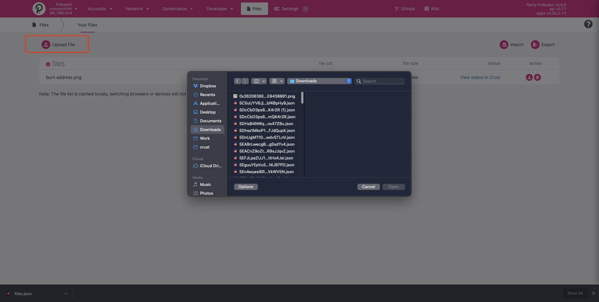
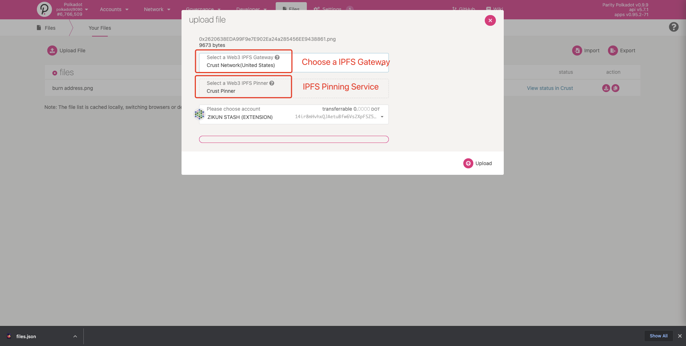
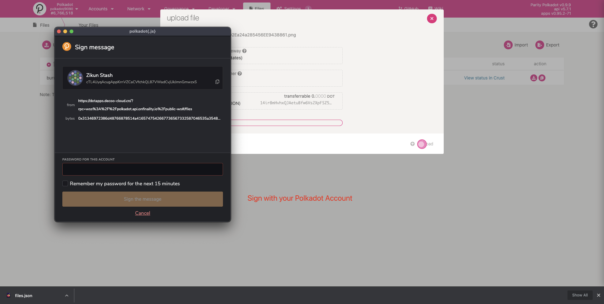
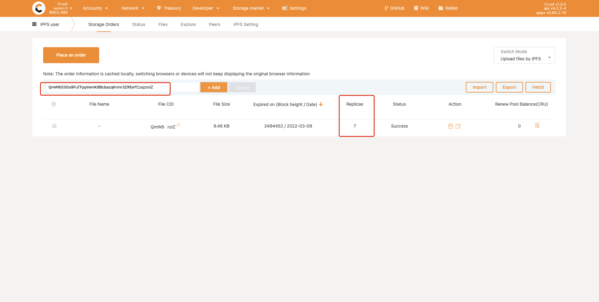
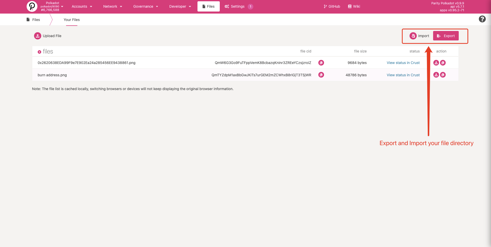

Storage is an integral part of modern computer systems, and the same is true for distributed and
decentralized systems like a blockchain. When interacting with the Polkadot ecosystem, it will be
helpful if you familiarize yourself with the current WEB3 approach to decentralized storage systems,
and how these systems can support your endeavors.

## DCS (Decentralized Cloud Storage)

The key attribute that characterizes centralized cloud storage is the location of data.

In decentralized cloud storage, the key attribute becomes the data itself instead of the data's
location.

This can be viewed as the shift from the centralized _location-centric_ storage approach to the
decentralized _content-centric_ approach.

### IPFS (Interplanetary File System)

[IPFS](https://ipfs.io/) is a peer-to-peer distributed file system that seeks to connect all
computing devices with the same system of files, by utilizing features such as content-addressing,
content-signing, and enhanced security methods through encryption. IPFS aims to address the current
hurdles of the HTTP-based Internet.

#### Brief comparison of IPFS & HTTP:

| IPFS                                                                                                                                     | HTTP                                                                                                                                                                          |
| ---------------------------------------------------------------------------------------------------------------------------------------- | ----------------------------------------------------------------------------------------------------------------------------------------------------------------------------- |
| network: peer-to-peer model (decentralized)                                                                                              | network: client-server model (centralized)                                                                                                                                    |
| requests: use a cryptographic hash of that data                                                                                          | requests: use the address on which data is hosted                                                                                                                             |
| accessibility: data is distributed to multiple nodes and can be accessed at any time. Bandwidth is high: nearest peer can serve the data | accessibility: data can only be accessed if the server is live and there are no interruptions in transmission. Bandwidth is limited: clients send requests to the same server |

### Filecoin

Like IPFS, [Filecoin](https://filecoin.io/) is a protocol developed by
[Protocol Labs](https://protocol.ai/) that offers a decentralized storage network. Filecoin's main
focus is the storage itself and uses IPFS as a [complementary] back-end protocol.

## Substrate Storage

Substrate takes a layered approach to storage by using a key-value data store that is implemented as
a database-backed, modified Merkle tree. Substrate's higher-layer storage abstractions are built on
the key-value store.

The key-value data store is backed by [RocksDB](https://rocksdb.org/), and it also supports an
experimental [Parity database](https://github.com/paritytech/parity-db).

:::note

The database is used for components that require persistent storage These are components like
Substrate clients, Substrate light-clients & off-chain workers. For more information, check out
Substrate documentation [Storage Page](https://docs.substrate.io/main-docs/build/runtime-storage/).

:::

When building on Substrate, runtime developers can utilize of Substrate's FRAME `Storage pallet`
which gives access to Substrate's storage APIs. These storage items support values that are encoded
by Parity's `SCALE (Simple Concatenated Aggregate Little-Endian) Codec`.

There is a
[`Storage Value`](https://paritytech.github.io/substrate/master/frame_support/storage/trait.StorageValue.html)
API that is used to store single values, a
[`Storage Map`](https://paritytech.github.io/substrate/master/frame_support/storage/trait.StorageMap.html)
API that is used to a key-value hash map, a
[`Storage Double Map`](https://paritytech.github.io/substrate/master/frame_support/storage/trait.StorageDoubleMap.html)
API that creates a `storage map` with two keys to provide the ability to efficiently remove all
entries that have a common first key, and a
[`Storage N Map`](https://paritytech.github.io/substrate/master/frame_support/storage/trait.StorageNMap.html)
API that can be used to store a hash map with any arbitrary number of keys.

These layered APIs act as runtime storage that allows you to store data in your blockchain. More
information can be found at the
[`Runtime Storage Page`](https://docs.substrate.io/main-docs/build/runtime-storage/) on Substrate
Developer Hub.

### Crust Storage

[Crust Network](https://crust.network) provides a Web3.0 decentralized storage network for the
Metaverse. It is designed to realize core values of decentralization, privacy, and assurance. Crust
supports multiple storage-layer protocols such as [IPFS](#ipfs-interplanetary-file-system), and
exposes instant accessible on-chain storage functions to users. Crustʼs technical stack is also
capable of supporting data manipulating and computing.

Crust provides a native cross-chain communication communication pallet based on
[XCMP](https://wiki.polkadot.network/docs/learn-crosschain), called
[xStorage](https://github.com/crustio/crust/tree/parachain/shadow/crust-collator/pallets/xstorage).

The protocol also supports most smart contract platforms, including Ethereum, with its
[cross-chain dStorage solution](https://wiki.crust.network/docs/en/buildCrossChainSolution).

:::note Learn more about Crust

To learn more about Crust, check out the [Crust Network Wiki](https://wiki.crust.network/en). Try
integrating with Crust by following their
[Crust Storage 101](https://wiki.crust.network/docs/en/build101) guide.

:::

### PolkadotJS Storage

The PolkadotJS API offers storage methods that are part of the default Substrate runtime. They are
exposed via `api.query.<module>.<method>`. See the
[official docs](https://polkadot.js.org/docs/substrate/storage/) for more details.

### Substrate Files

PolkadotJS Apps includes a decentralized storage module that allows Substrate-based chain users to
upload their files to [IPFS W3Auth Gateway](https://wiki.crust.network/docs/en/buildIPFSWeb3AuthGW)
and use the [IPFS W3Auth Pinning Service](https://wiki.crust.network/docs/en/buildIPFSW3AuthPin) to
pin their files on Crust Network.

Start by uploading a single file or folder:

Choose a Gateway:

Sign the message:

You should be able to view the file info, as follows:

As well as the file status:

:::note

The whole files module is decentralized, so your file directory is only cached in browser. The file
directory info will not be visible if you switch to a new browser or clear the browser cache. The
storage module allows you to export file directory info from the current browser and import it to
the new browser.

:::

:::note

These above images are taken from this [pull request](https://github.com/polkadot-js/apps/pull/6106)

:::
