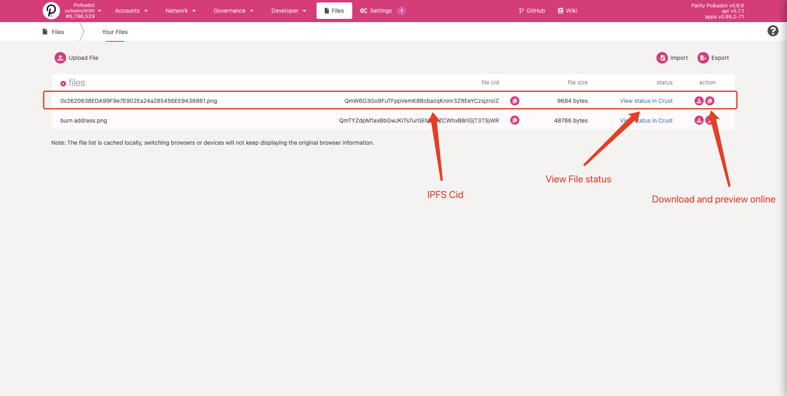

Storage is an integral part of modern computer systems, and the same is true for distributed and
decentralized systems like a blockchain. When interacting with the
{{ polkadot: Polkadot :polkadot }}{{ kusama: Kusama :kusama }} ecosystem, it will be helpful if you
familiarize yourself with the current Web3 approach towards decentralized storage.

## DCS (Decentralized Cloud Storage)

The key attribute that characterizes centralized cloud storage is the location of data.

In decentralized cloud storage, the key attribute becomes the data itself instead of the data's
location.

This can be viewed as the shift from the centralized _location-centric_ storage approach to the
decentralized _content-centric_ approach.

### IPFS (Interplanetary File System)

[IPFS](https://ipfs.io/) is a peer-to-peer distributed file system that seeks to connect all
computing devices with the same system of files, by utilizing features such as content-addressing,
content-signing, and enhanced security methods through encryption. IPFS aims to address the current
hurdles of the HTTP-based Internet.

#### Brief comparison of IPFS & HTTP:

| IPFS                                                                                                                                     | HTTP                                                                                                                                                                          |
| ---------------------------------------------------------------------------------------------------------------------------------------- | ----------------------------------------------------------------------------------------------------------------------------------------------------------------------------- |
| network: peer-to-peer model (decentralized)                                                                                              | network: client-server model (centralized)                                                                                                                                    |
| requests: use a cryptographic hash of that data                                                                                          | requests: use the address on which data is hosted                                                                                                                             |
| accessibility: data is distributed to multiple nodes and can be accessed at any time. Bandwidth is high: nearest peer can serve the data | accessibility: data can only be accessed if the server is live and there are no interruptions in transmission. Bandwidth is limited: clients send requests to the same server |

### Crust Storage

[Crust Network](https://crust.network) provides a Web3.0 decentralized storage network for the
Metaverse. It is designed to realize core values of decentralization, privacy, and assurance. Crust
supports multiple storage-layer protocols such as [IPFS](#ipfs-interplanetary-file-system), and
exposes instant accessible on-chain storage functions to users. Crustʼs technical stack is also
capable of supporting data manipulating and computing.

Crust provides a native cross-chain communication pallet based on
[XCMP](https://wiki.polkadot.network/docs/learn-xcm), called
[xStorage](https://github.com/crustio/crust/tree/parachain/shadow/crust-collator/pallets/xstorage).

The protocol also supports most smart contract platforms, including Ethereum, with its
[cross-chain dStorage solution](https://wiki.crust.network/docs/en/buildCrossChainSolution).

:::note Learn more about Crust

To learn more about Crust, check out the [Crust Network Wiki](https://wiki.crust.network/en). Try
integrating with Crust by following their
[Crust Storage 101](https://wiki.crust.network/docs/en/build101) guide.

### Filebase

[Filebase](https://filebase.com) is the first S3-compatible object storage platform that allows you to store data in a secure, redundant, and performant manner across multiple decentralized storage networks. 

Filebase offers a geo-redundant IPFS pinning service that allows you to pin files to IPFS across multiple diverse geographic locations. All files uploaded to IPFS through Filebase are automatically pinned to the Filebase infrastructure with 3x replication across the globe. This ensures that your data is globally available and redundant at all times.

Filebase acts as an easy on-ramp to IPFS and decentralized storage by offering a user-friendly web console dashboard, making drag-and-dropping files onto Web3 simple and easy. Filebase also provides an S3-compatible API for widespread integrations and configurations in current workflows.

:::note Learn more about Filebase

To learn more about Filebase, check out the [Filebase Documentation](https://docs.filebase.com), and specifically the documentation on [deploying Polkadot dApp on decentralized storage.](https://docs.filebase.com/web3-education/web3-tutorials/polkadot/polkadot-deploy-a-polkadot-dapp-on-decentralized-storage)
. You can get started with Filebase by signing up [here.](https://filebase.com/signup)

:::

#### Using Polkadot-JS Files (IPFS) module

Polkadot-JS UI includes a decentralized storage module that allows Substrate-based chain users to
upload their files to an
[IPFS W3Auth Gateway](https://wiki.crust.network/docs/en/buildIPFSWeb3AuthGW) and use the
[IPFS W3Auth Pinning Service](https://wiki.crust.network/docs/en/buildIPFSW3AuthPin) to pin their
files on Crust Network.

Start by uploading a single file or folder:

Choose a Gateway:

Sign the message:

You should be able to view the file info, as follows:

As well as the file status:

:::note

The whole files module is decentralized, so your file directory is only cached in browser. The file
directory info will not be visible if you switch to a new browser or clear the browser cache. The
storage module allows you to export file directory info from the current browser and import it to
the new browser.

:::

:::note

These above images are taken from this [pull request](https://github.com/polkadot-js/apps/pull/6106)

:::
