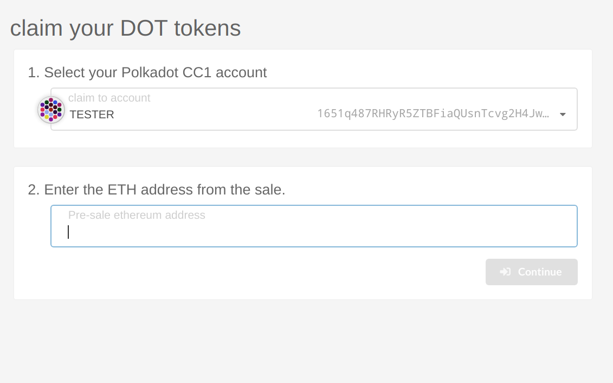
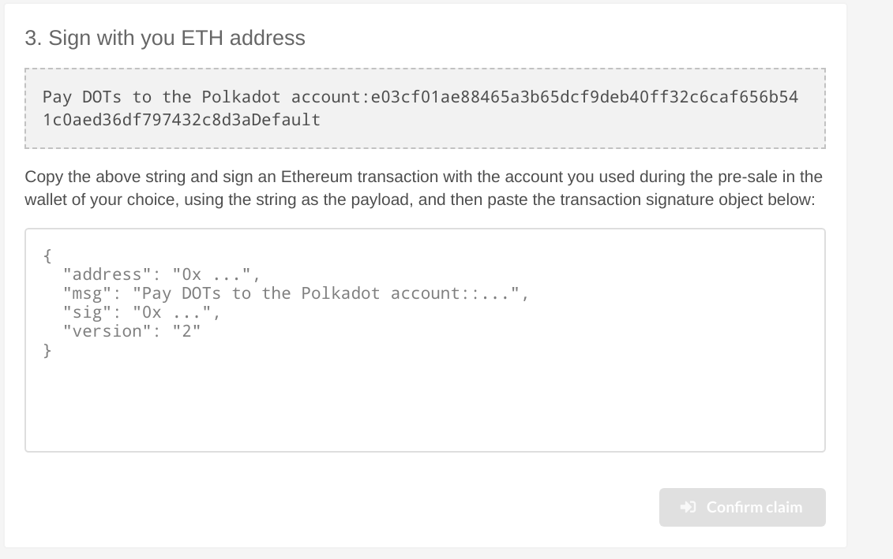
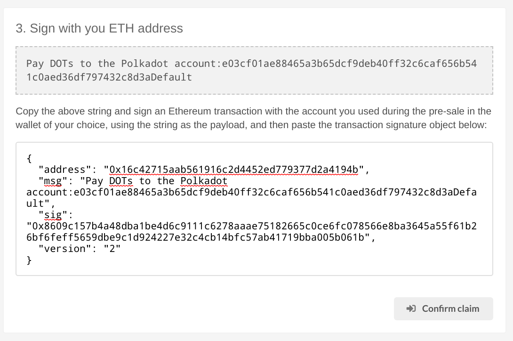
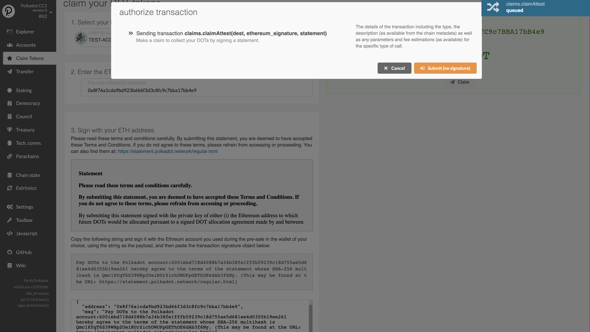
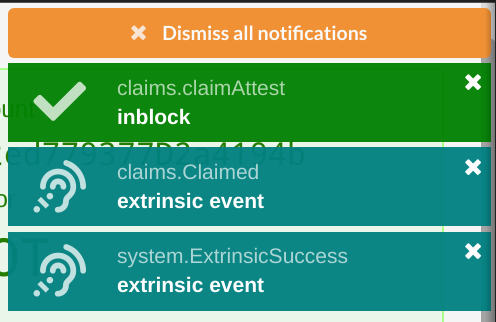
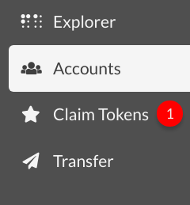
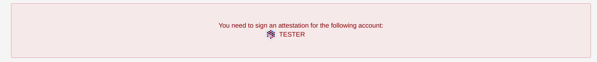
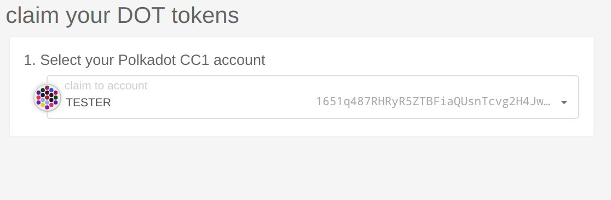

When Polkadot enters into its soft launch, the functionality for making on-chain claims for DOTs
will already be enabled. If you've already made a pre-genesis claim by making a claim transaction on
the Ethereum Claim Contract, then you will not need to claim again but you will need to send a free
_attest_ transaction before your DOTs are sent to your account.

This guide will walk you through the steps for either making a claim or attesting to the statement.

If you are making a claim on Polkadot for the first time please read on below in the
[making a claim](#making-a-claim) section. If you've already claimed during the pre-genesis claims
please proceed to [attesting to a statement](#attesting-to-a-statement) section instead.

## Making a Claim

If you did not make a claim in the pre-genesis claims period then you are able to make a claim any
time after genesis. There is no time limit for making your claim so feel free to do this whenever
you are most comfortable.

> Note: When you make a claim, at the same time you will make an attestation to the required
> statement. The two actions "claim" and "attest" are done at once in a `claim_attest` transaction,
> but for the most part this is simplified from the perspective of the UI.

### What you will need

- The Ethereum account that holds the DOT indicator tokens.
- The MyCrypto wallet
- A Polkadot account

You should already have your Ethereum account that holds the DOT indicator tokens from Polkadot's
prior sales. You will need to have access to this account in order to make a signature.

[MyCrypto][] is a versatile wallet that supports a variety of storage methods for your Ethereum
account. Please click on the link to go to their downloads page and ensure you download the latest
version for your operating system. This is important because the latest version will always have the
latest security patches.

You will need a Polkadot account to mark as the destination for sending the DOTs in the claim.
Please follow the instructions on the [account generation][] page for generating a new Polkadot
account.

#### Claiming your DOT with MyCrypto

The Polkadot JS [Claims app][] helps you sign a message from MyCrypto. MyCrypto is a good choice in
case you have stored the key to the Ethereum account holding your DOT indicator tokens on a hardware
device like a Ledger Nano S or a Trezor. It also supports raw private keys, mnemonics and Parity
signer.

**NOTICE**: It is much more secure to download and use the MyCrypto app locally. Please make sure to
download the latest version for your operating system. You can always find the most up-to-date
releases of the desktop app on their [releases page][mycrypto].

Once you've downloaded MyCrypto and have it running locally (we recommend an air-gapped computer for
maximum security), you can start by navigating to the Claims app on Polkadot-JS Apps. Select the
account you would like to claim the DOTs into and click the blue "Continue" button to proceed. Your
screen should look something like this:

Now you will need to provide the Ethereum address that is associated with the DOT indicator tokens
that you will claim. Enter the Ethereum address into the box and click "Continue". Next your screen
should look the image below.

The hex encoded string that follows the sentence: "Pay DOTs to the Polkadot account:" is the
hex-encoded public key of your Polkadot account, minus the `0x` prefix.

The next step is to go to the MyCrypto application and click on "Sign & Verify Message" tab.

This will prompt you to select a method for unlocking your wallet.

After unlocking your wallet, paste the message from Polkadot JS into the "Message" box.

When you click "Sign Message" you will get a JSON output like the below:

Copy and paste the JSON output of the signed message from MyCrypto into the input box on the
Polkadot JS UI and click "Confirm Claim."

Now a green box will appear telling you the amount to claim with a "Claim" button to make the claim.
Click on the "Claim" button and click "Submit (no signature)" to complete the claim.

At this point you will see a success message if everything went right and your DOTs will now be in
the account that you claimed to.

Congratulations, you have now completed the process for claiming and signing for your DOTs.

#### Verifying your Claim

After you make an on-chain claim for DOTs, your balance should be updated on the Polkadot UI
immediately.

Having trouble? Get support in the DOT [Claims Support][] channel.

### Third Party Claims Processes

\_COINBASE_TO_DO

**We do not recommend using a third-party app or process to perform your claim or acquire DOT**

Claiming using a third-party process can lead to the loss of your allocation, therefore we cannot
recommend using any third party apps to do so. Manually specifying your transaction data, as
specified in our claims process, is the only way to be certain you will receive your allocation.

## Attesting to a statement

If you've already made a pre-genesis claim, you still have to attest to a statement using your
Polkadot account.

### What you will need

- Your Polkadot account unlocked on Polkadot-JS Apps UI.

You will be sending a free transaction from your Polkadot account on the Polkadot-JS Apps UI. Once
you make this transaction you will have the tokens available in your account to use for staking,
voting, and eventually transfers.

### Log on to Polkadot-JS Apps

Proceed to [polkadot-js Apps][claims app]. You will need to grant Apps access to your account in
some way. One way would be to go to the Accounts page and "create" a new account, replacing the
generated seed or mnemonic with the one belonging to your account. The other way is by using the
Polkadot-JS extension and entering your seed or mnemonic there, which is generally safer than
entering it directly to the Apps page.

### Make the attestation

Once you have your account entered you should see a red counter appear on the "Claim Tokens" tab on
the left navigation drawer.

Click on the "Claim Tokens" tab and you will see a large notification at the top of the page that
tells you that you need to sign an attestation.

You will select your Polkadot account that is being notified to you needs to make an attestation in
the selector on this page. Click "Continue" and you should see a green box appear to the right of
the selector.

Click on "Attest" and then "Sign and Submit" to make your free attest transaction. When the
transaction is included in the block, you will see a green success box appear in the upper left
corner and the DOTs will be in your account.

[mycrypto]: https://github.com/MyCryptoHQ/MyCrypto/release
[account generation]: learn-account-generation
[claims app]: https://polkadot.js.org/apps/#/claims
[claims support]:
  https://riot.im/app/#/room/!kwIkVteRpPRjjTyvTe:web3.foundation?via=web3.foundation&via=matrix.org&via=matrix.parity.io
