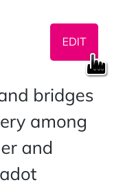

The wiki was started and is maintained by the Web3 Foundation. It is an Open-ish open source project and aims to be
the most extensive resource of knowledge on Polkadot and the Polkadot ecosystem. A large part of the material currently
focuses on Polkadot directly but it is not opposed to cover informational material for community projects. But please
do not try to pull request any marketing material as this will be rejected.

Pull requests, discussions and contributions from the community are encouraged. For certain active community members who
demonstrate a record of good contributions, they may be given write access to the repository. Otherwise, the Web3
Foundation holds the administrative position and final say on the content that is included. Specifically the Technical
Education team at the foundation are most directly involved.

## How to Contribute

Contributing to the wiki is easy with a GitHub account. Every page is a markdown file, which is a [very easy to learn](https://guides.github.com/features/mastering-markdown/)
syntax extension to plain text that makes creating links, rendering images, and nice-looking formatting simple.

Each page has an "Edit" button on the top right of the content. By clicking this button you are taken to the GitHub
text editor in which you can make your edits directly. When you've completed your changes you can create a new Pull
Request to the repository and one of the maintainers will either merge it in or request changes very soon.

## Rules

There are a few basic ground-rules for contributors:

1. **No `--force` pushes** or modifying the Git history in any way.
2. Pull requests are preferred to issues, especially for small changes such as typos. Issues should be used for generic or broad-based changes or missing content.
3. **Non-master branches** ought to be used for ongoing work.
4. **Significant modifications** ought to be subject to an **pull request** to solicit feedback from other contributors.
5. Pull requests to solicit feedback are _encouraged_ for any other non-trivial contribution but left to the discretion of the contributor.
6. Contributors should attempt to adhere to the prevailing Markdown style, language, and layout.
7. Correct grammar should be used at all times. Pull requests with typos will not be merged until fixed.
8. Care should be taken to remain as objective and informative as possible. There should be no editorializing, and external bias should not be present.

## Changes to this arrangement

This document may also be subject to pull requests or changes by contributors where you believe you have something valuable to add or change.

## Heritage

This document was based on the Level contribution guidelines located here: [https://github.com/Level/community/blob/master/CONTRIBUTING.md](https://github.com/Level/community/blob/master/CONTRIBUTING.md)
