If you made a DOT purchase in one of the pre-launch sales, then you will need to claim your DOT
tokens. For those who made a pre-genesis claim by sending a claim transaction to the Claims Contract
on Ethereum, you will still need to send a free *attest* transaction that will agree to the terms
and conditions of your allocation. If you did not make a pre-genesis claim, then you will claim and
attest in a single transaction.

This guide will walk you through the steps for either making a claim or attesting to the statement.

If you are making a claim on Polkadot for the first time, please read on below in the
[making a claim](#making-a-claim) section. If you've already claimed during the pre-genesis claims
period, please proceed to the [attesting to a statement](#attesting-to-a-statement) section instead.

:::note How to Claim your DOT

To learn more on How to claim your DOT post genesis, check out our walkthrough
[video](https://www.youtube.com/watch?v=rjhWfKXJTCg&list=PLOyWqupZ-WGuAuS00rK-pebTMAOxW41W8&index=22)
and our video on
[Claiming DOT with an Ethereum address generated using an old mnemonic phrase](https://www.youtube.com/watch?v=AlwrM27x3As&list=PLOyWqupZ-WGuAuS00rK-pebTMAOxW41W8&index=16)

:::

## Making a Claim

If you did not make a claim in the pre-genesis claims period, then you are able to claim your DOT
tokens after genesis. There is no time limit for making your claim so feel free to do this whenever
you are most comfortable.

:::note

When you make a claim, you will also attest to the agreement that corresponds to your DOT
allocation. The two actions, "claim" and "attest", are done in a single transaction, but for the
most part this is simplified from the perspective of the user.

:::

### What You Will Need

- The Ethereum account that holds the DOT indicator tokens
- The MyCrypto wallet
- A Polkadot account

You should already have your Ethereum account that holds the DOT indicator tokens from Polkadot's
prior sales. You will need to have access to this account in order to make a signature.

[MyCrypto][] is a versatile wallet that supports a variety of storage methods for your Ethereum
account. Go to their downloads page and ensure that you download the latest version for your
operating system. This is important because the latest version will always have the latest security
patches.

:::caution

It is much more secure to download and use the MyCrypto app locally. You can always
find the most up-to-date releases of the desktop app on their [releases page][mycrypto].

:::

You will need a Polkadot account to claim your DOT. Please follow the instructions on the [account
generation][] page for generating a new Polkadot account.

You can use the [claims guide](https://claims.polkadot.network/) to claim DOT that were purchased in
the form of DOT Allocation Indicators on Ethereum before June 30, 2020. These steps are broken down
in the remaining sections of this page.

#### Claiming your DOT with MyCrypto

The Polkadot-JS [Claims app][] helps you sign a message from MyCrypto. MyCrypto is a good choice in
case you have stored the key to the Ethereum account holding your DOT indicator tokens on a hardware
device like a Ledger Nano S or a Trezor. It also supports raw private keys, mnemonics, and Parity
signer.

Once you've downloaded MyCrypto and have it running locally (we recommend an air-gapped computer for
maximum security), you can start by navigating to the Claims app on Polkadot-JS Apps. Select the
account you would like to claim the DOT into and click the blue "Continue" button to proceed. Your
screen should look something like this:

Now you will need to provide the Ethereum address that is associated with the DOT indicator tokens
that you will claim. Enter the Ethereum address into the box and click "Continue".

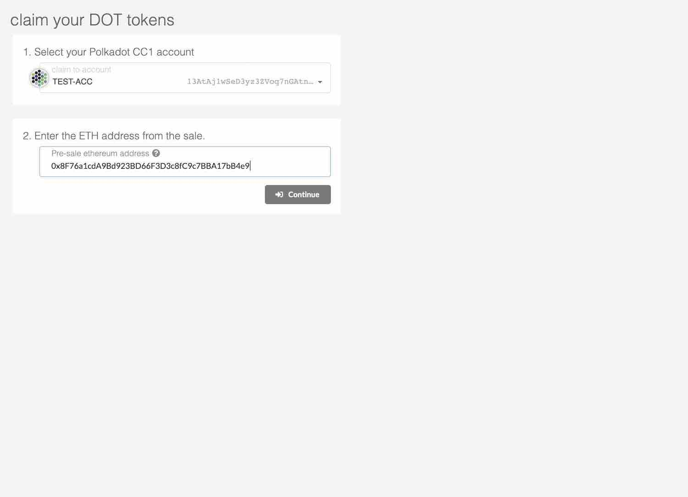

Next your screen should look the image below.

The hex-encoded string that follows the sentence: "Pay DOT to the Polkadot account:" is the
hex-encoded public key of your Polkadot account, minus the `0x` prefix.

The next step is to go to the MyCrypto application and click on "Sign & Verify Message" tab.

This will prompt you to select a method for unlocking your wallet.

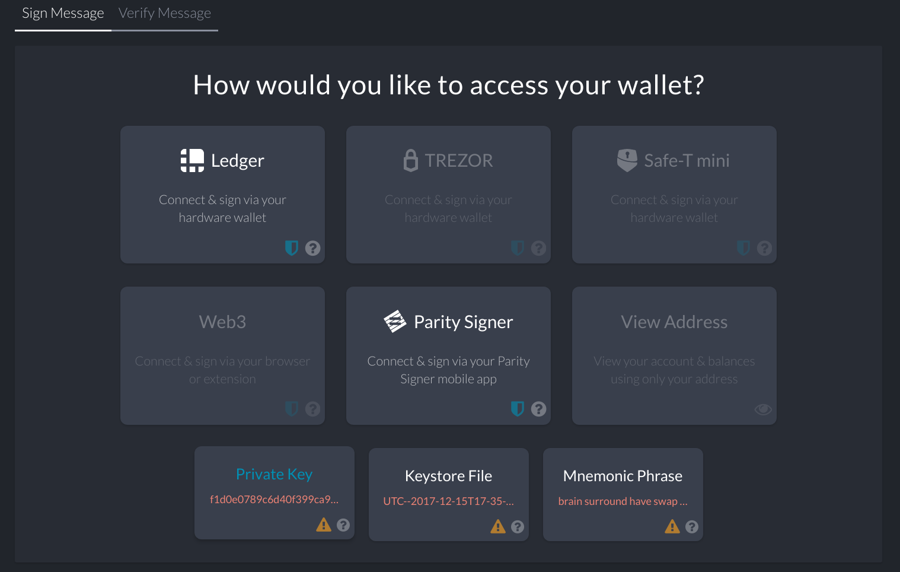

After unlocking your wallet, paste the message from Polkadot-JS into the "Message" box.

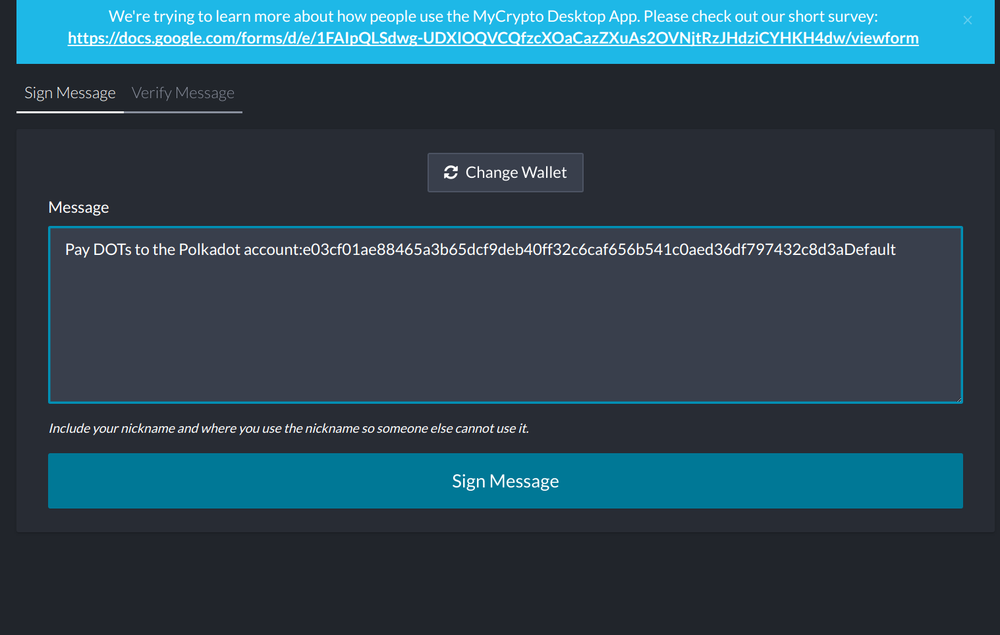

When you click "Sign Message" you will get a JSON output like the one below:

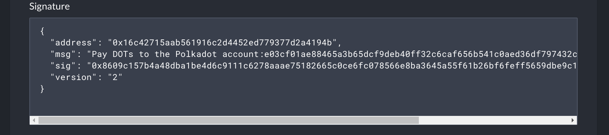

Copy and paste the JSON output of the signed message from MyCrypto into the input box on the
Polkadot-JS UI and click "Confirm Claim."

 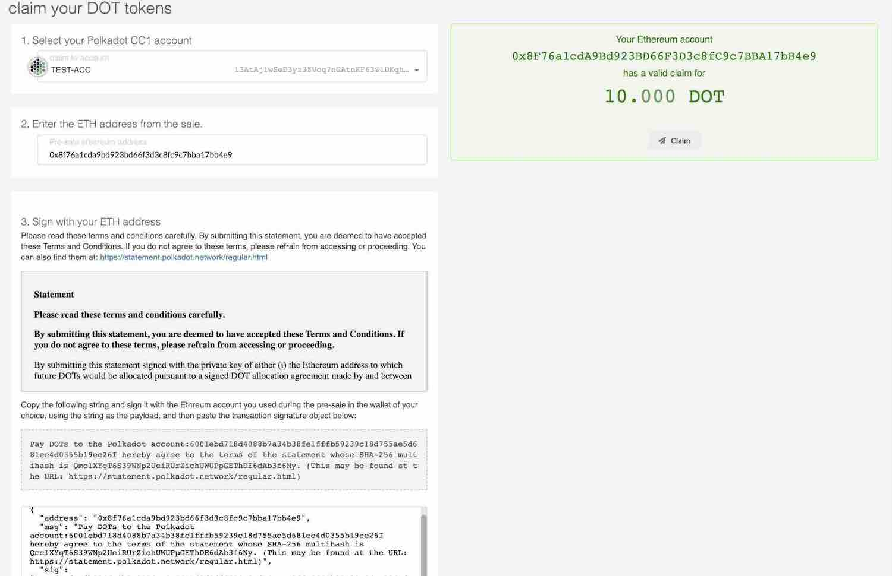

A green box will appear telling you the amount to claim with a "Claim" button to make the claim.
Click on the "Claim" button and click "Submit (no signature)" to complete the claim.

If this claim succeeded, then you will see a success message and your DOT will be in the account
that you claimed to.

#### Verifying your Claim

After you make an on-chain claim for DOT, your balance should be updated on the Polkadot UI
immediately.

Having trouble? Get support in the DOT [Claims Support][] channel.

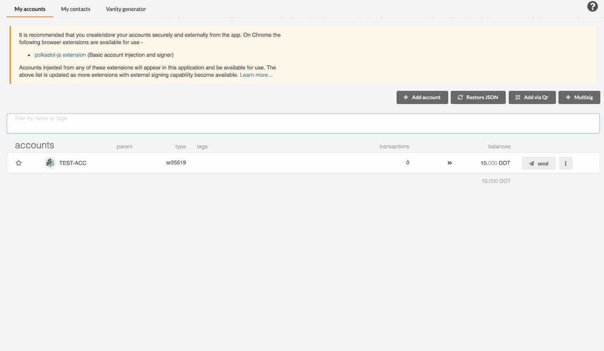

Congratulations, you have now completed the process for claiming and signing for your DOT.

### Third Party Claims Processes

**We do not recommend using third-party apps or processes to perform your claim or acquire DOT.**

Claiming using a third-party process can lead to the loss of your allocation, therefore we cannot
recommend using any third party apps to do so. Manually specifying your transaction data, as
specified in our claims process, is the only way to be certain you will receive your allocation.

## Attesting to a Statement

If you've already made a pre-genesis claim, you still have to agree to a statement using your
Polkadot account.

## Using Polkadot-JS Apps

### What you will need

- Your Polkadot account unlocked on Polkadot-JS Apps UI.

You will be sending a free transaction from your Polkadot account on the Polkadot-JS Apps UI. Once
you make this transaction you will have the tokens available in your account.

### Go to Polkadot-JS Apps

Proceed to [polkadot-js Apps][claims app]. You will need to grant Apps access to your account in
some way. One way would be to go to the Accounts page and "create" a new account, replacing the
generated seed or mnemonic with the one belonging to your account. The other way is by using the
Polkadot-JS extension and entering your seed or mnemonic there, which is generally safer than
entering it directly to the Apps page.

### Make the Attestation

After entering your account, you should see a red counter appear on the "Claim Tokens" tab on the
left navigation drawer.

Click on the "Claim Tokens" tab and you will see a large notification at the top of the page that
tells you that you need to sign an attestation.

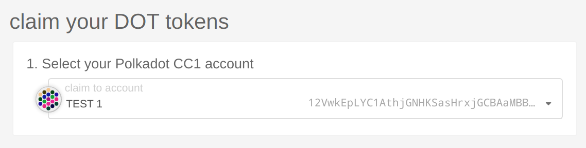

The notification will display one or more Polkadot addresses that you have loaded in Polkadot-JS
that you need to sign. Select a Polkadot account with a claim using the drop down selection. If you
don't see a notification or don't see the selector, please double check that the account has been
loaded into Polkadot-JS and that it has already claimed during the preclaim period. As always, feel
free to reach out for help in the [Claims Support][] channel.

Click "Continue" and you will see a green box appear on the right.

Click on "I Agree" and then "Sign and Submit" to make your free attest transaction. When the
transaction is included in the block, you will see a green success box appear in the upper right
corner and the DOT will be in your account.

## Using Parity Signer

### What you will need

- Parity Signer
- Your Polkadot account linked to Polkadot-JS Apps UI

Before claiming, you should import your Polkadot address on Parity Signer to the Polkadot-JS Apps.
All operations will use Parity Signer to sign the transaction, but will broadcast it via the
Polkadot-JS Apps remote node. If you do not have a Polkadot address, please follow the instructions
on the Parity Signer section in the [account generation][] page for generating a new Polkadot
account.

### Go to Polkadot-JS Apps

Proceed to [Polkadot-JS Apps][claims app]. You will need to import your address on Parity Signer to
the Accounts page first.

### Make the Attestation

Click "Add via Qr" on the right side.

Open Parity Signer and choose "Polkadot" network.

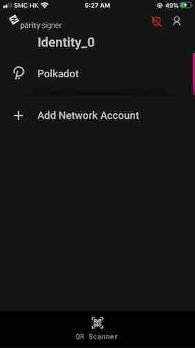

Select the address that you have claimed DOT to during pre-genesis.

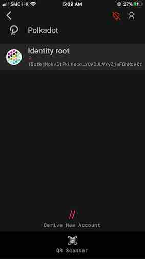

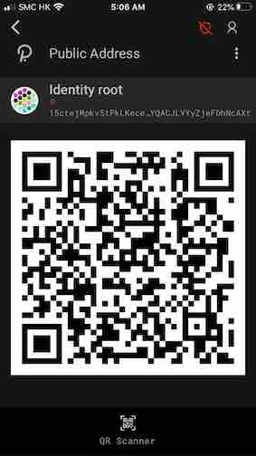

Your address will be displayed in QR code format. You can move the QR code to the camera so that the
Polkadot-JS Apps can decode it.

Once decoded successfully, input the name for your address and click "Create".

You will notice that the digit beside the "Claim Tokens" menu increased by 1. It means the number of
addresses on the Accounts page that need to do attestations.

Go to the [Claim Tokens](https://polkadot.js.org/apps/#/claims) page and and you will see a large
notification at the top of the page that tells you that you need to sign an attestation.

Select the Polkadot account that you just have imported with a claim using the drop-down selection.
If you don't see a notification or don't see the selector, please double check that the account has
been loaded into Polkadot-JS and that it has already claimed during the pre-genesis period. As
always, feel free to reach out for help in the [Claims Support][] channel.

Then click "Continue" and you will see a green box appear on the right.

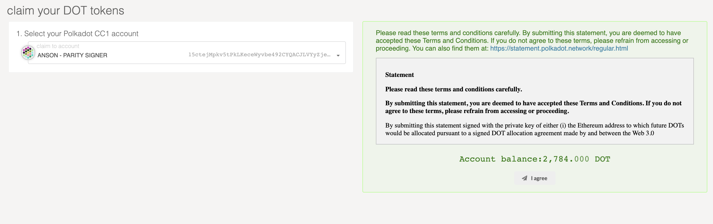

Click on "I Agree" and then "Sign via Qr".

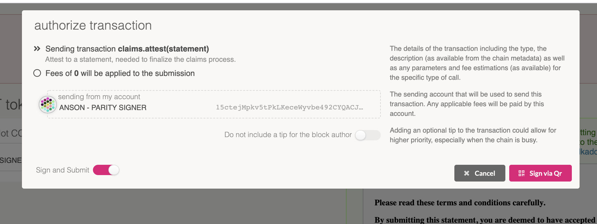

Now you need to sign the transaction using the Parity Signer with your Polkadot address.

First, you need to press the "QR Scanner" on the Parity Signer to scan the QR code that's shown on
the authorize transaction window to generate the raw transaction. Next, you may be required to input
the PIN on the Parity Signer to generate the signed transaction as a QR code. Then move the QR code
to the camera on the Polkadot-JS Apps to continue.

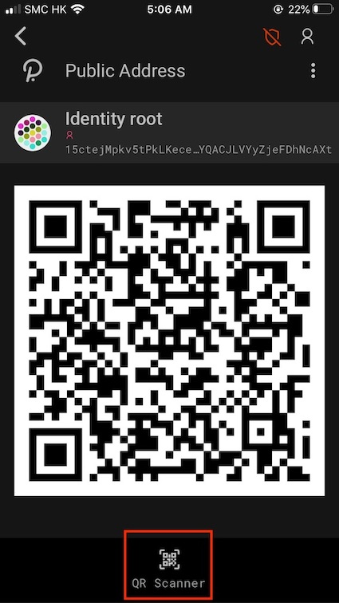

When the transaction is included in the block, you will see a green success box appear in the upper
right corner and the DOT will be in your account.

[mycrypto]: https://download.mycrypto.com/
[account generation]: ../learn/learn-account-generation.md
[claims app]: https://polkadot.js.org/apps/#/claims
[claims support]: https://riot.im/app/#/room/!kwIkVteRpPRjjTyvTe:web3.foundation?via=web3.foundation&via=matrix.org&via=matrix.parity.io
