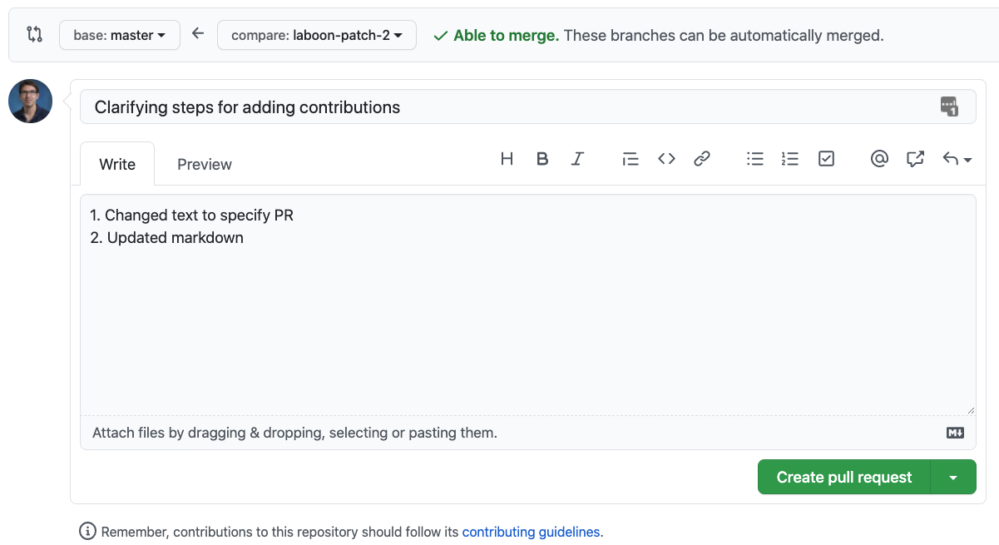

The wiki was started and is maintained by Web3 Foundation. It is an open source project and aims
to be the most extensive resource of knowledge on Polkadot and the Polkadot ecosystem. A large part
of the material currently focuses on Polkadot directly but it is not opposed to covering
informational material for community projects.

:::caution Marketing material

Please do not try to pull request any marketing material as this will be rejected.

:::

Nonetheless, pull requests, discussions, and contributions from the community are encouraged. Active
community members who demonstrate a record of good contributions may be given write access to the
repository.

Otherwise, Web3 Foundation holds the administrative position and final say on the content that is
included. Specifically, the Technical Education team at the foundation are most directly involved.

:::note Contributing Explainer

Check out the
[How to Contribute to the Polkadot Wiki](https://www.youtube.com/watch?v=6i55KOcy7B0) video for
steps on contributions.

:::

## How to Contribute

You can contribute to the wiki on the
[w3f/polkadot-wiki GitHub repository](https://github.com/w3f/polkadot-wiki). Every page is a
[MarkDown](https://guides.github.com/features/mastering-markdown/) file, which is an easy to learn
syntax extension to plain text that makes creating links, rendering images, and nice-looking
formatting simple.

Each page has an "Edit this page" link at the bottom of the content. By clicking it you are taken to
the GitHub sign-in page, where you can either log in or create an account.

Once logged in, you'll be taken to the GitHub built-in text editor where you can make your edits
directly. When you've completed your changes, you can add any specific details on what was changed
and commit to a **new branch** to create a new Pull Request to the repository. From there one of the
maintainers will review your changes, and either merge them or request changes.

 

Remember that after you click "Propose Changes", you must also click on "Create Pull Request" on the
next page.

## Guideline and Rules for Contributing

There are a few basic ground-rules for contributors:

1. **No `--force` pushes** or modifying the Git history in any way.
2. Pull requests are preferred to issues, especially for small changes such as typos. Issues should
   be used for generic or broad-based changes or missing content. Suggestions and requests are encouraged.
3. Only use **non-master branches**.
4. **Significant modifications**, even by contributors, ought to be subject to a **pull request** to
   solicit feedback from other contributors.
5. Pull requests to solicit feedback are _encouraged_ for any other non-trivial contribution but
   left to the discretion of the contributor.
6. Contributors should attempt to adhere to the prevailing `MarkDown` style, language, and layout.
7. Correct grammar should be used at all times. Pull requests with typos will not be merged until
   fixed.
8. Care should be taken to remain as objective and informative as possible. There should be no
   editorializing, and external bias should not be present.
9. We use a plugin called Prettier to standardize the style across documents. You can run this on
   your local copy with `npx pretty-quick --staged`, but for simplicity we also have a bot which
   runs this for us in your PRs.

## Heritage

This document is based on the
[Level contribution guidelines](https://github.com/Level/community/blob/master/CONTRIBUTING.md).

---

## Helping With Translations

The Wiki's default language is _English_, though, there is a desire to translate the Wiki
in as many languages as possible. Another way you can contribute is by helping with translations.

There is a feature at the bottom of the main page of the Polkadot Wiki that will redirect you to
[crowdin](https://crowdin.com/project/polkadot-wiki), which is where translation contributions can
be made.

There, you will see the progress of translating the docs associated with the Wiki in many different
languages.

 

The following are steps on how to interact with the crowdin interface for translations. Check out
the official [crowdin knowledge base](https://support.crowdin.com/online-editor/) as well.

    
   
    
    
   
     
     
    
    

The following shows an example in _Arabic_. You can type in your desired translation for each section
in the provided area, while using the suggestions generated by the crowdin built-in translator.

    
   
    

Make sure to save your translation.

