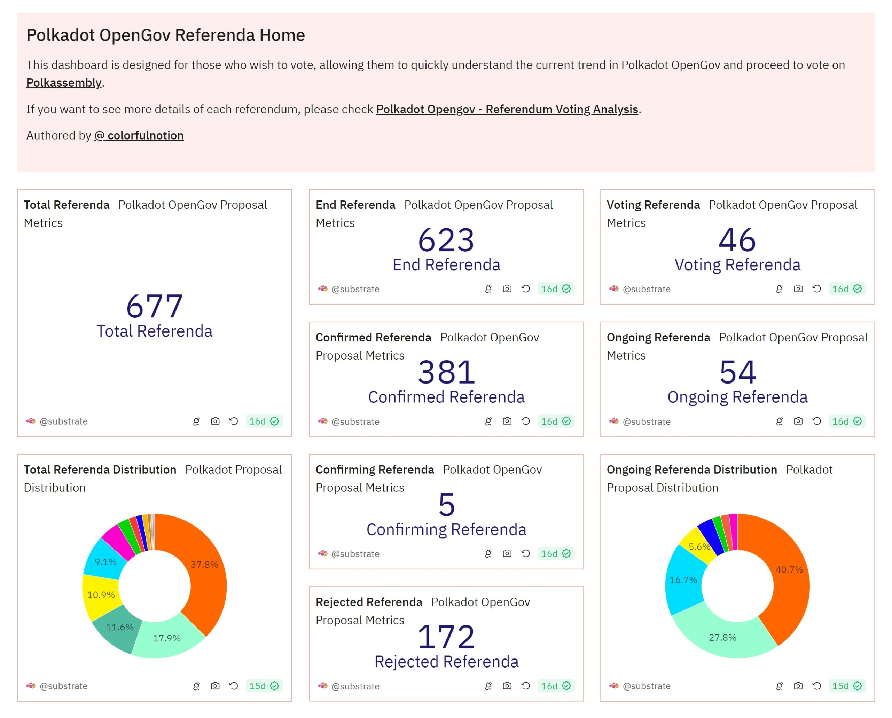
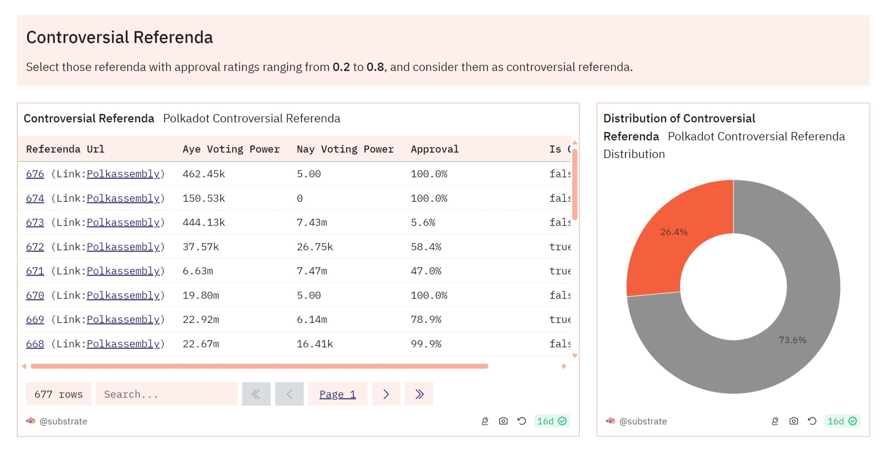

# Polkadot Dashboards Governance

## Overview

This document demonstrated various Polkadot governance dashboards, offering insights into treasury
management, referendum outcomes, voting patterns, and OpenGov referenda. These dashboards aim to
enhance community engagement by simplifying access to governance information and fostering a
transparent decision-making environment.

Authored by [**@ colorfulnotion**](https://x.com/colorfulnotion)

## Polkadot Governance Dashboard

**View On Dune:** [Polkadot Governance Dashboard](https://dune.com/substrate/polkadot-gov)

The **Polkadot Governance Dashboard** provides a clear and concise representation of the
[network's governance](https://wiki.polkadot.network/docs/en/learn-governance) activities.

### Polkadot Treasury Flow

Visualizes the monthly financial movements within the Polkadot treasury.

- **Treasury Netflow**: Treasury Inflows - Treasury Outflows
- **Treasury Inflows**: Inflation + Fees + Txn Tips + Slash
- **Treasury Outflows**: Opengov Proposals (Spender + Tipper Track) + Bounties + Burnt

<iframe src="https://dune.com/embeds/3386769/5684359/" height="350" width="100%"></iframe>

### Number of Votes by Duration of Lock

Visualizes Polkadot governance voting commitments.

<iframe src="https://dune.com/embeds/3393628/5694824/" height="350" width="100%"></iframe>

### Monthly Governance Metrics

These charts offer insights into monthly Polkadot governance engagement.

- **Number of Monthly Voters / Monthly Capital by Type / Monthly Voting Power by Type**
  <iframe src="https://dune.com/embeds/3393704/5695078/" height="350" width="100%"></iframe>
  <iframe src="https://dune.com/embeds/3393704/5695222/" height="350" width="100%"></iframe>
  <iframe src="https://dune.com/embeds/3393704/5695499/" height="350" width="100%"></iframe>

### Conviction Voting Power

- **None (0.1x)** - No lock
- **Locked1x** - 7 Days
- **Locked2x** - 14 Days
- **Locked3x** - 28 Days
- **Locked4x** - 56 Days
- **Locked5x** - 112 Days
- **Locked6x** - 224 Days

### Referenda Metrics

- **Number of Referenda by Outcome (OpenGov)**
  <iframe src="https://dune.com/embeds/3352377/5619239/" height="350" width="100%"></iframe>

- **Number of Referenda by Origin**
  <iframe src="https://dune.com/embeds/3415581/5734690/" height="350" width="100%"></iframe>

- **Monthly Tokens Voted by Direction / Monthly Voting Power by Direction**
  <iframe src="https://dune.com/embeds/3394126/5695667/" height="350" width="100%"></iframe>
  <iframe src="https://dune.com/embeds/3394126/5695709/" height="350" width="100%"></iframe>

### Delegation and Voting Dynamics

- **Recent Major Delegation Changes**
  <iframe src="https://dune.com/embeds/3460749/5816431/" height="350" width="100%"></iframe>

- **Recent Major Swing Votes**
  <iframe src="https://dune.com/embeds/3460920/5816752/" height="350" width="100%"></iframe>

- **Whale Voters**
  <iframe src="https://dune.com/embeds/3461952/5818542/" height="350" width="100%"></iframe>

- **Awakened Whale Voters**
  <iframe src="https://dune.com/embeds/3461031/5816940/" height="350" width="100%"></iframe>

## Polkadot OpenGov Referenda - Home

**View On Dune:**
[Polkadot OpenGov Referenda - Home](https://dune.com/substrate/polkadot-opengov-active-referenda)

Designed for voters to quickly understand the current trend in Polkadot OpenGov and proceed to vote
on [**Polkassembly**](https://polkadot.polkassembly.io/opengov).

### Referenda Basic Information

### Controversial Referenda

Referenda with approval ratings ranging from **0.2** to **0.8** are considered controversial.

## Polkadot Opengov - Referendum Voting Analysis

**View On Dune:**
[Polkadot Opengov - Referendum Voting Analysis](https://dune.com/substrate/polkadot-referendum)

!!!tip
    **Default parameters** are applied to all parameterized charts on this Wiki page as a demonstration. Visit our dashboard on Dune to use the `referendum_id` parameter for more in-depth analysis. For more information, please visit the[Dune documentation on parameters](https://docs.dune.com/web-app/query-editor/parameters).

### Voting Power Analysis

- **Voting Power Daily Accumulation**
  <iframe src="https://dune.com/embeds/3394377/5695923/" height="350" width="100%"></iframe>

- **Aye vs Nay**
  <iframe src="https://dune.com/embeds/3394358/5695887/" height="350" width="100%"></iframe>

### Vote Analysis

- **Aye Votes Analysis**
  <iframe src="https://dune.com/embeds/3394729/5696475/" height="350" width="100%"></iframe>
  <iframe src="https://dune.com/embeds/3394729/5697343/" height="350" width="100%"></iframe>
  <iframe src="https://dune.com/embeds/3394729/5701237/" height="350" width="100%"></iframe>

- **Nay Votes Analysis**
  <iframe src="https://dune.com/embeds/3394774/5696554/" height="350" width="100%"></iframe>
  <iframe src="https://dune.com/embeds/3394774/5697365/" height="350" width="100%"></iframe>
  <iframe src="https://dune.com/embeds/3394774/5701248/" height="350" width="100%"></iframe>

- **Abstain Votes Analysis**
  <iframe src="https://dune.com/embeds/3394782/5696570/" height="350" width="100%"></iframe>
  <iframe src="https://dune.com/embeds/3394782/5697378/" height="350" width="100%"></iframe>

### Voter Insights

- **First Time Voter Analysis**
  <iframe src="https://dune.com/embeds/3395256/5697453/" height="350" width="100%"></iframe>

- **Voter Conviction Adjustment**
  <iframe src="https://dune.com/embeds/3397420/5701499/" height="350" width="100%"></iframe>
  <iframe src="https://dune.com/embeds/3397420/5703298/" height="350" width="100%"></iframe>

- **Awakened Voters**
  <iframe src="https://dune.com/embeds/3399552/5705369/" height="350" width="100%"></iframe>
  <iframe src="https://dune.com/embeds/3401113/5707996/" height="350" width="100%"></iframe>
