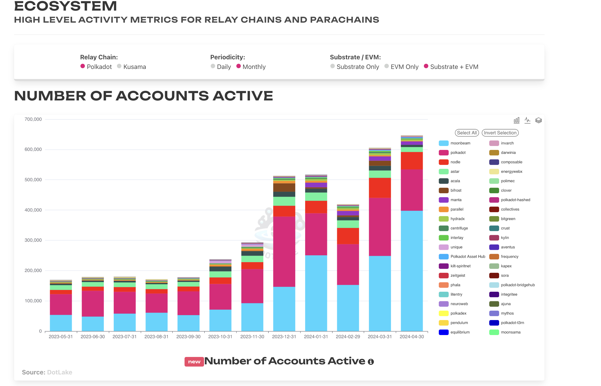
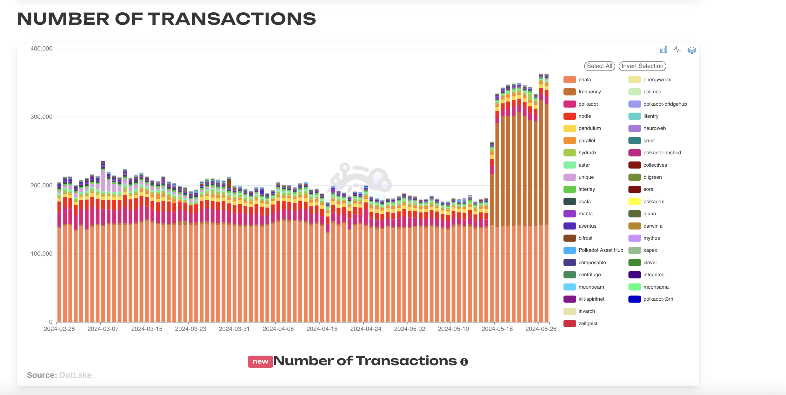
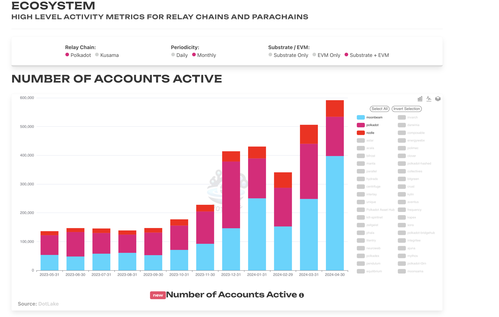
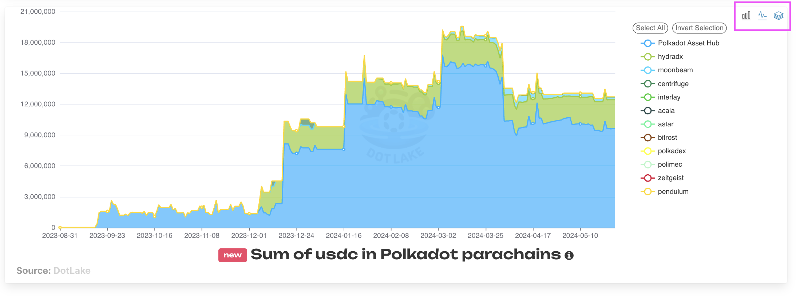
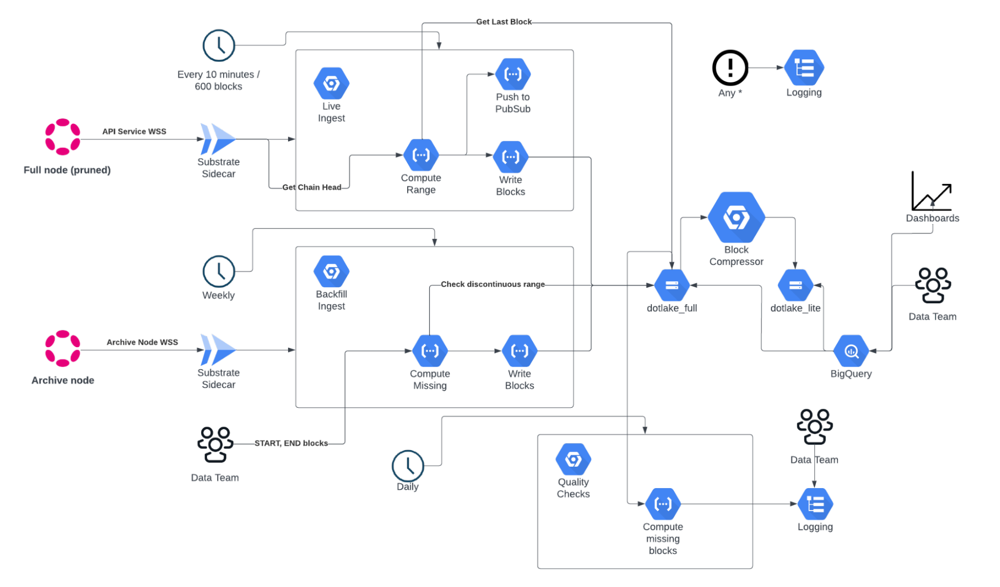
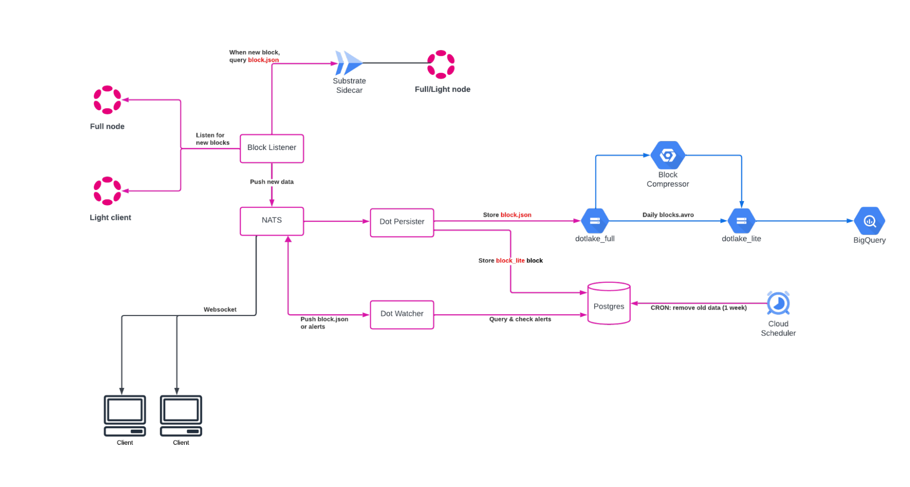

## Accessing Polkadot Ecosystem Dashboards

The Parity Data Team has made publicly available a [website](https://dashboards.data.paritytech.io/)
that displays a number of dashboards relating to Polkadot Ecosystem On-Chain data. The graphs
provided are grouped into the following sections:

- [Stablecoins](https://dashboards.data.paritytech.io/stablecoins.html) - metrics around stablecoins
  in Polkadot AssetHub.
- [Treasury](https://dashboards.data.paritytech.io/treasuries.html) - metrics around treasuries in
  the ecosystem.
- [Staking](https://dashboards.data.paritytech.io/staking.html) - metrics pertaining to staking,
  nomination pools and more.
- [Ecosystem](https://dashboards.data.paritytech.io/parachains.html) - high level activity metrics
  for relay chains and Parachains.
- [Monthly Report](https://dashboards.data.paritytech.io/eoyr.html) - an updated version of the
  [Polkadot in Numbers: Annual Report 2023](https://dashboards.data.paritytech.io/reports/2023/index.html).

## Notes on How to Use the Interactive Charts

The [Ecosystem Tab](https://dashboards.data.paritytech.io/parachains.html) shows a number of
universally applicable metrics (Active Accounts, Unique Accounts, Transactions, Events) across both
Polkadot & Kusama Relay/Parachains. Users can select whether they want to view:

- Polkadot or Kusama
- Daily or monthly figures
- Substrate Only, EVM Only or Substrate + EVM numbers.

The default view is set to Polkadot,Monthly, Substrate + EVM.

Here is an example of selecting Polkadot, Daily, Substrate Only for Transactions.

Users can also specify which chains they would like to view metrics for. The default view is set to
the entire Relay & Parachain grouping. Below is an example of selecting data for only Polkadot
Relay, Moonbeam and Nodle chains. Users can hit invert selection for convenience to de-select all
options before selecting their desired chains.

Also, for all graphs on the website, in the top right users can toggle between chart types: choosing
bar, line or stacked and a combination of those. See below for an example from the
[Stablecoins](https://dashboards.data.paritytech.io/stablecoins.html) tab.

## Where the Data Comes From

The data displayed on the website comes from DotLake, which is a scalable and cost-efficient data
platform built on Google Cloud Platform (GCP) by the Data Team at
[Parity Technologies](https://www.parity.io/). It's designed to store all blocks, events,
extrinsics, and more for all the chains in the Polkadot ecosystem. The platform uses a range of
existing technologies, keeping the architecture simple with low operational overhead. This includes
tools like Terraform, the Substrate Sidecar, Rust & Python programming languages, and various GCP
services like Cloud Storage, BigQuery, Cloud Run & Jobs, and Workflows & Functions.

The approach allows the processing of data from block number N to M, storing the raw results as JSON
in Google Cloud Storage. This method not only provides a convenient abstraction, but also avoids the
pitfalls of custom block parsing strategies in the ever-evolving Substrate Framework. The key to the
platform's efficiency is the Block Compressor, which optimizes and reduces the data size
significantly, making it more manageable for analytical purposes.

DotLake has evolved from it's origins as a data warehouse built to serve Parity's internal data
needs. Since then, the scope has been broadened to share data intitiatives and learnings with the
wider community. The plan is to progressively make datasets available to the public, alongside
dashboards, metrics, code, and best practices employed to ingest and decode Substrate data.

DotLake currently consists of 80+ Polkadot, Kusama, solo-chains and test-nets with their full
history and is continuously expanding.

**DotLake Batch Architecture**

**Real-Time Architecture**

## Support: Data Requests, Collaborations, Parachain Onboarding etc.

The Parity Data Team is very eager to collaborate with the Ecosystem. If you have any questions,
data requests that you need help with, interest in partnerships or you are a Parachain team and want
your chain onboarded to the platform - please get in contact with data-team@parity.io.
