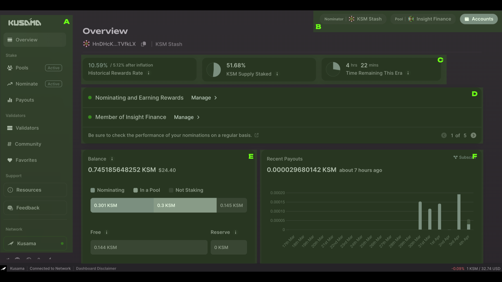
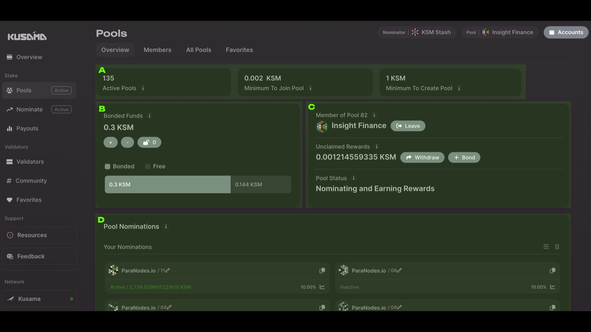
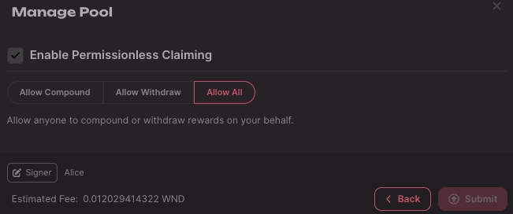
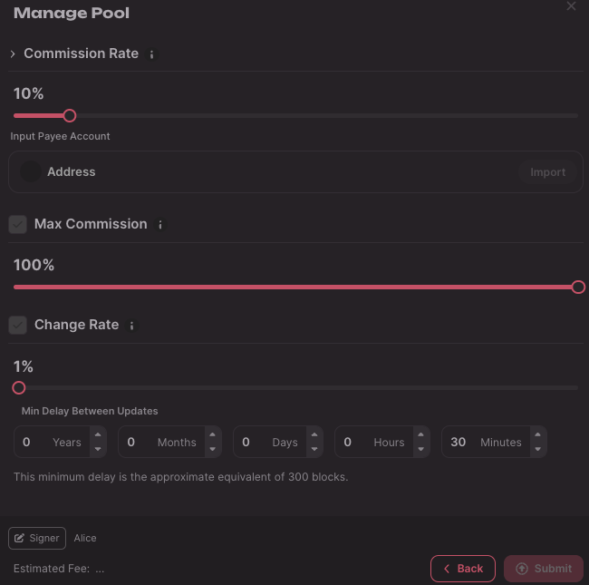
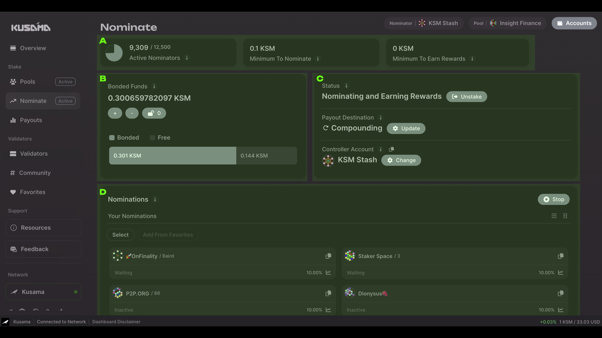
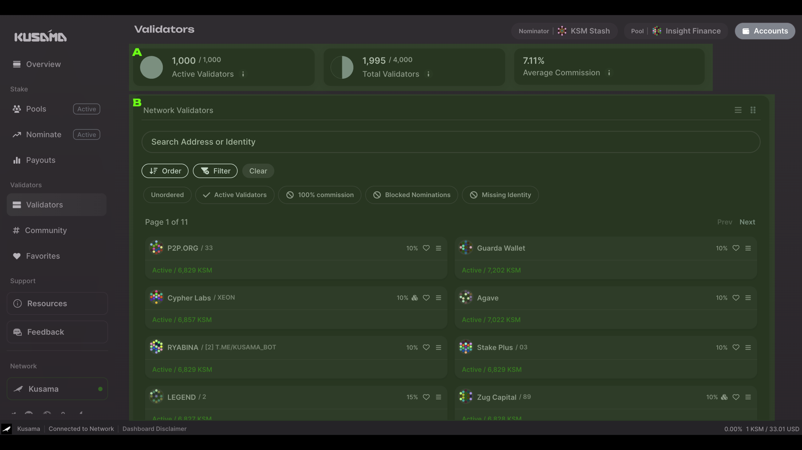

## Preliminary Notes

The [Polkadot Staking Dashboard](https://staking.polkadot.cloud/#/overview) supports
[**proxy accounts**](../../learn/learn-proxies.md) and you can import your
[staking proxy](../../learn/learn-staking-advanced.md#staking-proxies) (for nominators) or
[non-transfer proxy](../../learn/learn-proxies.md#proxy-types) (for nomination pool admins and members).

The dashboard also has **native [Ledger](../ledger.md) support**, meaning that you do not need an
extension or a wallet to use it; you just need your Ledger device.
[Metadata updates](../../learn/learn-guides-transfers.md#metadata-updates-with-the-polkadot-js-browser-extension)
are thus not necessary, as you only need to keep your Ledger apps up-to-date.

Before using the dashboard, make sure you have a
[wallet or extension](../wallets-and-extensions.md#browser-extensions) with a funded account. Note
that accounts on wallets or extensions can be imported from [Ledger](../ledger.md) or
[Polkadot Vault](../polkadot-vault.md).

On top of the [existential deposit](../../learn/learn-accounts.md#existential-deposit-and-reaping), you
need some free balance to pay for
[transaction fees](../../learn/learn-transactions.md#transaction-fees) and
[the minimum amount to place your nominations or join a nomination pool](../chain-state-values.md#minimum-bond-to-participate-in-staking).
For more information about staking visit the [staking page](../../learn/learn-staking.md) and the
[advanced staking page](../../learn/learn-staking-advanced.md).

## Using the Polkadot Staking Dashboard

The [Polkadot Staking Dashboard](https://staking.polkadot.cloud/#/overview) is a tool only dedicated
to [staking](../../learn/learn-staking.md) on Polkadot, [Kusama](../../learn/learn-comparisons-kusama.md)
(Polkadot's canary network) and [Westend](../../learn/learn-DOT.md#getting-tokens-on-the-westend-testnet) (Polkadot's test network).

The dashboard is not a wallet, meaning that you cannot transfer funds between accounts. To fund
accounts, you can use [wallets and extension](../wallets-and-extensions.md). You can participate in
staking by being a [nominator](../../learn/learn-nominator.md) or a member of a
[nomination pool](../../learn/learn-nomination-pools.md). Once you have a funded account, you need to
connect it to the dashboard (connect button on the top-right corner), this will allow you to interact with native staking.

!!!info "The dashboard is a Web3 dApp"
    The dashboard is a decentralized application (dApp), and to login you do not need to sign up with an
    email and password but just need an account created on the supported non-custodial wallets. Any
    transaction to be submitted needs to be signed by you. Also, if you use light clients, which are
    resistant to censorship, you interact trustlessly with the network without intermediaries. Welcome
    to the world of [true Web3](../web3-and-polkadot.md)!

Note the pictures on this page refer to Kusama, but the same applies to Polkadot and Westend.

The structure of this page follows the sidebar of the staking dashboard. Here you will learn about
the main features of the dashboard. If you need more information, see the
[Walkthrough Tutorial](https://youtu.be/hvXLc4H7rA4).

!!!info "Walk-through Video Tutorials"
    - [**Nominating**](https://youtu.be/F59N3YKYCRs): Stake your tokens, choose your best validators,
    and start your staking journey.
    - [**Becoming a Pool Member**](https://youtu.be/dDIG7QAApig): Start becoming a part of the Polkadot
    movement, keep the network secure by staking minimum 1 DOT and receiving staking rewards.
    - [**Dashboard Walkthrough**](https://youtu.be/hvXLc4H7rA4): Become a Pro using the Staking
    Dashboard.
    - [**After Staking**](https://youtu.be/58pIe8tt2o4): Nominating is not a set-and-forget action,
    learn what you can do with the dashboard after you started staking.

## Overview

!!!info "Staking Dashboard Walk-through video tutorial"
    [This video tutorial](https://youtu.be/hvXLc4H7rA4) shows you everything you can do with the Staking
    Dashboard.

This page of the dashboard has six main panels:

- **Section A: The Sidebar** shows which page you are on (in this case, the Overview). It will also
  show the role you currently have in staking (in this case, active in both [Pools](#pools) and
  [Nominate](#nominate)). You can also change the [network](#network) (currently on Kusama).

- **Section B: The Accounts Panel** allows you to connect one account to the dashboard. Once
  connected, the account will appear next to the `Accounts` button. You can see it here if you are
  active as a nominator and/or a pool member. In this case, the account KSM Stash is a nominator and
  a member of the pool Insight Finance. Proxy accounts are also shown here if applicable. Note that
  the dashboard will automatically fetch the stash and the proxy.

Note that Sections A and B will always be visible while you use the dashboard.

- **Section C: The Stats Panel** shows the general view of current staking metrics, including the historical reward rate (including after
  [inflation](../../learn/learn-inflation.md)), the supply staked and time remaining
  in the current era.

- **Section D: The Summary Panel** shows your current situation and gives you general tips about
  staking. In this case, the KSM Stash account is a nominator and a pool member, and by clicking on
  `Manage >` you can go directly to the [Nominate](#nominate) and [Pools](#pools) pages,
  respectively. You can take actions such as changing staking preferences, bonding more funds, etc.

- **Section E: The Balance Panel** shows the bonded amount distinguishing between "Nominating", "In
  a Pool", and "Not Staking". The amount that is not staking is further divided into "Free" (a
  balance that can be transferred) and "Reserve" (a balance that is needed the keep the account
  on-chain, see [existential deposit](../../learn/learn-accounts.md#existential-deposit-and-reaping)).
  In this case, 0.301 KSM are bonded for nominating, 0.3 KSM are bonded in a pool, and 0.145 KSM are
  not used for staking. Of the non-staking balance, 0.144 KSM are free while
  [a small portion is reserved for the existential deposit](../chain-state-values.md#existential-deposit).

- **Section F: The Recent Payouts Panel** shows a bar chart with the rewards paid out to you in the
  past 15 days either as a nominator or a pool member (manually claimed). Note how the 4th of April
  bar has the tip that is not filled with color. This is to show a pending payout (for nominators
  only). Below the bar chart is a line chart showing the 10-day moving average.

Additional statistics can be found at the bottom of the overview page.

!!!info "Pool funds are in system accounts"
    Remember that funds bonded in a pool are transferred to the pool's system account, which can only be
    accessed by the protocol, and not by any individual user. Some wallets might not display the balance
    bonded in pools, but the dashboard will always show it.

## Stake

In this category, you can access all functionalities allowing you to stake your tokens as a
nominator, member of a nomination pool, or both. The payout section will enable you to inspect the
most recently received rewards.

### Pools

!!!info "Joining a Nomination Pool - Walk-through video tutorial"
    [This video tutorial](https://youtu.be/dDIG7QAApig) shows you how to join a [nomination pool](../../learn/learn-nomination-pools.md) with the Staking Dashboard. You can also read the [dedicated support article](https://support.polkadot.network/support/solutions/articles/65000182376-staking-dashboard-how-to-join-a-nomination-pool) about joining a pool.

This page of the dashboard has four main panels (Sidebar and Accounts Panels excluded):

- **Section A: The Stats Panel** shows the number of active pools and the minimum number of tokens
  needed to join a pool and/or create one.
- **Section B: The Balance Panel** shows the number of tokens bonded in pools and those that are
  free. In this case, we have 0.3 KSM bonded and 0.144 KSM free. In this panel, you can bond more
  funds (`+` button) or unbond some funds (`-` button). Unbonding will withdraw unclaimed rewards
  and funds will be locked for the [unbonding period](../chain-state-values.md#unbonding-duration).
  Once the unbonding period has passed, you can unlock the locked funds (button with a lock icon)
  that will be available as a free balance.

!!!info "No fast unstake and pool swap for pool members"
    Note that the option to fast unstake is only available to nominators. Also, to change pool, you
    cannot simply swap memberships. You will need to unbond and go through the whole unbonding period.

- **Section C: The Pool Panel** shows the pool id where you have membership (in this case, Pool 82),
  the pool name, and next to it, a `Manage` button that will allow to choose between different
  options:

    - Update Claim Permissions: you can allow other pool members to compound your rewards, withdraw your rewards as a free balance, or both. More details about nomination pools and updating claim permissions can be found on the [dedicated wiki page](../../learn/learn-nomination-pools.md#claim-permissions).

    

    !!!info
        For more information about how-to update your claim permissions with the staking dashboard see [this support article](https://support.polkadot.network/support/solutions/articles/65000182399-staking-dashboard-how-to-claim-nomination-pool-rewards#Permissionless-claiming).

    - Leave the pool and unbond all the funds in the pool.

    If you are a pool admin you will be able to see the additional options:

    - Claim Commission: you can claim pool commissions to an account specified under Manage Commission
    (below).
    - Manage Commission: you can manage the pool commission rate, maximum commission, maximum change
    rate, and minimum time delay between commission updates. More details about nomination pools and
    managing pool commissions can be found on the
    [dedicated wiki page](../../learn/learn-nomination-pools.md#pool-commissions).

    

    !!!info
        For more information about how-to manage commission of your nomination pool with the staking dashboard see [this support article](https://support.polkadot.network/support/solutions/articles/65000182388-staking-dashboard-how-to-create-a-nomination-pool#Pool-management-options).

    - Rename Pool: you can change the pool's name.
    - Lock Pool: you can lock the pool so that new members are not allowed.
    - Destroy Pool: you can destroy the pool. See
    [this wiki page](../../learn/learn-guides-staking-pools.md#pool-destruction-with-polkadot-js) and
    [this support article](https://support.polkadot.network/support/solutions/articles/65000182388-staking-dashboard-how-to-create-a-nomination-pool#How-to-destroy-a-pool) for more information.

    You can see any unclaimed rewards in the middle of the panel. You can claim and bond the rewards (`+ Compound` button) or withdraw them as a free balance (`Withdraw` button). In this case, there are approximately 0.0012 KSM that can be claimed. You can see the Pool Status at the bottom of the panel, currently set to "Nominating and Earning Rewards".

    Note that if it is the first time you log in to the dashboard, you will see two buttons `Create` and `Join`, instead of `Manage`. For more information about how to create a nomination pool, see [this support article](https://support.polkadot.network/support/solutions/articles/65000182388-staking-dashboard-how-to-create-a-nomination-pool#How-to-create-a-pool).

- **Section D: The Pool Nominations Panel** shows the nominations of the pool you are currently in,
  highlighting the validator that is active and will pay rewards to the pool at the end of the era
  (in this case `ParaNodes.io/11`).

If you scroll down the page, there are two additional panels:

- **Roles** showing the accounts of the pool's Depositor, Root, Nominator, and Bouncer. The same
  account can cover all the roles.
- **Pool Stats** showing the Pool State (either Active, Closed, or Destroying), Pool Members (number
  of members in the pool), and Total Bonded (total number of bonded tokens).

The Pools page is divided into four parts: the Overview is basically what we talked about until now,
the Members section will show all accounts of the pool members, the All Pools section will show all
pools (you can filter Active, Locked, and Destroying pools), and the Favorites section shows all
pools that you liked (you can like a pool in the All Pools section by clicking on the heart icons).

### Nominate

!!!info "Walk-through video tutorial of How to Nominate"
    [This video tutorial](https://youtu.be/F59N3YKYCRs) shows you how to become a nominator with the
    Staking Dashboard.

This page of the dashboard has four main panels (Sidebar and Accounts Panels excluded):

- **Section A: The Stats Panel** shows the number of active nominators,
  [the minimum number of tokens to nominate](../chain-state-values.md#minimum-bond-to-participate-in-staking)
  and [the minimum active bond](../chain-state-values.md#minimum-active-bond). The system keeps 12500
  nomination intents and puts them into the
  [bags list](../../learn/learn-staking-advanced.md#bags-list). The fact that active nominators are not
  12500 is because there are nominators that have no active validator.
- **Section B: The Balance Panel** shows the number of tokens bonded in nominations and those that
  are free. In this case, we have 0.301 KSM bonded and 0.144 KSM free. In this panel, you can bond
  more funds (`+` button) or unbond some funds (`-` button). Unbonding will withdraw unclaimed
  rewards and funds will be locked for the
  [unbonding period](../chain-state-values.md#unbonding-duration). Once the unbonding period has
  passed, you can unlock the locked funds (button with a lock icon) that will be available as a free
  balance.

!!!info "Fast unstake"
    If your account did not receive rewards in the past 28 eras, you will be eligible for fast unstake. The dashboard will automatically check this for you and prompt a banner.

- **Section C: The Nominator Panel** shows the current status of the nominator, currently set to
  "Nominating and Earning Rewards", and next to it, the `Unstake` button allows you to unstake the
  whole bonded amount and stop nominating. In the middle of the panel, the payout destination is
  currently set to "Compounding" (i.e. rewards are added to the bonded funds). The `Update` button
  will allow you to change the destination to "To Your Account" (to the stash account as a free
  balance), "To Another Account" (an account that is not the stash), or "None" (no payout
  destination).
- **Section D: The Nominations panel** shows your nominations and allows you to stop all nomination
  with the `Stop` button or to select specific validators (`Select` button) and stop nominating only
  those.

### Payouts

This page is an expanded version of Panel F on the [Overview](#overview) page. It also shows all
validators and/or nomination pools that paid out rewards to your accounts in the past few months.

### After Staking

!!!info "Walk-through video tutorial - What to do after Staking"
    [This video tutorial](https://youtu.be/F59N3YKYCRs) shows you how to what you can do after staking
    with the Staking Dashboard.

## Validators

This page of the dashboard has two main panels (Sidebar and Accounts Panels excluded):

- **Panel A: The Stats Panel** shows the total number of active validators, all validators currently
  registered (active and inactive), and average commission across all validators.
- **Panel B: The Validators Panel** shows all validators. You can order them by low/high commission
  or apply the following filters:
  - Include only active validators
  - Exclude validators that have 100% commission, blocked nominations, and have missing identity.

## Support

Support for the Staking Dashboard is available at
[the official Polkadot support website](https://support.polkadot.network/support/home).

## Network

Under Network, you can connect to either Polkadot, Kusama, or Westend through public RPC nodes or
light clients for a true Web3 experience. For more information about light clients, see [this page](../web3-and-polkadot.md#decentralized-access-points).
