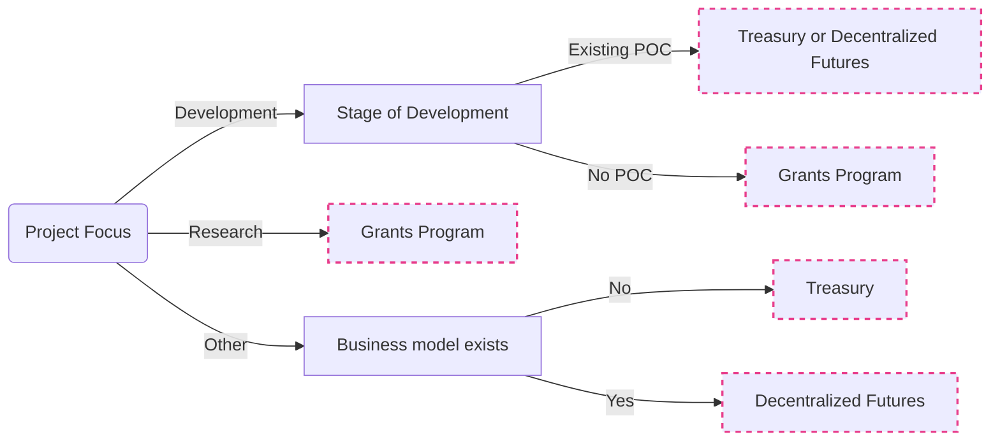

import DocCardList from '@theme/DocCardList';

:::tip

Check out the [programs](programs-index) for all kinds of ecosystem support opportunities.

:::

<DocCardList />

If you are certain you want to apply for a W3F grant, head straight to our
[application process documentation](https://grants.web3.foundation/docs/Process/how-to-apply).
Alternatively, the flowchart below outlines where we think the grants program fits in relation to
other popular funding opportunities.

## Funding Opportunities Overview

For a longer list and a description of the programs listed below, check out
[our page on alternative funding opportunities](./grants.md#alternative-funding-sources).

## Funding FAQ
