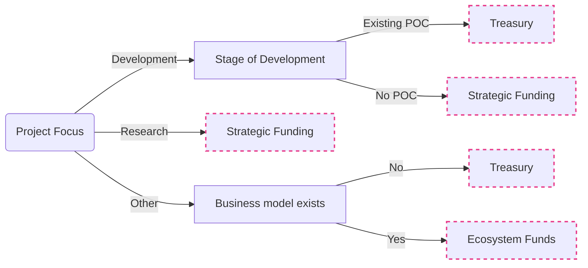

If you are sure you want to apply for strategic funding, head straight to the
[Web3 Foundation funding support page](https://web3.foundation/funding-support/). Before applying for strategic funding, please read [these guidelines](https://medium.com/web3foundation/new-w3f-grant-guidelines-b2c921a84850).
Alternatively, the flowchart below outlines where we think the strategic funding fits in relation to
other popular funding opportunities.

## Funding Opportunities Overview

