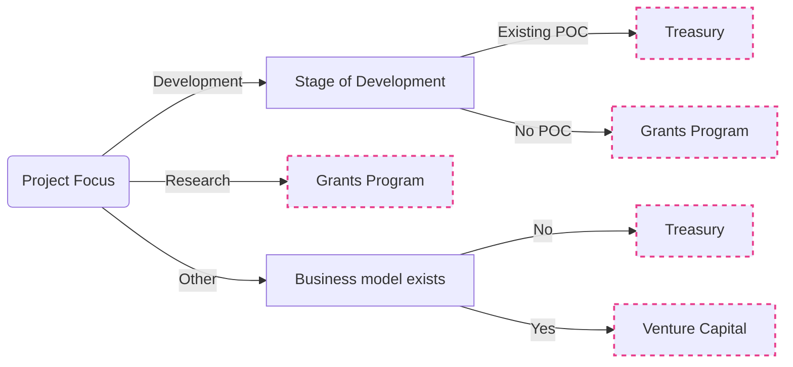

import DocCardList from '@theme/DocCardList'; import MessageBox from "../../components/MessageBox";
import "../../components/MessageBox.css";

<MessageBox message="For fundraising in a decentralized, transparent, and regulatory compliant manner within the ecosystem, check out the [Polimec parachain](https://www.polimec.org/)." />

:::tip

Check out the [programs](programs-index) for numerous ecosystem support opportunities.

:::

<DocCardList />

If you are certain you want to apply for a W3F grant, head straight to the
[application process documentation](https://grants.web3.foundation/docs/Process/how-to-apply).
Alternatively, the flowchart below outlines where we think the grants program fits in relation to
other popular funding opportunities. For a longer list and a description of the programs listed
below, check out
[the page on alternative funding opportunities](./grants.md#alternative-funding-sources).

## Funding Opportunities Overview

## Funding FAQ

1. _Will the grant be awarded to those delivering a complete product that everyone in the ecosystem
   can use?_

The grant does not necessarily require a finished product. It can be awarded at various stages of a
project’s development. The goal is to support ongoing progress, so even partial advancements are
eligible.

2. _After receiving a grant, can a team request funds from the treasury to continue development, or
   will they be advised to opt for other existing funding options, like
   [Polimec](https://www.polimec.org/)? Is that possible?_

Teams can indeed request additional funds from the treasury after the initial grant. The grant is a
great way to demonstrate capability and commitment to the community. Continued support would depend
on community approval, but proving the project’s value through initial funding can help.

3. _Since the grant will be awarded in stablecoin, why isn’t the bounty requested in stablecoin?_

Grants are not awarded in stablecoin. Grant applications are denominated in USD but will be
converted to DOT at the time of payment. Currently, it’s not feasible to fund bounties directly with
stablecoins. However, as this is programmable, we might explore potentially managing multiple assets
through an AH address controlled by curators in the future, similar to the classic setup on the
relay chain.

4. _Will there be publicity for the bounty? That is, will social media be created where potential
   candidates can learn about the requirements, steps to participate, and so on?_

All grant-related information will be available on GitHub for easy access. However, we do not plan a
dedicated social media presence. Instead, we’ll advertise the bounty individually and rely on word
of mouth.
