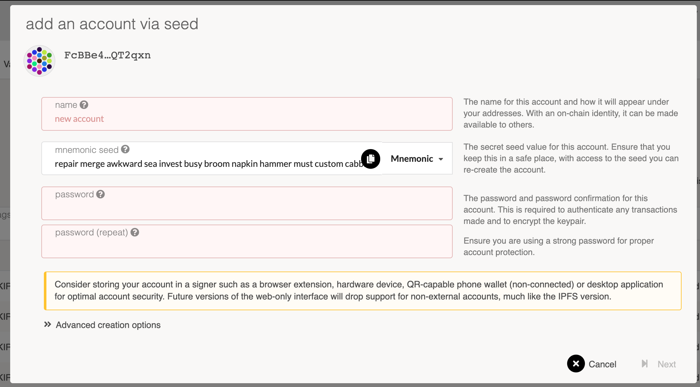
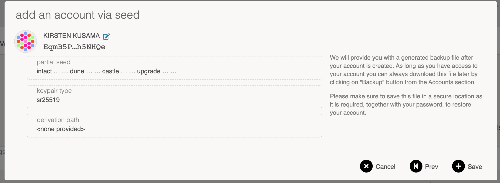

The Kusama network is Polkadot's experimental, community-focused R&D network. If you held the DOT
indicator token at the time of the genesis block of Kusama, you are entitled to claim an equivalent
amount of KSM on the Kusama network.

You can claim KSM by signing a message with the Ethereum account that holds your DOT indicator
tokens. There is no deadline for claiming KSM.

## Step 1. Create a Kusama account

You will need to generate a Kusama account to claim KSM. There are a few ways you can create one.

For most users, we recommend using the
[Polkadot{.js} browser extension](https://chrome.google.com/webstore/detail/polkadot%7Bjs%7D-extension/mopnmbcafieddcagagdcbnhejhlodfdd?hl=en)
since it will allow you to store your encrypted keystore locally.

In terms of hardware wallet support, you can use the [Kusama Ledger application](kusama-ledger.md),
or [Parity Signer](../../learn/learn-account-generation.md#parity-signer).

Another option you may consider using is the
[Subkey](https://docs.substrate.io/reference/command-line-tools/subkey/) command-line utility, which
will allow you to take extra steps to protect the security of your key.

There are a variety of other wallets that you can use; see the
[Polkadot Wiki Wallets page](../../build/build-wallets.md) for more details. Many of these wallets
support generating Kusama accounts as well.

### Using Kusama Ledger application

Please follow the instructions for [installing the Kusama Ledger application](kusama-ledger.md) and
then proceed to step 2 below.

### Using Polkadot{.js} extension (Chrome/Brave or Firefox)

1. Install the Polkadot{.js} extension from the
   [Chrome store](https://chrome.google.com/webstore/detail/polkadot%7Bjs%7D-extension/mopnmbcafieddcagagdcbnhejhlodfdd?hl=en)
   or [Firefox store](https://addons.mozilla.org/en-US/firefox/addon/polkadot-js-extension/).
2. Click on the settings button to change the network to "Kusama (canary)". 
3. Create a new account by clicking on "Create new account (root or derived)". 
4. Uncheck the option to create an account dervied from another seed. 
5. Copy the seed phrase and store it somewhere safe. Don't share the seed phrase with anyone, you
   can use it to access your account if you forget your password or want to import your account
   again. 
6. Enter a name for the account and type a strong password (at least 6 characters). 
7. Click on "Add the account with the generated seed".
8. You can copy the account's address to the clipboard by clicking on its identicon.

### Using Subkey

#### Installation

You can install Subkey with this one-line command:

```
cargo install --force --git https://github.com/paritytech/substrate subkey
```

Note that you will already have had to install the correct Rust version and dependencies. If you
have not done so, or experience problems installing using that command, run the following commands
first, and then re-try the previous command:

```
curl https://sh.rustup.rs -sSf | sh

rustup update nightly
rustup target add wasm32-unknown-unknown --toolchain nightly
rustup update stable
cargo install --git https://github.com/alexcrichton/wasm-gc
```

Alternatively, you can build Subkey from the source code.

1. Follow the build instructions for [Substrate](https://docs.substrate.io/quick-start/).
2. When building, only build Subkey by typing `cargo build -p subkey`.
3. The executable is `./target/debug/subkey`.

#### Usage

You can use Subkey on a computer that is not connected to the internet for added security.

The command `subkey --network kusama generate` will generate a new key pair. If you want to be more
secure, use 24 words, `subkey --network kusama generate --words 24`.

```
$ subkey --network kusama generate
Secret phrase `lobster flock few equip connect boost excuse glass machine find wonder tattoo` is account:
  Secret seed: 0x95b90eb1344e3aea40f4a6dc81622901a2ac39efb331c41db10c311bb9b46927
  Public key (hex): 0xfe7fce341ff73e1db537daa4cc8c539997a8b0654b06cb81c47e4f067f55a65a
  Address (SS58): JL1eTcbzuZP99FjeySkDrMygNREPdbhRyV7iD5AsV4fDRcg
```

The `Address (SS58)` field is what you should use to claim your KSM tokens. Never share your
`Secret phrase` or `Secret seed`, as these can both control your funds.

NOTE: Previous versions of Subkey only generated Substrate addresses. If you do not want to generate
a new seed, you can convert the Substrate address to a Kusama address by following
[this section](#kusama-from-substrate-address).

See the [Subkey documentation](https://docs.substrate.io/reference/command-line-tools/subkey/) or
enter `subkey --help` for more usage examples.

### Using Polkadot-JS UI

1. Open up the [Polkadot-JS UI](https://polkadot.js.org/apps) and navigate to the top left corner of
   the navigation. This will open up a panel of network options to select from. Select on "Kusama",
   either from Parity or Web3 Foundation, then "Switch".

2. Navigate to the [Polkadot-JS UI Accounts Tab](https://polkadot.js.org/apps/#/accounts) and click
   on the "Add account" button.


3. Enter a name for your account and create a secure password. This password will be used to decrypt
   your account. The required text fields to complete are highlighted in pink.



4. Ignore the advanced options unless you want to change the type of cryptography used for your keys
   (we recommend "Schnorrkel (sr25519)"). You will have to enter an Account Name and a password to
   protect your account. Be sure to select a secure and hard-to-guess password. Note that anything
   will be accepted as a password here. Please note: There are no checks to see if it is long enough
   or secure. You will need this password for any future interaction with or transaction from this
   account.

5. Click "Save" and "Create and backup account".



6. Save your encrypted keystore locally. Ideally, you would also save it on an external hard drive
   or thumb drive or print it out and be able to re-enter it later. You should not store it in cloud
   storage, email it to yourself, etc. You can use this backup file to restore your account. The
   seed in the backup file is not readable unless it is decrypted with the password.

7. The account now appears in your Accounts tab and is backed up to the keystore you just saved.

8. Click on the **DOT identicon** to copy the address to the clipboard.
   

### Using Polkawallet

1. Install [Polkawallet](https://polkawallet.io). Click "Download" and select the link corresponding
   to the platform you are using. On Android, you may need to allow installing apps from external
   sources. On iOS, you may need to "trust" Polkawallet in the "General > Profiles & Device
   Management > Enterprise App" section before running the app.

2. Once the app is open, copy the seed phrase and store it in a safe place. Don't share the seed
   phrase with anyone, you can use it to access your account if you forget your password or
   otherwise lose your keystore.


3. Name your account and make a strong password, make sure to write it down in another place, then
   click "Save".

4. You will be asked to confirm your seed phrase - this is to make sure you have copied it somewhere
   safe.

5. Click on the pink QR Code symbol and select "Copy address" to copy your address to the clipboard.


6. [Get the Kusama address from the Substrate address.](#kusama-from-substrate-address)

### Kusama from Substrate address

If you used one of the generation methods that gave you a generic Substrate address (begins with a
`5`), then you will need to take an extra step to turn this into the properly encoded Kusama
address.

1. Copy your Substrate generic address to the clipboard.
2. Go to the [Polkadot-JS UI](https://polkadot.js.org/apps).
3. Go to the "Settings" tab and find the "address network prefix" configuration.
4. Select "Substrate (development)" and click "Save and reload".
5. Go to the "Address book" and click the "Add contact" button.
6. Enter your address and give it a name like "My Address".
7. Go back to the "Settings" tab and select the "Kusama (canary)" option in "address network prefix"
   and click "Save and reload".
8. Go back to the "Address book" and find the account you just added (it will have the same name).
9. The address is now formatted as a Kusama address.

## Step 2. Get KSM tokens

There are two methods to claim KSM.

### DOT Holders

Those who participated in the Polkadot sales before 2020 and have been allocated DOT indicator
tokens on Ethereum can claim a proportional amount of KSM on the Kusama network.

To do this, you must sign a message containing the address of your Kusama account. You can do this
by using the Polkadot-JS UI
[Claims app](https://polkadot.js.org/apps/?rpc=wss%3A%2F%2Fkusama-rpc.polkadot.io#/claims). Ensure
that you are connected to the Kusama network (displayed in the upper-left hand corner of the
screen). If you are not, change the network to Kusama by clicking in the network change tab in the
upper-left-hand corner..

#### Generate a Kusama address

If you haven't already done so, you will need to generate a Kusama address. See
[step 1 above](kusama-claims#step-1-create-a-kusama-account) for detailed instructions first.

#### Claiming your KSM with MyCrypto

The Polkadot-JS [Claims app](https://polkadot.js.org/apps/#/claims) helps you sign a message from
MyCrypto. MyCrypto is good to use in case you have stored the key to the Ethereum account holding
your DOT indicator tokens on a hardware device like a Ledger Nano S or a Trezor. It also supports
raw private keys, mnemonics, and the Parity signer.

:::tip Downloading MyCrypto

It is much more secure to download and use the MyCrypto app locally. Please make sure to download
the latest version for your operating system. You can always find the most up-to-date releases of
the desktop app on their [releases page](https://github.com/MyCryptoHQ/MyCrypto/releases).

:::

Once you've downloaded MyCrypto and have it running locally (we recommend an air-gapped computer for
maximum security), you can start by navigating to the Claims app on the Polkadot-JS UI. Select the
account you would like to claim the KSM into and click the blue "Continue" button to proceed. Your
screen should look something like this:


The hex-encoded string that follows the sentence: "Pay KSM to the Kusama account:" is the
hex-encoded public key of your Kusama account, minus the `0x` prefix. To verify that the public key
is correct, you can use the Subkey tool to inspect your address.

The next step is to go to the MyCrypto application and click on "Sign & Verify Message" tab. This
will prompt you to select a method for unlocking your wallet. After unlocking your wallet, you will
copy and paste the outputted sentence into the input box.


When you click "Sign Message" you will get a JSON output like the below:


Copy and paste the JSON output of the signed message from MyCrypto into the input box on the
Polkadot-JS UI and click "Confirm Claim."


At this point, you will see a success message if everything went right and your KSM will now be in
the account that you claimed to. Congratulations you can now participate in aspects of the Kusama
network such as [governance](../../learn/learn-governance.md) and
[staking](../../learn/learn-staking.md). During the soft launch period balance transfers will not be
enabled.

]

#### Verifying your Claim

After you make an on-chain claim for KSM, your balance should be updated on Polkadot-JS Apps
immediately.

Are you having trouble? Get in touch on the
[Polkadot Support page](https://support.polkadot.network).

### Third Party Claims Processes

**We do not recommend using a third-party app or process to perform your claim or acquire KSM.**

Claiming using a third-party process can lead to the loss of your allocation; therefore, we cannot
recommend using any third-party apps to do so. Manually specifying your transaction data, as
specified in our claims process, is the only way to be certain you will receive your allocation.
