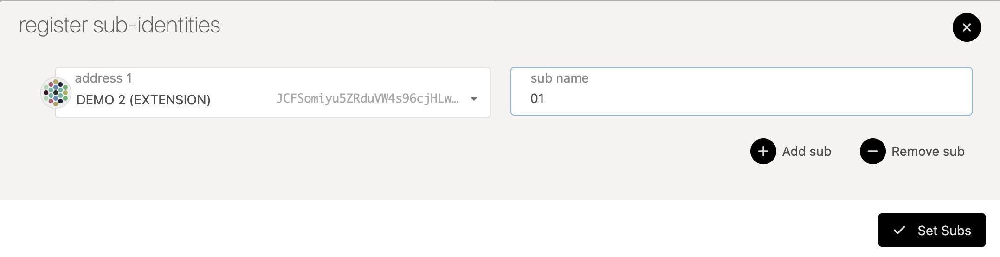

:::info

Because of required WebUSB support, Ledger wallets currently only work on
Chromium-based browsers like Brave and Chrome.

:::

Kusama has a [Ledger][] application that is compatible with the Ledger Nano S and Ledger Nano X
devices. The Ledger devices are hardware wallets that keep your private key secured on a physical
device that does not get directly exposed to your computer or the internet.

The Kusama application allows you to manage Kusama's native asset, KSM. It supports
most of the transaction types of the network ,including batch transactions from the Utility pallet.

If you have trouble using Ledger or following the directions below, you can try searching for your
issue on the [Polkadot Knowledge Base](https://support.polkadot.network/).

:::note Intro to Ledger Explainer

Please check out our
[intro to Ledger video on YouTube for more information](https://youtu.be/7VlTncHCGPc).
 
:::

## Requirements

Here is a list of what you will need before starting:

- A Ledger Nano S or a Ledger Nano X.
- The latest firmware installed.
- Ledger Live is installed and at version 2.19 or newer (see settings -> about to find out if you're
  up to date).
- A web browser is installed that you can use to access [Polkadot-JS Apps UI][apps].

## Installing the Ledger Application

### Using Ledger Live

- Open the "Manager" tab in Ledger Live.
- Connect and unlock your Ledger device.
- If asked, allow the manager on your device by pressing both buttons on the YES screen.
- Find Kusama in the app catalog and install it.
  

Please proceed to the [usage instructions](#using-on-polkadot-js-apps) below.

### Using the Developer Release

:::tip 

These instructions are for development installation only. It is recommended to install the
application from Ledger Live unless you *know exactly what you're doing*.

:::

Instructions for downloading the pre-release binary from the GitHub releases is written [on the
README][prerelease instructions] for the Kusama Ledger application GitHub repository.

On the [releases page][] you can download the shell script `install_app.sh` and then make it
executable in your shell by typing the command `chmod +x install_app.sh`.

Using `install_app.sh` help command will show you the available options:

```zsh
$ ./install_app.sh --help
Zondax Installer [Kusama-1.2011.1] [Warning: use only for test/demo apps]
  load    - Load Kusama app
  delete  - Delete Kusama app
  version - Show Kusama app version
```

Next, you must make sure your Ledger device is plugged in and unlocked and you're using the latest
firmware. If everything is prepared, then type `./install_app.sh load` and accept the prompts on
your Ledger device to install the application.

First it will prompt you to allow an unsafe manager - confirm this by switching the screen to the
allow screen and pressing the corresponding buttons.

After some processing time, the screen of your device will update to say "Install app Kusama".
Navigate all the way to the right, verify the Identifier hash matches the one that is printed in
your terminal. Click both buttons on "Perform Installation" to install the application. It will ask
again for your Pin code and you should enter it in the device.

At the end of the process you should have the newly installed Kusama application on the device.

## Using on Polkadot-JS Apps UI

### Loading Your Account

You can import your Ledger account to [Polkadot Extension](https://polkadot.js.org/extension/) or to the Polkadot JS UI. For instructions
on how to import Ledger accounts to Polkadot JS extension in written format, read through this [article](https://support.polkadot.network/support/solutions/articles/65000175387-how-to-add-your-ledger-through-the-polkadot-extension).
For importing your account to the UI, read through the instructions below.

[Polkadot-JS Apps UI][apps] already has an integration with the Ledger application so that your
device will work with the browser interface after installation. The functionality is currently gated
behind a feature setting that you will need to turn on.

In order to turn on the interoperability with the Kusama Ledger application, go to the "Settings"
tab in [Polkadot-JS Apps UI][apps]. Find the option for attaching Ledger devices and switch the
option from the default "Do not attach Ledger devices" to "Attach Ledger via WebUSB".


Click "Save" to keep your settings.

Now when you go to the "Accounts" tab you will see a new button that says "Add Ledger". Ensure that
your Ledger device is unlocked and you have navigated into the Kusama application, then click this
button.


A popup will appear asking you to select an account and derivation path.


The first option lets you select an account. You can have multiple accounts on a single Ledger
device. The second dropdown lets you pick a derivation path - think of it like a formula from which
child accounts are generated. If in doubt, pick the first option for both.

Once you confirm your selection, depending on your browser and its security settings, you might need
to confirm the USB connection through a popup like the one below when adding the Ledger device for
the first time:


You should now be able to scroll down and find a new account on the page with the type "ledger".


You can now use this account to interact with Kusama on [Polkadot-JS Apps UI][apps] and it will
prompt your ledger for confirmation when you initiate a transaction.

### Confirming the Address on your Device

On the "Accounts" tab, find your Ledger-connected account. Click on the three vertical dots at the
end of the row. This will open a new menu, here you can click the "Show address on hardware device"
option to display the address on your device.


Here you can scroll through and make sure the address matches to what is displayed on [Polkadot-JS
Apps UI][apps].

### Checking the Balance of Your Account

There are a few methods to check the balance of your account. You can use Polkadot-JS Apps or you
can use a block explorer like [Polkascan][] or [Subscan][].

#### Using Polkadot-JS Apps

Once you have your account loaded on the "Accounts" tab it should show a row with your Ledger
account. At the far right of the row is located your account's DOT balance. If you expand the
balance arrow, it will show details of your balance such as locks or reserved amounts.


### Sending a Transfer

If you would like to send a transfer from your account housed on the Ledger device, the easiest
method is to use [Polkadot-JS Apps UI][apps].

- Click on the "Transfer" button in "Accounts" dropdown in the top navigation menu.
- In the top input, select "Ledger" as your sending account.
- In the second input, select the account that you want to transfer funds to.
- In the third input, enter the amount of KSM you want to transfer.
- Click the "Make Transfer" button.
- Confirm the transaction on your device.
- A green success notification will be displayed when the transaction is included in a block.

:::note The "Transfer with Keep-Alive Checks" toggle

While this toggle is in the *On* state, your
account will be unable to make transactions which would get its balance below the existential
deposit. This prevents reaping of accounts with low balances. If you toggle this to *Off*, you
will be able to go below existential deposit balance, causing your account to be deleted and any
dust amount of KSM to be burned. If you encounter KeepAlive errors when making transactions, this
might be the reason.

A detailed guide on doing transfers is available [here](../../learn/learn-balance-transfers.md).

:::

### Receiving a Transfer

In order to receive a transfer on the accounts stored on your Ledger device, you will need to
provide the sender (i.e. the payer) with your address.

The easiest way to get your address is to click on the account name which will open a sidebar. Your
address will be shown in this sidebar, along with some other information. Another method is just
clicking on your account's avatar icon - this immediately copies your address to the clipboard.

:::caution Before giving anyone your address

Make sure it matches what's really on the Ledger
by [confirming the address on your device](#confirming-the-address-on-your-device). Some malware
will intercept clicks and clipboard requests and can change your copied value in-flight, so being
extra vigilant around copy-paste operations makes sense.

:::

### Staking

You can enable staking by issuing a batch transaction that will include
the required extrinsics.

You can also issue two separate transactions when you want to stake using an account stored on a
Ledger device, as follows:

- Go to the "Staking" tab found under the "Network" dropdown in the top navigation menu.
- Click the "Account Actions" pane in the inner navigation.
- Click "+ Stash" instead of "+ Nominator" or "+ Validator" (selecting the latter two will not
  work).
- Input the amount of tokens to bond and confirm the transaction.
- Confirm the transaction on the Ledger device.
- When the transaction is included you will see the newly bonded account in the "Account Actions"
  page.
- Select "Start Nominating" or "Start Validating" to start nominating or validating.
- Confirm the transaction on Apps and on the Ledger device.

### Removing Expired Democracy Locks

You can remove expired democracy locks by issuing a batch transaction that will include
the required extrinsics.

You can also manually issue several extrinsics when you want remove expired democracy locks on an
account stored on a Ledger device, as follows:

- Go to https://polkadot.js.org/apps/#/accounts. Look at your expired locks and note which referenda
  they were for.
- Go to https://polkadot.js.org/apps/#/extrinsics
- For each referendum with an expired lock, issue a `democracy.removeVote(X)` extrinsic, where X =
  the referendum you voted on and has an expired lock. Make sure you do it from the account with the
  expired locks - you can't do it from another account.
- Once you have removed all of the votes, issue a `democracy.unlock(ACCOUNT)` extrinsic, where
  ACCOUNT is the account you just removed the votes from.
- Go back to https://polkadot.js.org/apps/#/accounts. You'll see that the locks are now removed.

:::info

Despite the Polkadot ledger application being compatible with both the Ledger Nano S and
the Ledger Nano X, none of the [Democracy](../../maintain/maintain-guides-democracy.md) extrinsics are
available in the light version. The following [repo by Zondax][] lists the currently supported Democracy extrinsics on the full ledger.

:::

### Setting Sub-Identity (Sub-ID) for your Ledger Account

Setting an Identity is not possible on Ledger app yet, but as a workaround, you can 
[set the identity for an on-chain account ](../../learn/learn-identity.md#setting-an-identity) and then use 
it to set a sub-identity to your Ledger account.

- Go to https://polkadot.js.org/apps/#/accounts. Click on the three vertical dots correponding to the account
to which you already set identity. You should see an option to set onchain sub-identities. Click on it.

  
- In the pop-up window, select your Ledger account from the dropdown and enter text in sub name field. Then,
click on set subs button.
  
- Sign and submit the transaction from the parent account with the identity

You should now see the sub-identity displayed on-chain. You need to aware that {{ identity_reserve_funds }} KSM is reserved for setting 
identity and {{ identity_sub_reserve_funds }} KSM for each sub-identity. This reserved account balance is freed once you 
[clear the identities](../../learn/learn-identity.md#clearing-and-killing-an-identity) on the account.


## Support

If you need support, please visit the
[Polkadot Support page](https://support.polkadot.network).

[ledger]: https://www.ledger.com/
[repo by zondax]: https://github.com/Zondax/ledger-polkadot#democracy
[apps]: https://kusama.dotapps.io
[prerelease instructions]: https://github.com/Zondax/ledger-kusama#download-and-install
[releases page]: https://github.com/Zondax/ledger-kusama/releases
[polkascan]: https://polkascan.io/kusama
[subscan]: https://kusama.subscan.io/
