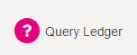
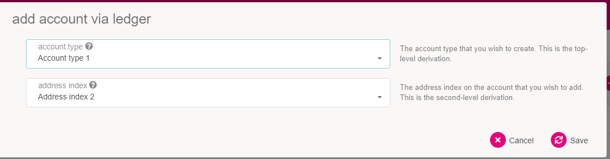
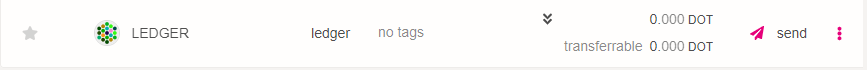
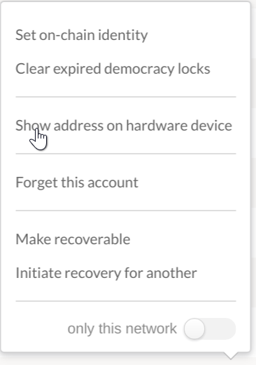

:::info

Because of required WebUSB support, Ledger wallets currently only work on
Chromium-based browsers like Brave, Chrome or Edge.

:::

Statemine has a [Ledger][] application that is compatible with the Ledger Nano S and Ledger Nano X
devices. The Ledger devices are hardware wallets that keep your private key secured on a physical
device that does not get directly exposed to your computer or the internet.

The Statemine application allows you to manage your KSM and other tokens on the Statemine parachain.
It supports most of the available transaction types of the network in the XL version of the app
(details [below](#installing-the-ledger-application)).

If you have trouble using Ledger or following the directions below, you can try searching for your
issue on the [Polkadot Support page](https://support.polkadot.network/).

:::note Intro to Ledger Explainer

Please check out our
[intro to Ledger video on YouTube for more information](https://youtu.be/7VlTncHCGPc).

:::

## Requirements

Here is a list of what you will need before starting:

- A Ledger Nano S or a Ledger Nano X.
- The latest firmware installed.
- Ledger Live is installed and at version 2.29 or newer (see settings -> about to find out if you're
  up to date).
- A web browser is installed that you can use to access [Polkadot-JS Apps UI][apps].

## Installing the Ledger Application

### Using Ledger Live

:::note Ledger Nano S

There are two versions of the Statemine app: the normal (light)
version and the XL version. The light version has smaller size but it supports only basic
functionality. If you want access to all the supported extrinsics, you need to install the XL
version of the app. You can see [here][prerelease instructions] a full list of the extrinsics
supported by both versions.

:::

- Open the "Manager" tab in Ledger Live.
- Connect and unlock your Ledger device.
- If asked, allow the manager on your device by pressing both buttons on the YES screen.
- Search for Statemine in the app catalog.
- If you are using a Ledger Nano S, install either the normal (light) version or the XL version. For
  Ledger Nano X, there will only be one app available.

Please proceed to the [usage instructions](#using-on-polkadot-js-apps) below.

## Using on Polkadot-JS Apps UI

:::info

The Polkadot extension doesn't support Statemine Ledger accounts at this point, so
you need to add your account on Polkadot-JS UI as described below.

:::

### Adding Your Account

:::note 

These instructions will guide you on how to add a Ledger account that's **only**
available on Statemine. If you want to use the same Ledger account on both Kusama **and**
Statemine check the instructions [below](#working-on-both-kusama-and-statemine).

:::

[Polkadot-JS Apps UI][apps] already has an integration with the Ledger application so that your
device will work with the browser interface after installation. The functionality is currently gated
behind a feature setting that you will need to turn on.

In order to turn on the interoperability with the Statemine Ledger application, go to the "Settings"
tab in [Polkadot-JS Apps UI][apps]. Find the option for attaching Ledger devices and switch the
option from the default "Do not attach Ledger devices" to "Attach Ledger via WebUSB" (**but see note
above**).

Click "Save" to keep your settings.

Now when you go to the "Accounts" tab you will see a new button that says "Add via Ledger". Ensure
that your Ledger device is unlocked, Ledger Live is **closed** and you have
[switched over](https://support.polkadot.network/support/solutions/articles/65000169778-how-to-switch-network-nodes)
to the Statemine application, then click this button.

A popup will appear asking you to select an account and derivation path.

The first option lets you select an account. You can have multiple accounts on a single Ledger
device. The second dropdown lets you pick a derivation path - think of it like a formula from which
child accounts are generated. If in doubt, pick the default option for both.

Once you confirm your selection, depending on your browser and its security settings, you might need
to confirm the USB connection through a popup like the one below when adding the Ledger device for
the first time:

You should now be able to scroll down and find a new account on the page with the type "ledger".

You can now use this account to interact with Statemine on [Polkadot-JS Apps UI][apps] and it will
prompt your ledger for confirmation when you initiate a transaction.

### Working on both Kusama and Statemine

Polkadot and Kusama accounts from the
[extension](https://wiki.polkadot.network/docs/learn-account-generation#polkadotjs-browser-extension)
will show up in Statemint and Statemine respectively, even if they're not set to be used on all
chains. Statemint and Statemine, which are common good parachains on Polkadot and Kusama respectively,
use DOT and KSM as their native tokens. Hence, accounts on Polkadot and Kusama makes sense to also be
available on their respective common good parachains. What this means is that if you already have a
Kusama Ledger account configured on the extension, that account will also be available on Statemine.
But the opposite is not the case: an account created specifically on Statemine or Statemint won't show up
on Kusama or Polkadot respectively.

**However**, as mentioned above, the
[Polkadot extension](https://wiki.polkadot.network/docs/learn-account-generation#polkadotjs-browser-extension)
does not support Statemine Ledger accounts at the moment, but the Polkadot-JS UI does. So, if your
Kusama account is in the Polkadot extension, you'll need to remove it from there and re-add it on
Polkadot-JS UI directly **as a Kusama account**, as described
[here](https://guide.kusama.network/docs/kusama-ledger#using-on-polkadot-js-apps-ui). After that,
you will be able to make transactions with that account.

To remove an account from the Polkadot extension:

1. Open the extension
2. Click on the three dots next to the account
3. Select "Forget account".

:::warning

As mentioned above, a Polkadot Ledger account will also be available on Statemint.

**DO NOT** send funds to it. They will be inaccessible until a Statemint Ledger app is released.

:::

### Confirming the Address on your Device

On the "Accounts" tab, find your Ledger-connected account. Click on the three vertical dots at the
end of the row. This will open a new menu, here you can click the "Show address on hardware device"
option to display the address on your device.

Here you can scroll through and make sure the address matches to what is displayed on [Polkadot-JS
Apps UI][apps].

#### Using Polkadot-JS Apps

Once you have your account loaded on the "Accounts" tab it should show a row with your Ledger
account. At the far right of the row is located your account's DOT balance. If you expand the
balance arrow, it will show details of your balance such as locks or reserved amounts.

### Sending a Transfer

If you would like to send a transfer from your account housed on the Ledger device, the easiest
method is to use [Polkadot-JS Apps UI][apps].

:::info Transfers

Transferring in this way sends tokens to another account on the Statemine
parachain. If you need to transfer KSM between Statemine and Kusama, see the
[Teleporting](#teleporting) section below.

:::

- Click on the "Send" button next to your account.
- In the second input, select one of the accounts from the drop-down menu or paste the address that
  you want to transfer funds to.
- In the third input, enter the amount of KSM you want to transfer.
- Click the "Make Transfer" button.
- Confirm the transaction on your device.
- A green success notification will be displayed when the transaction is included in a block.

:::note The "Transfer with Keep-Alive Checks" toggle

Note the "Transfer with Keep-Alive Checks" toggle. While this toggle is in the _On_ state, your
account will be unable to make transactions which would get its balance below the existential
deposit. This prevents reaping of accounts with low balances. If you toggle this to _Off_, you
will be able to go below existential deposit balance, causing your account to be deleted and any
dust amount of KSM to be burned. If you encounter KeepAlive errors when making transactions, this
might be the reason.

A detailed guide on doing transfers is available [here](../../learn/learn-balance-transfers.md).

:::

### Receiving a Transfer

In order to receive a transfer on the accounts stored on your Ledger device, you will need to
provide the sender (i.e. the payer) with your address.

The easiest way to get your address is to click on the account name which will open a sidebar. Your
address will be shown in this sidebar, along with some other information. Another method is just
clicking on your account's avatar icon - this immediately copies your address to the clipboard.

:::note Your Statemine address is the same as your Kusama address

Make sure that you clarify to the sender that you wish to receive your tokens on the 
Statemine parachain, otherwise (if you're receiving KSM tokens) they could be sent on the Kusama 
chain.

:::

:::caution Before giving anyone your address

Make sure it matches what's really on the Ledger
by [confirming the address on your device](#confirming-the-address-on-your-device). Some malware
will intercept clicks and clipboard requests and can change your copied value in-flight, so being
extra vigilant around copy-paste operations makes sense.

:::

### Teleporting

Teleporting allows you to send tokens between the Relay Chain and a parachain, or between different
parachains.

The Statemine Ledger app doesn't support the `teleport` extrinsic at this point, so an intermediary
account needs to be created first.

To teleport KSM to the Relay Chain follow these steps:

- Create an account outside your Ledger. Instructions can be found
  [here](../../learn/learn-account-generation.md).
- Transfer the desired amount as described [above](#sending-a-transfer). If you want to send exactly
  the amount you want to teleport, don't forget take into account the fees for teleporting that will
  be deducted in the next step.
- Teleport your tokens following the instructions you will find
  [here](../../learn/learn-teleport.md).

Teleporting **to** a Ledger account from a non-Ledger account doesn't require these extra steps.

## Support

If you need support, please visit the [Polkadot Support page](https://support.polkadot.network).

[ledger]: https://www.ledger.com/
[apps]:
  https://cloudflare-ipfs.com/ipns/dotapps.io/?rpc=wss%3A%2F%2Fkusama-statemine-rpc.paritytech.net#/explorer
[prerelease instructions]: https://github.com/Zondax/ledger-statemine
[releases page]: https://github.com/Zondax/ledger-statemine/releases
