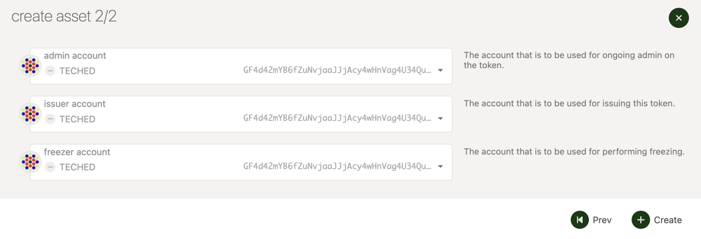

import RPC from "./../../../components/RPC-Connection"

Statemine is a generic assets parachain which provides functionality for deploying and transferring
assets — both Fungible and Non-Fungible Tokens (NFTs). It is a common good parachain on Kusama (not
to be confused with [Statemint](../../learn/learn-common-good-chains.md#statemint), which is a
parachain on Polkadot). The native token of Statemine is KSM. Balance transfers and the Existential
Deposit (ED) of KSM on Statemine are about 1/10th of the values on the Relay chain. For example, the
Existential Deposit of a Statemine account is
{{ polkadot: <RPC network="statemine" path="consts.balances.existentialDeposit" defaultValue={3333333} filter="humanReadable"/>, :polkadot }}
{{ kusama: <RPC network="statemine" path="consts.balances.existentialDeposit" defaultValue={3333333} filter="humanReadable"/>, :kusama }}
when compared to
{{ polkadot: <RPC network="kusama" path="consts.balances.existentialDeposit" defaultValue={33333333} filter="humanReadable"/> :polkadot }}
{{ kusama: <RPC network="kusama" path="consts.balances.existentialDeposit" defaultValue={33333333} filter="humanReadable"/> :kusama }}
on Kusama. Apart from the core protocol token KSM, the assets held on Statemine can be broadly
categorized as

- Assets backed by an on-chain protocol’s utility
- Assets with off-chain backing
- Assets without any backing

For additional background on Statemint and Statemine checkout
[this support article](https://support.polkadot.network/support/solutions/articles/65000181800-what-is-statemint-and-statemine-and-how-do-i-use-them-).

## Creating Assets on Statemine

:::info

Before minting assets on Statemine, we recommend that you try out this tutorial on Westmint, which
is a parachain on Westend. The WND tokens (Westies) are free and are available through a
[faucet](https://wiki.polkadot.network/docs/learn-DOT#getting-westies).

:::

To create an asset on Statemine, you need a deposit of
{{ polkadot: <RPC network="statemine" path="consts.assets.assetDeposit" defaultValue={100000000000} filter="humanReadable"/> :polkadot }}
{{ kusama: <RPC network="statemine" path="consts.assets.assetDeposit" defaultValue={100000000000} filter="humanReadable"/> :kusama }}
and around
{{ polkadot: <RPC network="statemine" path="consts.assets.metadataDepositBase" defaultValue={668933304} filter="humanReadable"/> :polkadot }}
{{ kusama: <RPC network="statemine" path="consts.assets.metadataDepositBase" defaultValue={668933304} filter="humanReadable"/> :kusama }}
for the metadata. Before you create an asset on Statemine, ensure that your Statemine account
balance is a bit more than the sum of those two deposits, which should seamlessly account for the
required deposits and transaction fees. You can send KSM from a Kusama account to a Statemine
account using the teleport functionality. For instructions on teleporting KSM, check this
[tutorial on Teleports](../../learn/learn-teleport.md).

Assuming you have the required KSM balance on your Statemine account, the following instructions
should let you successfully create an asset on Statemine

- Access Statemine through [Polkdot-JS UI][].
- Navigate to Network > Assets.

- Click on the create button and you will be presented with a pop-up window. Choose the creator
  account, name of the asset to be displayed on Statemine, the asset's symbol, number of decimals
  for the asset, the minimum balance required to hold this asset on a Statemine account and the most
  important field of your asset - the unique asset ID. The UI would not let you enter an ID that has
  already been taken. After all the details are entered, click on the next button.

- Choose the admin, issuer and the freezer accounts for your asset and click on the create button.

- Sign and submit the transaction. (If you like to verify the transaction details before signing,
  you can click on the dropdown button pointed by the arrow in the snapshot below)

If the transaction is successful, you should see the asset and its details displayed in the
Network > Assets page on Statemine.

## Transferring Assets on Statemine

Checkout
[this support article](https://support.polkadot.network/support/solutions/articles/65000181118-how-to-transfer-tether-usdt-on-statemine),
for a step by step guide covering how to make a transfer on the Statemine and the risks associated.

[polkadot-js ui]: https://polkadot.js.org/apps/#/explorer
