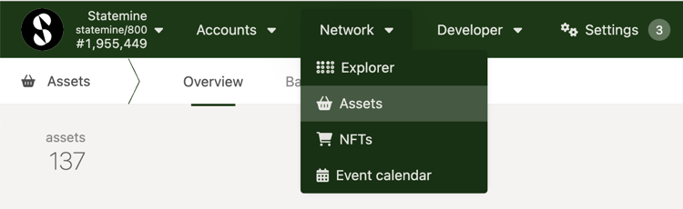
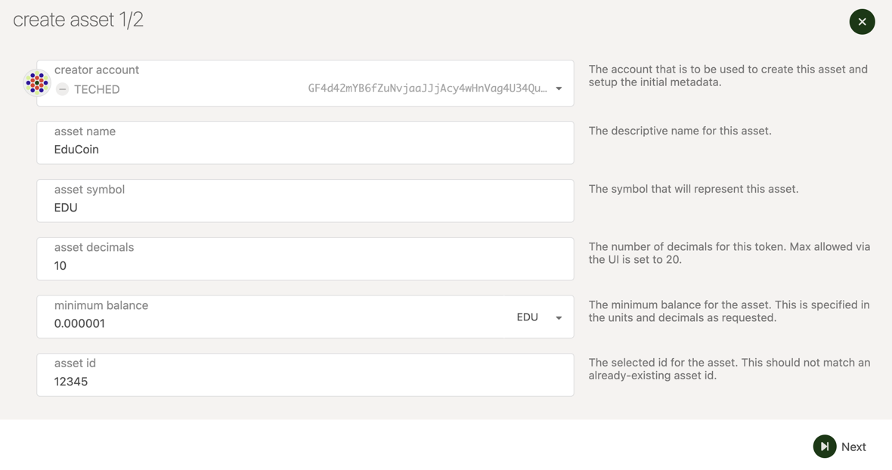
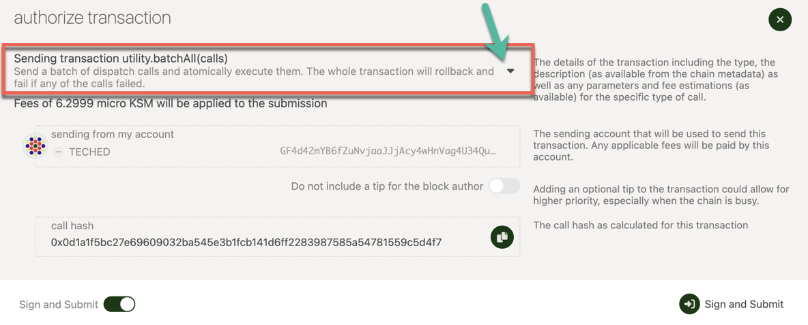
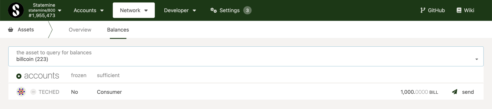
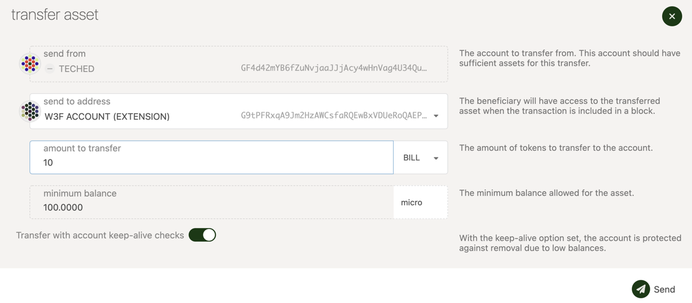
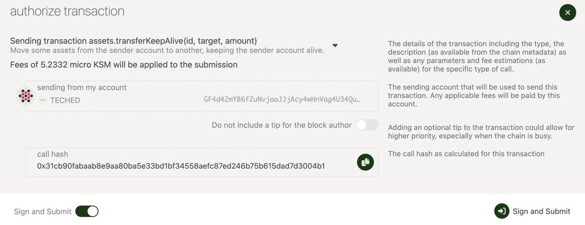

## Statemine

Statemine is a generic assets parachain which provides functionality for deploying and transferring assets — both Fungible and Non-Fungible Tokens (NFTs). It is a common good parachain on Kusama (not to be confused with [Statemint](../../learn/learn-common-good-chains.md#statemint), which is a parachain on Polkadot). The native token of Statemine is KSM. Balance transfers and the Existential Deposit (ED) of KSM on Statemine are about 1/10th of the values on the Relay chain. 
Apart from the core protocol token KSM, the assets held on Statemine can be broadly categorized as 

- Assets backed by an on-chain protocol’s utility
- Assets with off-chain backing
- Assets without any backing

## Creating Assets on Statemine

::: info

Before minting assets on Statemine, we recommend that you try out this tutorial on Westmint, which is a parachain on Westend. 
The WND tokens (Westies) are free and are available through a [faucet](https://wiki.polkadot.network/docs/learn-DOT#getting-westies).

:::

To create an asset on Statemine, you would need a deposit of 1 KSM. Ensure that your Statemine account balance more than 1 KSM,
which should account for the transaction fee as well. You can send KSM from a Kusama account to a Statemine account using the teleport functionality. For instructions on teleporting KSM, check this [tutorial on Teleports](../../learn/learn-teleport).

Assuming you have the required KSM balance on your Statemine account, the following instructions should let you successfully create an asset on Statemine

- Access Statemine through Polkdot-JS Apps UI.
- Navigate to Network > Assets.

- Click on the create button and you will be presented with a pop-up window. Choose the creator account, name of the asset to be
displayed on Statemine, the asset's symbol, number of decimals for the asset, the minimum balance required to hold this asset on a Statemine account and the most important field of your asset - the unique asset ID. The UI would not let you enter an ID that has already been taken. After all the details are entered, click on the next button.

- Choose the admin, issuer and the freezer accounts for your asset and click on the create button.

- Sign and submit the transaction. (If you like to verify the transaction details before signing, you can click on the dropdown button pointed by the arrow in the snapshot below)

If the transaction is successful,  you should see the asset and its details displayed in the Network > Assets page on Statemine.

## Transferring Assets on Statemine

::: caution Beware of scams

Due to the permissionless nature of Statemine, anyone can create an asset with any name and symbol. The most important attribute 
of an asset is the asset ID. There could be multiple assets with the same name and symbol, but they cannot have the same asset ID. Ex: The USDT by Tether minted on Statemine holds the asset ID: 1984.

:::

To hold, send or receive most of the assets on Statemine, the accounts need to have a minimum balance of 0.1 microKSM (The Existential Deposit on Statemine). You can send KSM from a Kusama account to a Statemine account using the teleport functionality. For instructions on teleporting KSM, check this [tutorial on Teleports](../../learn/learn-teleport). The balance transfers of KSM on Statemine are similar to the balance transfers KSM on Kusama and can be done on the accounts page on Polkadot-JS Apps UI.

In this tutorial, transfer of BILLCOINs (Asset ID: 223, Symbol: BILL) is demonstrated.

::: info

Ensure that the receiver account has at least 0.1 microKSM which is the Existential Deposit for a Statemine acocunt

:::

- Access Statemine through Polkdot-JS Apps UI.
- Navigate to Network > Assets and click on the Balances tab
- Select the asset to transfer from the drop-down (The assets are sorted based on their IDs). If you have accounts with the selected asset, they will be displayed.

- Click on the send button 
- Enter the receiver address and the amount to transfer.

- Sign and submit the transaction

If the transaction is successful, the assets are transferred to the receiver account. 