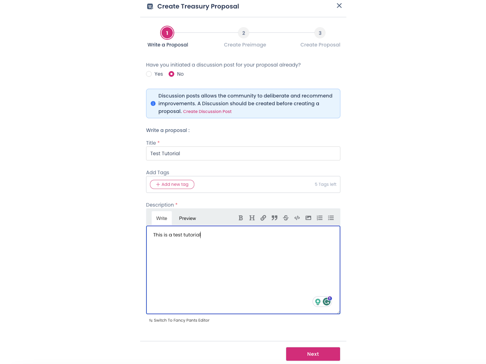

The Treasury is a pot of funds collected through a portion of block production rewards,
[transaction fees](../learn/learn-transactions.md#transaction-fees), [slashing](../learn/learn-offenses.md), and
[staking inefficiencies](../learn/learn-inflation.md). Treasury funds are held in a
[system account](../learn/learn-account-advanced.md#system-accounts) that cannot be controlled by any
external account; only the system internal logic can access it.

!!!tip "Creating a Treasury Proposal on Polkadot OpenGov"
    If you would like to create a treasury proposal on Polkadot OpenGov, follow the instructions
    outlined on [this how-to guide](../learn/learn-guides-treasury.md#creating-a-treasury-proposal).

## Treasury Inflow and Outflow

Tokens that are deposited into the Treasury (i.e. the inflow) is determined by the following
mechanisms:

- **Transaction fees:** 80% of the transaction fees of every submitted extrinsic is diverted to the
  Treasury, while 20% is given to the block producers.
- **Inflation:** 15% of DOT annual inflation is directed to the Treasury.
- **Slashes:** whenever validators and nominators are [slashed](../learn/learn-offenses.md), a share of the slashed tokens are diverted to Treasury. They are typically rare and unpredictable events.
- **Transfers:** everyone can send funds to the Treasury directly. This is a rare event and
  typically due to grantees reimbursing some of the amount they got allocated for various reasons.

The outflow is determined by the following mechanisms:

- **Burned tokens:** at the end of each spend period,
  **[a fraction](chain-state-values.md#treasury-burn-factor) of the available funds are
  burned**.
- **Treasury proposals & Bounties:** they make up the largest share of outflow tokens to the
  community and need to be approved by governance. Then, payouts occur at the end of a
  [spend period](../general/glossary.md#spend-period).
- **Tips:** smaller payouts directly to grantees that can happen within a
  [spend period](../general/glossary.md#spend-period).

!!!info "Spend Period Schedule"
    On Polkadot-JS UI, navigate to Governance > Treasury to view the status of current [spend period](../general/glossary.md#spend-period).

    

## Treasury Tracks

OpenGov allows for managing funds through six tracks, each with its own
[origin and track parameters](../learn/learn-polkadot-opengov-origins.md#origins-and-tracks-info).

- [Treasurer](../learn/learn-polkadot-opengov-origins.md#treasurer)
- [Big Spender](../learn/learn-polkadot-opengov-origins.md#big-spender)
- [Medium Spender](../learn/learn-polkadot-opengov-origins.md#medium-spender)
- [Small Spender](../learn/learn-polkadot-opengov-origins.md#small-spender)
- [Big Tipper](../learn/learn-polkadot-opengov-origins.md#big-tipper)
- [Small Tipper](../learn/learn-polkadot-opengov-origins.md#small-tipper)

## Submit Treasury Proposal via Polkassembly

Access to Treasury funds requires successful enactment of referendum in the respective treasury
track on-chain. Learn how to submit a treasury proposal for referendum using
[Polkassembly](governance-apps.md).

Go to [Polkassembly](https://polkadot.polkassembly.io/opengov) and click on the FAB button in the
bottom right corner. Then,

- Click on "Create Treasury Proposal" and choose an address for the proposer
- After choosing an address, you will enter a three-stage guideline:

  - Write a proposal: you can add a detailed description for the proposal, which will be stored on
    Polkassembly. Alternatively, you can link an existing discussion post.

  

  - Create a preimage: an existing preimage can be linked, or a new one can be created. To create a
    preimage, add the beneficiary address and the token amount. The track will be auto-selected and
    the user can proceed with the creation of a preimage.

  

  - Create a proposal: final confirmation about the proposal creation. The description of the
    proposal and the preimage are automatically linked to the proposal.

## Sub-treasuries

The treasury currently operates on a single account on-chain. The above tracks manage the outflow of
the treasury on the network. With _sub_-treasuries, having treasury accounts that correspond to each
[collective](../learn/learn-system-chains.md#collectives) is also possible.

Rather than have many referenda through OpenGov, the treasury can allocate funds to each
sub-treasury (through [governance](../learn/learn-polkadot-opengov.md)), from which each respective collective
can spend funds (depending on their specific rule set).

New treasuries could be added to respective
[system chains](../learn/learn-system-chains.md#existing-system-chains) through governance by adding more
instances of this pallet.

## Multi-Asset Treasury Support

The treasuries can support multiple asset types and thus can spend assets other than DOT (or KSM on
Kusama) held within the treasury, and their transfers and interactions across the chains facilitated
by [cross-consensus messaging](../learn/xcm/learn-xcm-docs-intro.md). These assets have a few requirements:

1. The asset is listed on the [AssetHub system parachain](https://assethub-polkadot.subscan.io/).
2. The asset is active and has sufficient liquidity to be utilized for payouts.
3. The asset has a set conversion rate, as per OpenGov referenda on the Treasurer track (set via the
   asset rate pallet). This conversion rate defines a fixed-point representation for converting from
   that asset to the native asset (DOT or KSM).
4. The asset must be approved and onboarded via OpenGov to become spendable via the treasury as a
   valid spend method.

> For example,
> [see how USDT became approved as an asset on AssetHub](https://forum.polkadot.network/t/multi-asset-treasury-and-milestone-based-spends/6780),
> which can be used in the treasury.

## Bounties

### Parent Bounties

Getting treasury funding through OpenGov, depending on which treasury track you submit your
referendum, can be a long and uncertain process. This is not always a suitable option, for example,
for event organizers who need to pay costs upfront or close to the event's date. Bounties solve this
problem by procuring access to treasury funds in a single shot and using them to fund multiple
events later on through [child bounties](#child-bounties). This is why bounties are also called _parent_ bounties.

Parent bounty proposals aim to reserve a portion of treasury funds once, which will be used later.
They save proponents the time needed to create and obtain approval for several OpenGov referenda.
Bounties are managed by curators, where the curator is usually a
[multi-signature account](../learn/learn-account-multisig.md). Bounties can access a large amount of funds,
so managing those funds with a multisig is a good practice to enhance security. Essentially,
curators are multisig addresses with agency over a portion of the treasury to promote events, fix a
bug or vulnerability, develop a strategy, or monitor a set of tasks related to a specific topic, all
for the benefit of the ecosystem.

A proposer can [submit a bounty proposal](../learn/learn-guides-bounties.md#submit-a-bounty-proposal) to
OpenGov,
[with a curator to be defined later](../learn/learn-guides-bounties.md#assign-a-curator-to-a-bounty), whose
background and expertise is such that they can determine when the task is complete.

When submitting the value of the bounty, the proposer can specify a fee that will be paid to
curators willing to invest their time and expertise in the task; this amount will be included in the
total value of the bounty. In this sense, the curator's fee can be defined as the difference between
the amounts paid to child bounty awardees and the total value of the bounty.

Curators are selected through OpenGov referendum after the bounty proposal passes; and they need to
pay an upfront [deposit](chain-state-values.md#bounty-curator-deposit) to take the
position. This deposit can be used to punish curators if they act maliciously. However, if they are
successful in managing the bounty to completion, they will receive their deposit back, and part of
the bounty funding as a payment for their efforts.

Curators are expected to have a decent track record in addressing the issues the bounty wants to
solve. They should be very knowledgeable on the topics covered by the bounty and have proven project
management skills or experience. These recommendations help ensure an effective use of the bounty
mechanism. A Bounty is a reward for a specified body of work or set of objectives that needs to be
executed for a predefined treasury amount designated to be paid out. The responsibility of assigning
a payout address once the specified set of objectives is completed is delegated to the curator.

The bounty has a [predetermined duration](chain-state-values.md#bounty-duration), with
possible extension(s) to be requested by the curator. To maintain flexibility during the tasks’
curation, the curator will also be able to create child bounties for more granularity in the
allocation of funds and as part of a nested iteration of the bounty mechanism.

### Child Bounties

Child bounties are spawned from [parent bounties](#parent-bounties). Child bounties are used to
access funds directly from the parent bounty without going through an OpenGov referendum.

---

!!!info "Polkadot-JS Guides"
    If you are an advanced user, see the [Polkadot-JS guides about bounties](../learn/learn-guides-bounties.md) and [treasury](../learn/learn-guides-treasury.md).

