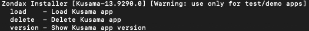

:::info

Because of required WebUSB support, Ledger wallets currently only work on Chromium-based browsers
like Brave and Chrome.

:::

:::warning Ledger does not currently support batch transactions

Ledger does not currently support batch calls; As a consequence, if you stake using the
[staking dashboard](https://staking.polkadot.network/#/overview), you must use a hot wallet.
Alternatively, you can use the [Polkadot-JS UI](https://polkadot.js.org/apps/#/explorer) that allows
for single calls (i.e., bonding and nominating).

:::

The Polkadot [Ledger](https://www.ledger.com/) application is compatible with both the Ledger Nano S
and the Ledger Nano X devices. Ledger devices are hardware wallets that keep your secret key secured
on a physical device that does not expose it to your computer or the internet. That is, even if you
connect your nano via USB to your computer, the private keys will not be leaked. Ledger devices are
also hierarchical deterministic wallets (HD wallets), that is:

- _Deterministic_ means that there is only one seed phrase to generate all the accounts for
  different blockchain networks.
- _Hierarchical_ means that the accounts are generated in a tree-like structure for different
  purposes.

Ledger devices can be equipped with applications that are blockchain-specific. Such applications are
usually developed by third parties and they enable the user to transact securely on the blockchain
network. The Polkadot Ledger application allows you to manage Polkadot's native token, DOT. It
supports most of the transaction types of the network, including batch transactions from the Utility
pallet.

:::note Ledger apps may not support all the transactions

Check [Ledger Polkadot App](https://github.com/Zondax/ledger-polkadot) specification for the list of
transactions supported. It could be possible that some transactions are supported only on a specific
version of the app and some transactions are not supported at all by any version. For instance, the
staking `rebag` extrinsic is supported on the XL version but not on the light version. The
`setIdentity` extrinsic is not supported by any of the app versions.

:::

If you have trouble using Ledger or following the directions below, you can try searching for your
issue on the [Polkadot support pages](https://support.polkadot.network/).

## Requirements

Here is a list of what you will need before using Polkadot with Ledger:

- A Ledger Nano X or Nano S plus (recommended for Polkadot Ledger App space requirements). The
  Ledger Nano S has limited memory and is no longer produced.
- The latest firmware of the Polkadot Ledger App installed (always check for updates in Ledger Live
  under the "Manager" tab, you will need to allow access with your nano).
- Ledger Live is installed and at version 2.1 or newer (see settings -> about to find out if you're
  up to date).
- A Chromium-based web browser is installed that you can use to access the
  [Polkadot-JS UI](https://www.ledger.com/).

## Using Ledger Live

Check
[this support article](https://support.polkadot.network/support/solutions/articles/65000175822-how-to-use-polkadot-and-stake-with-ledger-live)
to learn how to use Polkadot with ledger live.

:::info

Ledger Live will only show the main account with BIP44 path 44'/354'/0'/0'/0'. This means that if
you create a [derived account using Polkadot JS](#using-on-polkadot-js-apps) with a derivation path
44'/354'/0'/0'/1', it will not be displayed on the Ledger Live App. As a consequence it is not
possible to transact with derived accounts using the Ledger Live App, but it is possible to do so
using Polkadot JS. For more information about derived accounts and derivation paths check
[the accounts page](../learn/learn-accounts.md).

:::

## Using on Polkadot-JS Apps

### Loading Your Account

:::info

Ledger Live should be off while using Ledger with Polkadot-JS UI as it can interfere with normal
operation.

:::

You can import your Ledger account to [Polkadot Extension](https://polkadot.js.org/extension/) or to
the [Polkadot-JS UI](https://polkadot.js.org/apps/#/explorer). For instructions on how to import
Ledger accounts to the Polkadot Extension read through
[this support article](https://support.polkadot.network/support/solutions/articles/65000175387-how-to-add-your-ledger-through-the-polkadot-extension),
while if you want to import Ledger accounts to the Polkadot JS UI you can consult
[this other article](https://support.polkadot.network/support/solutions/articles/65000170812-how-to-add-ledger-account-through-the-polkadot-js-ui).

#### Derivation paths

When adding a Ledger account using the extension or the UI, you will be asked to select an
`account type` and an `account index`. The first lets you select an account, while the second lets
you pick a derivation path from that account - think of it like a formula from which child accounts
are generated. When you are creating a Polkadot ledger account for the first time on Ledger Live
with name `Polkadot 1`, this can be added to Polkadot JS using the 0/0 derivation path (i.e. account
type = 0 and account index = 0). If then you add a second account called `Polkadot 2`, this will
correspond to the 1/0 derivation path, and so on. We thus have multiple parent accounts that can be
viewed and used in both Ledger Live and Polkadot JS. Additionally, we can use Polkadot-JS UI to
created multiple children accounts from each parent account. For example, `Polkadot 1` with 0/0
derivation path can have child 0/1, 0/2, etc. that can be used within the UI. However, such children
accounts cannot be used in Ledger Live, as it only scans through the parent accounts. So, keep in
mind that the balances on the children accounts cannot be viewed, and you will not be able to
transact with those accounts on Ledger Live.

#### Connecting your ledger device

While using a ledger device to sign transactions, depending on your browser and its security
settings, you might need to confirm the USB connection through a popup like the one below:

If you are adding your Ledger Nano for the first time, click on the "Unknown device" line and the
"Connect" button will become available.

:::info Signature error message

If you already connected your device but an error message appears before signing a transaction, make
sure you have opened the Polkadot application on your Ledger Nano device. Visit
[this support page](https://support.polkadot.network/support/solutions/articles/65000181994) for
more information about signing transactions using your ledger.

:::

### Confirming the Address on your Device

To display your Polkadot ledger account address on your Ledger Nano you can follow the guidelines on
[this support article](https://support.polkadot.network/support/solutions/articles/65000181854-how-to-confirm-your-account-address-on-your-ledger-device).
Here you can scroll through and make sure the address matches to what is displayed on
[Polkadot-JS UI](https://polkadot.js.org/apps/#/explorer).

### Checking the Balance of Your Account

There are a few methods to check the balance of your account. Check out
[this support article](https://support.polkadot.network/support/solutions/articles/65000169332-where-can-i-see-the-balance-of-my-account-)
for information.

### Sending a Transfer

General instructions to send a transfer can be found on
[this support page](https://support.polkadot.network/support/solutions/articles/65000170304-how-to-send-transfer-funds-out-of-your-dot-account-on-the-polkadot-js-ui).
To sign transactions with your Ledger nano check
[this support article](https://support.polkadot.network/support/solutions/articles/65000181994).

### Receiving a Transfer

In order to receive a transfer on the accounts stored on your Ledger device, you will need to
provide the sender (i.e. the payer) with your address. To do so follow the instructions on
[this support page](https://support.polkadot.network/support/solutions/articles/65000181866-how-to-receive-dot-to-my-account-on-polkadot-js-ui).

:::warning

Before giving anyone your address, make sure it matches what's really on the Ledger by
[confirming the address on your device](#confirming-the-address-on-your-device). Some malware will
intercept clicks and clipboard requests and can change your copied value in-flight, so being extra
vigilant around copy-paste operations makes sense.

:::

### Staking

For staking using Ledger devices check the section "How to stake using your Ledger" on
[this support article](https://support.polkadot.network/support/solutions/articles/65000168057-how-do-i-stake-nominate-on-polkadot-).

### Removing Expired Democracy Locks

Check out
[this support page](https://support.polkadot.network/support/solutions/articles/65000181870-how-to-remove-expired-democracy-locks)
the learn how to remove democracy locks after the end of a Governance referendum.

**Please be advised**: Despite the Polkadot ledger application being compatible with both the Ledger
Nano S and the Ledger Nano X, none of the [Democracy](../maintain/maintain-guides-democracy.md)
extrinsics are available in the light version. The following
[repository by Zondax](https://github.com/Zondax/ledger-polkadot) lists the currently supported
Democracy extrinsics on the full ledger.

## Ledger Developer Release

:::warning

This section is for developers only. It is recommended to install the application from Ledger Live
unless you _know exactly what you're doing_.

:::

### Why you might need the Developer Release

Ledger apps for the Polkadot and Kusama ecosystems are developed by [Zondax](https://zondax.ch/).
When new functionalities are added to the Ledger apps, they are made available on a developer
release for testing purposes. After a successful audit and review, the apps would be available for
download and installation using [Ledger Live](https://www.ledger.com/ledger-live). As it takes some
time for Ledger to audit and review the release, the app upgrade option may not be available on
Ledger Live when the new runtime is deployed on the network. If this happens, users cannot use
Ledger devices with the Polkadot-JS UI, and while signing for a transaction, they will most likely
incur the error message "txn version not supported". Please do not panic if this happens, as there
are solutions to this problem. If you cannot wait a couple of days until the app passes the Ledger
audit, you can install the developer release from the shell using the latest version published on
[the Zondax GitHub repository](https://github.com/Zondax/ledger-polkadot/releases).

### Install the Developer Release

:::info

See [**this video tutorial**](https://youtu.be/4SyVQrlXZ_Q) to learn how to install the developer
release of your ledger app.

:::

To install the developer version make sure you have the latest `pip` version and follow the steps
below:

- Install _ledgerblue_ running the command `python3 -m pip install ledgerblue`.
- Download the developer release from the
  [Zondax GitHub repository](https://github.com/Zondax/ledger-polkadot/releases). The file will be
  named `installer_nanos_plus.sh`or something similar depending on the ledger device you are using.
- Locate the downloaded shell script and make it executable in your shell by typing the command
  `chmod +x installer_nanos_plus.sh`.
- You can now use the `./installer_nanos_plus.sh --help` command to visualize the available options
  (see below)

- Next attach your Ledger Nano (in this case Nano S Plus) to your computer, enter the PIN code and
  run the command `./installer_nanos_plus.sh load`. Scroll with the right button until you see
  "Allow unsafe manager", left and right press to confirm. You will be asked to confirm the action
  of uninstalling the app, and subsequently installing the newer version. After confirming both
  actions the shell script will proceed to install the version on your device. You will need to
  insert the PIN code to use the device after the installation.
- If you wish to revert the version back to stable release just go to Ledger Live, the app will
  automatically detect the developer release and give the option to install the previous stable
  release.
