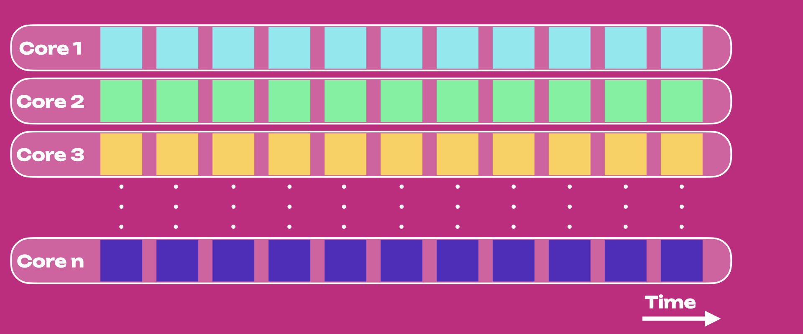
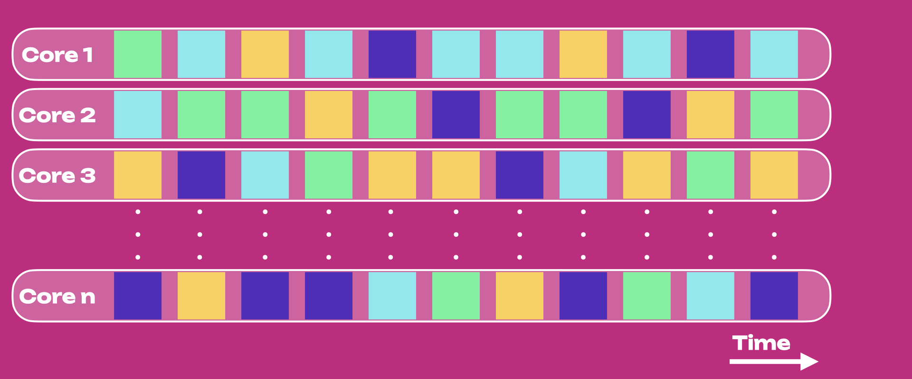
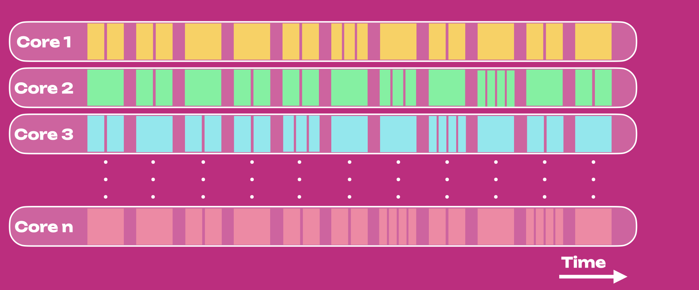
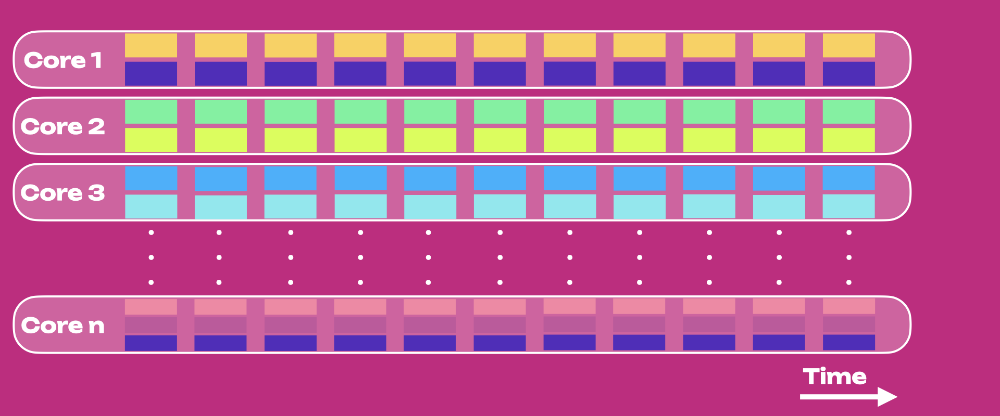
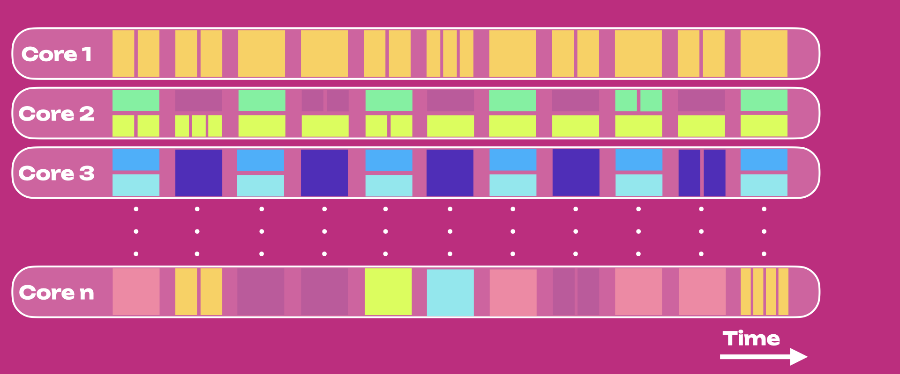

!!!info
    The material on this page is based on [Gavin Wood's talk at Polkadot Decoded 2023](https://www.youtube.com/watch?v=GIB1WeVuJD0).

Understanding what [Polkadot 1.0](./polkadot-v1.md) is about and the philosophy behind it will help
us envision the future direction of the Polkadot ecosystem toward abstraction and generalization.

## Polkadot as a Computational Resource

Polkadot has been abstracted and generalized beyond what was originally proposed and envisioned in
the [whitepaper](https://polkadot.network/whitepaper/). 

Polkadot is:
- About [**Blockspace**](./polkadot-v1.md#polkadots-blockspace) (the underlying resources that
  chains need), not chains.
- **A platform to build applications** rather than chains and for people to use those applications.
  Fundamentally, Polkadot is not a platform to host chains, and so far, chains have happened to be one
  way to build applications and grow Polkadot's utility.
- **A provider of resilient general-purpose continuation computation**, where the term
  _continuation_ refers to a broad, long-running task that can do something, pause, continue (or do
  something else) later.
- **A multicore computer** where chains that continuously operate in parallel on different cores are
  called [parachains](../learn/learn-parachains.md). One core can be reserved for one single chain
  in-bulk or on-demand. On-demand cores can be accessed by multiple chains at different periods (see
  the [Agile Coretime page](../learn/learn-agile-coretime.md)). At the time of writing (2024), there
  are around 50 cores independently operating in parallel on Polkadot.

From now on _application_ will be used as a general term to describe anything that can use a
Polkadot core to access secure and decentralized computation.

## Summary

If we see Polkadot as a service provider of trustless and resilient computation through cores as
well as secure interoperability between core-powered applications, the future development of
Polkadot can be directed towards the following main changes.

A paradigm shift from:

- being a chain-focused ecosystem where each parachain owned an execution core at all times
  (acquired through fixed parachain auction), which allowed a simple and secure, sharded execution
  environment
- to being an application-focused ecosystem where we remove the assumption that each application
  owns a core, and instead that all cores are a resource to be consumed and used as needed by all
  applications.

Previously, securing a core was a competitive process through an
[auction mechanism](../learn/archive/learn-auction.md). With Agile Coretime, there is no need for
auctions anymore. Teams can purchase on-demand coretime or reserve bulk coretime as required. This
greatly decreases the barrier-to-entry for software tinkerers and parachain teams.

On top of those main changes, [agile core usage](#agile-core-usage) and
[coretime allocation](#agile-coretime-allocation) will allow any application to access Polkadot's
computation based on their needs without wasting valuable blockspace. [Accords](#xcm-and-accords)
will improve cross-chain communication and the security guarantees of XCM messages. Finally,
Polkadot will scale by moving on-chain logic into its system parachains, allowing it to have more
bandwidth for the [parachains protocol](../learn/learn-parachains-protocol.md) and accords.

## From Slot Auctions to Coretime Marketplace

The end product of blockchains is [**Blockspace**](./polkadot-v1.md#polkadots-blockspace).
Applications need to access Polkadot's blockspace, and the entry points to blockspace are the cores.
Thus, applications will need to reserve some time on cores or **Coretime** to gain the right to
access Polkadot's secure blockspace and interoperability for a finite period.

Cores must be agile and general: they can change what job they run as easily as a modern CPU. It
follows that the procurement of those cores must be agile as well.

The auction mechanism is not agile, creates high entry barriers, and is designed for long-running
single applications (i.e., the original Polkadot vision proposed in the whitepaper).

We depart from the classic lease auctions and propose an agile marketplace for coretime, where
essentially **coretime becomes a commodity that can be tokenized, sold, and traded**. This setup
maximizes the agility of Polkadot and lets the market figure out the best solution needed for
applications to be successful.

Applications can reserve **bulk coretime** and **on-demand coretime** depending on their needs. Bulk
coretime rental will be a standard rental of coretime through a broker system parachain at a fixed
price for a fixed period of time. On-demand coretime rental will be available through ongoing sale
of coretime for immediate use at a spot price. This system lowers the barrier to entry for
prospective builders.

For example, revenues from coretime sales can be burnt, used to fund the Treasury, or used for a mix
of those options. The topic is currently under discussion. For more information, see
[RFC-0010](https://github.com/polkadot-fellows/RFCs/pull/10) and
[RFC-0015](https://github.com/polkadot-fellows/RFCs/pull/17/files).

## From Chain-centricity to Application-centricity

Polkadot 1.0 was a chain-centric paradigm consisting of isolated chains able to exchange messages.
This was not fundamentally different from having completely different chains connected to bridges,
with the only difference of having the relay chain securing the network, providing message-passing
capability, and doing some extra tasks such as [staking](../learn/learn-staking.md),
[accounts](../learn/learn-accounts.md), [balances](../learn/learn-transactions.md#balance-transfers),
and [governance](../learn/learn-polkadot-opengov.md). Having a chain-centric system will ultimately
end in a chain-centric application and UX.

The true innovation of Polkadot is about leveraging the unique value proposition offered by
different chains and using those chains’ collaborative potential to build inter-chain applications
to solve real-world problems. Those applications will thus need to span across chains.

**Increasingly fewer tasks will be handled by the relay chain** which will focus efforts only on
primary tasks: securing the network and providing secure message-passing capability.
[System parachains](../learn/learn-system-chains.md) will be used to take over secondary relay chain
tasks such as staking, governance, etc.

### XCM and Accords

[XCMP](../learn/learn-xcm.md) is the transport layer for delivering XCM messages. It gives the
transportation method and a secure route but not a framework for binding agreements.

[XCM](../learn/learn-xcm-transport.md) is a format, a language of intention abstracted over
functionality common within chains. It creates an expressive language of what you intend to do or
want to happen. XCM messages are transported between different chains using XCMP. Ideally, in a
fully trustless environment, strong guarantees ensure chains faithfully interpret XCM messages. We
can have a secure mode of delivering messages that can be interpreted across protocols, but still
messages might be misinterpreted. These guarantees can be achieved with accords.

An **Accord** is an _opt-in_ treaty across many chains, where treaty logic cannot be changed or
undermined by one or more of those chains, and Polkadot guarantees faithful execution of this logic.
Accords will be specific to a particular function, and any chain that enters the accord will be held
to it and will serve that particular function. To lower the entry barrier, accords can be proposed
permissionlessly, but because they are opt-in, the accord proposal will take effect until chains
agree and sign up.

To sum up, accords ensure that the receiver faithfully interprets XCM messages securely sent via
XCMP channels. Accords are the missing piece of the puzzle to achieve a fully trustless and
collaborative environment between applications.

Polkadot is the only ecosystem where accords can properly exist because it has a homogenous security
layer that provides a specific state transition function for each logic component. This allows
patterns of cooperation between multiple logic components (i.e., trans-applications) that would not
be possible to achieve over bridges.

Accords will be implemented using [SPREE technology](../learn/learn-spree.md).

## Core Usage in Polkadot 1.0

In Polkadot 1.0, applications produced blocks at a fixed rate of 12 seconds, whether needed or not.
This led to inefficient energy allocation and economic incentives for producing full blocks under
heavy traffic and empty blocks under light traffic.

The figure below shows the core usage for Polkadot 1.0, where the horizontal axis is time, and each
row represents a core. Colors show different parachains, each using one core (i.e., one parachain,
one core formula).

The above setup allowed a **simple and secure, sharded execution environment**.

However, to achieve full efficiency, blocks must be produced when needed, and the system must target
full block capacity, lowering the probability of incentivizing validators to build blocks half full
or, worse, empty.

## Agile Coretime Allocation

In Polkadot 1.0, coretime is a fixed two-year period on one specific core. Here, we remove this
limitation and generalize coretime usage to meet different application needs. For more information,
see the [agile coretime documentation](../learn/learn-agile-coretime.md).

### Split Coretime

Owners of coretime can split or trade it. An application A1 can run on core C1 for a finite period
and then another application A2 can run on that core, or application A1 can continue running on
another core C2. Some applications might stop running for some time and resume later on.

### Strided Coretime

Ranges can be strided (i.e., applications can take turns on a core) to share costs or decrease block
production rate, for example.

### Combined Coretime

An application can be assigned to multiple cores simultaneously. Some applications can have a
permanent core assignment and an intermittent one, for example, in a period of high demand to send
multiple blocks to multiple cores at the same time slot to reduce latency. Combining coretime in
this manner is achieved through [elastic scaling](../learn/learn-elastic-scaling.md).

## Agile Core Usage

In Polkadot 1.0, one core is assigned to one application (in this case, equivalent to a parachain).
Ideally, core affinity (i.e., which application operates on which core) is unimportant (see below).
Cores do not have any higher friendliness to one application than another.

Here, we remove the assumption that each application owns a core and instead that all cores are a
resource to be consumed and used as needed by all applications in the ecosystem.

### Compressed Cores

The same core can secure multiple blocks of the same application simultaneously. Combining multiple
application blocks in the same relay chain core will reduce latency at the expense of increased
bandwidth for the fixed price of opening and closing a block.

### Shared Cores

Sharing cores with other applications to share costs but with no reduction in latency. Note that
this is different from the [split coretime](#split-coretime) where one core is used by multiple
application at different times to share costs at the expense of higher latency. Shared cores will be
enabled with [JAM](../learn/learn-jam-chain.md), a semi-coherent system in which data from different
shards can be scheduled within the same core.

## Agile Composable Computer

All the above options of agile [coretime allocation](#agile-coretime-allocation) and
[core usage](#agile-core-usage) can be composable and enable the creation of an agile decentralized
global computing system.

Thus, this new vision is focused on Polkadot’s resource, which is secure, flexible, and available
blockspace that can be accessed by reserving some time on a core. Agility in allocating coretime and
using cores allows for maximized network efficiency and blockspace usage.

## Polkadot's Resilience

Systems that have yet to be engineered with decentralization, cryptography, and game theory in mind
are breakable and prone to cyber-attacks. Polkadot is basing its resilience on different pillars:

- **Preponderance of light-client usage:** Centralized RPC servers are common but susceptible to
  attack and not trustless decentralized entry points to using blockchain-based applications. Light
  client usage on Polkadot is possible through
  [Smoldot](https://github.com/smol-dot/smoldot).
- **Zero-Knowledge (ZK) Primitives:** They can have a problematic effect on censorship and
  centralization as having a big state transition function boiled down to a single proof of correct
  execution is not currently a scaling solution to build resilient systems. However, a library of
  richly featured and high-performance ZK primitives ready for specific use cases is being built.
  The first use-case will be used to improve privacy for on-chain collectives such as
  [the Polkadot Technical Fellowship](../learn/learn-polkadot-technical-fellowship.md).
- **[SAFROLE](../learn/learn-safrole.md) consensus:** New forkless block-production consensus
  algorithm replacing [BABE](../learn/learn-consensus.md#block-production-babe) and where blocks are
  not produced unless they are expected to be finalized. This will provide several benefits, such
  as:
  - Improved security, parachain performance, and UX from being forkless
  - Preventing front-running attacks through high-performance transaction routing where transactions
    are included in blocks in one hop instead of being gossiped, and transaction encryption.
- **Internode Mixnet:** Shielded transport for short messages that avoids leaking IP information for
  transactions, and introduces a general messaging system allowing users, chains and off-chain workers,
  smart contracts, pallets, and anything else existing within a chain to exchange messages containing
  signatures, intentions, etc.
- **Social Decentralization:** Resilience is achieved by including many participants contributing to
  the system and coming to decisions through on-chain governance. Involving as many people as
  possible ensures resilience against spending becoming systemically misjudged and appropriately
  directs wealth for spending treasury funds, salaries, and grants. Another crucial way of
  decentralizing the network is ensuring experts on which the maintenance of the system relies upon
  are incentivized and recruited over time by the Polkadot network and not by organizations within
  the Polkadot ecosystem.
