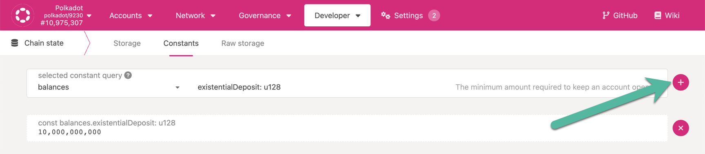

<!-- MessageBox -->

  

    Polkadot-JS is for developers and power users only. Explore Polkadot with secure and user-friendly wallets listed on the
    <a href="https://www.polkadot.network/ecosystem/wallets/" target="_blank" rel="noopener noreferrer">
      Polkadot website.
    </a>
    If you need help using the Polkadot-JS UI, you can contact the
    <a href="https://support.polkadot.network/support/home" target="_blank" rel="noopener noreferrer">
      Polkadot Support Team.
    </a>
  

  <button class="close-messagebox" aria-label="Close message">✖</button>

!!!info
    We support only the use of the [**Polkadot-JS UI**](https://polkadot.js.org/apps/#/explorer) together with the [**Polkadot-JS browser extension**](https://polkadot.js.org/extension/), [**Ledger**](https://www.ledger.com/ledger-live) and [**Polkadot Vault**](https://www.parity.io/technologies/signer/) for signing transactions. We do not provide support for third party applications.

This section of the Polkadot Wiki is dedicated to advanced guides for the Polkadot-JS tooling. 

[**Polkadot-JS**](https://polkadot.js.org/) is a collection of tools that interfaces with Relay Chains and parachains in a granular way. The tools include:

- [The Polkadot-JS UI](#polkadot-js-ui)
- [The Polkadot-JS Browser Extension](#polkadot-js-extension)
- [The Polkadot-JS API](https://docs.polkadot.com/develop/toolkit/api-libraries/polkadot-js-api/)
- [The Polkadot-JS Phishing List](#polkadot-js-phishing-list)

Below we describe the different components of Polkadot-JS. For more information about Polkadot-JS you can consult the [**official documentation**](https://polkadot.js.org/docs/).

## Polkadot-JS UI

The Polkadot-JS UI is an application that loads in your browser. There is a standard DNS
[**hosted version**](https://polkadot.js.org/), which always has the latest features, and an
[**IPFS version**](https://dotapps.io/) that is less frequently updated but is more decentralized.
This is also often referred to as Polkadot-JS Apps, UI or the Apps UI. In the Wiki pages we will
always refer to Polkadot-JS UI.

Polkadot-JS Apps has many capabilities that go beyond basic wallet functions such as account
creation and sending or receiving transactions. See the [**dedicated section**](./polkadotjs-ui.md)
for more information about the UI.

### Polkadot-JS UI Desktop App

The Polkadot-JS UI also exists as a
[**desktop application**](https://github.com/polkadot-js/apps/releases/) for Windows, Mac and Linux.
The main advantage of using it is that by default it stores encrypted accounts on the filesystem
instead of browser's local storage. Local storage is susceptible to attacks using XSS (Cross-Site
Scripting). There's no such risk when with files stored on disk.

The desktop app uses the [**Electron**](https://www.electronjs.org/) framework. It provides the same
features as web app, the only difference being different account storage.

!!!info Ledger not supported
    The desktop application does not support Ledger accounts. If you need a cold storage solution you
    can try Parity Signer (aka Polkadot Vault).

### Querying On-chain Data

Let's see how we can query on-chain data with Polkadot-JS UI on the Polkadot network with an
example. To find out the current value for existential deposit, navigate to Developer > Chain
state > Constants and query the balances pallet for existential deposit as shown in the snapshot
below. You need to click on the plus button to execute the query. The value displayed is in
[plancks](../learn/learn-DOT.md#the-planck-unit)

## Polkadot-JS Extension

The [**Polkadot-JS browser extension**](https://polkadot.js.org/extension/) is not a wallet _per se_
but an account management tool. It allows you to create accounts and also import accounts from
[**Ledger**](./ledger.md) devices or Parity Signer, allowing the signing of
[**extrinsics**](../learn/learn-transactions.md) using these accounts. It also allows you export
existing accounts and restore accounts (given you have the required information to restore them).

The extension is a robust key storage tool, i.e. even if you clear the cache of your browser your
accounts will be retained. The extension will recognize any websites that have been flagged for
malicious activity. For additional security, the extension will always ask if you want a specific
website to access the account information on it.

The extension does not let users interact directly with on-chain functions as one would find on a
wallet app like Metamask, i.e. it does not allow you to transact or do anything else other than
adding and managing accounts. However, it provides a simple interface for interacting with
extension-compliant dApps such as the [**Polkadot-JS UI**](https://polkadot.js.org/apps/#/explorer)
and the [**Polkadot Staking Dashboard**](https://staking.polkadot.cloud/#/overview).

!!!info Metadata Updates
    The browser extension is a tool that interacts with the Polkadot network, but it is disconnected from it when it is not in use. It is important you [**always check for metadata updates**](../learn/learn-guides-accounts.md#polkadot-js-browser-extension) before using the extension or other account management tools such as Parity Signer (aka Polkadot Vault).

## Polkadot-JS Phishing List

The [**Polkadot-JS phishing list**](https://polkadot.js.org/phishing/) website is a community-driven
curation of malicious actors and operators. The Polkadot-JS extension uses this list to warn a user
about suspicious URLs and addresses that are part of the list, and automatically blocks the account
address.
