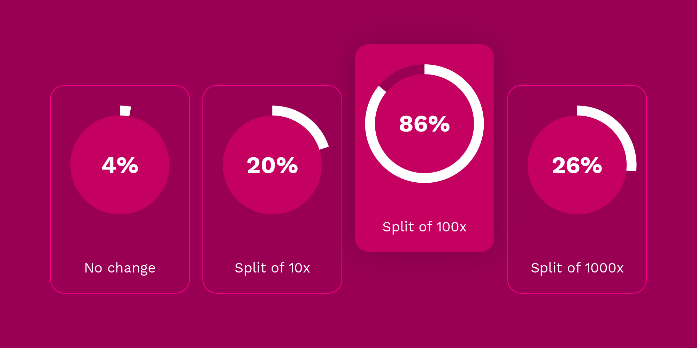

:::info Denomination Day

The DOT redenomination took place on 21 August 2020, known as Denomination Day, at block number
1_248_328.

:::

While [DOT](../learn/learn-DOT.md) is the unit of currency on Polkadot that most people use when
interacting with the system, the smallest unit of account is called the Planck. A Planck's relation
to DOT is like the relation of a Satoshi to Bitcoin. Before 21 August, the DOT was denominated as
1e12 Plancks, that is, twelve decimal places. After Denomination Day, DOT is denominated as 1e10
Plancks, as in, ten decimal places. DOT denominated to twelve decimal places is referred to as "DOT
(old)" and DOT denominated to ten decimal places is generally referred to as "DOT". When the
difference must be made explicit, the current ten-decimal-denominated DOT is referred to as "_New
DOT_".

:::note Redenomination Explainer

Check out our
[technical explainer video that explains more of Redenomination](https://www.youtube.com/watch?v=xXIcnBV4uUE&list=PLOyWqupZ-WGuAuS00rK-pebTMAOxW41W8&index=22&ab_channel=Polkadot).

:::

The change in denomination, henceforth referred to as the _redenomination_, was voted on by the
community of DOT holders. The community decided between four options, to change the DOT denomination
by a factor of ten, one hundred, one thousand, or not at all. The end result was to change the
denomination by a factor of one hundred.

The overall effect of this change was that the number of Polkadot's smallest unit, the Planck,
remained constant, while the DOT balance for all holders was increased by a factor of one hundred.
As one can see from the example below, the number of Plancks that a user has does not change, only
the number of Plancks that constitute a single DOT. A user with 1_000_000_000_000 Plancks still has
the same number of Plancks, but will have 100 DOT under the new denomination, as opposed to one DOT
under the old denomination.

```
   Before the change the decimal was here
   v
  1.000000000000 DOT

  100.0000000000 DOT
     ^
     After the change the decimal is here
```

:::note

There are no state changes with redenomination. There are no transfers. The real change regards the
social consensus around where to put the decimal place when we talk about what constitutes a DOT.

:::

## Origins

The initial vote for redenomination occurred as a
[referendum](https://kusama.polkassembly.io/referendum/52) on the Kusama blockchain. The referendum
was summarized as having four effects if approved by KSM holders.

:::info Referendum Summary

- The total allocations of DOT will increase one hundred times from 10 million to 1 billion.
- DOT allocation balances will increase by a factor of one hundred, such that 1 DOT will be 100 DOT.
- The distribution of DOT does not change, and holders of DOT still own an equal share of the
  network as before the change.
- The precision of DOT will change from 12 decimal places to 10 decimal places.
- The main benefit of this change is to avoid using small decimals when dealing with DOT and to
  achieve an easier calculation system.

:::

The initial referendum was proposed prior to the Polkadot genesis block under the assumption that
making a redenomination would be simpler before the Polkadot chain was live. However, many in the
community pointed out the disconnect of the two networks and how it was unfair for holders of DOT to
be impacted by a vote by a different token holder set. For this reason, Web3 Foundation
[decided to make a new vote on Polkadot](https://polkadot.network/results-of-dot-redenomination-referendum/)
when it went live, although the Kusama vote ended with a majority in favor of the redenomination
change.

Web3 Foundation summarized the decision not to change:

:::note

However, given the non-negligible amount of opposition, including from some within the ranks of Web3
Foundation and Parity, **the Foundation decided that we cannot, in good faith, sponsor the
redenomination.**

:::

## The Vote

After the genesis block of Polkadot was created and the network was running with a decentralized
community of validators securing the network, Web3 Foundation decided to put the redenomination
topic up to a vote again. This time, the vote was explicitly binding &mdash; meaning that it would
be executed if voted through. In comparison, the vote on Kusama was of course non-binding, being at
best a way to capture a signal without a direct way to affect the Polkadot chain.

Based on the feedback received during the Kusama referendum, the
[Polkadot vote](https://polkadot.network/the-first-polkadot-vote/) was held as an approval vote,
with four available options. DOT holders could issue votes for any configuration of the four
options: no change, a change of 10x, a change of 100x, or a change of 1000x. The vote logic was
contained in a specially-built Substrate pallet that was included in Polkadot's runtime for this
poll.

:::info Summary of the Vote

- Any combination of the four options may have been approved of by the voter. There was no need to
  only select one option.
- Approving of all or none of the options was equivalent and did not affect the outcome.
- All voters were able to alter their votes any number of times prior to the close of the poll.
- No discretionary lock-voting was in place; all DOT used to vote counts the same.
- Voting was made on a per-account basis; a single account must have voted the same way and was
  unable to split its vote.
- This vote did not affect any economics of the Polkadot platform. As in, staking rewards,
  inflation, effective market capitalization, and the underlying balances of every account remained
  completely unchanged. It was “merely” about what units the network uses to denominate the balances
  into “DOT”.

:::

With a voting period of two weeks set, the redenomination was now in the hands of the Polkadot
community for a final, binding decision.

## The Outcome



After two weeks of voting, the [results](https://polkadot.network/the-results-are-in/) of the
redenomination vote were tallied. About one third of the total DOT in the network participated in
the vote. The redenominaton proposal passed with 86% of the voters favoring a 100x factor increase
(or two decimal places of precision loss).

Polkadot's redenomination then took place on 21 August, now known as Denomination Day, at block
#1_248_328.

### What This Means for the Community

If you are a DOT holder or user of the network, then you do not need to take any action. The DOT
redenomination was a purely front-end change. You still hold the same amount of Plancks after the
change, but now it will appear that you hold 100x more DOT. This change applies proportionally to
every account.

### What This Means for Builders of Tools

If you are the builder of a tool that consumes the
[`@polkadot/api`](https://yarnpkg.com/package/@polkadot/api) package &mdash; then there should be no
real changes that need to be made in your application. The denomination is technically a cosmetic
change and every value is still a constant amount of Plancks.

However &mdash; if you are a builder of a tool that displays DOT balances to users (e.g. a wallet)
or handles DOT balances in an off-chain or custodial way, then you will need to ensure that you
display the correct denomination of DOT to users.

Please see our
[Ecosystem Redenomination Guide](https://docs.google.com/document/d/1yAzoDh99PgR_7dYAKTWLMVu2Fy5Ga-J6t9lof4f4JUw/edit#)
for recommendations.

Please reach out to [support@polkadot.network](mailto:support@polkadot.network) if you need any
assistance in making sure your software is compatible with the redenomination.
