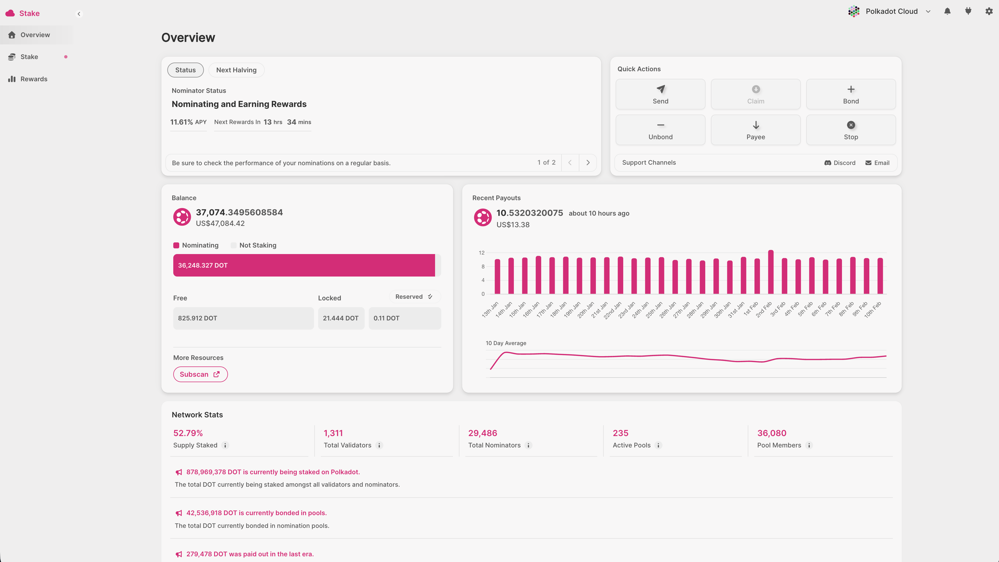
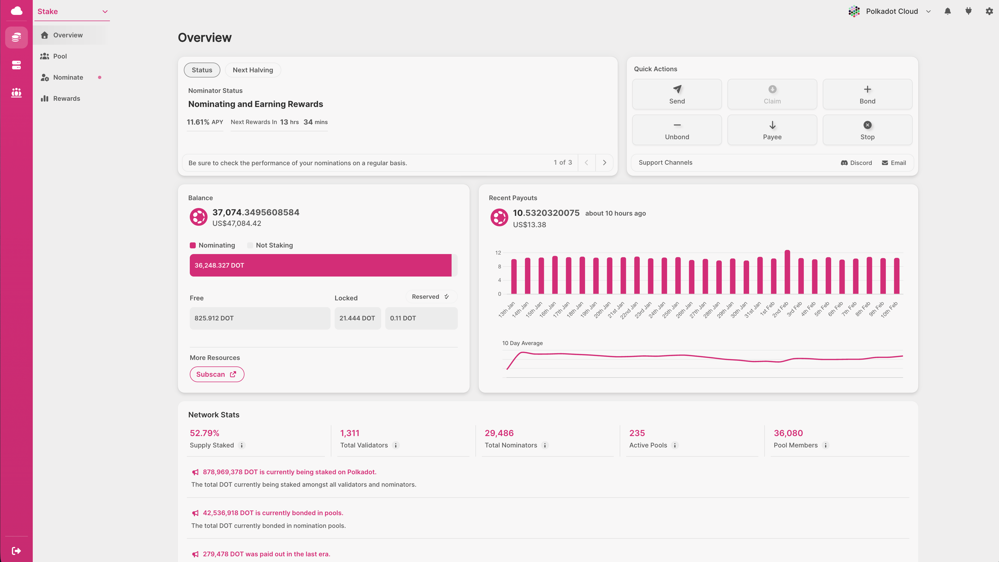

!!!info "Community Page"
    This page is open to contributions from the community. Please follow the
    [Wiki contribution guidelines](https://github.com/w3f/polkadot-wiki#contributing-to-documentation)
    and add your protocol native, permissionless, non-custodial NPoS Staking app to this page.

- [Polkadot Staking Dashboard](#polkadot-staking-dashboard)
- [PAPI Staking Dashboard](#papi-staking-dashboard)
- [NOMI](#nomi)
- [SubWallet Earning](#subwallet-ear[Polkadot Staking Dashboard](https://staking.polkadot.cloud/) is a Web3 application for native, non-custodial [staking](../learn/learn-staking.md) on Polkadot Hub.This section covers the official Polkadot Staking Dashboard for native, non-custodial staking on Polkadot Hub.[Polkadot Staking Dashboard](https://staking.polkadot.cloud/) is a Web3 application for native, non-custodial [staking](../learn/learn-staking.md) on Polkadot Hub.ning)

## Polkadot Staking Dashboard

[Polkadot Staking Dashboard](https://staking.polkadot.cloud/) is a Web3 application for native, non-custodial [staking](../learn/learn-staking.md) on Polkadot Hub.

=== "Simple Mode"

    

=== "Advanced Mode"

    

 The [Polkadot Staking Dashboard](https://staking.polkadot.cloud/) enables users to stake either as a solo nominator or as a [nomination pool](../learn/learn-nomination-pools.md) member, and also supports creating and managing nomination pools. The dashboard offers a Simple mode for new stakers and an Advanced mode for experienced stakers. It works with the most popular browser extension and hardware wallets, and supports [staking proxies](../learn/learn-staking.md#stash-account-and-staking-proxy).

Support is available via Discord and email accessible within the app. You can also find more information on the dedicated [wiki page](./dashboards/staking-dashboard.md) and
[support articles](https://support.polkadot.network/support/solutions/folders/65000157523).

Below is a simple list of video tutorials about the Polkadot Staking Dashboard:

- YouTube [Stake Your DOT: How to Nominate Validators](https://youtu.be/F59N3YKYCRs?feature=shared)
- YouTube [Stake Your DOT: Join a Nomination Pool](https://youtu.be/dDIG7QAApig?feature=shared)
- YouTube [Staking Dashboard Walkthrough](https://youtu.be/hvXLc4H7rA4?feature=shared)
- YouTube [Everything You Can Do After Staking](https://youtu.be/58pIe8tt2o4?feature=shared)
- YouTube [Create, Manage & Destroy Pools](https://youtu.be/aTFWhwy_Mxg?feature=shared)

## PAPI Staking Dashboard

The [PAPI Staking Dashboard](https://staking.usepapi.app/polkadot/dashboard) is a fully decentralized, trustless web application for native non-custodial [staking](../learn/learn-staking.md). It operates exclusively via Polkadot light clients with no reliance on centralized RPC endpoints or third-party indexers.

Key features include:

- **Light client support**: All data originates from direct peer connections, with a visible "trustless" status indicator confirming the decentralized connection.
- **Full staking functionality**: Supports real-time interaction, validator filtering, nomination rebalancing, bonding/unbonding, and reward claiming.
- **Solo nomination and pools**: Manage your staking operations as a solo nominator or participate in [nomination pools](../learn/learn-nomination-pools.md).

## NOMI

[NOMI](https://apps.turboflakes.io/?app=nomi) is designed to actively involve nominators in native
staking on the relay chain. It aims to offer a unique and enhanced nomination experience, using
[Multiple-Criteria Decision Analysis](https://en.wikipedia.org/wiki/Multiple-criteria_decision_analysis)
(MCDA) as a base for the analytical research. MCDA is an open and transparent approach for
evaluating numerous conflicting traits in the decision-making process. For the analysis, validator
data is collected at the last block of every session.

source: https://github.com/turboflakes/apps

## SubWallet Earning

[SubWallet Web Dashboard](https://web.subwallet.app/) is the all-in-one solution to manage assets
and stake on multiple networks in the Polkadot, Kusama and Polkadot SDK (Substrate) ecosystems.

The Web Dashboard features an Earning tab which allows users to stake DOT easily via native
nomination pools, as well as in liquid staking and lending protocols, without having to manage
multiple applications with different interfaces and experiences.
