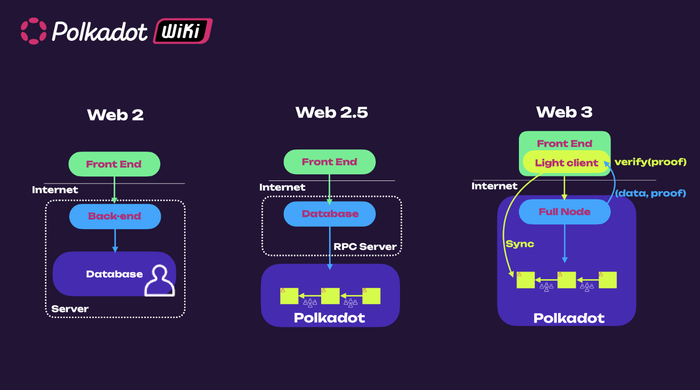

Back in the early 2000's the internet featured read-only, static, basic web pages. The online
connected world at the time was only the beginning of virtual data, identities, and more. The
internet during this time can be viewed as its first version (Web1).

As social media platforms and online businesses began to emerge, the internet transformed into its
next iteration - the Web2. This upgraded internet, which we use today, features dynamic, interactive
web pages, where users can read and write information and publish their own for others to see.
However, this version of the web comes with downsides, dealing with data control, privacy issues,
and the consequences of trusting centralized entities to store our data on their servers. This is
where Web3 comes into the picture.

Web3 is transforming applications hosted on centralized infrastructure into decentralized
applications (dApps) powered by trust-free blockchain protocols. The goal is to transform the
internet into a decentralized web, where users control their data and identity in a trust-free
environment. The Web3 movement aims to remove intermediaries and build trustless infrastructure.
Web3 is an interactive and collaborative web where users can read, write, and **own** data.

!!!note "The Web3 Movement"
    To learn more about the Web3 movement, check out this video from the [Web3 Summit](https://youtu.be/l44z35vabvA)

## Data Ownership

In web3, ownership is achieved and validated through cryptography. Each user has a digital identity
bound to a set of cryptographic keys usually based on the public key cryptographic scheme, i.e., the
famous **public and private key pair**.

Unlike Web2 which is driven by email IDs, phone numbers, and passwords, users onboarding to Web3
just need to generate a key pair. The public key can be the identity that can be shared with anybody
to send you messages or assets, while the private key is used to access your account, sign messages,
transfer funds, edit identity details, etc. [Keeping your private key secure](./scams.md) is
essential to avoid identity theft or consequent loss of funds. Currently, scams are one of the main
factors hindering web3 adoption. No legitimate person or entity will ever ask you to share your
private key, and those who attempt to do so are likely trying to steal your digital identity and
anything you own related to it.

To mitigate risks of key mismanagement (for **non-custodial** accounts, i.e. when you have custody
of your keys) there are [account abstraction](../learn/learn-account-abstraction.md) solutions that
separate the key management from the user experience. To mitigate key hacks, there are cold wallet
solutions where the private key is generated and stored on dedicated devices with secure elements
that are not exposed to the internet (see [Ledger](./ledger.md)), or dedicated applications that can
be installed on air-gapped devices such as phones (see [Polkadot Vault](./polkadot-vault.md)). For
**custodial** accounts, you trust third parties to manage your keys and give you access whenever
needed.

To summarize, data ownership comes from the fact that any message you sign with your private key
comes from your digital identity, and the signature proof can be cryptographically verified. Unless
someone else stole your keys, you and only you are held accountable for signing the messages and are
responsible for the information on your account. Transferring an [NFT](../learn/learn-nft.md) between
two accounts is essentially a transfer of ownership.

## Trustless Environment

Cryptography also brings the possibility of building a trustless environment where we do not have to
trust third parties, or have any relationship between the sender and receiver of a message. We do
not need to trust centralized entities since we can verify who wrote the message and who owns what
just by using cryptography. Trust is embedded in the code. Well-audited and reviewed code ultimately
provides a solid, trustless environment.

## Data Immutability

But what if the data we own can be easily modified or tampered with after they have been signed and
stored?

Here is where **blockchain** technology plays an important role. Blockchain networks comprise of
distributed state machines where increments of data are stored within blocks that build on each
other using hash functions. For example, the hash of block `N + 1` contains data of that block
together with the hash of the previous block `N`. This creates the situation where if you modify the
content of block `N` you will change the hash of block `N + 1`, `N + 2`, etc. essentially breaking
the chain. If a blockchain network is not sufficiently decentralized, it can be possible to add an
invalid block (a block with invalid transactions) or to censor certain transactions. In
decentralized proof-of-stake blockchains like Polkadot however, such attacks are financially
expensive and attempting them can get you [slashed](../learn/learn-offenses.md).

So, with blockchain as a means of storing data and transactions permanently without an option to
modify them, we can ensure what we cryptographically sign with our digital identity is set in stone
digitally.

## Data Retrievability

But what if our data are stored in a blockchain, but that blockchain is run on a centralized server
or by different computers belonging to the same operator?

That server or those computers can be easily shut down, the blockchain can be stopped from running
and its data wiped out. This can be achieved from the inside by the malicious network participants
or from the outside by regulatory rules and other forces. Though blockchain offers immutability,
there would be little sense in using a centralized blockchain to prove ownership as it can possibly
cease to exist in the future.

Data retrievability is dependent on how resilient the blockchain is. Resiliency is achieved through
elements such as decentralization, economic incentives, and on-chain governance to ensure the
network can sustain on its own.

!!!info Data Retrievability vs. Data Availability

Data **retrievability** is the ability of nodes to retrieve historical information from the
blockchain. Historical data is not needed to verify new blocks; it is only required for synching
full nodes from the Genesis block or serving specific historical requests.

Data **availability** assures full nodes can access and verify the full transactions associated with
a specific block. It does not necessarily imply that the data is accessible forever. For more
information about data availability on Polkadot, see the
[dedicated section on the parachain protocol page](../learn/learn-parachains-protocol.md#availability-and-validity-anv-protocol).

### Decentralization

Having multiple nodes belonging to numerous independent identities increases network resiliency and
thus data retrievability.

Blockchain is a state machine, and consensus must be achieved on every single state transition by
every node on the blockchain network. In Proof of Work (PoW) based blockchains, which let any node
in the network produce a block, consensus is achieved probabilistically by building on the longest
chain (at the cost of energy-intensive computations). Proof of Stake (PoS) based blockchains like
Polkadot enable deterministic consensus by allowing only a limited number of privileged nodes to
produce blocks. A PoW blockchain can be considered centralized if a single entity can capture 51% of
network nodes. Similarly, a PoS blockchain can be considered centralized if a single entity controls
more than one-third of nodes, as a two-thirds majority is required to arrive at a deterministic
consensus. Different blockchains have different levels of decentralization.

Nowadays, most of the nodes cannot be run on consumer-grade hardware. Node running equipment is
typically rented through service providers. Resiliency is also achieved by ensuring nodes run on as
many different providers as possible and avoiding a significant share of the nodes being run under
the same provider in the same geographic region. A legislation change or a natural disaster could
impact a considerable fraction of the nodes and potentially stop the network. Polkadot's level of
decentralization can be explored through the [Polkawatch app](https://polkawatch.app/).

The [Decentralized Nodes program](https://nodes.web3.foundation/) aims to incentivize the creation
of new validator nodes to increase the level of node decentralization.

### Decentralized Storage

[Blockspace](./glossary.md#blockspace) is limited and valuable. Not all data we have can be stored on
the blockchain. Large files like pictures, music, movies, etc., typically will never be held on the
blockchain. But where can we stored those files? To stick to the web3 vision, we need a resilient
and decentralized storage solution.

The most important thing is that the proof of ownership is stored on the blockchain through the
hashes of data and metadata. The files are uploaded on decentralized storage networks hosting
protocols like [IPFS](https://ipfs.tech/).

### Stake Allocation

In Proof-of-Stake blockchains, security is dictated by how much stake is locked on-chain (financial
security). In a decentralized network, you want to ensure that the difficulty level for a financial
attack to happen is equally difficult across all nodes. Polkadot's
[election algorithm](../learn/learn-phragmen.md) makes sure that the stake is maximized across all
active validators, and the variance in stake across validators is minimized as much as possible.

### Economic Incentives

Strong incentives are essential to incentivize network participants to run nodes and secure the
network. Strong incentives are possible because blockchain is a trustless system where there are no
intermediaries between who sends a message and who receives it. Such incentives, coupled with
punishment for bad behavior, ensure that most of the participants make the interest of the network
and work together to improve it.

But from where are those incentives coming from? Polkadot's native token
[DOT is inflationary](../learn/learn-inflation.md). Inflation is used to pay validators for running
nodes and reward nominators for providing the necessary stake to secure the network.

### Governance and Treasury

In Polkadot, an on-chain [treasury](../learn/learn-polkadot-opengov-treasury.md) together with an
[open governance](../learn/learn-polkadot-opengov.md) model allow to access funds in a fully
decentralized manner without any bank transaction whatsoever. This opens up the possibility to come
to a decision through on-chain voting mechanism, promoting a sense of community and creating an
independent socio-economical environment.

## Decentralized Access Points

But what if we have data we own stored on a resilient blockchain, but the only way to access the
blockchain is through an RPC server? Whoever is behind the server or an attacker could present us
data that is not the truth. How can we trustlessly verify that the data is true?

Here is where light clients play a key role. Light clients are clients that can sit on a web browser
and can fetch data directly from blockchain. The figure below shows the architectural difference
between web2 and web3 applications.

In web2 applications, data are stored on a centralized server, while in web3 applications, data (or
better data proofs) are stored on the blockchain. With light clients, it is possible to access
blockchain data through a full node and verify the validity of such data. They efficiently
synchronize (_warp sync_ in case of Polkadot) with a full node to obtain (Merkle Root) commitment of
the latest chain state, and hence can trustlessly verify any response by full node against the
commitment. In this way, we can always verify that the data we see is the truth, which is done
automatically by the light client. Polkadot has a browser-embedded light client
[Substrate connect](../build/build-light-clients.md) that uses the
[smoldot](https://github.com/smol-dot/smoldot) codebase. Most web3 applications today access
blockchain data through a centralized RPC server.

For more details about the inner workings of Smoldot, see
[this blog post](https://hackmd.io/@s_iGZLIITG6WjSgnFX0pcg/rkmmcvBno) and
[this video](https://youtu.be/YjsLpfM6a7E).

## Interoperability

The Web3 landscape's expansion into a multi-layered ecosystem highlights the need for
interoperability. Blockchains compete and differentiate themselves based on decentralization,
throughput, and specific use case focus. Some aim for a single high-performance base-layer
blockchain, while others focus on decentralization through layer-2 networks. With such diverse
approaches, it's crucial for distinct on-chain environments to interoperate, especially for
developers building cross-chain applications and traditional systems interacting with multiple
blockchains.

Various cross-chain interactions are employed to achieve interoperability, including token swaps,
token bridges, native payments, contract calls, and programmable token bridges. Each mechanism
serves specific functions, such as facilitating the exchange of tokens between different blockchains
or enabling smart contract interactions across chains. Other interoperability solutions validate the
state of a source blockchain and relay transactions to the destination blockchain, which is
essential for completing cross-chain interactions.

Interoperability between chains having different consensus has been a challenging task. Most of
hacks have exploited vulnerabilities in interoperability protocols. Polkadot provides secure
interoperability through [XCM](../learn/learn-xcm.md) and [XCMP](../learn/learn-xcm-transport.md) to
all blockchains attached to it. For more information, see the [Polkadot 1.0 page](./polkadot-v1.md)
and
[the section about XCM and Accords in Polkadot Direction page](./polkadot-direction.md#xcm-and-accords).