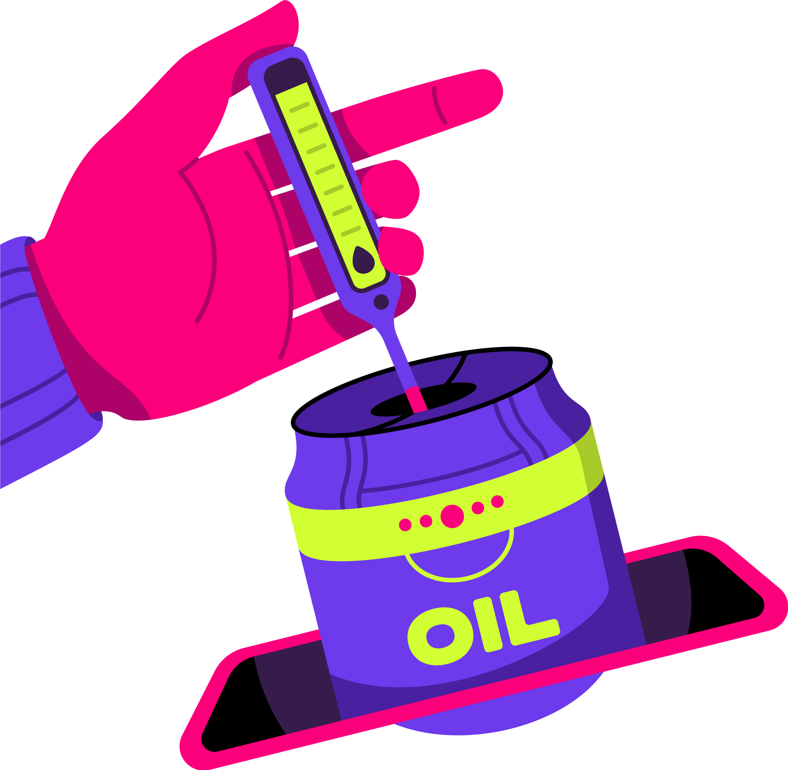

The Polkadot Wiki features high-level technical documentation about the Polkadot Ecosystem. Use the cards below to explore and learn more about Polkadot.

  <!-- Card 1 -->
  <a href="./general/getting-started" class="card-container" data-aos="fade-up" data-aos-delay="100">
    
    
Explore

    

      Explore Wallets, Applications and Programmes within the Polkadot Ecosystem.
    

  </a>

  <!-- Card 2 -->
  <a href="./learn" class="card-container" data-aos="fade-up" data-aos-delay="200">
    
    
Learn

    

      Learn about Polkadot and how it provides Shared Security and Secure Interoperability to its Parachains.
    

  </a>

  <!-- Card 1 -->
  <a href="https://docs.polkadot.com/develop/" class="card-container" data-aos="fade-up" data-aos-delay="100">
    
    
Build

    

      Most up-to-date Information on the Status of Development Tools in the Polkadot Ecosystem.
    

  </a>

  <!-- Card 2 -->
  <a href="https://docs.polkadot.com/infrastructure/" class="card-container" data-aos="fade-up" data-aos-delay="200">
    
    
Maintain

    

      Information and Guides on how to Deploy a Node and Run the Network.
    

  </a>

