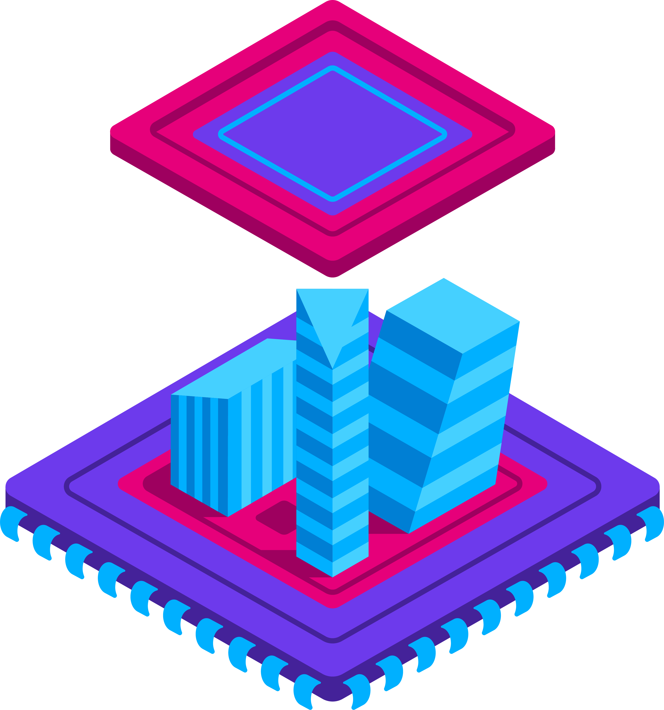
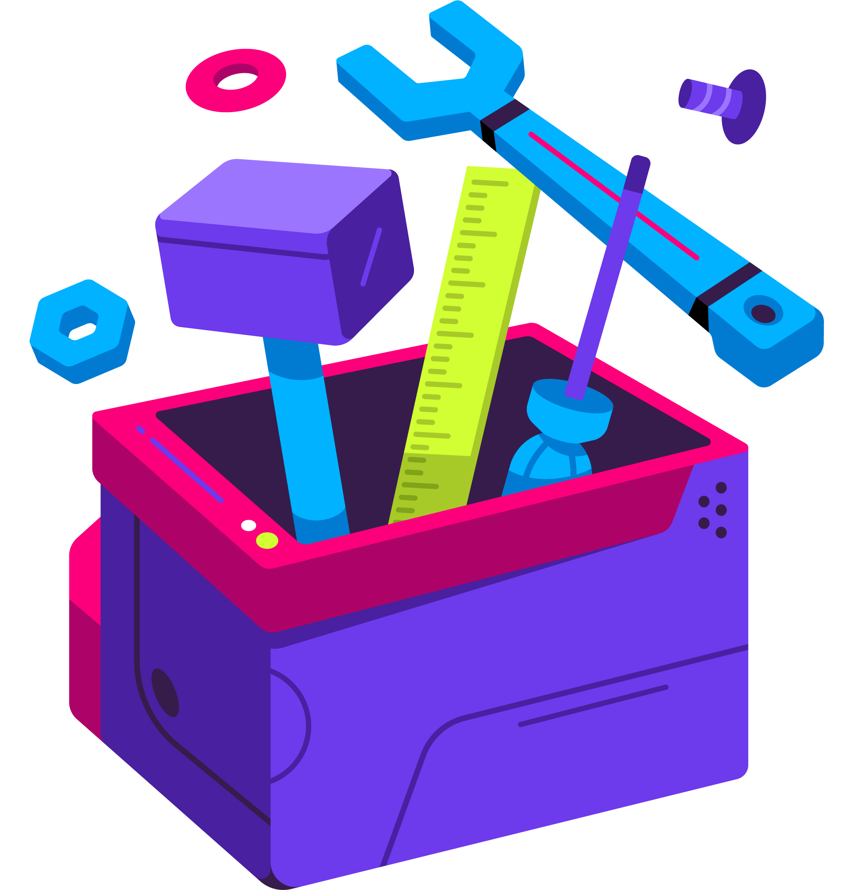

The Polkadot Wiki features high-level technical documentation about the Polkadot Ecosystem. Use the cards below to explore and learn more about Polkadot.

  <!-- Card 1 -->
  <a href="./general/getting-started" class="card-container" data-aos="fade-up" data-aos-delay="100">
    
    
Get Started

    

      Explore Wallets, Applications and Programs.
    

  </a>

  <!-- Card 2 -->
  <a href="./general/fundamentals" class="card-container" data-aos="fade-up" data-aos-delay="200">
    
    
Fundamentals

    

      Learn about how to interact with Polkadot.
    

  </a>

<!-- Card 3 -->
  <a href="./learn/learn-architecture" class="card-container" data-aos="fade-up" data-aos-delay="100">
    
    
Architecture

    

      Learn about Polkadot's core architecture.
    

  </a>

  <!-- Card 1 -->
  <a href="./general/dashboards/parity-data-dashboards" class="card-container" data-aos="fade-up" data-aos-delay="200">
    
    
Analytics

    

      Explore data-driven insights into the Polkadot ecosystem with interactive analysis and visualizations.
    

  </a>

  <!-- Card 2 -->
  <a href="./general/polkadotjs" class="card-container" data-aos="fade-up" data-aos-delay="100">
    
    
Guides

    

      Advanced guides for power users and developers about the Polkadot-JS tools.
    

  </a>

