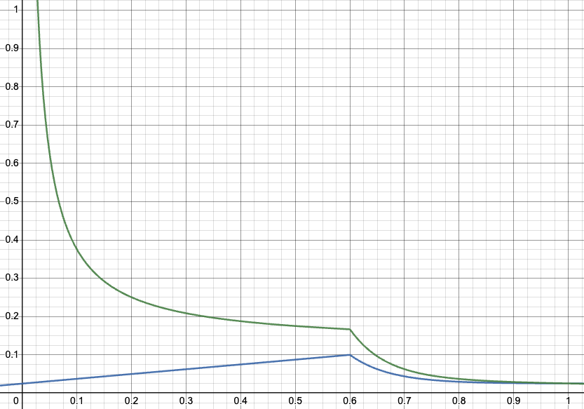

<!-- MessageBox -->

  

    <a href="../learn/learn-inflation.md" target="_blank" rel="noopener noreferrer">
      Learn about Polkadot's native token DOT inflation.
    </a>
  

  <button class="close-messagebox" aria-label="Close message">✖</button>

KSM is an inflationary token. Inflation is set to be 10% annually. Depending on the supply staked
and the ideal staking rate (more about this below), part of the inflation is distributed to the
stakers and part to the [treasury](../learn/learn-polkadot-opengov-treasury.md).

!!!info The current KSM token supply can be seen [here](../general/chain-state-values.md#total-issuance).

It is essential to understand that the primary objective of inflation is to incentivize network
participants through
[Nominated Proof of Stake (NPoS)](../learn/learn-consensus.md#nominated-proof-of-stake) and to grow the
network through funding the on-chain treasury. There is an opportunity cost of keeping the number of
tokens idle with the current inflation model as the tokens get diluted over time. Economics and game
theory suggest that setting an ideal inflation rate is essential for incentivizing the network
participants as well as the growth of the network, and any deviation from it can have adverse
effects. Reducing the inflation rate could limit growth, while increasing the inflation rate could
break the incentive model of the token. Hence, **token inflation rate is not a forever fixed value,
and inflation can be updated in the future through
[on-chain governance](../learn/learn-polkadot-opengov.md)** based on thorough tokenomics research.

## Kusama Inflation Model

The chart below shows the inflation model of the network. Depending on the number of staked tokens,
the distribution of the inflation to validators and nominators versus the treasury will change
dynamically to provide incentives to participate (or not participate) in staking.

There is a [dynamic _ideal staking rate_](#ideal-staking-rate) (in the figure set to 0.6 or 60%)
that the network tries to maintain. The inflation model will incentivize network participants to
stake when the _current staking rate_ < _ideal staking rate_ and disincentivize staking when
_current staking rate_ > _ideal staking rate_. The goal is to have the staking rate meet the ideal
staking rate. The current staking rate would be the total amount staked in the current era over the
total token supply, where the total amount staked is the stake of all validators and nominators on
the network. The ideal staking rate accounts for having sufficient backing of tokens to prevent the possible compromise of security while keeping the native token liquid.

More information [here](https://research.web3.foundation/Polkadot/overview/token-economics).

- **x-axis**: Proportion of staked tokens
- **y-axis**: Annualized percentage (inflation and staking rewards, see below)
- **Blue line**: Annual inflation rate diverted to NPoS, i.e., the total amount of tokens minted to pay validators and nominators. For instance, 0.1 corresponds to 10% of token inflation diverted to stakers. Since annual token inflation is 10%, all inflation is used to pay validators and nominators, and 0% of token inflation is diverted to the treasury.
- **Green line**: Annual rewards rate for stakers. For instance, 0.2 corresponds to 20% of annual returns on the staked tokens. You can determine the current annual staking rewards rate by looking at the top bar of the staking overview on [the Polkadot Staking Dashboard](https://staking.polkadot.cloud/#/overview).

Assuming that the ideal staking rate is 60%, all of the inflation would go to the validators and
nominators if 60% of all tokens are staked. Any deviation from the 60% - positive or negative -
sends the proportional remainder to the treasury. Deviations from the ideal staking rate are
referred to as _staking inefficiencies_. Thus, the treasury does not receive an inflow of funds from
inflation when the system staking rate equals the ideal staking rate. See
[this page](../learn/learn-polkadot-opengov-treasury.md) for more information about treasury inflow
sources.

For those who are interested in knowing more about the design of the inflation model for the
network, please see [here](https://research.web3.foundation/Polkadot/overview/token-economics).

## Ideal Staking Rate

The ideal staking rate can vary between 45% to 75% based on the number of parachains that occupied a
core (this excludes the system parachains), based on the implementation
[here](https://github.com/paritytech/polkadot-sdk/blob/cd901764a52edc04a6d22bea3a526def593ab2a7/polkadot/runtime/common/src/impls.rs#L80).

Briefly, the ideal staking rate can be calculated as follows:

`0.75 - auction_proportion`

where `auction_proportion` is obtained by computing `min(auctioned_slots, 60) / 300`. The
`auctioned_slots` are all the auctioned slots (or cores) without the cores for system parachains.

Assuming there are 50 filled cores, of which five are dedicated to
[system parachains](../learn/learn-system-chains.md), there are 45 auctioned cores. The
`auction_proportion` is thus `45 / 300 = 0.15`. The ideal staking rate is `0.75 - 0.15 = 0.6`.

If the amount of tokens staked goes below 60%, then staking rewards for nominators increase,
incentivizing them to stake more tokens on the network. On the contrary, staking rewards drop if
staked tokens exceed the ideal staking rate. This results from the change in the percentage of
staking rewards that go to the Treasury.
