There are several ways to generate a Polkadot address.

## Polkadot.js Browser Plugin

The polkadot.js plugin provides a reasonable balance of security and usability.
It provides a separate local mechanism to generate your address and interact
with Polkadot.

This method involves installing the polkadot.js
plugin and using it as a “virtual vault," separate from your browser, to store your private keys. It also
allows signing of transactions and similar functionality.

It is still running on the same computer you use to connected to the internet with and thus is less secure
than using Parity Signer or other air-gapped protocols.

### Install the Browser Plugin

The browser plugin is available for both [Google Chrome](https://chrome.google.com/webstore/detail/polkadot%7Bjs%7D-extension/mopnmbcafieddcagagdcbnhejhlodfdd?hl=en) and [FireFox](https://addons.mozilla.org/en-US/firefox/addon/polkadot-js-extension).

If you would like to know more or review the code of the plugin yourself, you can visit the Github source
[repository](https://github.com/polkadot-js/extension).

After installing the plugin, you should see the orange and white polkadot.js logo in the menu bar of your
browser.

### Open Accounts

Navigate to [Polkadot Apps](https://polkadot.js.org/apps). Click on the "Accounts"
tab. This is located in the sidebar on the left of your screen.

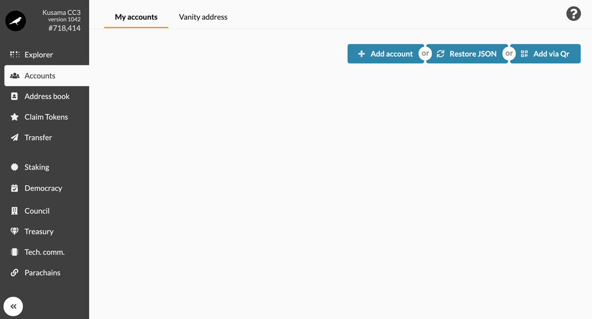

### Create Account

Open the polkadot.js browser extension by clicking the logo on the top bar of your browser. You will see a
separate browser window open. If you have used this extension before, you may see a list of previously
generated accounts. In any case you will see two buttons: “I want to create an account with a new seed” and “I
have a pre-existing seed, import the account."

Click “I want to create an account with a new seed”.

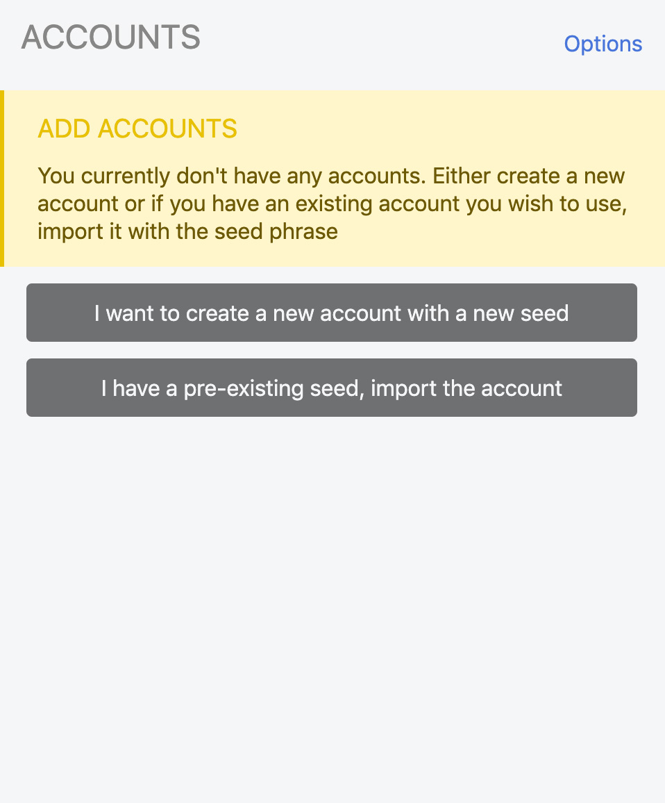

The polkadot.js plugin will then use system randomness to make a new seed for you and display it to you in the
form of twelve words.

You should back up these keys. It is imperative to store the seed somewhere safe, secret, and secure. If you
cannot access your account via polkadot.js for some reason, you can simply re-enter your seed, and have access
to your account once again.

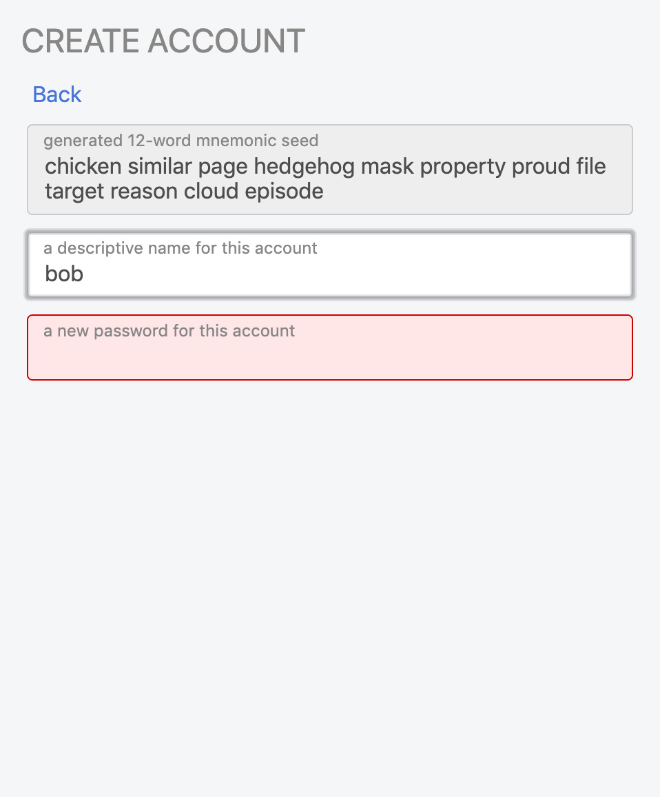

### Store the Key Safely

The seed is your **key** to the account. Knowing the seed allows you, or anyone
else who knows the seed, to re-generate and control this account.

It is imperative to store the seed somewhere safe, secret, and secure. If
you lose access to your account, you can re-create it by entering the seed. This
also means that somebody else can have control over your account if they have
access to your seed.

For maximum security, the seed should be written down on paper or another non-digital device and stored in a
safe place. You may also want to protect your seed from physical damage, as well (e.g. by storing in a sealed
plastic bag to prevent water damage, storing it in a fireproof safe, etc.) It is recommended that you store
multiple copies of the seed in geographically separate locations (e.g., one in your home safe and one in a
safety deposit box at your bank).

You should definitely not store your seed on any kind of computer that has or may have access to the internet
in the future.

### Name Account

You are not able to edit the seed words. However, you should add a descriptive name for this account in the
lower textbox (e.g. “Bob”, “Jane”, or “Office Account”).

### Enter Password

After typing a name for the account, a new textbox will appear in which you can enter a password. When you
start typing, a new textbox will appear underneath it. Enter the same password in the second textbox. If your
passwords do not match, the plugin will not allow you to generate the account.

Note that this password will protect your data in the plugin, and any backup file you export from the plugin.
It does NOT protect your seed phrase. If someone knows the twelve words in your mnemonic
seed, they still have control over your account even if they do not know the password.

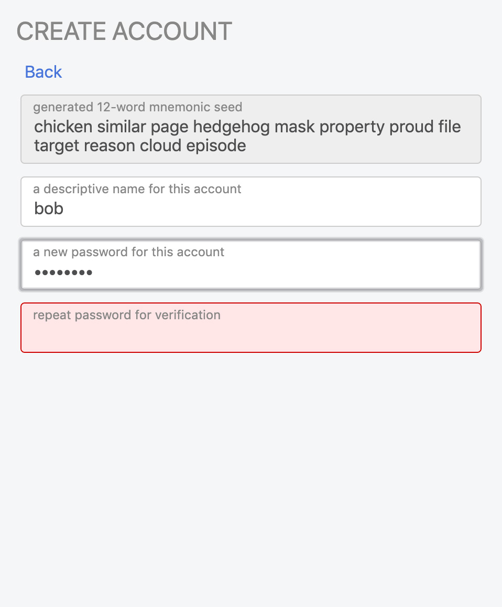

### Review Account

Once both of your passwords match, the program will display information about the account that will be
generated for you.

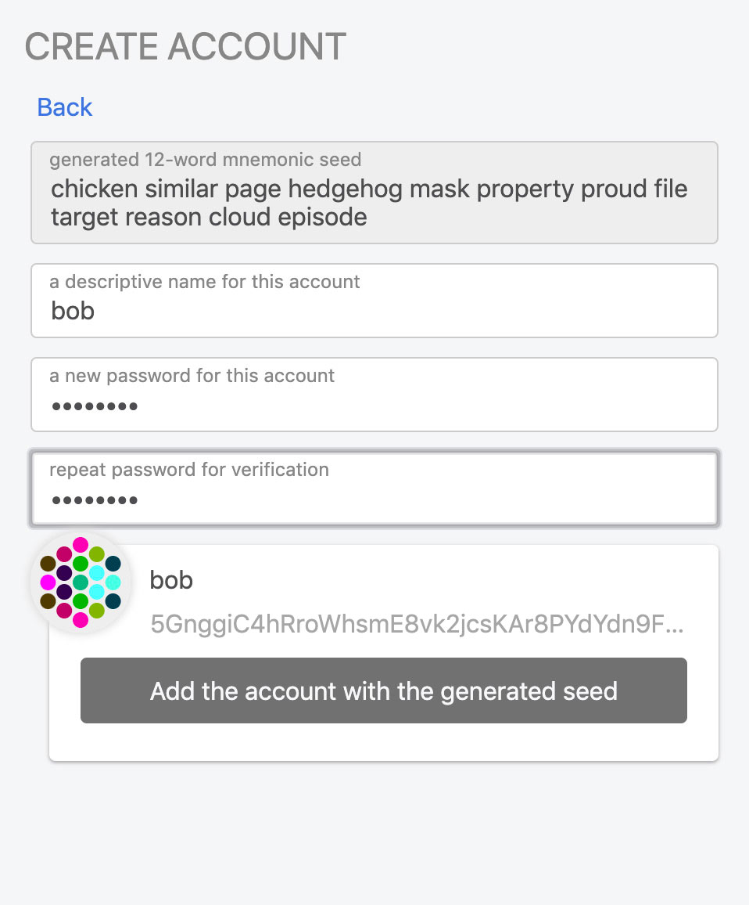

Click on “Add the account with the generated seed”. You will be taken back to the main page of the plugin,
which should now include your generated account.

### Set Address for Polkadot Mainnet

Now we will ensure that the addresses are displayed as Polkadot mainnet addresses.

Click on "Options" at the top of the plugin window.

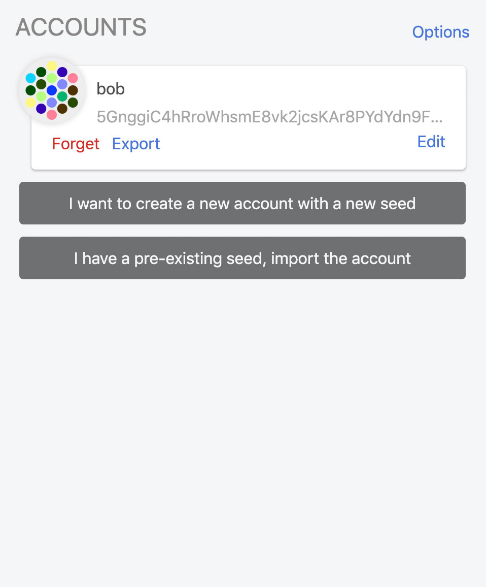

In the "display addresses formatted for" dropdown, select "Polkadot (live) and then click "Back".

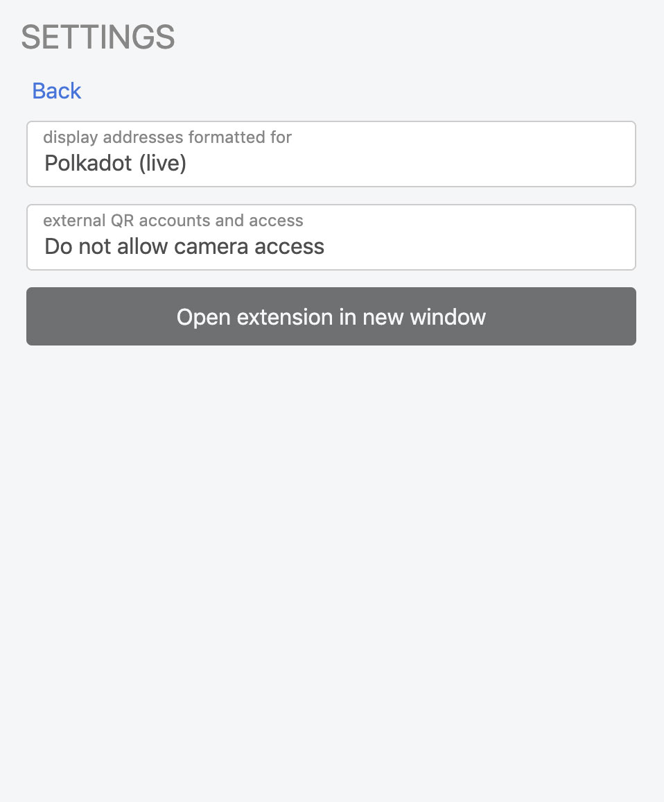

### Get Address

Verify that your address has a “1” as the first character. This indicates that it is a Polkadot mainnet
address.

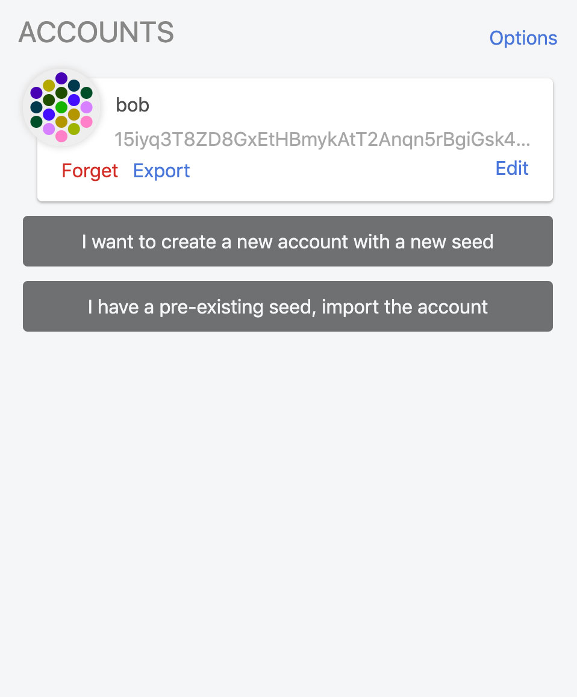

You can copy the address by double-clicking on the string representation of the address itself, and then
copying (e.g. with Control-C on Windows or Linux, Command-C on OS X). DO NOT click on the icon representing
your account (the colorful hexagon of differently-colored dots) - this will copy a Kusama version of your
address.

Be sure that you select the ENTIRE displayed address. Note that when you paste it, you will see even more
characters than are displayed.

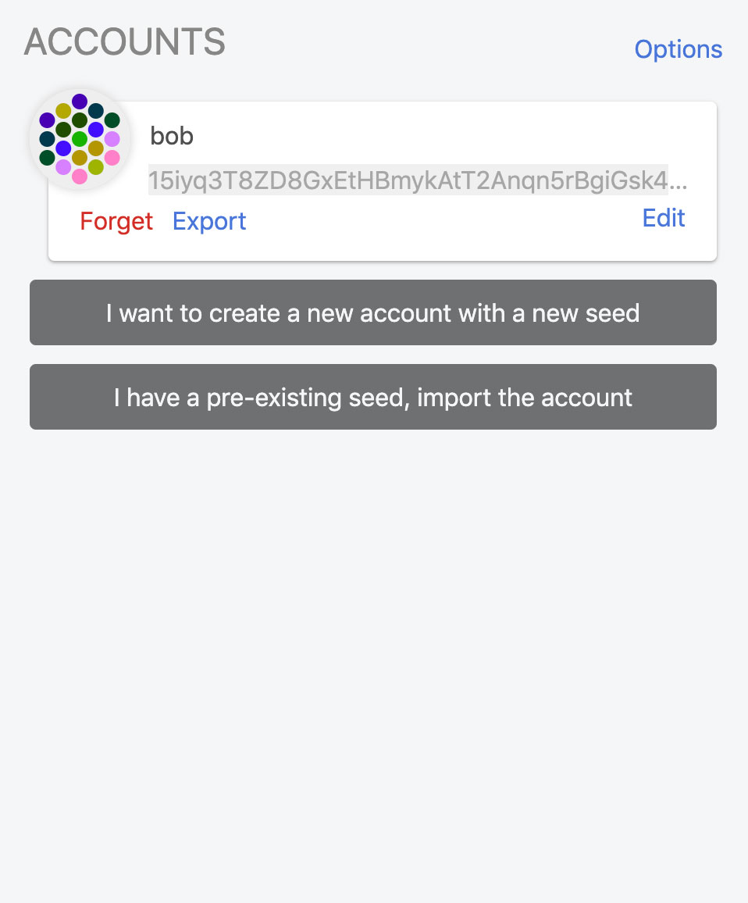

### Copy Address

You can now copy and paste the address from the address textbox, and you now have a plain-text copy of your
Polkadot mainnet address.

Note that an address in a different format can always be converted to a Polkadot address, since the same
public key can be used for generating addresses on different networks. However, for ease of use and
understanding, it is best to ensure that you are always using Polkadot mainnet addresses.

## Subkey

Subkey is recommended for technically advanced users who are comfortable with command line and compiling Rust
code. Subkey allows you to generate keys on any device that can compile the code. Subkey may also be useful for
automated account generation, using an air-gapped device other than one running iOS or Android or other specific
purposes. It is not recommended for general users.

For detailed build and usage instructions of subkey, please see [here](https://github.com/paritytech/substrate/tree/master/bin/utils/subkey).

## Polkadot.js

Using the polkadot.js user interface without the plugin is not recommended. It is
the least secure way of generating an account. It should only be used if all of 
the other methods are not feasible in your situation.

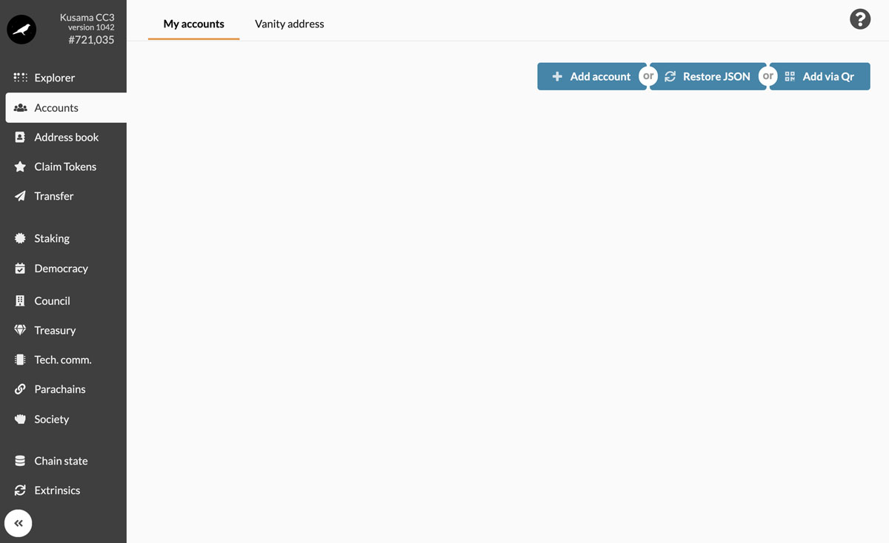

### Go to Polkadot Apps

Navigate to [Polkadot Apps](https://polkadot.js.org/apps) and click on the "Accounts"
tab. It is located in the sidebar on the left side of your screen.

### Start Account Generation

Click on the "Add Account" button.

You should see a pop-up that looks like the one here. The required text fields to complete are highlighted in
pink.

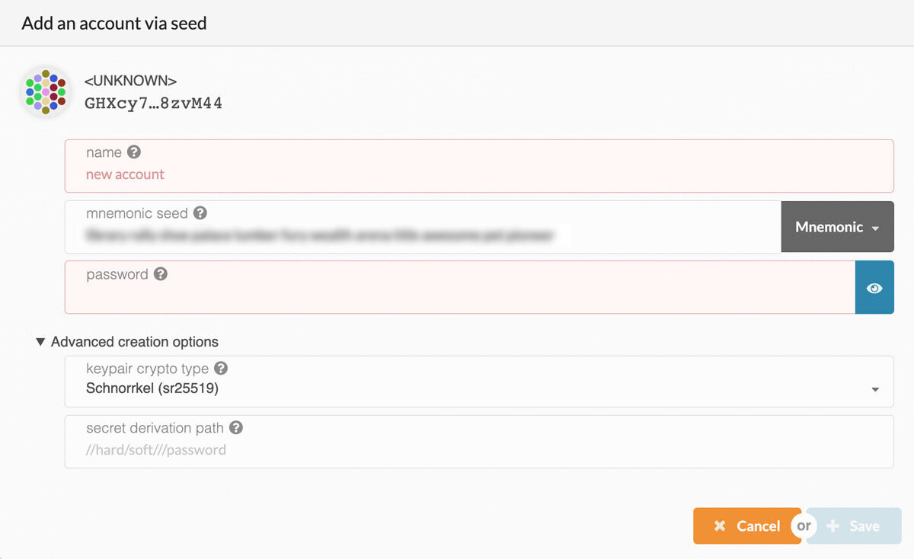

You can ignore the Advanced creation options; the defaults are fine. You will have to enter an Account Name
and a password to protect your account. Be sure to select a secure and hard-to-guess password. Note that
anything will be accepted as a password here. Please note: There are no checks to see if it is long enough or
secure. You will need this password for any future interaction with or transaction from this account.

When you have entered valid information for both, the color of the text boxes will turn from pink to white.

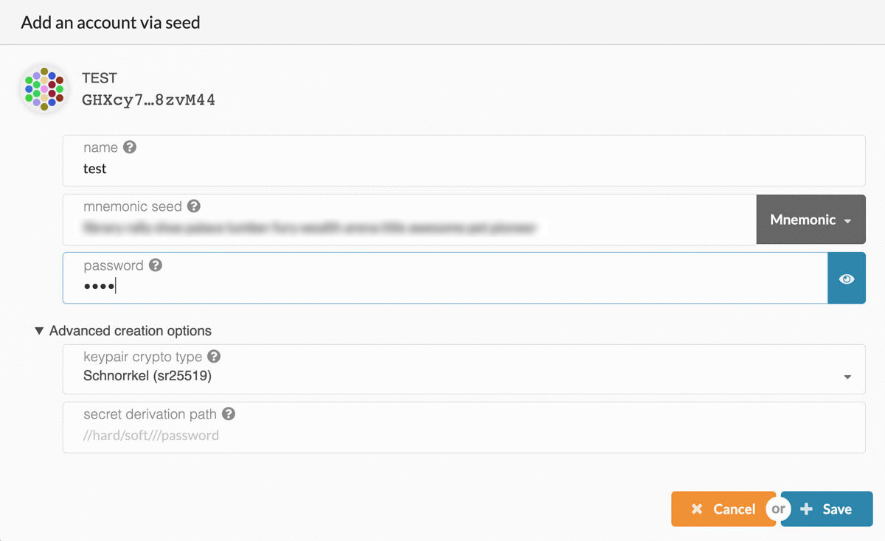

### Store the key somewhere safe

The seed is your **key** to the account. Knowing the seed allows you, or
anyone else who knows the seed, to re-generate and control this account.

It is imperative to store the seed somewhere safe, secret, and secure. If you lose access to your account, you
can re-create it by entering the seed. This also means that somebody else can have control over your account
if they have access to your seed.

For maximum security, the seed should be written down on paper or another non-digital device and stored in a
safe place. You may also want to protect your seed from physical damage, as well (e.g. by storing in a sealed
plastic bag to prevent water damage, storing it in a fireproof safe, etc.) It is recommended that you store
multiple copies of the seed in geographically separate locations (e.g., one in your home safe and one in a
safety deposit box at your bank).

You should definitely not store your seed on any kind of computer that has or may have access to the internet
in the future.

### Create and backup account

Click “Save” and your account will be created. It will also generate a backup file that you should save to
your computer. Ideally, you would also save it on an external hard drive or thumb drive, or print it out and
be able to re-enter it later. You should not store it in cloud storage, email it to yourself, etc.

You can use this backup file to restore your account. This backup file is not readable unless it is decrypted
with the password.

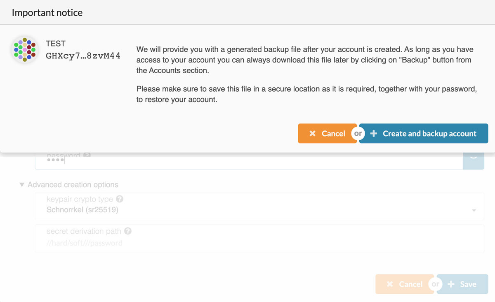

## Coinbase

Coinbase offers custody services for their customers with at least 1,000 dots and
during the _Claims_ process.

To open an account please contact Coinbase directly at <a href="mailto:sales@coinbase.com" target="_blank" rel="noopener noreferrer">sales@coinbase.com</a>.

Once you’ve opened an account, Coinbase Custody will generate a dot address for you to use in the
claims process and send it to you.

You may then claim your tokens using your Coinbase Custody dot address and your tokens will appear in your
Coinbase Custody account.

## Parity Signer

Parity Signer is a secure way of storing your dots on an air-gapped device.

__Coming soon!__ 

Parity Signer requires the genesis hash of the chain to be known in order to
derive new accounts. Since Polkadot is not launched yet - the genesis hash is
not known. Expect a Parity Signer release to follow the launch of Polkadot
that allows you to create accounts.