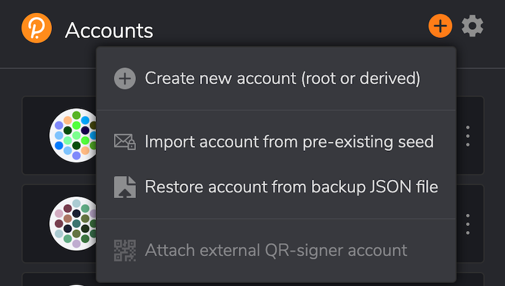
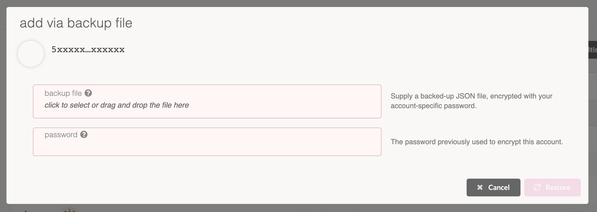
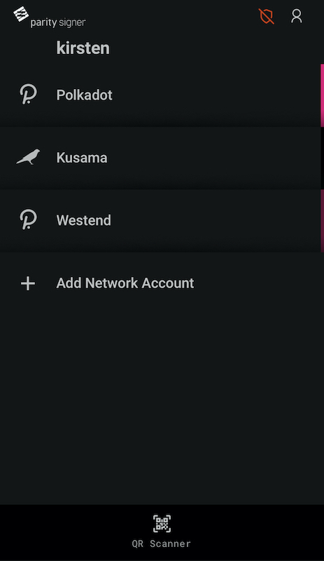
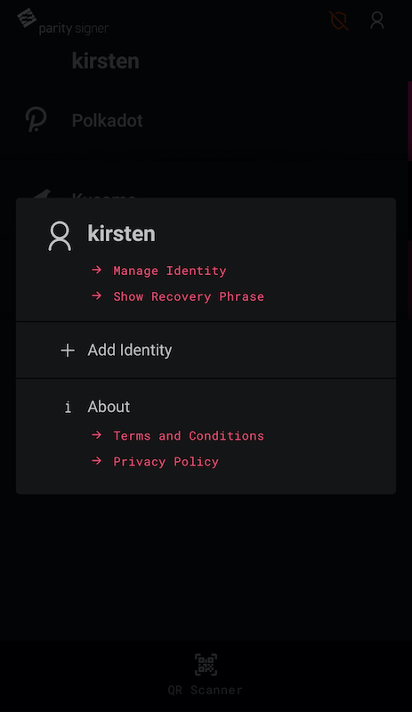
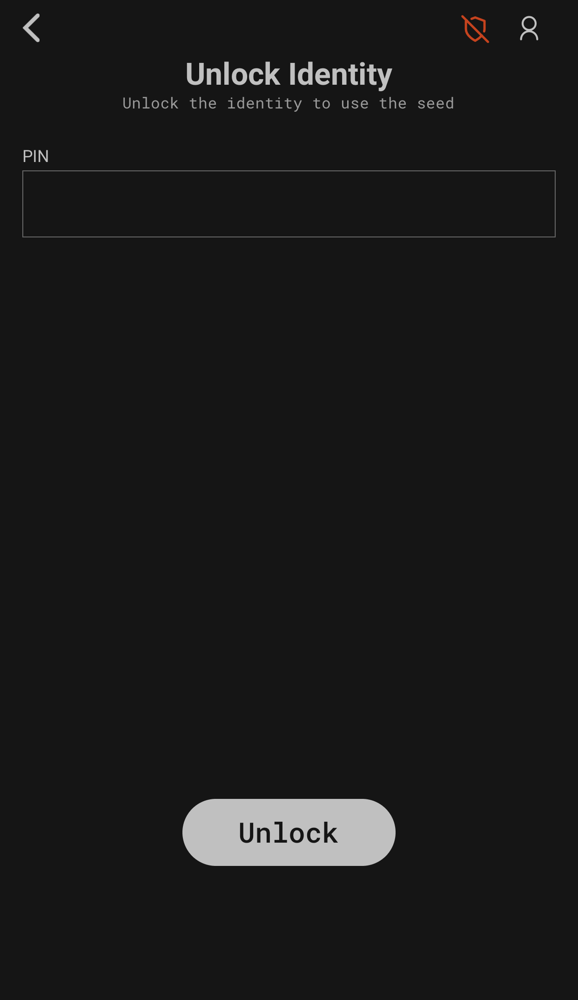
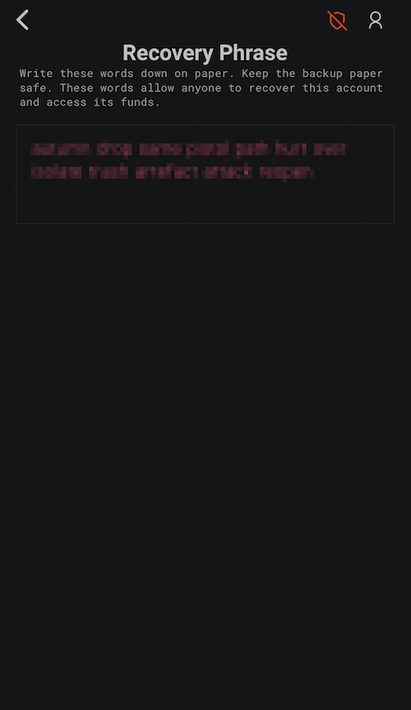
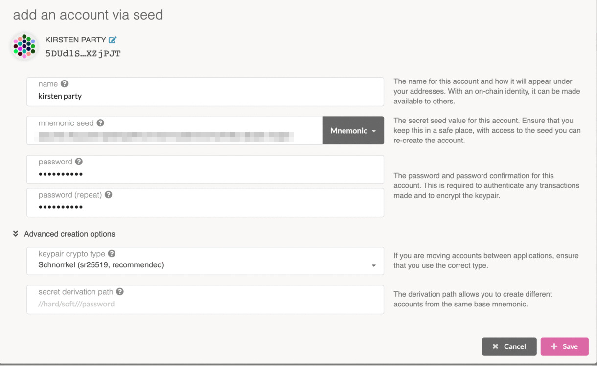
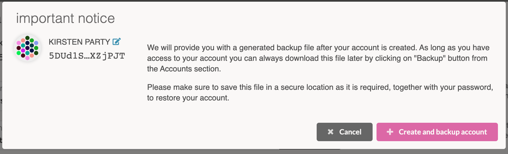

In the case that your Polkadot account needs to be restored, there are simple ways to take care of
this in Polkadot.js Browser Plugin, Polkadot.js, and Parity Signer. Note that in order to recover an
account, it is necessary that an account is made according to the instructions
[here](learn-account-generation).

## Polkadot.js Browser Plugin

For using the Polkadot.js browser plugin, restoring an account is simple. Let's start off by heading
over to the extension and selecting the desired account to restore. Click on the three dots beside
the address to open up a settings tab.

From here, we will be selecting the Export Account button, which will then ask you for the password
for that specific account. Once the password is entered, the browser will automatically download a
.json file that will hold all the account restoration details that will be used when you restore
your account. This part is _very important_.

Now, onto restoring the account. In Polkadot.js browser plugin, let's click on the + button at the
top. This will open up a tab with many choices listed, select "Restore account from backup JSON
file". This will then prompt you for the .json file which was download earlier and the password for
that account.

Once these are filled out, and the "Restore" button has been pressed, you'll be taken back to the
main page of the plugin. There listed will be your restored account!

## Polkadot.js

If you're using the main Polkadot.js UI, restoring an account will feel similar to restoring an
account on Polkadot.js browser plugin. The first step is to head over to the chosen account and
click on the three dots beside it. This will open up a tab with lots of options. For recovering an
account, press on "Create a backup file for this account".

From there, a pop up screen will appear, prompting for the password of that account. By entering
your password and clicking on "Download", your browser will download the .json file associated with
the Polkadot account. This .json file holds all relevant data about the account to be used in
account restoration.

Now that's completed, it's time to restore the account. On the Polkadot accounts page, click on the
"Restore JSON" button, which will let you upload your .json file that you downloaded and enter your
password for that account.

Once the "Restore" button has been pressed, you should see a green notification letting you know
that your account has been restored. That's it!

## Parity Signer

To restore an account on Parity Signer, open the app and click on the user profile icon in the top
right hand corner.

From here, we want to choose "Show Recovery Phase", which will be the next step in restoring an
account.

The next step will require you to enter your PIN that was created with your account on Parity
Signer. Once this has been added, you'll have access to your Mnemonic Recovery phrase for your
account.

Now, it's time to restore the account. Open up the Polkadot.js on your browser, and navigate to "Add
Account". Though this may seem counter-intuitive, we aren't actually adding in an account here,
rather we are restoring the account using its mnemonic recovery phrase. It is very important here to
put in the mnemonic recovery phrase from your Parity Signer account.

Note that you can change the name and password if desired.

Once you hit save, it is important to "Create and backup account", which will download a .json file
that contains all the relevant data for that account. At this point, we have successfully saved the
Parity Signer account onto Polkadot js and downloaded the account data, now we have restored the
account.

