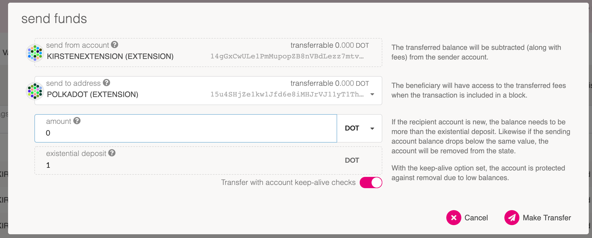

Balance transfers are used to send one balance from one account to another account. To start
transferring balances, we will begin by using [Polkadot-JS Apps][]. This guide assumes that you've
already [created a Polkadot or Kusama account](learn-account-generation) and have some funds that
will be transferred.

## Polkadot-JS Apps

Let's begin by opening up the [Polkadot-JS Apps][]. There are two ways to make a transaction:

1. By using the "Transfer" tab in the "Accounts" dropdown (located on the top navigational menu).
2. Clicking the "send" button while in the "Accounts" page.

### Using the Transfer Tab

Click on the "Transfer" tab in the "Accounts" dropdown.

Now a modal window will appear on the page. The modal asks you to enter 3 inputs:

- "send from account": Your account with funds that you will send from.
- "send to address": The address of the account that will receive the funds.
- "amount": The amount of tokens you will transfer.

The "existential deposit" box shows you the minimum amount of funds you must keep in the account for
it to remain active. See the [existential deposit][] section for more information.

After setting your inputs correctly, click the "Make Transfer" button and confirm. Once the
transaction is included in a block you will see a green notification on the top-right corner of your
screen.

### From the Accounts Page

Navigate to the "Accounts" page by selecting the "Accounts" tab from the "Accounts" dropdown located
on the top navigational menu of Polkadot-JS Apps.

You will see a list of accounts you have loaded. Click the "Send" button in the row for the account
you will like to send funds from.

Now you will see the same modal window as if using the "Transfer" tab. Fill in the inputs correctly
and hit "Make Transfer" then confirm the transaction. You will see a green notification in the
top-right corner of the screen when the transaction is included in a block.

[polkadot-js apps]: https://polkadot.js.org/apps
[existential deposit]: build-protocol-info#existential-deposit
=======
transferring balances, we will begin by using the Polkadot-JS User Interface.

## Polkadot-JS UI

Begin by opening up the [Polkadot-JS UI](https://polkadot.js.org/apps). There are two ways to make a
transaction: underneath "Accounts" by using the "Transfer" tab or through the "Accounts" tab. We
will be starting off with the Accounts tab, so head there.

> Please note: For these examples, the network of choice is Polkadot. If you'd like to change this,
> please click on the network selection from the top left corner of the navigation.

Assuming that you've already [created a Polkadot or Kusama account](learn-account-generation), we
will click on the "send" button beside the account you'd like to send from.

There should be a window that pops up displaying the sender, the receiver, the amount, and the
existential deposit (minimum amount you must have in your account balance).

If you wanted to send a transfer using the "Transfer" tab underneath "Accounts", you'd need to head
over to the specific tab and the window will ask you for the same information as before.