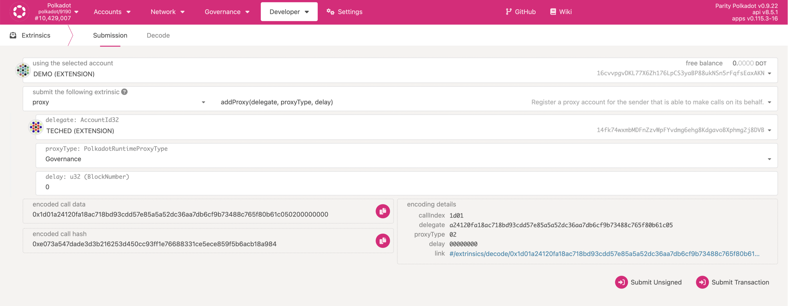
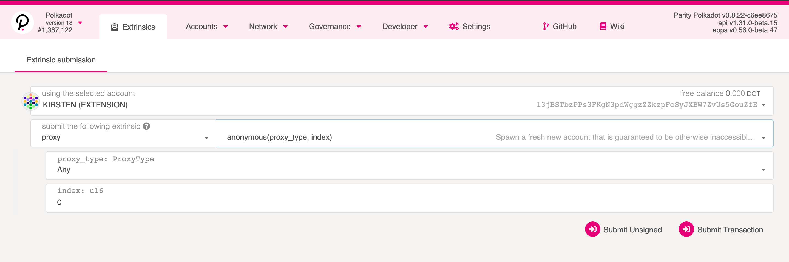
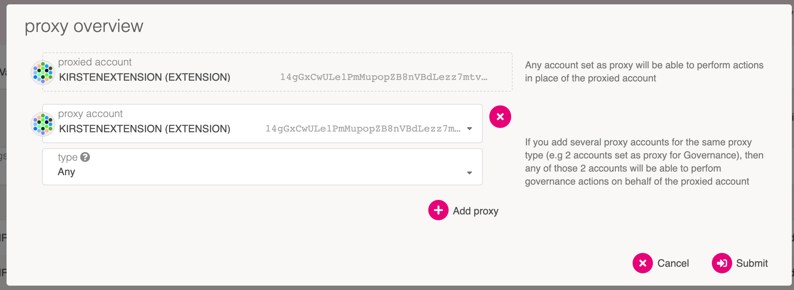
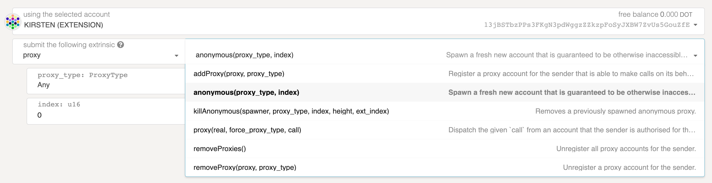

Polkadot provides a module that allows users to set proxy accounts to perform a limited number of
actions on their behalf. Much like the Stash and Controller account relationship in
[staking](learn-staking.md), proxies allow users to keep one account in cold storage and actively
participate in the network with the weight of the tokens in that account.

> Check out our Polkadot Youtube video that explains
> [what are proxies](https://www.youtube.com/watch?v=EuaM5dWAJis&list=PLOyWqupZ-WGuAuS00rK-pebTMAOxW41W8&index=29&ab_channel=Polkadot).

## Proxy Types

You can set a proxy account via the Proxy module. When you set a proxy, you must choose a type of
proxy for the relationship. Polkadot offers:

- Any
- Non-transfer
- Governance
- Staking
- Identity Judgement

When a proxy account makes a `proxy` transaction, Polkadot filters the desired transaction to ensure
that the proxy account has the appropriate permission to make that transaction on behalf of the cold
account.

### Any Proxies

As implied by the name, a proxy type of "Any" allows the proxy account to make any transaction,
incuding balance transfers. In most cases, this should be avoided as the proxy account is used more
frequently than the cold account and is therefore less secure.

### Non-transfer Proxies

Proxies that are of the type "non-transfer" are accounts that allow any type of transaction except
balance transfers (including vested transfers).

### Governance Proxies

The "Governance" type will allow proxies to make transactions related to governance (i.e., from the
Democracy, Council, Treasury, Technical Committee, and Elections pallets).

> See [Governance](maintain-guides-democracy.md#governance-proxies) for more information on
> governance proxies or watch our
> [technical explainer video that explores this concept](https://www.youtube.com/watch?v=q5qLFhG4SDw&list=PLOyWqupZ-WGuAuS00rK-pebTMAOxW41W8&index=27&ab_channel=Polkadot).

### Staking Proxies

The "Staking" type allows staking-related transactions, but do not confuse a staking proxy with the
Controller account. Within the Staking pallet, some transactions must come from the Stash, while
others must come from the Controller. The Stash account is meant to stay in cold storage, while the
Controller account makes day-to-day transactions like setting session keys or deciding which
validators to nominate. The Stash account still needs to make some transactions, though, like
bonding extra funds or designating a new Controller. A proxy doesn't change the _roles_ of Stash and
Controller accounts, but does allow the Stash to be accessed even less frequently.

### Identity Judgement Proxies

"Identity Judgement" proxies are in charge of allowing registars to make judgement on an account's
identity. If you are unfamiliar with judgements and identities on chain, please refer to
[this page](learn-identity.md#judgements).

### Anonymous Proxies

Polkadot includes a function to create an anonymous proxy, an account that can only be accessed via
proxy. That is, it generates an address but no corresponding private key. Normally, a primary
account designates a proxy account, but anonymous proxies are the opposite. The account that creates
the proxy relationship is the proxy account and the new account is the primary. Use extreme care
with anonymous proxies; once you remove the proxy relationship, the account will be inaccessible.

> Learn more about anonymous proxies from our
> [technical explainer video](https://www.youtube.com/watch?v=iWq53zXo7dw&list=PLOyWqupZ-WGuAuS00rK-pebTMAOxW41W8&index=28&ab_channel=Polkadot).


### Time Delayed Proxies

We can add an additional layer of security to proxies by giving them a delay time. The delay will be
quantified in number of blocks (blockNumber). Polkadot and Kusama both have
{{ block_target_in_seconds }} second blocks, hence a delay value of 10 will mean 10 blocks which
will equal 1 minute of delay. The proxy will announce it's intended action and wait for the number
of blocks defined in the delay time before executing it. The proxy will include the hash of the
intended function call in the announcement. Within this time window, the intended action may be
cancelled by accounts that control the proxy. Now we can use proxies knowing that any malicious
actions can be noticed and reverted within a delay period.

## Why use a Proxy?

Proxies are great to use for specific purposes because they add in a layer of security. Rather than
using funds in one sole account, smaller accounts with unique roles complete tasks for the main
stash account. This drives attention away from the main account and to proxies.

Anonymous proxies, in particular, can be used for permissionless management. In this example below,
there is a multisig with four different accounts inside. Two of the accounts, Alice and Bob, have an
anonymous proxy attached to them. In the case that the multisig account wanted to add or remove
Alice or Bob or even add in a new account into the anonymous proxy, the anonymous proxy would take
care of that change. If a multisig wanted to modify itself without an anonymous proxy, a whole new
multisig would be created.


## How to set up a Proxy

### Using the Polkadot-JS UI

To set up a proxy, navigate to the [Polkadot-JS UI](https://polkadot.js.org/apps/#/extrinsics) and
click on "Developer" > "Extrinsics". Here we will see a page that looks similar to this:



To add a proxy, click on the pallet selection dropdown menu. The dropdown is labeled "submit the
following extrinsic". Select the `proxy` pallet, then the `addProxy` extrinsic (in the dropdown menu
next to it). The `addProxy(proxy, proxy_type)` function will need to be selected in order to add in
a proxy. The chosen proxy account that you set will be the account that has the proxy on it. The
selected account at the top is the account that will be the primary account.

> Note: If you see an "unused" option when adding in a proxy, this is not a proxy type. This is an
> empty enum, and if you try to add this in as a proxy, nothing will happen. No new proxy will be
> created.

### Creating Anonymous Proxies on Polkadot-JS UI

For anonymous proxies, a different function will need to be called, the
`anonymous(proxy_type, index)`. This will let you select which kind of anonymous proxy you would
like to set up if you choose, as well as the index.



### Using Time Delayed Proxies

When creating a proxy through the PolkadotJS application, we are provided a delay field. In this
example we are creating a proxy with a delay value of 100, which means 100 blocks. 100 \* 6(minutes)
= 600 minutes, or 10 hours.


### Another way to create Proxies

There is another way you can set up a proxy on Polkadot-JS UI. Go to "Accounts" in the navigation
and then click the "Accounts" button. For each of the accounts you have on this page, the three dot
button will let you create a proxy by using "Add proxy". This will open up a pop up onto your screen
where you will be able to select the type of proxy for that specific account.



> Note: You cannot create an anonymous function from the Accounts page, you must be on the
> Extrinsics page.

### Removing Proxies

If you want to remove a proxy, there are a few functions on the extrinsic page that will help do
this. The `killAnonymous()` function will let you remove an anonymous proxy. Both the
`removeProxies()` and the `removeProxy()` will remove any other type of proxy but the former will
remove all proxies made while the latter will remove one selected proxy.



## How to view your Proxies

To view your proxy, head over to the Chain State (underneath "Developer") page on
[Polkadot-JS Apps](https://polkadot.js.org/apps/?rpc=wss%3A%2F%2Frpc.polkadot.io#/chainstate). If
you've created your proxy on a Kusama account, it is required to change your network accordingly
using the top left navigation button. On this page, the proxy pallet should be selected, returning
the announcements and proxies functions. The proxies function will allow you to see your created
proxies for either one account or for all accounts (using the toggle will enable this). Proxy
announcements are what time lock proxies do to announce they are going to conduct an action.


## Putting It All Together

If the idea of proxy types and their application seems abstract, it is. Here is an example of how
you might use these accounts. Imagine you have one account as your primary token-holding account,
and don't want to access it very often, but you do want to participate in governance and staking.
You could set Governance and Staking proxies.


In this example, the primary account A would only make two transactions to set account B as its
governance proxy and account C as its staking proxy. Now, account B could participate in governance
activity on behalf of A.

Likewise, account C could perform actions typically associated with a stash account, like bonding
funds and setting a Controller, in this case account D. Actions that normally require the Stash,
like bonding extra tokens or setting a new Controller, can all be handled by its proxy account C. In
the case that account C is compromised, it doesn't have access to transfer-related transactions, so
the primary account could just set a new proxy to replace it.

By creating multiple accounts that act for a single account, it lets you come up with more granular
security practices around how you protect private keys while still being able to actively
participate in a network.

## Proxy Deposits

Proxies require deposits in the native currency (i.e. DOT or KSM) in order to be created. The
deposit is required because adding a proxy requires some storage space on-chain, which must be
replicated across every peer in the network. Due to the costly nature of this, these functions could
open up the network to a Denial-of-Service attack. In order to defend against this attack, proxies
require a deposit to be reserved while the storage space is consumed over the life time of the
proxy. When the proxy is removed, so is the storage space, and therefore the deposit is returned.

The deposits are calculated in the runtime, and the function can be found in the runtime code. For
example, the deposits are calculated in Polkadot with the following functions:

```rust
// One storage item; key size 32, value size 8; .
pub const ProxyDepositBase: Balance = deposit(1, 8);
// Additional storage item size of 33 bytes.
pub const ProxyDepositFactor: Balance = deposit(0, 33);
```

The `ProxyDepositBase` is the required amount to be reserved for an account to have a proxy list
(creates one new item in storage). For every proxy the account has, an additonal amount defined by
the `ProxyDepositFactor` is reserved as well (appends 33 bytes to storage location).

On Polkadot the `ProxyDepositBase` is {{ dot_proxy_deposit_base }} and the `ProxyDepositFactor` is
{{ dot_proxy_deposit_factor }}.

So what this boils down to is that the required deposit amount for one proxy on Polkadot is equal to
(in DOT):

```
{{ dot_proxy_deposit_base }} + {{ dot_proxy_deposit_factor }} * num_proxies
```
