An on-chain identity is a good way to build up your reputation and let the community know
more about you if you plan on running a validator or being a councilor. Web3 Foundation is providing
registrar service in the Polkadot network for free, so if you want your identity to be
verified, follow the steps below to start. In case you would like to learn the basics of identity,
go [here](learn-identity).

The whole process of doing the verification is done by the bot. You will have an hour to complete
the verification. If you are not able to finish it within an hour, the judgment will be issued as
"Erroneous". Then you would have to call `clearIdentity` transaction first and redo everything
again.

> Note: The registrar bot will not ask you to send any DOT!

If you have provided `display name`, `email`, `twitter`, or `riot name` when setting an on-chain
identity, these will be required to verify one by one by signing a challenge message. Just be aware
of the `display name` cannot be too similar to others that have verified already.

Free feel to join the [Polkadot's community](community#polkadot) to ask questions if there is
anything unclear.

## Setting an On-chain Identity

Go to [Accounts](<(https://polkadot.js.org/apps/#/accounts)>) page in Polkadot-JS Apps. The easiest
way to add the built-in fields is to click the gear icon next to one's account and select "Set
on-chain identity".

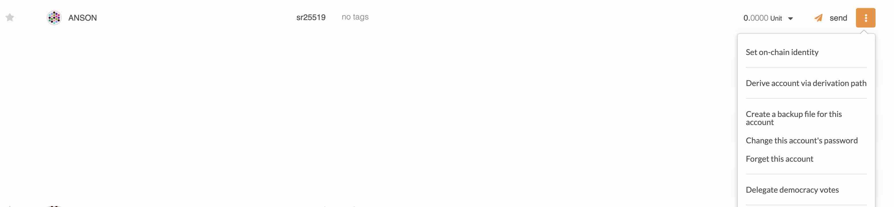

A popup will appear, offering the default fields.

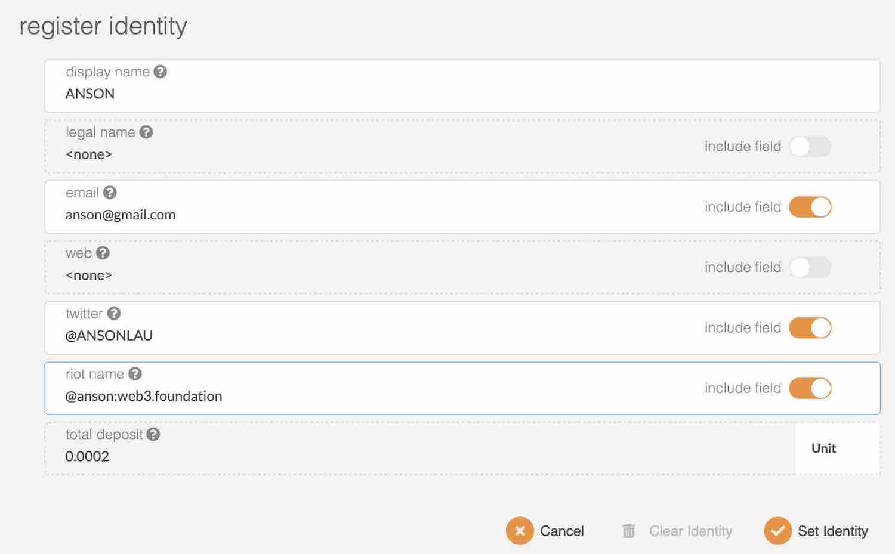

Once you have filled in the information you would like to store on-chain, click `Set Identity` to
submit the transaction.


Now you have set the identity information on-chain, but that is not verified yet, so you should see
a little grey icon beside your name. It is the time to interact with the W3F's verification bot by
submitting the judgment request to the W3F's registrar.

## Request Judgement

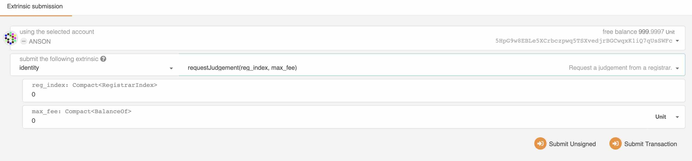

Go to
[Developer->Extrinics](https://polkadot.js.org/apps/?rpc=wss%3A%2F%2Frpc.polkadot.io#/extrinsics)
and select your account to submit the `identity -> requestJudgement(reg_index, max_fee)`
transaction. This will request the registrar to validate the information you set on-chain earlier.

```
reg_index - the position of the registrar. For W3F, use 0

max_fee - the amount of DOT you are going to pay for the registrar. For W3F, it does not cost anything, so 0.
```

> Friendly reminder: Once you have submitted "requestJudgement" transaction, if you are not able to
> complete the verification procedure in an hour, you would have to submit the "clearidentity"
> transaction first and then redo the whole thing from the beginning again.

## Element Verification

Since I have provided the Element, Twitter, and Email information in this example, I would start to
receive the verification requests from those platforms. As for Element, an invitation will be sent
by the bot named "W3F Registrar Verification".

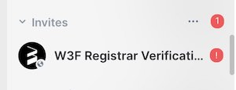

Once you accept the invitation, you should see the following information.

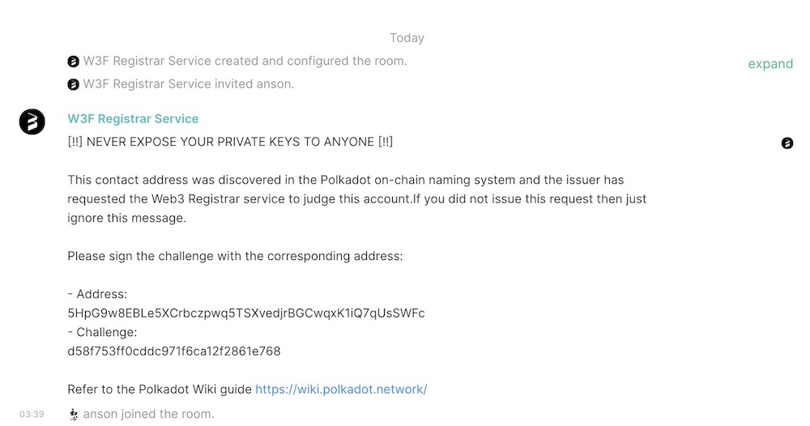

Then go to [Sign and Verify](https://polkadot.js.org/apps/#/signing) under the Developer tab in the
PolkadotJS and select your account, paste the "Challenge" data to the "sign the following data"
field and click "Sign message".

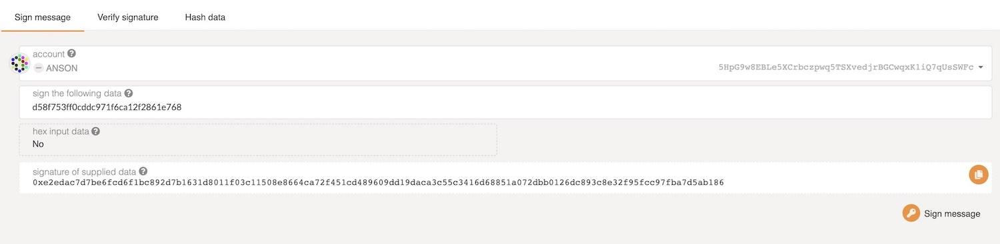

Copy the result of the "signature of supplied data" and paste it to the W3F Registrar Verification
chat.

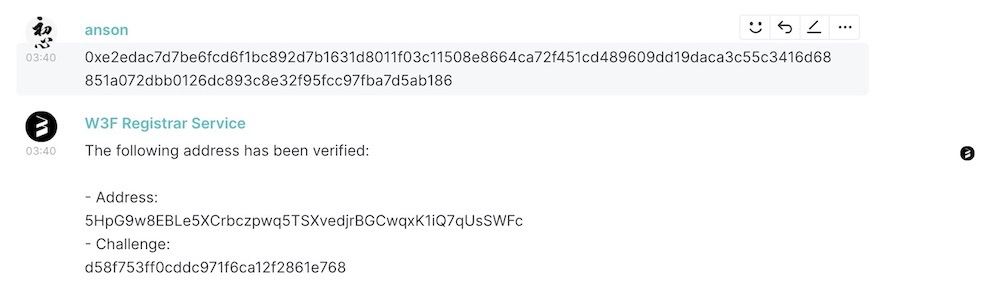

If the information is correct, you should see a message like the above image that indicates your
address has been verified. This basically proves you are the owner of the account.

## Email Verification

Next, you should receive an email called "W3F Registrar Verification Service". Below is an example
for reference.

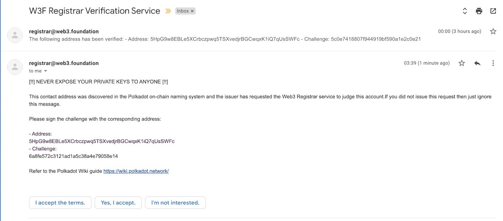

You would do what you did in the above again. Copy the "Challenge" data and go to
[Sign and Verify](https://polkadot.js.org/apps/#/signing) under the Developer tab in the PolkadotJS
and select your account, paste the "Challenge" data to the "sign the following data" field and click
"Sign message"

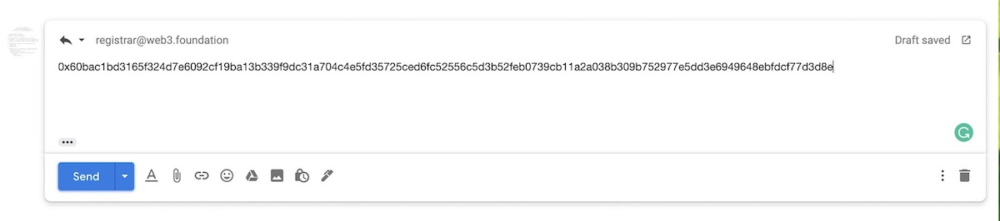

And reply with your signed data only in the email. Then click "Send".

> Note: Do not add anything in the email except the signed data.

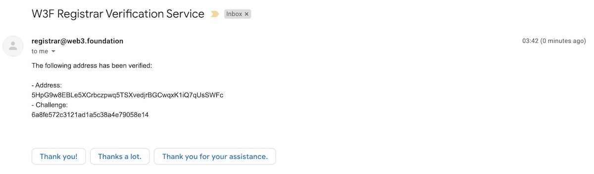

Wait for 1 to 2 minutes. You would receive another email that shows your email has been verified
successfully.

## Twitter Verification

Lastly, if you have provided Twitter handle, you would have to follow
[@w3f_registrar](https://twitter.com/w3f_registrar) first.

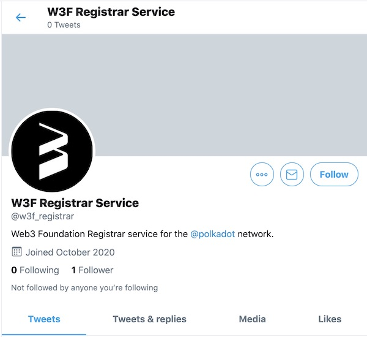

And then wait for 1 to 2 minutes, the Twitter bot would send a challenge message to you.

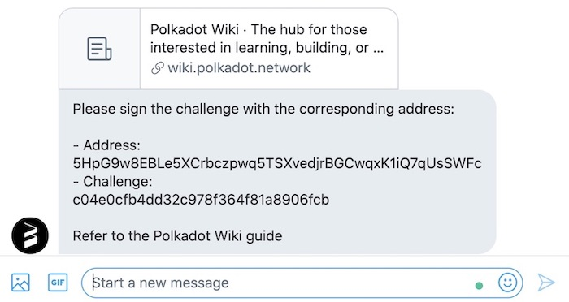

Then you would do the same thing as the previous step to go to the
[Sign and Verify](https://polkadot.js.org/apps/#/signing) under the Developer tab in the PolkadotJS
and select your account, paste the "Challenge" data that you received in the Twitter to the "sign
the following data" field and click "Sign message".

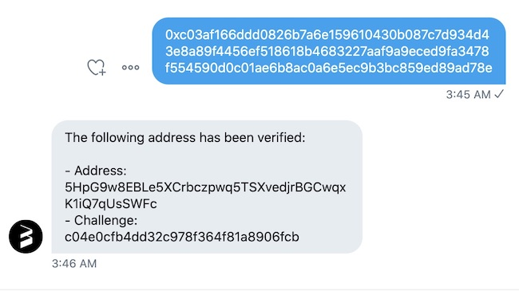

Paste the signed data to the chat and you would receive the verification status after 1 to 2
minutues.

If everything has been verified successfully, you would see your account verification status has
been marked as "reasonable" with a green tick icon on the
[Accounts](https://polkadot.js.org/apps/#/accounts) page.

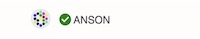

Congratulations!
