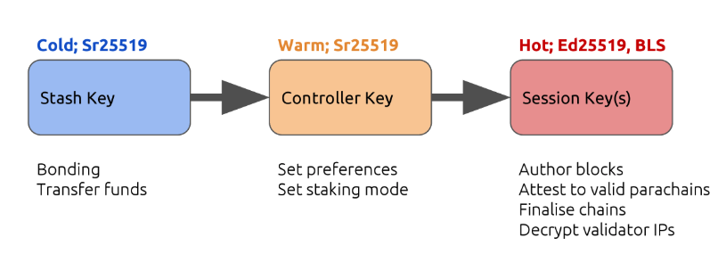

Polkadot uses NPoS (Nominated Proof-of-Stake) as its mechanism for selecting the validator set. It is designed with the roles of **validators** and **nominators**, to maximize chain security. Actors who are interested in maintaining the network can run a validator node. At genesis, Polkadot will have a limited amount of slots available for these validators, but this number will grow over time to over one thousand.

The system also encourages an unlimited number of DOT holders to participate as nominators, where a nominator backs the election of one or more trusted validator candidates (up to 16), to ensure the network will not be heavily centralized on only a few validators. Validators take the role of both validating blocks and guaranteeing the finality of the chain, while nominators will have the power to choose the set of validators by indicating their support weighted by DOTs. Validators earn rewards by completing payable actions in the protocol (for example, producing a new block in BABE), Nominators will get paid relevant to their stake that they have behind a specific validators, with validators having the option to specify an initial portion of the rewards to take for themselves.

## How does staking work in Polkadot?

### 1. Identifying which role you are

In staking, you can be either a [nominator or a validator](#validators-and-nominators).

As a nominator, you can nominate one or more (up to 16) validator candidates that you trust to help you earn rewards in DOTs. You can take a look at the [nominator guide](maintain-nominator) to understand what you are required to do when the mainnet launches.

A validator node is required to be responsive 24/7, perform its expected duties in a timely manner, and avoid any slashable behavior. You can follow our [Alexander validator guide](maintain-guides-how-to-validate-alexander) if you want to run a validator in the current testnet, or our [Kusama validator guide](maintain-guides-how-to-validate-kusama) if you would like to run a validator on Kusama.

### 2. Nomination period

Any potential validators can indicate their intention to be a validator candidate. Their candidacies are made public to all nominators, and a nominator in turn submits a list of any number of candidates that it supports. In the next epoch (lasting several hours), a certain number of validators having the most DOT backing get elected and become active. There are no particular requirements for a DOT holder to become a nominator, though we expect each nominator to carefully track the performance and reputation of validators.

Once the nomination period ends, the NPoS election mechanism takes the nominators and their associated votes as input, and outputs a set of validators of the required size, that maximizes the stake backing of any validator, and that makes the stakes backing validators as evenly distributed as possible. The objectives of this election mechanism are to maximize the security of the network, and achieve fair representation of the nominators. If you want to know more about how NPoS works (e.g. election, running time complexity, etc.), please read [here](http://research.web3.foundation/en/latest/polkadot/NPoS/).

### 3. Staking Rewards Distribution

To explain how rewards are paid to validators and nominators, we need to consider **validator pools**, where a validator pool consists of an elected validator together with the nominators backing it. (Note: if a nominator n with stake s backs several elected validators, say k, the NPoS election mechanism will split its stakes into pieces s_1, s_2, …, s_k, so that it backs validator i with stake s_i. In that case, nominator n will be rewarded the same as if there were k nominators in different pools, each backing a single validator i with stake s_i). For each validator pool, we keep a list of nominators with the associated stakes.

The general rule for rewards across validator pools is that two validator pools get paid the **same amount of DOTs** for equal work, i.e. they are NOT paid proportional to the stakes in each pool. Within a validator pool, a (configurable) part of the reward goes to pay the validator’s commission fees, and the remainder is paid **pro-rata** (i.e. proportional to stake) to the nominators and validator. Notice in particular that the validator is rewarded twice: once as commission fees for validating, and once for nominating itself with stake.

To estimate the inflation rate and how many DOTs you can get each month as a nominator or validator, you can use this [Excel sheet](https://docs.google.com/spreadsheets/d/1-9Hc3kZ23EhZC3X6feRUKSTv6gj4xR7cvUbJD2zUEZk/edit?usp=sharing) as a reference and play around with it by changing some parameters (e.g. validator pools, total supply, commission fees, etc.) to have a better estimate. Even though it may not be entirely accurate since staking participation is changing dynamically, it works well as an indicator.

### 4. Rewards Mechanism

We highlight two features of this payment scheme. The first is that since validator pools are paid the same, pools with less stake will pay more to nominators per-DOT than pools with more stake. We thus give nominators an economic incentive to gradually shift their preferences to lower staked validators that gain a sufficient amount of reputation. The reason for this is that we want the stake across validator pools to be as evenly distributed as possible, to avoid a concentration of power among a few validators. In the long term, we expect all validator pools to have similar levels of stake, with the stake being higher for higher reputation validators (meaning that a nominator that is willing to risk more by backing a validator with a low reputation will get paid more).

The following example should clarify the above.  For simplicity, we have the following assumptions:

* These validators do not have a stake of their own.
* They do NOT charge any commission fees
* Reward amount is 100 DOT tokens
* The least amount of DOTs to be a validator is 350


||**A - Validator Pool**|||
|:----:|:----:|:----:|:----:|
|Nominator (4) | Stake (600) | Fraction of the Total Stake | Rewards|
|Jin| 100 | 0.167 | 16.7|
|**Sam**| 50 | 0.083 | 8.3|
|Anson| 250 | 0.417 | 41.7|
|Bobby | 200 | 0.333 | 33.3|

||**B - Validator Pool**|||
|:----:|:----:|:----:|:----:|
|Nominator (4) | Stake (400) | Fraction of the Total Stake | Rewards|
|Alice | 100 | 0.25 | 25|
|Peter | 100 | 0.25 | 25|
|John | 150 | 0.375 | 37.5|
|**Kitty** | 50 | 0.125 | 12.5|

_Both validator pools A & B have 4 nominators with the total stake 600 and 400 respectively._

Based on the above rewards distribution, nominators in validator pool B get more rewards per DOT than those in pool A because pool A has more overall stake. Sam has staked 50 DOTs in pool A, but he only gets 8.3 in return, whereas Kitty gets 12.5 with the same amount of stake.

We also remark that when the network slashes a validator slot for a misbehavior (e.g. validator offline, equivocation, etc.) the slashed amount is a fixed percentage (and NOT a fixed amount of DOTs), which means that validator pools with more stake get slashed more DOTs. Again, this is done to provide nominators with an economic incentive to shift their preferences and back less popular validators whom they consider to be trustworthy.

The second point to note is that each validator candidate is free to name their desired commission fee (as a fixed amount of DOTs) to cover operational costs. Since validator pools are paid the same, pools with lower commission fees pay more to nominators than pools with higher fees. Thus, each validator can choose between increasing their fees to earn more DOTs, or decreasing their fees to attract more nominators and increase their chances of being elected. We will let the market regulate itself in this regard. In the long term, we expect that all validators will need to be cost efficient to remain competitive, and that validators with higher reputation will be able to charge slightly higher commission fees (which is fair).

## Accounts

There are three different accounts for managing your funds: `Stash`, `Controller` and `Session` accounts.



- **Stash:** This account holds funds bonded for participation, but delegates its staking and governance functions to controller and proxy keys. As a result, you may actively participate with a stash key kept in a cold wallet, meaning it stays offline all the time, possibly sharded in bank vaults. After unbonding, users must wait a certain amount of time in order to access the locked funds (600 blocks at the time of writing).
- **Controller** This account controls its stash account's nomination of validator nodes, or authorizes operation of your own validator, switching between validating, nominating and idle. It only needs enough funds to post transactions when actions are taken.
- **Proxy** This account participates in governance on behalf of its stash account. Again, it only needs enough funds to post vote transactions.
- **Session** Session keys are not account keys, but instead consist of several different key types used by validator nodes for different functions. A validator operator first certifies their session keys with their controller key. We recommend handling session keys using only your node's RPC interface because if session keys exist elsewhere then you might equivocate and be slashed. We still support the legacy `--key` parameter for testnets like Alexander.

We designed this hierarchy of separate key types so that validator operators and nominators can protect themselves much better than in systems with only one key. As a rule, you lose security anytime you use one key for multiple roles, or even if you use keys related by derivation. You should never use any account key for a "hot" session key in particular.

Any account key (stash, controller, proxy, etc.) could be either sr25519 or ed25519. At present, Polkadot session keys include one Sr25519 and several Ed25519 keys, but we shall add BLS12-381 and a zero-knowledge VRF mechanism, and parachains might employ other session key types.

For more on how keys are used in Polkadot and the cryptography behind it [see here](learn-keys).

## Validators and nominators

Since validator slots will be limited, most of those who wish to stake their DOTs and contribute economic security to the network will be nominators. Validators do most of the heavy lifting, they produce new block candidates in BABE, vote and come to consensus in GRANDPA, validate STF of parachains, and possibly some other responsibilities in regard to data availability. Nominators, on the other hand do not need to do anything once they have bonded their DOTs. The experience of the nominator is similar to "set it and forget it" while the validator will be doing an actual service for the network by performing the critical operations. For this reason, the validator has certain privileges in regard to the payout of the staking mechanism and will be able to declare its own allocation before the share is divided to nominators.


### Want to stake DOTs?

- [Nominator Guide](maintain-guides-how-to-nominate) - Become a nominator on the Alexander testnet.
- [Validator Guide](maintain-guides-how-to-validate) - Become a validator on the Alexander testnet.

## Slashing

Slashing will be applied if a validator has been reported to be offline for a number of times. Essentially, there are two parameters that will be taken into account whether the slashing will happen or not, these are `Offline Slash Grace` & `Unstake Threshold`.
`Offline Slash Grace` is configured by the network, and the current testnet configuration is set to `4`, whereas `Unstake Threshold` is decided by the validator. However,the maximum number of `Unstake threshold` is NOT allowed to be set greater than 10 in the current setting.

In short, validators will be slashed if they have been reported offline more than `Offline Slash Grace + Unstake Threshold` times.

At the same time, once slashing is determined, a value will be deducted from the balance of the validator and all the nominators that have voted for this validator.

### Example

```
    Offline Slash Grace = 4 (Network define)

    Unstake Threshold   = 5 (Validator define)
```

In this case, slashing will only occur if a validator has been reported offline more than 9 times.

## Reward Distribution

Based on the the current configuration in the Alexander testnet, rewards are recorded per session that is roughly 5 minutes and paid per era. It takes 1 hour to finish an era; that means rewards will be distributed to the validators and nominators per hour.

### Example

```
    PER_ERA * BLOCK_TIME = **Reward Distribution Time**

    600 * 6 = 3600 = 1 Hour

    ***These parameters can be changed by proposing a referendum***
```

Validators can create a cut of the reward that is not shared with the nominators. After the value gets deducted, the remaining portion is based on their staked value and split between the validator and all of the nominators who have voted for this validator.

For example, assume reward is 100 DOTs.
A validator may specify `validator_payment = 50 DOTs` and the remaining 50 DOTs would be split between the validator and their nominators based on the portion of stakes they had.

Rewards can be used by the same account (controller) to keep accumulating the rewards or by the stash account (increasing the staked value/not increasing the staked value). Also, it is possible to top-up/withdraw partial bonded DOTs without having to completely un-stake everything.

## Inflation

It is planned to be close to 10% in the first year. This means that each validator will get 1,000 - 2,000 DOTs per month to share with their nominators.


<sub><sup>Source: [Research - Web3 Foundation](https://research.web3.foundation)</sup></sub>

**x-axis**: amount of DOTs staked

**y-axis**: the annualized percentage

**Green line**: return rate based on the staking participation

**Blue line**:  inflation rate

The above chart shows the inflation model of the network. Depending on the staking participation, the inflation rate will be dynamically changed to incentivize / disincentivize token holders to participate in staking. For instance, inflation would be 10% if 50% of DOTs are being staked to the network.

Determining the ideal staking rate is not an easy task as the network requires enough DOTs to be staked to provide the security guarantees we want and to avoid illiquidity on the market.

For those who are interested in knowing more about the design of inflation model for the network, please see [here](https://research.web3.foundation/en/latest/polkadot/Token%20Economics/).

## Why stake?

- 10% inflation/year when the network launches
- 50% targeted active staking
- ~20% annual return

## Why not stake?

- Tokens will be locked for about 12 weeks
- Punishment in case of validator found to be misbehaving

## How many validators will Polkadot have?

The plan is to start with somewhere between 50 to 100 open validator positions and open more gradually. The top bound on the number of validators has not been determined yet, but should only be limited by the bandwidth strain of the network due to frequent and voluminous peer-to-peer message passing. The estimate of the number of validators that Polkadot will have at maturity is around 1000.

## Resources

- [How Nominated Proof of Stake will work in Polkadot](https://medium.com/web3foundation/how-nominated-proof-of-stake-will-work-in-polkadot-377d70c6bd43) - Blog post by Web3 Foundation researcher Alfonso Cevallos covering NPoS in Polkadot.
