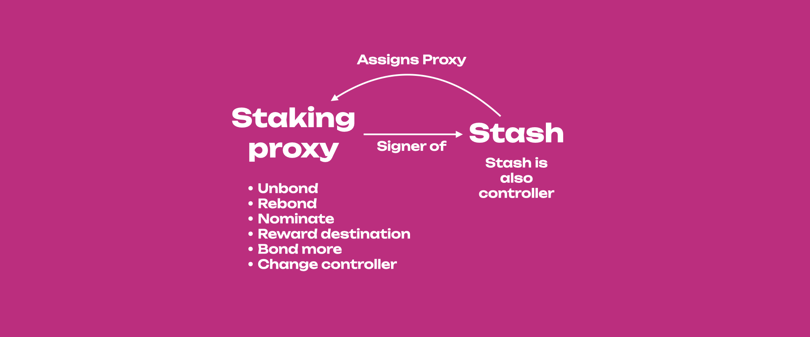
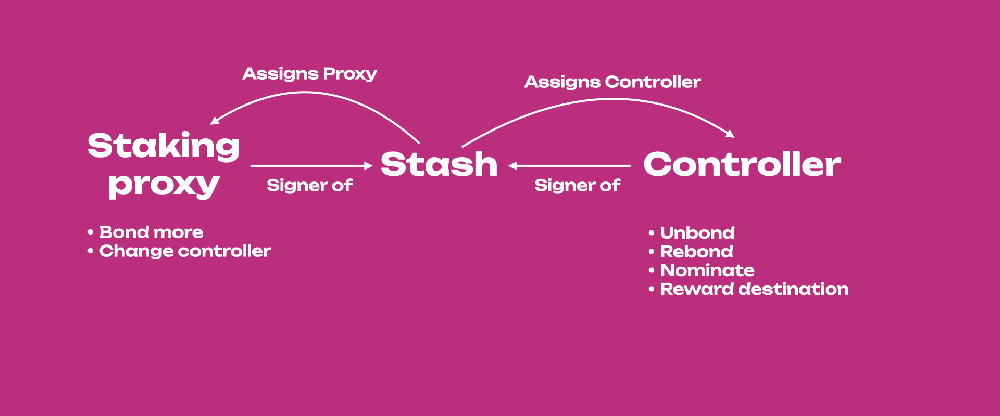

<!-- MessageBox -->

  

    The content on this page is archived. Controller accounts are deprecated. For more information, see
    <a href="https://forum.polkadot.network/t/staking-controller-deprecation-plan-staking-ui-leads-comms/2748" target="_blank" rel="noopener noreferrer">
      this discussion.
    </a>
  

  <button class="close-messagebox" aria-label="Close message">✖</button>

Controller accounts were used for staking and were a "less-powerful" version of staking proxies.
Controllers could only sign for unbonding and rebonding funds, nominating and changing the reward
destination. The stash account was still used to bond more funds and change the controller.
Controller accounts became redundant and added unnecessary complexity to the staking mechanics.

With the setup shown above, the stash account was not entirely isolated. More complicated designs to
fully isolate the stash account included having both controller and staking proxies (see below).

## Stash as Controller

It was unnecessary to have a controller if you had a staking proxy. In this case the stash was also
set to be the controller, and the account security would not have been compromised. The staking
proxy was used to sign all staking-relate transactions. Note that you needed to sign with the stash
to change the staking proxy.

This past situation was similar to the present setup, except that now there is no option to set the
stash as controller and that the action of "changing the controller" is missing. From a practical
perspective, we need to use only one account and remember one password to sign for all
staking-related transactions. From a security perspective, who controls the staking proxy controls
our staking actions.

## Stash not as Controller

If the stash and controller were different accounts, the staking proxy was used to bond more funds
and change the controller. Thus the staking proxy was used to sign for those transactions that were
used less often and usually signed by the stash.

From a practical perspective, there were two accounts, and we needed to remember two passwords. From
a security perspective, the party who wanted to control our staking actions was required to control
two accounts.
