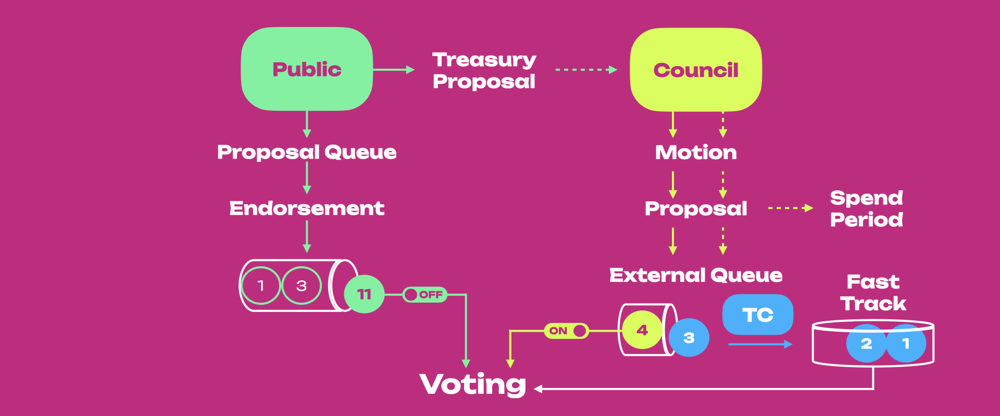

<!-- MessageBox -->

  

    The content on this page is archived. For up-to-date information about governance, see the
    <a href="../learn-polkadot-opengov" target="_blank" rel="noopener noreferrer">
      Polkadot OpenGov page.
    </a>
  

  <button class="close-messagebox" aria-label="Close message">✖</button>

Polkadot uses a sophisticated governance mechanism that allows it to evolve gracefully overtime at
the ultimate behest of its assembled stakeholders. The stated goal is to ensure that the majority of
the stake can always command the network.

Polkadot brings together various novel mechanisms, including an amorphous (abstract) form of
state-transition function stored on-chain defined in a platform-agnostic language (i.e.
[WebAssembly](../learn-wasm.md)). It also allows for several on-chain voting mechanisms, such as
referenda with the novel concept of [Adaptive Quorum Biasing](#adaptive-quorum-biasing) and batch
approval voting. All changes to the protocol must be agreed upon by stake-weighted referenda.

To make any changes to the network, the idea is to compose active token holders and the council
together to administrate a network upgrade decision. No matter whether the proposal is proposed by
the public (token holders) or the [Council](#council), it finally will have to go through a vote on
a referendum to let all holders, weighted by stake, make the decision.

## Governance Summary

The figure below shows an overview of Governance V1 with the key actors and different paths for
submitting a proposal that can potentially be voted on as a referendum.

The public (i.e. token holders) can submit a proposal that gets added to the proposal queue. Here,
proposals are [endorsed](#endorsing-proposals), and the one that gets the most support will climb to
the top of the queue. When it is time, the proposal at the top of the queue will become a
[Public Referendum](#public-referenda). For instance, the proposal with 11 endorsements is shown at
the top of the queue in the figure, which is ready to become a referendum.

The public can also submit a [treasury proposal](./learn-treasury.md),
which must be evaluated by the [Council](#council) through a motion. If the Council motion passes,
the treasury proposal can be directly executed or go to the external queue, which will be voted on
through a [Council Referendum](#council-referenda). See the figure's green horizontal path from the
Public (green) to the Council (yellow). Treasury proposals and Council proposals can be directly
executed (horizontal yellow arrows) or go to the external queue, where they will become a referendum

Note that the external queue always consists of
[a single proposal](https://github.com/paritytech/substrate/blob/f4a2e84ee5974b219f2a03cd195105060c41e3cd/frame/democracy/src/lib.rs#LL29C8-L31C4).
A proposal in the external queue can be fast-tracked by the
[Technical Committee](#technical-committee) (light blue). The fast track can contain as many
proposals as possible (also called emergency proposals) that can be voted on simultaneously with
with the referenda introduced either by the Council or the Public. See in the figure the yellow
circle (i.e. Council Proposal) exiting the external queue, and the yellow circle with a light-blue
border also leaving the queue and being fast-tracked by the Technical Committee (TC). Once empty,
the external queue can be filled with another Council proposal.

The Council can also submit proposals that will end up in the external queue. Voting on Council and
Public proposals subject to an [alternating timetable](#alternating-voting-timetable), shown in the
figure as the "on" and "off" toggles on the external and proposal queues. In this example, the
Public proposal will be voted on together with the fast-tracked Council Proposal. Voting on
non-fast-tracked Council Proposals will be blocked until the alternating timetable switches the
toggles, which stops Public proposals from becoming a referenda.

Referenda will follow an [adaptive quorum biasing](#adaptive-quorum-biasing) mechanism for deciding
whether they get enacted, and if they do, they will be executed after an
[enactment period](#enactment).

Token holders can delegate their votes (with a conviction multiplier) to another account belonging
to a trusted entity voting on their behalf.

## Proposals

Referenda can be started in different ways:

- Publicly submitted proposals
- Proposals submitted by the council, either through a majority or unanimously
- Proposals submitted as part of the [enactment](#enactment) of a prior referendum (i.e. making a
  referendum to start a new referendum)
- Emergency proposals submitted by the [Technical Committee](#technical-committee) and approved by
  the [Council](#council)

!!!info "Starting a proposal in Governance V1"
    For more information about how to start a proposal, see the [dedicated page](../../maintain/archive/maintain-guides-democracy.md#proposing-an-action).

### Endorsing Proposals

Anyone can submit a proposal by depositing the minimum amount of tokens for a certain period (number
of blocks). If someone agrees with the proposal, they may deposit the same amount of tokens to
support it - this action is called
[_endorsing_](../../maintain/archive/maintain-guides-democracy.md#endorsing-a-proposal). The
proposal with the highest amount of bonded support will be selected to be a referendum in the next
voting cycle based on an [alternating voting timetable](#alternating-voting-timetable).

### Cancelling Proposals

A proposal can be canceled if the [Technical Committee](#technical-committee) unanimously agrees to
do so or if Root Origin (e.g. sudo) triggers this functionality. A canceled proposal's deposit is
burned.

Additionally, a two-thirds majority of the council can cancel a referendum. This may function as a
last-resort if there is an issue found late in a referendum's proposal, such as a bug in the code of
the runtime that the proposal would institute.

If the cancellation is controversial enough that the council cannot get a two-thirds majority, then
it will be left to the stakeholders _en masse_ to determine the proposal’s fate.

### Blacklisting Proposals

A proposal can be blacklisted by Root Origin (e.g. sudo). A blacklisted proposal and its related
referendum (if any) are immediately [canceled](#cancelling-proposals). Additionally, a blacklisted proposal's
hash cannot re-appear in the proposal queue. Blacklisting is useful when removing erroneous
proposals that could be submitted with the same hash.

Upon seeing their proposal removed, a submitter who is not properly introduced to the democracy
system of Polkadot might be tempted to re-submit the same proposal. That said, this is far from a
fool-proof method of preventing invalid proposals from being submitted - a single changed character
in a proposal's text will also change the hash of the proposal, rendering the per-hash blacklist
invalid.

## Referenda

Referenda are simple, inclusive, stake-based voting schemes. Each referendum has a specific proposal
that takes the form of a **privileged function** call in the runtime. That function includes the
most powerful **call**: `set_code`, which can switch out the entire runtime code, achieving what
would otherwise require a "hard fork".

Referenda are discrete events, have a fixed period where voting happens, and then are tallied, and
the function call is executed if the vote is approved. Referenda are always binary: your only
options in voting are "aye", "nay", or abstaining entirely.

### Referenda Timeline

The structure of the timeline for all referenda is the same regardless of who initiates the
proposal, although the timeline length can vary (see below).

The figure above provides a summary view of the referenda timeline for Governance V1.

In (1), the proposal is submitted, and the Launch Period starts. During this period of indefinite
length the voters can [endorse](#endorsing-proposals) proposals by bonding the same amount of tokens
used by the depositor. Deposited tokens for endorsement will be returned once the proposal becomes a
referendum. During the launch period, the proposal will compete with other proposals, and the one
that gets to the top will be selected for a referendum when the next voting period starts.

The figure shows that the launch period is shown with a fixed length. Still, it varies depending on
who initiated the proposal and how many proposals there are in the pipeline. Council motions will
likely have a short launch period when compared to the public referenda which might take longer
unless they are the only ones in the pipeline.

In (2), the proposal is selected for a referendum. Proposals initiated by the public will become a
[public referendum](#public-referenda), while those initiated by the council will become
[council referenda](#council-referenda). The voting period lasts 28 days (7 days on Kusama), after
which, if the proposal is approved, it will go through an enactment period. Rejected proposals will
need to start from (1). Note that Governance V1 uses an
[alternating voting timeline](#alternating-voting-timetable) where voters can vote either for a
public proposal or a council motion every 28 days (7 days on Kusama).

In (3), the proposal is approved and moves through the [enactment period](#enactment) that can be of
different lengths depending on who initiated the proposal in the first place, with emergency
proposals being the fastest ones and the only ones that can be voted simultaneously with other
referenda.

### Public Referenda

Public referenda will have a [**positive turnout bias**](#adaptive-quorum-biasing), meaning that
they will require a heavy supermajority of _aye_ votes to pass at low turnouts but as turnout
increases towards 100%, it will require a simple majority of _aye_ votes to pass (i.e. 51% wins).

Note that the bonded tokens will be released once the proposal is tabled (that is, brought to a
vote), and a maximum of 100 public proposals can be in the proposal queue.

!!!info "turnout"
    The total number of voting tokens excluding conviction or [voluntary locking](#voluntary-locking).

### Council Referenda

Unanimous Council - When all council members agree on a proposal, it can be moved to a referendum
with a [**negative turnout bias**](#adaptive-quorum-biasing). Briefly, it will require a heavy
supermajority of _nay_ votes to reject at low turnouts, but as turnout increases towards 100%, it
will require a simple majority of _nay_ votes to fail (i.e. 51% wins).

Majority Council - When agreement from only a simple majority of council members occurs, the
referendum will need [**simple majority**](#adaptive-quorum-biasing) to pass.

!!!info "Public- vs. Council-initiated Referenda"
    Public referenda must be agreed upon using a positive bias to mitigate attacks by malicious or ill-conceived proposals. Conversely, when a proposal is unanimously voted in favor by the council, it benefits from using the negative bias. We assume low turnout is less problematic if the council proposes a referendum. Also, the council members are elected by the community and have strong technical as well as functional knowledge about the system, and we assume solid justifications back changes proposed by the council.

### Alternating Voting Timetable

All referenda are executed by Root Origin. It follows that multiple referenda cannot be voted upon
in the same period, excluding emergency referenda. An emergency referendum occurring at the same
time as a regular referendum (either public- or council-proposed) is the only time multiple
referenda can be voted on.

Every 28 days (7 days on Kusama), a new referendum will come up for a vote, assuming there is at
least one proposal in one of the queues. There is a queue for Council-approved proposals and a queue
for publicly-submitted proposals. The referendum to be voted upon alternates between the top
proposal in the two queues, where the proposals' rank is based on
[endorsement](#endorsing-proposals) (i.e. bonded tokens).

### Adaptive Quorum Biasing

Polkadot introduces the concept of **Adaptive Quorum Biasing**, which is used to alter the effective
super-majority required to make it easier or more difficult for a proposal to pass depending on
voting power (turnout) and origin (Council or public).

Adaptive Quorum Biasing creates three tallying mechanisms: majority carry, super-majority approve,
and super-majority against. They all equate to a simple majority-carry system at 100% turnout. Their
selection depends on which entity proposed the proposal and whether all Council members voted yes
(in the case of Council Referenda).

|          **Entity**          |                   **Metric**                   |
| :--------------------------: | :--------------------------------------------: |
|            Public            | Positive Turnout Bias (Super-Majority Approve) |
| Council (Complete agreement) | Negative Turnout Bias (Super-Majority Against) |
| Council (Majority agreement) |                Simple Majority                 |

Let's use the image below as an example.

If a publicly submitted referendum only has a 25% turnout, the tally of _aye_ votes has to reach 66%
for it to pass since we applied **Positive Turnout Bias**. In contrast, when it has a 75% turnout,
the tally of _aye_ votes has to reach 54%, which means that the super-majority required decreases as
the turnout increases. A positive turnout bias, whereby a heavy super-majority of aye votes is
required to carry at low turnouts. However, as turnout increases towards 100%, it becomes a simple
majority carry as below.

Where `approve` is the number of _aye_ votes, `against` is the number of _nay_ votes, `turnout` is
the total number of voting tokens excluding [voluntary locking](#voluntary-locking), and
`electorate` is the total number of tokens issued in the network.

When the council proposes a new proposal through unanimous consent, the referendum would be put to
the vote using **Negative Turnout Bias**. Referring to the above image, when a Council referendum
only has a 25% turnout, the tally of _aye_ votes has to reach 34% for it to pass, while if the
turnout increases to 75%, the tally of _aye_ votes has to reach 46%. A negative turnout bias
requires a heavy super-majority of _nay_ votes to reject at low turnouts. However, as turnout
increases towards 100%, it becomes a simple majority carry as below.

In short, when the turnout rate is low, a super-majority is required to reject the proposal, which
means a lower threshold of _aye_ votes must be reached. As turnout increases toward 100%, it becomes
a simple majority, a simple comparison of votes. If there are more _aye_ votes than _nay_, then the
proposal is carried, no matter how much stake votes on the proposal.

To know more about where these above formulas come from, please read the
[democracy pallet](https://github.com/paritytech/polkadot-sdk/blob/master/substrate/frame/democracy/src/vote_threshold.rs).

#### Example of Adaptive Quorum Biasing

Let's assume we only have 1,500 DOT tokens in total and that this is a public proposal.

- John: 500 DOT
- Peter: 100 DOT
- Lilly: 150 DOT
- JJ: 150 DOT
- Ken: 600 DOT

John: Votes `Yes` for a 4 week lock period => 500 x 1 = 500 Votes

Peter: Votes `Yes` for a 4 week lock period => 100 x 1 = 100 Votes

JJ: Votes `No` for a 16 week lock period => 150 x 3 = 450 Votes

- approve = 600 Votes
- against = 450 Votes
- turnout = 750 Votes
- electorate = 1500 Votes

Since the above example is a public referendum, **Super-Majority Approve** would be used to
calculate the result. Super-Majority Approve requires more _aye_ votes to pass the referendum when
turnout is low; therefore, based on the above result, the referendum will be rejected.

!!!info "only the winning voter's tokens are locked."
    If the voters on the losing side of the referendum believe that the outcome will have adverse effects, their tokens are transferrable, so they will not be locked into the decision. Winning proposals are autonomously enacted after the [enactment period](#enactment).

### Enactment

Referenda are considered _baked_ if they are closed and tallied. Assuming a referendum is approved,
it will be scheduled for **enactment**. Referenda are considered _unbaked_ if they are pending an
outcome, i.e. being voted on.

All referenda are associated with an enactment delay or **enactment period**. This is the period
between a referendum ending and (assuming it was approved) the changes being enacted.

For public and Council referenda, the enactment period is a fixed time of 28 days (8 days on
Kusama). For proposals submitted as part of the enactment of a prior referendum, it can be set as
desired. Emergency proposals deal with major problems with the network and need to be
"fast-tracked". These will have a shorter enactment period.

## Voting on a Referendum

To vote, a voter generally must lock their tokens up for at least the enactment period beyond the
end of the referendum. This is to ensure that some minimal economic buy-in to the result is needed
and to dissuade vote selling.

!!!note "Referenda explainer video"
    To learn more about voting on referenda, please check out our [technical explainer video](https://www.youtube.com/watch?v=BkbhhlsezGA&list=PLOyWqupZ-WGuAuS00rK-pebTMAOxW41W8&index=31&ab_channel=Polkadot).

It is possible to vote without locking, but your vote is worth a small fraction of a normal vote,
given your stake. At the same time, holding only a small amount of tokens does not mean that the
holder cannot influence the referendum result, thanks to time-locking or **voluntary locking** (see
below).

### Voluntary Locking

!!!info "Voluntary Locking"
    For more information about voluntary locking or conviction voting see [Polkadot OpenGov](../learn-polkadot-opengov.md#voluntary-locking-conviction-voting).

### Delegations

In Polkadot, you can
[delegate your voting power](../../maintain/archive/maintain-guides-democracy.md#delegate-a-vote) to
another account you trust if you are not willing to stay up-to-date with all referenda.

You can also use a [governance proxy](../learn-proxies.md#proxy-types) to vote on behalf of
your stash account. The proxy can be yours, or you can authorize a third-party governance proxy to
vote with your stash. Learn more from the [dedicated page on Proxy Accounts](../learn-proxies.md).

## Council

To represent passive stakeholders, Polkadot introduces the idea of a "council". The council is an
on-chain entity comprising several actors, each represented as an on-chain account. The Polkadot
council consists of 13 members (19 on Kusama).

Along with [controlling the treasury](./learn-treasury.md), the council is called upon primarily for
three tasks of governance:

- Proposing sensible referenda
- Cancelling uncontroversially dangerous or malicious referenda
- Electing the [Technical Committee](#technical-committee).

For a referendum to be proposed by the council, a strict majority of members must be in favor, with
no member exercising a veto. Vetoes may be exercised only once by a member for any single proposal.
If the proposal is resubmitted after a cool-down period, they may not veto it a second time.

Council motion that pass with a 3/5 (60%) super-majority - but without reaching unanimous support -
will move to a public referendum under a neutral, majority-carries voting scheme. In the case that
all members of the council that voted are in favor of a motion, the vote is considered unanimous and
becomes a referendum with [negative turnout bias](#adaptive-quorum-biasing).

!!!note "Explainer video on the Council"
    For more information, check out our [video explainer on Council](https://www.youtube.com/watch?v=837Vv3gdRzI)

### Prime Members

The council, being an instantiation of
[Substrate's Collective pallet](https://github.com/paritytech/polkadot-sdk/tree/master/substrate/frame/collective),
implements what's called a _prime member_ whose vote acts as the default for other members that fail
to vote before the timeout.

The prime member is chosen based on a [Borda count](https://en.wikipedia.org/wiki/Borda_count).

The purpose of having a prime council member is to ensure a quorum, even when several members
abstain from a vote. Council members might be tempted to vote a "soft rejection" or a "soft
approval" by not voting and letting the others vote. The existence of a prime member forces
councilors to be explicit in their votes or have their vote counted for whatever is voted on by the
prime.

## Technical Committee

The Technical Committee(TC) was introduced in the
[Kusama rollout and governance post](https://polkadot.network/kusama-rollout-and-governance/) as one
of the three chambers of Kusama governance (along with the Council and the Referendum chamber). The
TC is composed of the teams that have successfully implemented or specified either a Polkadot
runtime or Polkadot Host. Teams are added or removed from the TC via a simple majority vote of the
[Council](#council).

The TC aims to safeguard against malicious referenda, implement bug fixes, reverse faulty runtime
updates, or add new but battle-tested features. The TC can fast-track proposals using the Democracy
pallet and is the only origin that can trigger the fast-tracking functionality. We can think of the
TC as a "unique origin" that cannot generate proposals but fast-track existing ones.

Fast-tracked referenda are the only referenda that can be active alongside another active
referendum. Thus, with fast-tracked referenda, it is possible to have two active referendums
simultaneously. Voting on one does not prevent a user from voting on the other.

## Frequently Asked Questions

### How to be a council member?

All stakeholders can signal their approval of any of the registered candidates.

Council elections are handled by the same [Phragmén election](../learn-phragmen.md) process that
selects validators from the available pool based on nominations. However, token holders' votes for
councilors are isolated from any nominations they may have on validators. Council terms last for one
week on Polkadot and one day day on Kusama.

At the end of each term, [Phragmén election algorithm](../learn-phragmen.md#algorithm) runs and the
result will choose the new councilors based on the vote configurations of all voters. The election
also chooses a set number of runners-up, which is 20 on Polkadot (12 on Kusama), that will remain in
the queue with their votes intact.

As opposed to a "first-past-the-post" electoral system, where voters can only vote for a single
candidate from a list, a Phragmén election is a more expressive way to include each voter’s views.
Token holders can treat it as a way to support as many candidates as they want. The election
algorithm will find a fair subset of the candidates that most closely matches the expressed
indications of the electorate as a whole.

Let's take a look at the example below.

|      Round 1      |     |                |     |     |     |
| :---------------: | :-: | :------------: | :-: | :-: | :-: |
| **Token Holders** |     | **Candidates** |     |     |     |
|                   |  A  |       B        |  C  |  D  |  E  |
|       Peter       |  X  |                |  X  |  X  |  X  |
|       Alice       |     |       X        |     |     |     |
|        Bob        |     |                |  X  |  X  |  X  |
|      Kelvin       |  X  |                |  X  |     |     |
|     **Total**     |  2  |       1        |  3  |  2  |  2  |

The above example shows that candidate C wins the election in round 1, while candidates A, B, D & E
keep remaining on the candidates' list for the next round.

|      Round 2      |     |                |     |     |
| :---------------: | :-: | :------------: | :-: | :-: |
| **Token Holders** |     | **Candidates** |     |     |
|                   |  A  |       B        |  D  |  E  |
|       Peter       |  X  |       X        |     |     |
|       Alice       |  X  |       X        |     |     |
|        Bob        |  X  |       X        |  X  |  X  |
|      Kelvin       |  X  |       X        |     |     |
|     **Total**     |  4  |       4        |  1  |  1  |

The top-N (say 4 in this example) runners-up can remain, and their votes persist until the next
election. After round 2, even though candidates A & B get the same number of votes in this round,
candidate A gets elected because after adding the older unused approvals, it is higher than B.

### How can I appeal to the council to enact a change on my behalf?

In some circumstances, you may want to appeal to the on-chain council to enact a change on your
behalf. One example of this circumstance is the case of lost or locked funds when the funds were
lost due to a human interface error (such as inputting an address for another network). Another
example is if you participated in the 2017 Polkadot ICO with a multi-sig address which now does not
let you sign a message easily. When these circumstances can be proven beyond a reasonable doubt to
be an error, the council _may_ consider a governance motion to correct it.

The first step to appeal to the council is to contact the councilors. There is no singular place
where you are guaranteed to grab every councilor’s ear with your message. However, there are
[a handful of good places](../../general/community.md) to start where you can get the attention of
some of them. After creating an account and joining this room, you can post a well-thought-through
message here that lays down your case and justifies why you think the council should consider
enacting a change to the protocol on your behalf.

At some point, you will likely need a place for a longer-form discussion. For this, making a post on
[Polkassembly](https://polkadot.polkassembly.io/) is the recommended place to do so. When you write
a post on Polkassembly, present all the evidence for your circumstances and state clearly what kind
of change you would suggest to the councilors to enact.

!!!info
    Remember, the councilors do not need to make the change, it is your responsibility to make a strong case for why the change should be made.

## Gov1 Runtime Upgrade Monitoring

Monitor the chain for:

1. `democracy(Started)` events and log `index` and `blockNumber`. This event indicates that a
   referendum has started (although it does not mean it is a runtime upgrade). Get the referendum
   info\*; it should have a status of `Ongoing`. Find the ending block number (`end`) and the
   enactment `delay` (delay). If the referendum passes, it will execute on block number
   `end + delay`.
2. `democracy(Passed)`, `democracy(NotPassed)`, or, `democracy(Cancelled)` events citing the index.
   If `Passed`, you need to look at the `scheduler(Scheduled)` event in the same block for the
   enactment block.
3. `democracy(PreimageNoted)` events with the same hash as the `ReferendumInfoOf(index)` item. This
   may be up to the last block before execution, but it will not work if this is missing.
4. `democracy(Executed)` events for actual execution. In the case of a runtime upgrade, there will
   also be a `system(CodeUpdated)` event.

You can also monitor [Polkassembly](https://polkadot.polkassembly.io/) for discussions on on-chain
proposals and referenda.

\* E.g. via `pallets/democracy/storage/ReferendumInfoOf?key1=index&at=blockNumber` on Sidecar.

## Resources

- [Initial Governance Description](https://github.com/paritytech/polkadot/wiki/Governance)
- [Democracy Pallet](https://github.com/paritytech/polkadot-sdk/tree/master/substrate/frame/democracy/src)
- [Governance Demo](https://www.youtube.com/watch?v=VsZuDJMmVPY&feature=youtu.be&t=24734) - Dr.
  Gavin Wood presents the initial governance structure for Polkadot. (Video)
- [Governance on Polkadot](https://www.crowdcast.io/e/governance-on-polkadot--) - A webinar
  explaining how governance works in Polkadot and Kusama.
