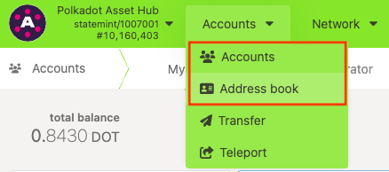
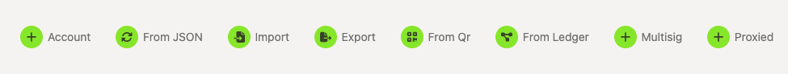
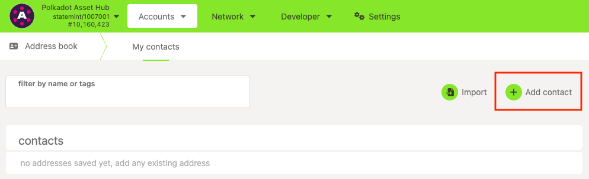
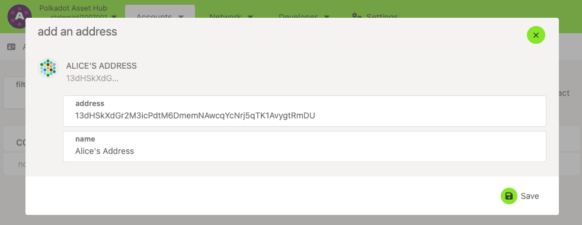
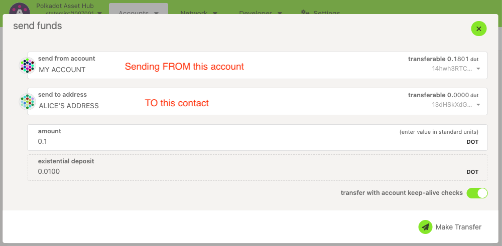

!!!info "Related concepts"
    For the underlying concepts, see [Accounts](../learn-accounts.md).

!!! warning "IMPORTANT"

    Polkadot Developer Interface (Polkadot-JS UI) is a web wallet meant for power users and developers. For everyday use, there are several user-friendly wallets funded by the Polkadot Treasury that support a plethora of features and platforms. Discover them in [this article](where-to-store-dot.md).

On Polkadot Developer Interface, you will see Accounts as well as Address Book, under the Accounts tab:

* * *

### What is the difference between them?

#### **Accounts Page**

You control any address you have under [Accounts](https://polkadot.js.org/apps/#/accounts), and you can therefore send funds out or perform other actions with it.

Addresses on your Accounts page have been [created](create-polkadot-account.md) or [restored](restore-account-signer.md) by you either directly on Polkadot Developer Interface in one of the ways highlighted in the image below or through a browser extension. In all cases, you control those addresses because you own their private keys.

#### **Address Book**

Addresses that show up in your [Address Book](https://polkadot.js.org/apps/#/addresses) are read-only. They don't require private keys to be added there, allowing you to add any address here as a contact.

Here you can, for example, add your DOT deposit addresses at exchanges that you'd like to monitor or regularly send funds to. Your address book is a passive "watch tool," making sending funds to your contact addresses easier.

To add an address to your Address Book, click the "Add contact" button, add the account's address, and give it a name. Then click the "Save" button.

You _cannot_ send funds out of an address in your Address book since it's just a contact address, just like you can't send an email from a friend's email address in your contact list.

!!! danger "READ THIS FIRST!"

    If you click the "Send" button next to an account in the Address Book, you are initiating a transaction **to that account, not from** as it is for accounts on the Accounts page.
    

* * *

### How to move an address from the Address book to Accounts

The only way to do this is if you own the private keys of the contact address in the form of its mnemonic phrase or backup JSON file. In that case, you could use them to restore access to the addresses on the Accounts page. [Here is how to do that](restore-account-signer.md).

If the account in your Address book is your Ledger account, here's how you can [connect it to the Polkadot Developer Signer](add-ledger-account-signer.md) or directly to [ Polkadot Developer Interface](add-ledger-account.md).
